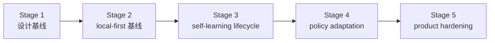

# 路线图

[English](roadmap.md) | [中文](roadmap.zh-CN.md)

## 范围

这份文档是仓库的稳定路线图包装页。它负责说明里程碑顺序和当前项目方向，但不替代实时执行控制面。

实时状态看这里：

- [../.codex/status.md](../.codex/status.md)
- [../.codex/module-dashboard.md](../.codex/module-dashboard.md)

详细执行队列看这里：

- [项目 workstream roadmap](workstreams/project/roadmap.zh-CN.md)
- [unified-memory-core/development-plan.zh-CN.md](reference/unified-memory-core/development-plan.zh-CN.md)

## 当前专项结果快照

这块用于直接回答“`200+` case 专项现在做到哪了”，避免只看主 roadmap 时还要再跳回 control surface。

- 专项名称：`execute-200-case-benchmark-and-answer-path-triage`
- 当前状态：`completed`
- runnable matrix：`392` cases
- 中文占比：`211 / 392 = 53.83%`
- 自然中文案例：`24`（`12` retrieval + `12` answer-level）
- retrieval-heavy formal gate：`250 / 250`
- isolated local answer-level formal gate：`12 / 12`（formal gate 内中文样本 `6 / 12`）
- live answer-level A/B：`100` 个真实案例，`96` 个两边都能答对，`1` 个只有 Memory Core 能答对，`1` 个只有内置能答对，`2` 个两边都失败
- 自然中文代表性 retrieval slice：`5 / 5`
- 自然中文代表性 answer-level slice：`6 / 6`
- raw transport watchlist：`3 / 8 raw ok`；其余为 `4` 条 `missing_json_payload` 和 `1` 条 `empty_results`
- main-path perf baseline：retrieval / assembly `16ms`；raw transport `8061ms`；isolated local answer-level `11200ms`
- 当前结论：`200+` case 建设、自然中文补强、transport watchlist failure-class 化、perf baseline 刷新，以及 answer-level formal gate 从 `6/6` 扩到 `12/12` 都已收口；但 `100` 个真实 A/B 案例也说明 direct answer-level 提升还不大，下一步要优先把内置独占通过和共享失败收掉，再争取把更多 harder cases 变成 Memory Core 独占胜场

对应证据：

- [../.codex/status.md](../.codex/status.md)
- [../.codex/plan.md](../.codex/plan.md)
- [generated/openclaw-cli-memory-eval-program-2026-04-14.md](../reports/generated/openclaw-cli-memory-eval-program-2026-04-14.md)
- [generated/openclaw-natural-chinese-watch-and-perf-2026-04-15.md](../reports/generated/openclaw-natural-chinese-watch-and-perf-2026-04-15.md)
- [generated/openclaw-answer-level-gate-expansion-2026-04-15.md](../reports/generated/openclaw-answer-level-gate-expansion-2026-04-15.md)

## 当前 / 下一步 / 更后面

| 时间层级 | 重点 | 退出信号 |
| --- | --- | --- |
| 当前 | 在新的 `12/12` isolated local answer-level formal gate、`392` case matrix、`100` case live A/B 和 failure-class watchlist 基线上，优先把“为什么 Memory Core 还没有明显甩开内置”这件事拆清楚 | `100` case A/B 里的 `1` 个内置独占通过和 `2` 个共享失败被收掉，并且更多 harder cases 开始变成 Memory Core 独占胜场 |
| 下一步 | 把更深的 answer-level gate 继续扩到 cross-source、conflict、multi-step history，再讨论是否真的打开 runtime API / service-mode | 更深的 isolated local answer-level gate 可以稳定复跑，且在更大 A/B 集里显示出比内置更清晰的领先 |
| 更后面 | 只在 operator baseline 稳定后，再讨论 runtime API / split-ready 演进 | Stage 5 收口后的独立产品证据继续保持绿色 |

## 当前执行重点

主 roadmap 里的“当前”不只是方向，也对应接下来要执行的具体工作：

1. 先把 `100` case live A/B 里 `1` 个内置独占通过和 `2` 个两边都失败的 case 收掉，避免继续出现“治理更强但直观效果不明显”的结论。
2. 继续把 deeper-watch harder failures 与更大 A/B case 合并看，优先在 cross-source、conflict、history、自然中文这些本该体现差异的场景里拉开胜场。
3. 继续保持 formal gate 内部 `6 / 12` 的自然中文占比，不退回“全局过半、正式门禁里却很少中文”的状态。
4. 持续把 gateway/session-lock 与 raw transport 维持在 `missing_json_payload` / `empty_results` watchlist，不让宿主噪声重新污染算法判断。

恢复执行时：

- 主顺序看 [reference/unified-memory-core/development-plan.zh-CN.md](reference/unified-memory-core/development-plan.zh-CN.md) 的 `90`
- 实时执行状态看 [../.codex/plan.md](../.codex/plan.md) 和 [../.codex/status.md](../.codex/status.md)

## 里程碑

| 里程碑 | 状态 | 目标 | 依赖 | 退出条件 |
| --- | --- | --- | --- | --- |
| [Stage 1：设计基线](reference/unified-memory-core/development-plan.zh-CN.md#stage-1-设计与文档基线) | completed | 冻结产品命名、边界和文档栈 | 无 | 架构、模块边界、测试面已经对齐 |
| [Stage 2：local-first 基线](reference/unified-memory-core/development-plan.zh-CN.md#stage-2-local-first-实现基线) | completed | 跑通一条可治理的 local-first 端到端主链 | Stage 1 | 核心模块、适配器、standalone CLI、governance 都可运行 |
| [Stage 3：self-learning lifecycle 基线](reference/unified-memory-core/development-plan.zh-CN.md#stage-3-self-learning-生命周期基线) | completed | 把已经实现的 reflection baseline 收成一条显式生命周期，并补齐 promotion / decay / 学习专项治理 | Stage 2 | promotion / decay、learning governance、OpenClaw validation 和本地 governed loop 都已落地并有回归保护 |
| [Stage 4：policy adaptation](reference/unified-memory-core/development-plan.zh-CN.md#stage-4-policy-adaptation-与多消费者使用) | completed | 让治理后的学习产物影响消费者行为 | Stage 3 | 一条可回退的 policy-adaptation 闭环被证明 |
| [Stage 5：product hardening](reference/unified-memory-core/development-plan.zh-CN.md#stage-5-产品加固与独立运行) | completed | 验证独立产品运行和 split-ready 边界 | Stage 4 | release boundary、可复现性、维护工作流和 split rehearsal 都已经 CLI 可验证 |

## 里程碑流转

## 风险与依赖

- 路线图不能和 `.codex/status.md`、`.codex/plan.md` 漂移
- `todo.md` 应继续只是个人速记，不应成为并行状态源
- 当前的下一依赖不再是 Stage 5 实现，而是让 release-preflight 与 deployment 证据面长期保持稳定
- registry-root cutover policy 仍是 operator follow-up，但不再算隐藏的 Stage 5 contract 工作
- 只要后续 service-mode 讨论继续延后，Stage 4 和 Stage 5 的报告都必须保持可读
- 新的主要工程主线已经转成“评测驱动优化”，所以 roadmap 和 `.codex/plan.md` 必须明确记录案例扩充、A/B 对照、answer-level 回退、transport watchlist 和性能规划，不要再只停留在 Stage 5 收口表述
