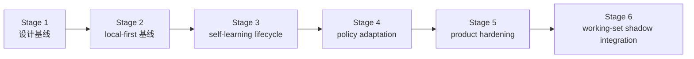

# 路线图

[English](roadmap.md) | [中文](roadmap.zh-CN.md)

## 范围

这份文档是仓库的稳定路线图包装页。它负责说明里程碑顺序和当前项目方向，但不替代实时执行控制面。

实时状态看这里：

- [../.codex/status.md](../.codex/status.md)
- [../.codex/module-dashboard.md](../.codex/module-dashboard.md)

详细执行队列看这里：

- [项目 workstream roadmap](workstreams/project/roadmap.zh-CN.md)
- [unified-memory-core/development-plan.zh-CN.md](reference/unified-memory-core/development-plan.zh-CN.md)

## 当前专项结果快照

这块用于直接回答“`200+` case 专项现在做到哪了”，避免只看主 roadmap 时还要再跳回 control surface。

- 专项名称：`execute-200-case-benchmark-and-answer-path-triage`
- 当前状态：`completed`
- runnable matrix：`392` cases
- 中文占比：`211 / 392 = 53.83%`
- 自然中文案例：`24`（`12` retrieval + `12` answer-level）
- retrieval-heavy formal gate：`250 / 250`
- isolated local answer-level formal gate：`12 / 12`（formal gate 内中文样本 `6 / 12`）
- live answer-level A/B：`100` 个真实案例，`97` 个两边都能答对，`1` 个只有 Memory Core 能答对，`0` 个只有内置能答对，`2` 个两边都失败
- 自然中文代表性 retrieval slice：`5 / 5`
- 自然中文代表性 answer-level slice：`6 / 6`
- raw transport watchlist：`3 / 8 raw ok`；其余为 `4` 条 `missing_json_payload` 和 `1` 条 `empty_results`
- main-path perf baseline：retrieval / assembly `16ms`；raw transport `8061ms`；isolated local answer-level `11200ms`
- 当前结论：`200+` case 建设、自然中文补强、transport watchlist failure-class 化、perf baseline 刷新，以及 answer-level formal gate 从 `6/6` 扩到 `12/12` 都已收口；`100` 个真实 A/B 里的内置独占通过已经被移除，下一步要优先把剩余共享失败收掉，再争取把更多 harder cases 变成 Memory Core 独占胜场

对应证据：

- [../.codex/status.md](../.codex/status.md)
- [../.codex/plan.md](../.codex/plan.md)
- [generated/openclaw-cli-memory-eval-program-2026-04-14.md](../reports/generated/openclaw-cli-memory-eval-program-2026-04-14.md)
- [generated/openclaw-natural-chinese-watch-and-perf-2026-04-15.md](../reports/generated/openclaw-natural-chinese-watch-and-perf-2026-04-15.md)
- [generated/openclaw-answer-level-gate-expansion-2026-04-15.md](../reports/generated/openclaw-answer-level-gate-expansion-2026-04-15.md)

## Dialogue Working-Set Runtime 快照

这块现在记录的是已经完成的 Stage 6 runtime shadow integration。

- 专项名称：`dialogue-working-set-shadow-runtime`
- 当前状态：`completed / shadow-only`
- runtime shadow replay：`16 / 16`
- runtime shadow replay average reduction ratio：`0.4368`
- runtime answer A/B：baseline `5 / 5`，shadow `5 / 5`
- runtime answer A/B shadow-only wins：`0`
- runtime answer A/B average prompt reduction ratio：`0.0114`
- 当前解释：runtime shadow integration 已经成为新的测量面，但 active prompt mutation 继续显式延后

对应证据：

- [generated/dialogue-working-set-pruning-feasibility-2026-04-16.md](../reports/generated/dialogue-working-set-pruning-feasibility-2026-04-16.md)
- [generated/dialogue-working-set-shadow-replay-2026-04-16.md](../reports/generated/dialogue-working-set-shadow-replay-2026-04-16.md)
- [generated/dialogue-working-set-answer-ab-2026-04-16.md](../reports/generated/dialogue-working-set-answer-ab-2026-04-16.md)
- [generated/dialogue-working-set-adversarial-2026-04-16.md](../reports/generated/dialogue-working-set-adversarial-2026-04-16.md)
- [generated/dialogue-working-set-validation-2026-04-16.md](../reports/generated/dialogue-working-set-validation-2026-04-16.md)
- [generated/dialogue-working-set-runtime-shadow-2026-04-16.md](../reports/generated/dialogue-working-set-runtime-shadow-2026-04-16.md)
- [generated/dialogue-working-set-runtime-answer-ab-2026-04-16.md](../reports/generated/dialogue-working-set-runtime-answer-ab-2026-04-16.md)
- [generated/dialogue-working-set-runtime-shadow-summary-2026-04-16.md](../reports/generated/dialogue-working-set-runtime-shadow-summary-2026-04-16.md)
- [generated/dialogue-working-set-stage6-2026-04-16.md](../reports/generated/dialogue-working-set-stage6-2026-04-16.md)

## 当前 / 下一步 / 更后面

| 时间层级 | 重点 | 退出信号 |
| --- | --- | --- |
| 当前 | 把 Stage 6 runtime shadow integration 当成已完成能力，继续保持 `default-off` 和 shadow-only，并恢复之前延后的 shared-fail history cleanup | deferred history / harder A/B 队列已经重新带着 Stage 6 telemetry surface 跑起来 |
| 下一步 | 带着新的 shadow telemetry surface 继续扩 harder live A/B 和 history cases | 更难的 answer-level case 开始在不打开 active prompt mutation 的情况下变成更稳定的 UMC 胜场 |
| 更后面 | 只有在更长时间的 real-session soak 后，才讨论是否值得开 active prompt experiment | shadow telemetry 长期为绿，足以支撑显式的 promotion decision 和 rollback gate |

## 当前执行重点

主 roadmap 里的“当前”不只是方向，也对应接下来要执行的具体工作：

1. 继续保持 Stage 6 runtime shadow integration 为 `default-off` 和 shadow-only。
2. 恢复之前延后的 `ab100-zh-history-editor-*` cleanup 与 harder live A/B 扩面，并把 shadow telemetry 一起挂上。
3. 继续把 active prompt mutation 明确排除在当前范围外，直到新的 measurement surface 再 soak 更久。
4. 把 runtime export artifacts 当成新的 replayable operator evidence surface。

恢复执行时：

- 主顺序看 [reference/unified-memory-core/development-plan.zh-CN.md](reference/unified-memory-core/development-plan.zh-CN.md) 的 `91`
- 实时执行状态看 [../.codex/plan.md](../.codex/plan.md) 和 [../.codex/status.md](../.codex/status.md)

## 里程碑

| 里程碑 | 状态 | 目标 | 依赖 | 退出条件 |
| --- | --- | --- | --- | --- |
| [Stage 1：设计基线](reference/unified-memory-core/development-plan.zh-CN.md#stage-1-设计与文档基线) | completed | 冻结产品命名、边界和文档栈 | 无 | 架构、模块边界、测试面已经对齐 |
| [Stage 2：local-first 基线](reference/unified-memory-core/development-plan.zh-CN.md#stage-2-local-first-实现基线) | completed | 跑通一条可治理的 local-first 端到端主链 | Stage 1 | 核心模块、适配器、standalone CLI、governance 都可运行 |
| [Stage 3：self-learning lifecycle 基线](reference/unified-memory-core/development-plan.zh-CN.md#stage-3-self-learning-生命周期基线) | completed | 把已经实现的 reflection baseline 收成一条显式生命周期，并补齐 promotion / decay / 学习专项治理 | Stage 2 | promotion / decay、learning governance、OpenClaw validation 和本地 governed loop 都已落地并有回归保护 |
| [Stage 4：policy adaptation](reference/unified-memory-core/development-plan.zh-CN.md#stage-4-policy-adaptation-与多消费者使用) | completed | 让治理后的学习产物影响消费者行为 | Stage 3 | 一条可回退的 policy-adaptation 闭环被证明 |
| [Stage 5：product hardening](reference/unified-memory-core/development-plan.zh-CN.md#stage-5-产品加固与独立运行) | completed | 验证独立产品运行和 split-ready 边界 | Stage 4 | release boundary、可复现性、维护工作流和 split rehearsal 都已经 CLI 可验证 |
| [Stage 6：dialogue working-set shadow integration](reference/unified-memory-core/development-plan.zh-CN.md#stage-6-dialogue-working-set-shadow-integration) | completed | 在任何 active prompt cutover 之前，先用 runtime shadow mode 验证热会话 working-set pruning | Stage 5 | runtime shadow telemetry 已经 default-off 落地、replayable exports 已存在，且 answer-level replay 继续足够绿色，支持保持 shadow-only |

## 里程碑流转

## 风险与依赖

- 路线图不能和 `.codex/status.md`、`.codex/plan.md` 漂移
- `todo.md` 应继续只是个人速记，不应成为并行状态源
- 当前的下一依赖不再是 Stage 5 实现，而是让 release-preflight 与 deployment 证据面长期保持稳定
- registry-root cutover policy 仍是 operator follow-up，但不再算隐藏的 Stage 5 contract 工作
- 只要后续 service-mode 讨论继续延后，Stage 4 和 Stage 5 的报告都必须保持可读
- 新的主要工程主线已经转成“评测驱动优化”，所以 roadmap 和 `.codex/plan.md` 必须明确记录案例扩充、A/B 对照、answer-level 回退、transport watchlist 和性能规划，不要再只停留在 Stage 5 收口表述
- active prompt mutation 继续显式延后，直到 runtime shadow telemetry 在真实 session 上长期为绿
