# 路线图

[English](roadmap.md) | [中文](roadmap.zh-CN.md)

## 范围

这份文档是仓库的稳定路线图包装页。它负责说明里程碑顺序和当前项目方向，但不替代实时执行控制面。

实时状态看这里：

- [../.codex/status.md](../.codex/status.md)
- [../.codex/module-dashboard.md](../.codex/module-dashboard.md)

详细执行队列看这里：

- [项目 workstream roadmap](workstreams/project/roadmap.zh-CN.md)
- [unified-memory-core/development-plan.zh-CN.md](reference/unified-memory-core/development-plan.zh-CN.md)

## 当前专项结果快照

这块用于直接回答“`200+` case 专项现在做到哪了”，避免只看主 roadmap 时还要再跳回 control surface。

- 专项名称：`execute-200-case-benchmark-and-answer-path-triage`
- 当前状态：`completed`
- runnable matrix：`392` cases
- 中文占比：`211 / 392 = 53.83%`
- 自然中文案例：`24`（`12` retrieval + `12` answer-level）
- retrieval-heavy formal gate：`250 / 250`
- isolated local answer-level formal gate：`12 / 12`（formal gate 内中文样本 `6 / 12`）
- live answer-level A/B：`100` 个真实案例，current `100 / 100`、legacy `99 / 100`、`1` 个只有 Memory Core 能答对、`0` 个只有内置能答对、`0` 个两边都失败
- 自然中文代表性 retrieval slice：`5 / 5`
- 自然中文代表性 answer-level slice：`6 / 6`
- raw transport watchlist：`3 / 8 raw ok`；其余为 `4` 条 `missing_json_payload` 和 `1` 条 `empty_results`
- main-path perf baseline：retrieval / assembly `16ms`；raw transport `8061ms`；isolated local answer-level `11200ms`
- 当前结论：`200+` case 建设、自然中文补强、transport watchlist failure-class 化、perf baseline 刷新，以及 answer-level formal gate 从 `6/6` 扩到 `12/12` 都已收口；builtin-only regression 与 shared-fail history cases 都已经被移除，下一步不再是补历史尾项，而是把“逐轮 context 优化”收成明确主线，再争取把更多 harder cases 变成 Memory Core 独占胜场

对应证据：

- [../.codex/status.md](../.codex/status.md)
- [../.codex/plan.md](../.codex/plan.md)
- [generated/openclaw-cli-memory-eval-program-2026-04-14.md](../reports/generated/openclaw-cli-memory-eval-program-2026-04-14.md)
- [generated/openclaw-natural-chinese-watch-and-perf-2026-04-15.md](../reports/generated/openclaw-natural-chinese-watch-and-perf-2026-04-15.md)
- [generated/openclaw-answer-level-gate-expansion-2026-04-15.md](../reports/generated/openclaw-answer-level-gate-expansion-2026-04-15.md)

## Dialogue Working-Set Runtime 快照

这块现在记录的是已经完成的 Stage 6 runtime shadow integration。

- 专项名称：`dialogue-working-set-shadow-runtime`
- 当前状态：`completed / shadow-only`
- runtime shadow replay：`16 / 16`
- runtime shadow replay average reduction ratio：`0.4368`
- runtime answer A/B：baseline `5 / 5`，shadow `5 / 5`
- runtime answer A/B shadow-only wins：`0`
- runtime answer A/B average prompt reduction ratio：`0.0114`
- 当前解释：runtime shadow integration 已经成为新的测量面，但 active prompt mutation 继续显式延后

对应证据：

- [generated/dialogue-working-set-pruning-feasibility-2026-04-16.md](../reports/generated/dialogue-working-set-pruning-feasibility-2026-04-16.md)
- [generated/dialogue-working-set-shadow-replay-2026-04-16.md](../reports/generated/dialogue-working-set-shadow-replay-2026-04-16.md)
- [generated/dialogue-working-set-answer-ab-2026-04-16.md](../reports/generated/dialogue-working-set-answer-ab-2026-04-16.md)
- [generated/dialogue-working-set-adversarial-2026-04-16.md](../reports/generated/dialogue-working-set-adversarial-2026-04-16.md)
- [generated/dialogue-working-set-validation-2026-04-16.md](../reports/generated/dialogue-working-set-validation-2026-04-16.md)
- [generated/dialogue-working-set-runtime-shadow-2026-04-16.md](../reports/generated/dialogue-working-set-runtime-shadow-2026-04-16.md)
- [generated/dialogue-working-set-runtime-answer-ab-2026-04-16.md](../reports/generated/dialogue-working-set-runtime-answer-ab-2026-04-16.md)
- [generated/dialogue-working-set-runtime-shadow-summary-2026-04-16.md](../reports/generated/dialogue-working-set-runtime-shadow-summary-2026-04-16.md)
- [generated/dialogue-working-set-stage6-2026-04-16.md](../reports/generated/dialogue-working-set-stage6-2026-04-16.md)

## Stage 7 / Stage 9 快照

- Stage 7 shadow replay：`15 / 16`
- Stage 7 scorecard：captured `16 / 16`，average raw reduction ratio `0.4191`，average package reduction ratio `0.1151`
- Stage 9 guarded answer A/B：baseline `5 / 5`、shadow `5 / 5`、guarded `5 / 5`
- Stage 9 guarded applied：`2 / 5`
- Stage 9 average guarded prompt reduction ratio：`0.0424`
- 当前解释：Stage 7 的 operator-facing scorecard 和 Stage 9 的 guarded opt-in seam 都已落地，但 Stage 7 还没正式 closeout，Stage 9 也继续保持 `default-off` / opt-in only

对应证据：

- [generated/dialogue-working-set-stage7-shadow-2026-04-17.md](../reports/generated/dialogue-working-set-stage7-shadow-2026-04-17.md)
- [generated/dialogue-working-set-scorecard-2026-04-17.md](../reports/generated/dialogue-working-set-scorecard-2026-04-17.md)
- [generated/dialogue-working-set-guarded-answer-ab-2026-04-17.md](../reports/generated/dialogue-working-set-guarded-answer-ab-2026-04-17.md)
- [generated/dialogue-working-set-stage7-stage9-2026-04-17.md](../reports/generated/dialogue-working-set-stage7-stage9-2026-04-17.md)

## 当前评审结论

- 已完成：
  - Stage 6 `dialogue working-set shadow integration` 已正式落到 runtime，且继续保持 `default-off`、shadow-only
  - shared-fail 的中文 history cleanup 已收口
  - 官方镜像驱动的 Docker hermetic eval 已可真实复用
- 计划做：
  - 先把 `轻快` 里的 `context 加载优化` 做成下一轮主线，而不是继续把“安装体验”排在前面
  - 先定 unified context-optimization scorecard，把 `prompt thickness / reduction / retrieval-assembly latency / answer latency / rollback metrics` 收成同一套证据面
  - 再把 bounded LLM-led context decision contract、operator metrics、rollback boundary 和 harder live A/B 设计接到这套证据面上
  - 把“日常尽量不依赖 compat / compact、而由逐轮 context 管理维持长对话可持续；compat / compact 只做夜间或后台 safety net”写成显式阶段目标
- 当前明确不做：
  - 不打开默认 active prompt mutation
  - 不改 builtin memory 行为
  - 不靠继续增加硬编码规则表来模拟 topic / context 决策

## 三个用户承诺与里程碑映射

| 用户承诺 | 当前已落地能力 | 当前证据面 | 下一里程碑 |
| --- | --- | --- | --- |
| 轻快 | fact-first assembly、runtime working-set shadow instrumentation、release-preflight、Docker hermetic eval | runtime shadow replay `16 / 16`、average reduction ratio `0.4368`、runtime answer A/B `5 / 5` vs `5 / 5`、ordinary-conversation Docker steady-state `current=32 / 40`、`legacy=17 / 40`、`UMC-only=17`、`preCaseResetFailed=0`、整轮 `40` case wall-clock `~22.5 min` | 先完成 context 加载优化，把 context thickness / reduction / latency 收成硬门禁；保持 Docker 作为默认 hermetic A/B 面，并把剩余 ordinary-conversation harder misses 收成 targeted follow-up |
| 聪明 | realtime `memory_intent` ingestion、nightly self-learning、governed promotion / decay、working-set shadow path | ordinary-conversation host-live A/B：current `38 / 40`、legacy `21 / 40`、`18` 条 UMC-only wins | 把 shadow-first 的 context decision 逐步推进到 bounded、guarded 的窄路径用户收益，并让 context 优化真正变成默认可感知收益 |
| 省心 | add / inspect / audit / repair / replay / rollback、canonical registry root、OpenClaw / Codex adapters | 已发版级 CLI 流程与回归保护验证栈 | 持续保持 operator surface 可读、可 replay，并补强 Codex / 多实例产品证据 |

## 产品北极星

> 装得简单，用得顺手，跑得轻快，记得聪明，维护省心。

roadmap 层的含义是：

- `轻快`
  - 接入复杂度、默认配置复杂度、包体、运行负担、context thickness、latency 都属于同一个正式目标
  - 日常热路径的目标是不把 compat / compact 当作默认续命手段，而是通过持续的 context 管理让 prompt 厚度和延迟都留在可控区间
- `聪明`
  - retrieval、learning、working-set pruning、budgeted assembly 的协同质量，必须成为下一轮主证据面
- `省心`
  - hermetic / Docker eval、rollback boundary、operator metrics、shared registry 继续是一等约束

## 当前缺口评估

当前离北极星最近和最远的地方，需要在 roadmap 上写清楚：

- 已经比较稳：
  - `省心`
  - `聪明` 的 self-learning 主干
  - context 优化已经成为正式主线
- 当前最薄弱：
  - `轻快`：安装 / bootstrap / verify 仍然偏手工，hermetic 普通对话写记忆路径仍明显受 timeout 影响
  - `聪明`：working-set 优化还没有变成默认用户收益
  - `省心`：Codex / 多实例的产品证据仍弱于 OpenClaw

这意味着下一轮 priority order 应该是：

1. `轻快 / context 加载优化`：先把每轮 context thickness、working-set reduction、budgeted assembly 和 answer-level latency 收成正式主线
   - 目标不是更频繁 compact，而是尽量让长对话在日常路径上不用 compact 也能继续
2. `轻快 / install`：在 ordinary-conversation hermetic A/B 已收口后，再收 install / bootstrap / verify 的接入体验
3. `聪明`：再继续把 bounded、guarded smart path 保持在极窄 opt-in 面，同时把用户可感知收益做实
4. `省心`：共享底座与跨 Codex 证据补强

## Post-Stage-6 路线图

Stage 1-6 已经完成，但 roadmap 不能停在“历史阶段都绿了”。当前真正的后续地图应该是：

| 后续里程碑 | 状态 | 为什么现在做 | 退出信号 |
| --- | --- | --- | --- |
| Stage 7：context loading optimization closure | `in_progress` | 当前最大的产品缺口不是“功能有没有”，而是每轮 context 仍然偏厚，Stage 6 也还只是 shadow measurement | unified scorecard 固定；harder replay / Docker / local evidence 能稳定说明更轻的 context package 不伤回答质量；日常长对话通常不再需要依赖 compat / compact 才能继续 |
| Stage 8：ordinary-conversation realtime-write latency closure | `completed` | Docker ordinary-conversation A/B 已经从 blanket timeout wall 收口到 `32 / 40 vs 17 / 40` 的可信 steady-state 结果 | clean Docker path 已不再被 timeout 大面积主导，且 `preCaseResetFailed = 0` 证明它可作为常规 A/B 面 |
| Stage 9：guarded smart-path promotion | `in_progress` | context 加载优化如果一直停在 shadow-only，就还不是用户收益 | bounded、guarded 的窄路径 experiment 有明确 rollback boundary、operator metrics 和 promotion gate，并继续保持 compat / compact 只是后台保底而不是默认日常路径 |
| Stage 10：adoption simplification and shared-foundation proof | `planned` | 当前 install / bootstrap 仍偏手工，Codex / 多实例证据也还弱 | 接入更短、更稳，且共享底座不只停留在架构叙事 |

## 当前 / 下一步 / 更后面

| 时间层级 | 重点 | 退出信号 |
| --- | --- | --- |
| 当前 | 继续收 `Stage 7` closeout，并保持 `Stage 9` 为 default-off / opt-in only：先回答“怎样让每轮 context 更轻、更快、且不伤回答质量” | unified scorecard、guarded seam、rollback boundary 和 operator summary 都已落地，且下一轮 focus 明确转向 closeout 与 latency |
| 下一步 | 继续收 `Stage 7` closeout，同时保持 `Stage 9` 的窄实验面；ordinary-conversation Docker steady-state 继续作为默认 hermetic A/B 基线 | unified scorecard、guarded seam、rollback boundary 和 operator summary 都已稳定，且剩余 Docker harder misses 被明确隔离成 targeted follow-up |
| 更后面 | 在 `Stage 7` 站稳后，再决定是否扩大 `Stage 9`，以及是否进入 `Stage 10` 的接入简化与跨宿主证明 | smart-path promotion gate、rollback boundary、shared-foundation proof 都变成 operator-ready 状态 |

## 当前执行重点

主 roadmap 里的“当前”不只是方向，也对应接下来要执行的具体工作：

1. 继续保持 Stage 6 runtime shadow integration 为 `default-off` 和 shadow-only。
2. 先把 durable-source slimming、working-set pruning、harder live A/B、ordinary-conversation Docker rerun 收成一个统一的 `context optimization scorecard`。
3. 继续把 active prompt mutation 明确排除在默认路径外，直到 rollback boundary 与 operator metrics 足够清楚。
4. 把 runtime export artifacts 和 Docker hermetic eval 一起当成新的 replayable operator evidence surface。
5. 在 context 加载优化站稳之前，不要把 install 简化重新排到更前面。

恢复执行时：

- 主顺序看 [reference/unified-memory-core/development-plan.zh-CN.md](reference/unified-memory-core/development-plan.zh-CN.md) 的 `101`
- 实时执行状态看 [../.codex/plan.md](../.codex/plan.md) 和 [../.codex/status.md](../.codex/status.md)

## 里程碑

| 里程碑 | 状态 | 目标 | 依赖 | 退出条件 |
| --- | --- | --- | --- | --- |
| [Stage 1：设计基线](reference/unified-memory-core/development-plan.zh-CN.md#stage-1-设计与文档基线) | completed | 冻结产品命名、边界和文档栈 | 无 | 架构、模块边界、测试面已经对齐 |
| [Stage 2：local-first 基线](reference/unified-memory-core/development-plan.zh-CN.md#stage-2-local-first-实现基线) | completed | 跑通一条可治理的 local-first 端到端主链 | Stage 1 | 核心模块、适配器、standalone CLI、governance 都可运行 |
| [Stage 3：self-learning lifecycle 基线](reference/unified-memory-core/development-plan.zh-CN.md#stage-3-self-learning-生命周期基线) | completed | 把已经实现的 reflection baseline 收成一条显式生命周期，并补齐 promotion / decay / 学习专项治理 | Stage 2 | promotion / decay、learning governance、OpenClaw validation 和本地 governed loop 都已落地并有回归保护 |
| [Stage 4：policy adaptation](reference/unified-memory-core/development-plan.zh-CN.md#stage-4-policy-adaptation-与多消费者使用) | completed | 让治理后的学习产物影响消费者行为 | Stage 3 | 一条可回退的 policy-adaptation 闭环被证明 |
| [Stage 5：product hardening](reference/unified-memory-core/development-plan.zh-CN.md#stage-5-产品加固与独立运行) | completed | 验证独立产品运行和 split-ready 边界 | Stage 4 | release boundary、可复现性、维护工作流和 split rehearsal 都已经 CLI 可验证 |
| [Stage 6：dialogue working-set shadow integration](reference/unified-memory-core/development-plan.zh-CN.md#stage-6-dialogue-working-set-shadow-integration) | completed | 在任何 active prompt cutover 之前，先用 runtime shadow mode 验证热会话 working-set pruning | Stage 5 | runtime shadow telemetry 已经 default-off 落地、replayable exports 已存在，且 answer-level replay 继续足够绿色，支持保持 shadow-only |
| [Stage 7：context loading optimization closure](reference/unified-memory-core/development-plan.zh-CN.md#stage-7-context-loading-optimization-closure) | in_progress | 先把逐轮 context 加载优化做成正式主线和正式门禁，而不是继续停在 shadow 结论 | Stage 6 | context optimization scorecard 稳定、harder replay / Docker / local evidence 对齐，且 rollout/rollback 边界清楚 |
| [Stage 8：ordinary-conversation realtime-write latency closure](reference/unified-memory-core/development-plan.zh-CN.md#stage-8-ordinary-conversation-realtime-write-latency-closure) | completed | 把 clean Docker path 从 blanket timeout 收口成可信的 ordinary-conversation steady-state A/B 面 | Stage 7 | ordinary-conversation hermetic A/B 已达到 `32 / 40 vs 17 / 40`，且 `preCaseResetFailed = 0` |
| [Stage 9：guarded smart-path promotion](reference/unified-memory-core/development-plan.zh-CN.md#stage-9-guarded-smart-path-promotion) | in_progress | 在不破坏回退边界的前提下，让 context 优化开始变成真实用户收益 | Stage 8 | bounded opt-in path 有明确 promotion gate 和可操作 rollback |
| [Stage 10：adoption simplification and shared-foundation proof](reference/unified-memory-core/development-plan.zh-CN.md#stage-10-adoption-simplification-and-shared-foundation-proof) | planned | 把接入体验和跨宿主产品证据收口到与核心能力同等重要的层级 | Stage 9 | install / bootstrap / verify 更短，Codex / 多实例复用更可证明 |

## 里程碑流转

```mermaid
flowchart LR
    A["Stage 1<br/>设计基线"] --> B["Stage 2<br/>local-first 基线"]
    B --> C["Stage 3<br/>self-learning lifecycle"]
    C --> D["Stage 4<br/>policy adaptation"]
    D --> E["Stage 5<br/>product hardening"]
    E --> F["Stage 6<br/>working-set shadow integration"]
    F --> G["Stage 7<br/>context loading optimization"]
    G --> H["Stage 8<br/>realtime-write latency closure"]
    H --> I["Stage 9<br/>guarded smart-path promotion"]
    I --> J["Stage 10<br/>adoption simplification + shared-foundation proof"]
```

## 风险与依赖

- 路线图不能和 `.codex/status.md`、`.codex/plan.md` 漂移
- `todo.md` 应继续只是个人速记，不应成为并行状态源
- 当前的下一依赖不再是 Stage 5 实现，而是让 release-preflight 与 deployment 证据面长期保持稳定
- 当前的第一主线不再是 Stage 5 或 Stage 6 收口，而是 Stage 7 的 context loading optimization
- registry-root cutover policy 仍是 operator follow-up，但不再算隐藏的 Stage 5 contract 工作
- 只要后续 service-mode 讨论继续延后，Stage 4 和 Stage 5 的报告都必须保持可读
- 新的主要工程主线已经转成“评测驱动优化”，所以 roadmap 和 `.codex/plan.md` 必须明确记录案例扩充、A/B 对照、answer-level 回退、transport watchlist 和性能规划，不要再只停留在 Stage 5 收口表述
- active prompt mutation 继续显式延后，直到 runtime shadow telemetry 在真实 session 上长期为绿
- 下一轮如果要做 context decision experiment，应优先走 bounded LLM-led contract，而不是继续扩展越来越大的硬编码规则表
- install / bootstrap / verify 简化仍然重要，但在当前 roadmap 上已经明确排在 context loading optimization 和 realtime-write latency closure 之后
