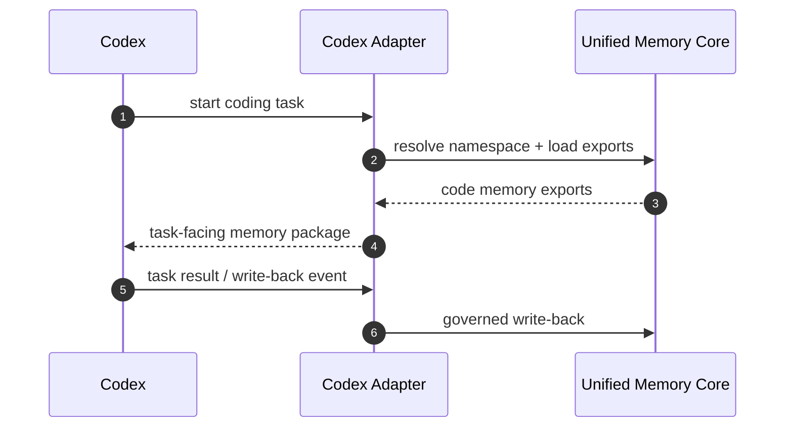
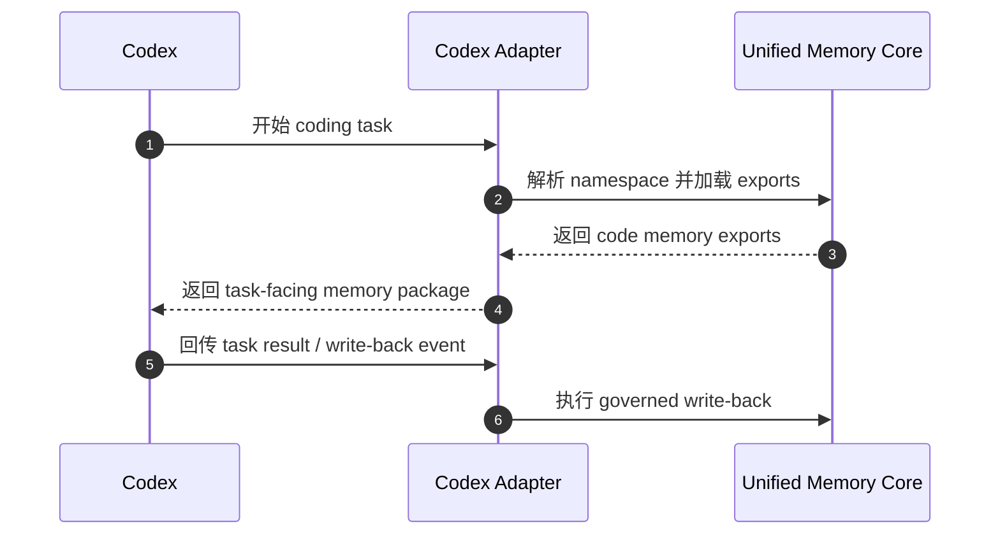

# Codex Adapter Architecture

[English](#english) | [中文](#中文)

## English

## Purpose

`Codex Adapter` lets Codex consume and contribute governed shared memory through `Unified Memory Core`.

Its main target is:

`shared code memory with explicit project / user / namespace binding`

## What It Owns

- code-memory namespace binding
- Codex-facing export projection rules
- Codex read-before-task flow
- Codex write-back event mapping

## What It Does Not Own

- shared artifact truth
- source ingestion
- OpenClaw-specific behavior

## Core Responsibilities

1. map user + project + namespace
2. load shared code memory before coding tasks
3. write back governed events after coding tasks
4. stay compatible with standalone and embedded execution paths

## Core Flow

## Required Boundaries

The adapter must keep separate:

- Codex task runtime
- shared memory contracts
- write-back governance rules

## Initial Build Boundary

The first implementation wave should support:

1. code-memory namespace model
2. read-before-task contract
3. write-after-task event contract
4. adapter compatibility tests

## Done Definition

This module is ready for implementation when:

- code memory binding is explicit
- read/write contract is explicit
- project/user binding rules are explicit
- adapter test surfaces are defined

## 中文

## 目的

`Codex Adapter` 负责让 Codex 通过 `Unified Memory Core` 消费和回写受治理的共享记忆。

它最核心的目标是：

`建立带 project / user / namespace 绑定的共享 code memory`

## 它负责什么

- code-memory namespace binding
- Codex-facing export projection rules
- Codex read-before-task flow
- Codex write-back event mapping

## 它不负责什么

- shared artifact truth
- source ingestion
- OpenClaw-specific behavior

## 核心职责

1. 绑定 user + project + namespace
2. 在 coding task 前加载 shared code memory
3. 在 coding task 后回写治理过的事件
4. 同时兼容 standalone 和 embedded 两条执行路径

## 主流程

## 必须守住的边界

这个 adapter 必须清楚分开：

- Codex task runtime
- shared memory contracts
- write-back governance rules

## 第一阶段实现边界

第一批实现建议先支持：

1. code-memory namespace model
2. read-before-task contract
3. write-after-task event contract
4. adapter compatibility tests

## 完成标准

这个模块进入可开发状态的标准是：

- code memory binding 已明确
- read/write contract 已明确
- project/user binding rules 已明确
- adapter test surfaces 已定义
