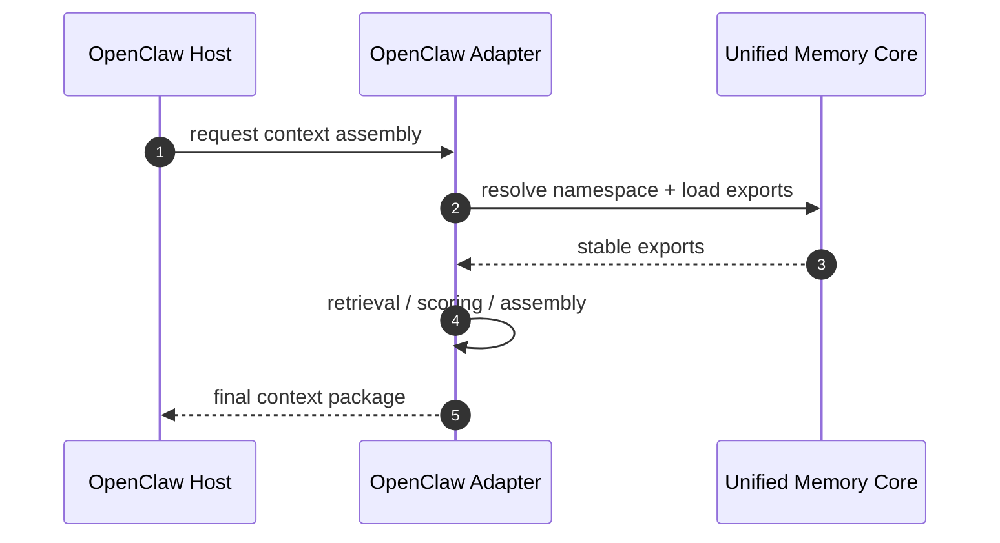
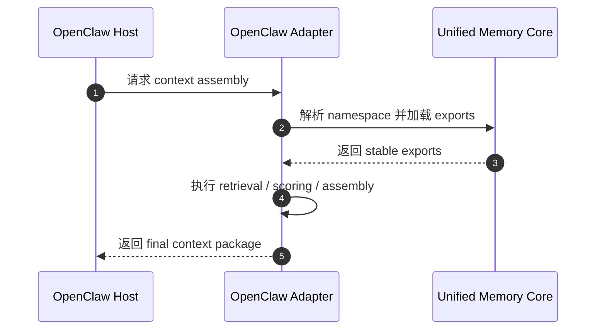

# OpenClaw Adapter Architecture

[English](#english) | [中文](#中文)

## English

## Purpose

`OpenClaw Adapter` consumes `Unified Memory Core` exports for OpenClaw retrieval and context assembly.

It is the boundary between:

- product-level shared memory
- OpenClaw-specific runtime behavior

## What It Owns

- OpenClaw namespace mapping
- OpenClaw export consumption
- OpenClaw-specific retrieval / assembly hooks
- adapter-side compatibility rules

## What It Does Not Own

- shared artifact truth
- source ingestion
- generic export building

## Core Responsibilities

1. map OpenClaw sessions to product namespaces
2. consume relevant product exports
3. merge adapter logic with host retrieval paths when needed
4. keep behavior regression-protected

## Core Flow

## Required Boundaries

The adapter must keep separate:

- host runtime behavior
- product artifacts
- adapter-side heuristics

## Initial Build Boundary

The first implementation wave should support:

1. namespace mapping
2. export consumption contract
3. retrieval / assembly integration
4. adapter compatibility tests

## Done Definition

This module is ready for implementation when:

- OpenClaw boundary is explicit
- export consumption contract is explicit
- namespace mapping rules are explicit
- adapter test surfaces are defined

## 中文

## 目的

`OpenClaw Adapter` 负责把 `Unified Memory Core` 的 exports 接进 OpenClaw 的 retrieval 和 context assembly。

它是下面两层之间的边界：

- 产品级共享记忆
- OpenClaw 专属运行时行为

## 它负责什么

- OpenClaw namespace mapping
- OpenClaw export consumption
- OpenClaw-specific retrieval / assembly hooks
- adapter-side compatibility rules

## 它不负责什么

- shared artifact truth
- source ingestion
- generic export building

## 核心职责

1. 把 OpenClaw session 映射到产品 namespace
2. 消费相关产品 exports
3. 在需要时把 adapter 逻辑和宿主 retrieval 路径结合起来
4. 保持行为有 regression 保护

## 主流程

## 必须守住的边界

这个 adapter 必须清楚分开：

- host runtime behavior
- product artifacts
- adapter-side heuristics

## 第一阶段实现边界

第一批实现建议先支持：

1. namespace mapping
2. export consumption contract
3. retrieval / assembly integration
4. adapter compatibility tests

## 完成标准

这个模块进入可开发状态的标准是：

- OpenClaw boundary 已明确
- export consumption contract 已明确
- namespace mapping rules 已明确
- adapter test surfaces 已定义
