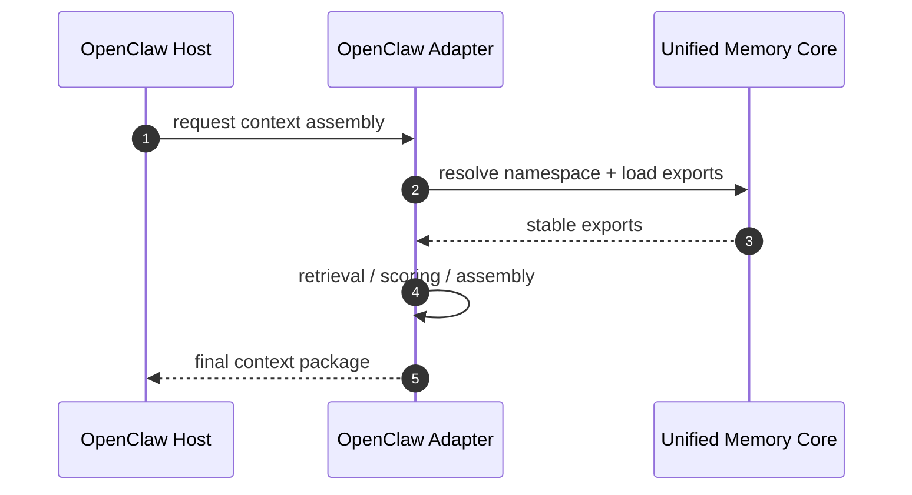
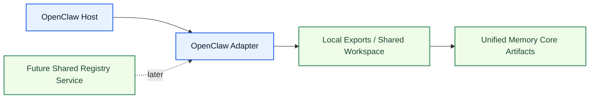
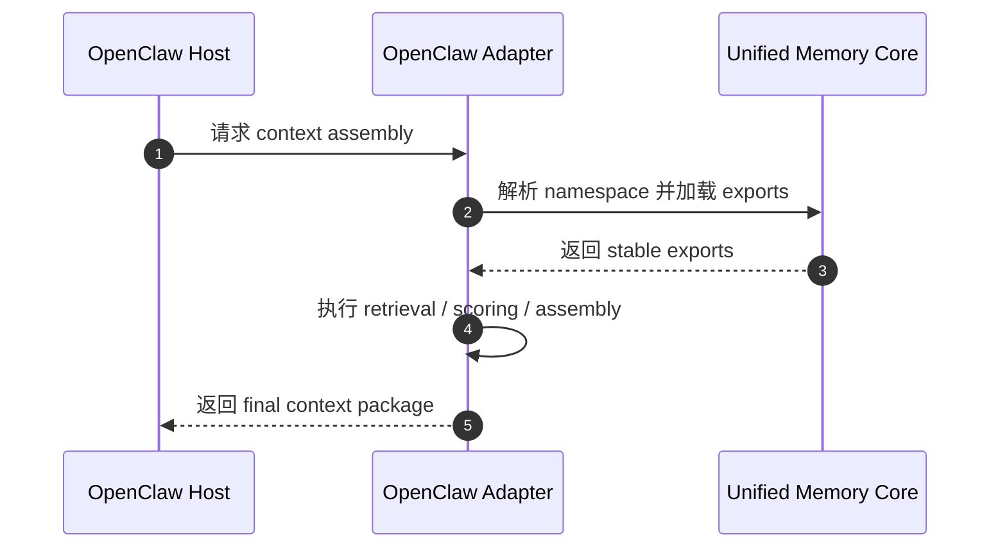

# OpenClaw Adapter Architecture

[English](#english) | [中文](#中文)

## English

## Purpose

`OpenClaw Adapter` consumes `Unified Memory Core` exports for OpenClaw retrieval and context assembly.

It is the boundary between:

- product-level shared memory
- OpenClaw-specific runtime behavior

Related documents:

- [../deployment-topology.md](../deployment-topology.md)
- [../../code-memory-binding-architecture.md](../../code-memory-binding-architecture.md)

## What It Owns

- OpenClaw namespace mapping
- OpenClaw export consumption
- OpenClaw-specific retrieval / assembly hooks
- adapter-side compatibility rules
- OpenClaw multi-agent runtime coordination rules

## What It Does Not Own

- shared artifact truth
- source ingestion
- generic export building

## Core Responsibilities

1. map OpenClaw sessions to product namespaces
2. consume relevant product exports
3. merge adapter logic with host retrieval paths when needed
4. keep behavior regression-protected
5. stay compatible with local-first and future shared-service deployments

## Core Flow

## Runtime Modes

The adapter should support two early runtime modes:

1. `local adapter mode`
2. `shared-workspace adapter mode`

It should remain compatible with a later:

3. `shared-registry service mode`

## Network-Ready Boundaries

The adapter should not assume:

- one host only
- one OpenClaw process only
- one agent only

So the adapter boundary must preserve:

- explicit namespace resolution
- deterministic export loading
- visibility-aware artifact selection
- serialized write-back for adapter-emitted events

## Multi-Agent Notes

For `one OpenClaw with multiple agents`, the recommended rule is:

- share one governed namespace resolver
- allow concurrent reads
- serialize adapter-side writes by namespace
- keep agent-local scratch state outside governed exports

## Required Boundaries

The adapter must keep separate:

- host runtime behavior
- product artifacts
- adapter-side heuristics

## Initial Build Boundary

The first implementation wave should support:

1. namespace mapping
2. export consumption contract
3. retrieval / assembly integration
4. adapter compatibility tests
5. multi-agent-safe read/write rules in local-first mode

## Done Definition

This module is ready for implementation when:

- OpenClaw boundary is explicit
- export consumption contract is explicit
- namespace mapping rules are explicit
- adapter test surfaces are defined
- local-first and shared-workspace deployment rules are explicit

## 中文

## 目的

`OpenClaw Adapter` 负责把 `Unified Memory Core` 的 exports 接进 OpenClaw 的 retrieval 和 context assembly。

它是下面两层之间的边界：

- 产品级共享记忆
- OpenClaw 专属运行时行为

相关文档：

- [../deployment-topology.md](../deployment-topology.md)
- [../../code-memory-binding-architecture.md](../../code-memory-binding-architecture.md)

## 它负责什么

- OpenClaw namespace mapping
- OpenClaw export consumption
- OpenClaw-specific retrieval / assembly hooks
- adapter-side compatibility rules
- OpenClaw 多 agent 运行时协调规则

## 它不负责什么

- shared artifact truth
- source ingestion
- generic export building

## 核心职责

1. 把 OpenClaw session 映射到产品 namespace
2. 消费相关产品 exports
3. 在需要时把 adapter 逻辑和宿主 retrieval 路径结合起来
4. 保持行为有 regression 保护
5. 同时兼容 local-first 与后续 shared-service 演进

## 主流程

## 运行模式

这个 adapter 的前期实现应支持两种运行模式：

1. `local adapter mode`
2. `shared-workspace adapter mode`

同时要保持对后续：

3. `shared-registry service mode`

的兼容性。

## 面向网络演进的边界

这个 adapter 不应该假设：

- 只有一个 host
- 只有一个 OpenClaw 进程
- 只有一个 agent

所以 adapter 边界必须保留：

- 显式 namespace resolution
- 可重复的 export loading
- 带 visibility 的 artifact 选择
- 对 adapter 回写事件做按 namespace 串行化

## 多 Agent 说明

对于 `一个 OpenClaw 下多个 agent`，推荐规则是：

- 共用一套受治理的 namespace resolver
- 允许并发读取
- adapter 侧写入按 namespace 串行化
- agent 本地 scratch state 不进入 governed exports

## 必须守住的边界

这个 adapter 必须清楚分开：

- host runtime behavior
- product artifacts
- adapter-side heuristics

## 第一阶段实现边界

第一批实现建议先支持：

1. namespace mapping
2. export consumption contract
3. retrieval / assembly integration
4. adapter compatibility tests
5. local-first 模式下的 multi-agent-safe 读写规则

## 完成标准

这个模块进入可开发状态的标准是：

- OpenClaw boundary 已明确
- export consumption contract 已明确
- namespace mapping rules 已明确
- adapter test surfaces 已定义
- local-first 与 shared-workspace 部署规则已明确
