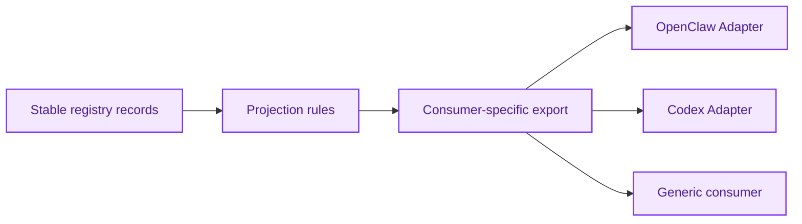

# Projection System Architecture

[English](#english) | [中文](#中文)

## English

## Purpose

`Projection System` turns stable registry records into deterministic exports for adapters and external consumers.

It answers:

`given governed artifacts, what should a specific consumer receive?`

## What It Owns

- export builders
- consumer-specific projection rules
- export versioning
- policy projection

## What It Does Not Own

- artifact truth
- promotion decisions
- adapter runtime logic

## Core Outputs

1. OpenClaw exports
2. Codex exports
3. generic JSON artifacts
4. future API-ready response shapes

## Projection Rules

Projection must respect:

- namespace
- visibility
- confidence / state
- consumer type
- export version

## Core Flow

## Dependency Rules

- consumes only governed records from `Memory Registry`
- may read constraints from `Governance System`
- must not depend on host runtime behavior

## Initial Build Boundary

The first implementation wave should support:

1. OpenClaw export artifact
2. Codex export artifact
3. generic export contract
4. export version tagging

## Done Definition

This module is ready for implementation when:

- export contracts are explicit
- consumer differences are documented
- versioning rules are documented
- testable deterministic projection is possible

## 中文

## 目的

`Projection System` 负责把治理后的 stable registry records 转成面向 adapters 和外部 consumer 的确定性 exports。

它回答的是：

`给定一组受治理的 artifacts，不同 consumer 应该收到什么？`

## 它负责什么

- export builders
- consumer-specific projection rules
- export versioning
- policy projection

## 它不负责什么

- artifact truth 本身
- promotion decisions
- adapter runtime logic

## 主要输出

1. OpenClaw exports
2. Codex exports
3. generic JSON artifacts
4. 后续 API-ready response shapes

## 投影规则

Projection 必须同时尊重：

- namespace
- visibility
- confidence / state
- consumer type
- export version

## 主流程

## 依赖规则

- 只消费来自 `Memory Registry` 的治理后记录
- 可以读取 `Governance System` 的限制条件
- 不能依赖宿主运行时行为

## 第一阶段实现边界

第一批实现建议先支持：

1. OpenClaw export artifact
2. Codex export artifact
3. generic export contract
4. export version tagging

## 完成标准

这个模块进入可开发状态的标准是：

- export contracts 已明确
- consumer 差异已写清楚
- versioning rules 已写清楚
- 可以做可测试的确定性 projection
