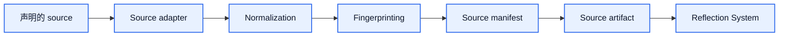

# Source System Architecture

[English](#english) | [中文](#中文)

## English

## Purpose

`Source System` defines how controlled inputs enter `Unified Memory Core`.

It is responsible for making source ingestion:

- explicit
- repeatable
- inspectable
- replayable

## What It Owns

- source registration
- source manifests
- source-type adapters
- normalization
- fingerprinting
- source snapshots for replay

## What It Does Not Own

- reflection logic
- candidate promotion
- stable-memory lifecycle
- tool-specific export logic

Those belong to:

- `Reflection System`
- `Memory Registry`
- `Projection System`

## Supported Source Classes

1. conversations
2. files
3. directories
4. URLs
5. images
6. manual CLI input
7. future structured imports

## Required Properties

Every source must be:

- declared
- typed
- scoped
- timestamped
- fingerprinted
- attributable to one importer path

## Core Flow

## Main Submodules

### 1. Source registration

Responsible for:

- accepting declared inputs
- assigning source ids
- recording source type and scope

### 2. Source adapters

Responsible for:

- reading raw source content
- extracting structured source payloads
- preserving source metadata

### 3. Normalization

Responsible for:

- converting heterogeneous inputs into one normalized shape
- preserving traceability back to raw origin

### 4. Fingerprinting

Responsible for:

- change detection
- deduplication support
- replay support

## Input Contract

The minimum source registration contract should include:

- `source_id`
- `source_type`
- `declared_by`
- `scope`
- `visibility`
- `created_at`
- `fingerprint`
- `locator`

## Output Contract

The minimum source artifact should include:

- `artifact_id`
- `source_id`
- `normalized_payload`
- `raw_metadata`
- `fingerprint`
- `ingest_run_id`
- `created_at`

## Dependency Rules

- `Source System` must not depend on reflection rules
- it may depend on shared contracts and utilities
- all downstream systems consume source artifacts, not raw inputs

## Initial Build Boundary

The first implementation wave should support:

1. file input
2. directory input
3. conversation input
4. manual CLI input

URL and image adapters can follow after the contract is stable.

## Done Definition

This module is ready for implementation when:

- source manifest schema is documented
- adapter responsibilities are explicit
- replay and fingerprint rules are explicit
- module test surfaces are defined

## 中文

## 目的

`Source System` 定义 `Unified Memory Core` 如何接入“可控输入源”。

它负责让 source ingestion 具备这几个特性：

- 显式
- 可重复
- 可检查
- 可回放

## 它负责什么

- source registration
- source manifests
- source-type adapters
- normalization
- fingerprinting
- 用于 replay 的 source snapshots

## 它不负责什么

- reflection logic
- candidate promotion
- stable-memory lifecycle
- tool-specific export logic

这些分别属于：

- `Reflection System`
- `Memory Registry`
- `Projection System`

## 支持的 source 类型

1. conversations
2. files
3. directories
4. URLs
5. images
6. manual CLI input
7. 后续 structured imports

## 必须满足的性质

每个 source 都必须是：

- 已声明的
- 有类型的
- 有 scope 的
- 有时间戳的
- 有 fingerprint 的
- 能追溯到导入路径的

## 主流程

## 主要子模块

### 1. Source registration

负责：

- 接受显式声明的输入
- 分配 source id
- 记录 source type 和 scope

### 2. Source adapters

负责：

- 读取原始 source 内容
- 提取结构化 source payload
- 保留 source metadata

### 3. Normalization

负责：

- 把异构输入统一成一套 normalized shape
- 保留回到原始来源的追踪线索

### 4. Fingerprinting

负责：

- change detection
- deduplication support
- replay support

## 输入契约

最小 source registration contract 建议包括：

- `source_id`
- `source_type`
- `declared_by`
- `scope`
- `visibility`
- `created_at`
- `fingerprint`
- `locator`

## 输出契约

最小 source artifact 建议包括：

- `artifact_id`
- `source_id`
- `normalized_payload`
- `raw_metadata`
- `fingerprint`
- `ingest_run_id`
- `created_at`

## 依赖规则

- `Source System` 不能依赖具体 reflection 规则
- 可以依赖 shared contracts 和通用工具
- 下游系统消费的是 source artifacts，不是 raw inputs

## 第一阶段实现边界

第一批实现建议先支持：

1. file input
2. directory input
3. conversation input
4. manual CLI input

等 contract 稳定后，再接 URL 和 image adapters。

## 完成标准

这个模块进入可开发状态的标准是：

- source manifest schema 已写清楚
- adapter 职责边界已明确
- replay 和 fingerprint 规则已明确
- 模块测试面已定义
