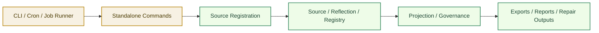

# Standalone Mode Architecture

[English](#english) | [中文](#中文)

## English

## Purpose

`Standalone Mode` defines how `Unified Memory Core` should run without requiring OpenClaw host participation.

It covers:

- CLI-driven execution
- scheduled job execution
- controlled source ingestion
- export / audit / repair operations outside adapters

Related documents:

- [../deployment-topology.md](../deployment-topology.md)
- [../../self-learning-architecture.md](../../self-learning-architecture.md)
- [../development-plan.md](../development-plan.md)

## What It Owns

- CLI-facing execution boundary
- scheduled-job-friendly entrypoints
- source registration commands
- export / audit / repair command contracts

## What It Does Not Own

- OpenClaw runtime behavior
- Codex runtime behavior
- adapter-specific projection logic
- runtime API service implementation

## Core Goal

Make the product usable as:

`a local-first, host-independent memory system that can ingest, reflect, export, and govern artifacts from the command line`

## Core Flow

## Command Families

The first stable command families should be:

1. `source add / list / inspect`
2. `reflect run / inspect`
3. `export build / inspect`
4. `govern audit / repair / replay`

## Boundary Rules

Standalone mode should:

- reuse the same contracts as embedded mode
- write the same governed artifacts
- avoid hidden runtime-only state
- stay compatible with future shared-registry service evolution

## Initial Build Boundary

The first implementation wave should support:

1. source registration
2. dry-run reflection
3. deterministic export build
4. audit / repair inspection commands

## Done Definition

This module is ready for implementation when:

- command families are explicit
- input / output contracts are explicit
- scheduled-job execution assumptions are explicit
- standalone outputs match governed artifact contracts

## 中文

## 目的

`Standalone Mode` 用来定义 `Unified Memory Core` 在**不依赖 OpenClaw host** 的情况下如何运行。

它覆盖：

- CLI 驱动执行
- scheduled job 执行
- 可控 source ingestion
- 脱离 adapter 的 export / audit / repair 操作

相关文档：

- [../deployment-topology.md](../deployment-topology.md)
- [../../self-learning-architecture.md](../../self-learning-architecture.md)
- [../development-plan.md](../development-plan.md)

## 它负责什么

- 面向 CLI 的执行边界
- 面向 scheduled jobs 的入口
- source registration commands
- export / audit / repair command contracts

## 它不负责什么

- OpenClaw runtime behavior
- Codex runtime behavior
- adapter 专属 projection logic
- runtime API service implementation

## 核心目标

把产品收成：

`一个 local-first、脱离宿主也能独立 ingest / reflect / export / govern 的记忆系统`

## 主流程

## 命令族

第一批稳定命令族建议是：

1. `source add / list / inspect`
2. `reflect run / inspect`
3. `export build / inspect`
4. `govern audit / repair / replay`

## 边界规则

Standalone mode 应当：

- 复用 embedded mode 的同一套 contracts
- 写入同一套 governed artifacts
- 避免隐藏的 runtime-only state
- 对未来 shared-registry service 演进保持兼容

## 第一阶段实现边界

第一批实现建议先支持：

1. source registration
2. dry-run reflection
3. deterministic export build
4. audit / repair inspection commands

## 完成标准

这个模块进入可开发状态的标准是：

- command families 已明确
- 输入 / 输出 contracts 已明确
- scheduled-job 执行假设已明确
- standalone outputs 与 governed artifact contracts 一致
