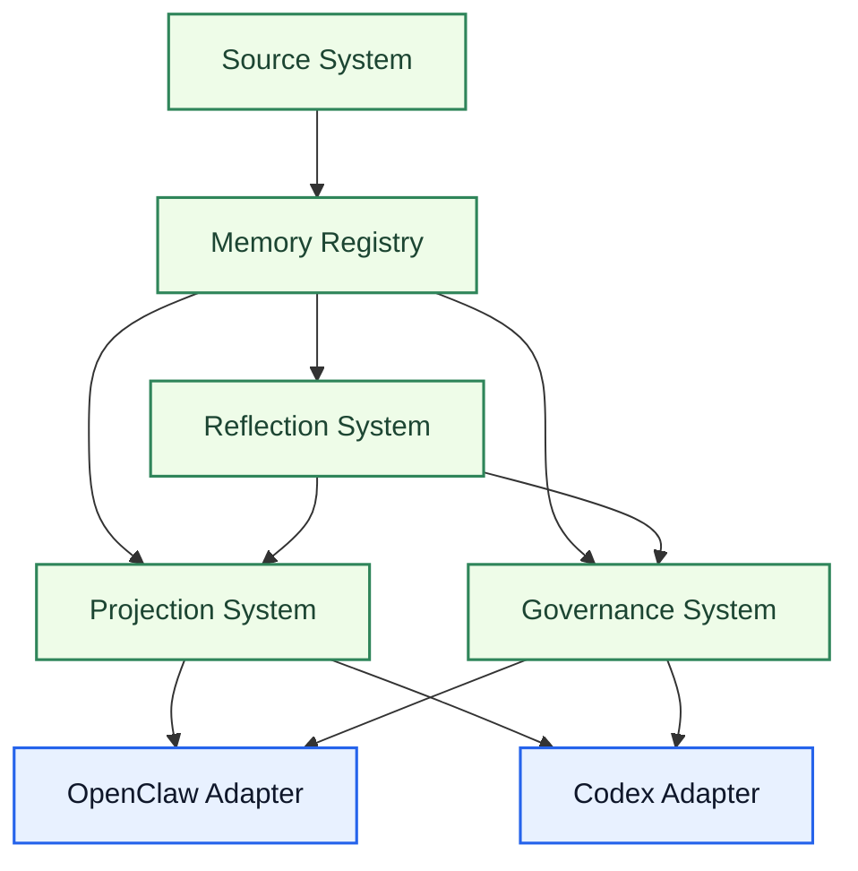

# Unified Memory Core Development Plan

[English](#english) | [中文](#中文)

## English

## Purpose

This document converts the product roadmap into an execution plan.

It is meant to answer one practical question:

`from the current repo state to the final product target, what should we build next, in what order, and how do we know each step is done?`

Use this document as the review and execution baseline before implementation starts.

Related documents:

- [../../project-roadmap.md](../../project-roadmap.md)
- [../../system-architecture.md](../../system-architecture.md)
- [../../unified-memory-core-architecture.md](../../unified-memory-core-architecture.md)
- [../../unified-memory-core-roadmap.md](../../unified-memory-core-roadmap.md)
- [deployment-topology.md](deployment-topology.md)
- [architecture/README.md](architecture/README.md)
- [roadmaps/README.md](roadmaps/README.md)
- [blueprints/README.md](blueprints/README.md)
- [testing/README.md](testing/README.md)

## Final Target

`Unified Memory Core` should become:

- a governed shared-memory foundation
- a reusable product core for OpenClaw, Codex, and future tools
- a multi-adapter system with explicit namespaces, visibility rules, and repairable artifacts
- a product that can run in embedded mode and standalone mode

## Current Starting Point

The repo has already completed:

- product naming alignment
- top-level architecture alignment
- OpenClaw adapter rename and runtime verification
- master roadmap alignment
- self-learning boundary definition
- module-document skeleton setup
- step 1-12 design-package completion

The next step is no longer “discuss the shape”.

The next step is:

`use the current document set as the implementation baseline and start incremental development`

## Current Execution Status

- `Step 1-4`: completed
- `Step 5-7`: completed at the document / contract / backbone-definition level
- `Step 8-9`: completed at the adapter design-package level
- `Step 10-12`: completed at the workstream / standalone / independent-execution design-package level
- next phase: implementation kickoff with the current document set as baseline
- current implementation progress:
  - shared contracts landed in [../../src/unified-memory-core/contracts.js](../../src/unified-memory-core/contracts.js)
  - `Source System` MVP landed in [../../src/unified-memory-core/source-system.js](../../src/unified-memory-core/source-system.js)
  - `Memory Registry` MVP landed in [../../src/unified-memory-core/memory-registry.js](../../src/unified-memory-core/memory-registry.js)
  - local `source -> candidate` loop landed in [../../src/unified-memory-core/pipeline.js](../../src/unified-memory-core/pipeline.js)
  - `Projection System` MVP landed in [../../src/unified-memory-core/projection-system.js](../../src/unified-memory-core/projection-system.js)
  - OpenClaw / Codex adapter bridges landed in [../../src/unified-memory-core/adapter-bridges.js](../../src/unified-memory-core/adapter-bridges.js)
  - `Governance System` MVP landed in [../../src/unified-memory-core/governance-system.js](../../src/unified-memory-core/governance-system.js)
  - OpenClaw adapter runtime integration landed in [../../src/openclaw-adapter.js](../../src/openclaw-adapter.js)
  - Codex adapter runtime integration landed in [../../src/codex-adapter.js](../../src/codex-adapter.js)
  - adapter compatibility tests landed in [../../test/adapter-compatibility.test.js](../../test/adapter-compatibility.test.js)
  - tranche-1 tests landed in [../../test/unified-memory-core](../../test/unified-memory-core)

Important note:

- multi-runtime and multi-tool topology is now part of the execution baseline
- current implementation should be `network-ready`, but not `network-required`

## Implementation Baseline

From this point onward, `development-plan.md` should be read as:

- the implementation kickoff guide
- the sequencing guide for the first coding waves
- the coordination baseline across core, adapters, self-learning, and standalone mode

That means:

- steps `1-12` are now design-complete
- implementation should start from the existing contracts and test surfaces
- the document should now answer `what should we code first, second, and third`

## Program Map

```mermaid
flowchart LR
    A["Step 1\nFreeze execution order"] --> B["Step 2\nFinish module architecture docs"]
    B --> C["Step 3\nFinish module roadmaps / blueprints / todo"]
    C --> D["Step 4\nDefine testing surfaces"]
    D --> E["Step 5\nBuild core contracts"]
    E --> F["Step 6\nBuild source + registry backbone"]
    F --> G["Step 7\nBuild projection + governance backbone"]
    G --> H["Step 8\nBuild OpenClaw adapter integration"]
    H --> I["Step 9\nBuild Codex adapter integration"]
    I --> J["Step 10\nBuild self-learning workstream"]
    J --> K["Step 11\nHarden CLI + standalone mode"]
    K --> L["Step 12\nPrepare split-ready independent product execution"]

    classDef plan fill:#e8f1ff,stroke:#2563eb,color:#0f172a,stroke-width:1.6px;
    class A,B,C,D,E,F,G,H,I,J,K,L plan;
```

## Execution Order

### Step 1. Freeze execution order

Goal:

- confirm the main build order
- confirm which module blocks others
- confirm which work can stay parallel

Deliverables:

- this document
- explicit “build-first” module order

Done when:

- the team agrees on the order below
- no major architecture ambiguity remains at the top level

### Step 2. Finish module architecture docs

Goal:

- turn each first-class module from placeholder into a real architecture doc

Priority order:

1. `Source System`
2. `Memory Registry`
3. `OpenClaw Adapter`
4. `Codex Adapter`
5. `Projection System`
6. `Governance System`
7. `Reflection System`

Deliverables:

- one formal architecture doc per module
- boundaries, inputs, outputs, artifact shapes, dependency rules

Done when:

- each module doc can answer “what it owns / what it does not own / what it emits / what it consumes”

### Step 3. Finish module roadmaps / blueprints / todo

Goal:

- convert each module architecture into executable planning material

Deliverables:

- one roadmap per module
- one blueprint per module
- one todo file per module

Done when:

- each module has a phased build order
- each module has a near-term task queue
- dependencies across modules are explicit

### Step 4. Define testing surfaces

Goal:

- decide how correctness will be measured before deeper implementation starts

Deliverables:

- module case matrix
- artifact validation rules
- adapter compatibility checks
- regression ownership map

Done when:

- every major module has at least one explicit validation surface
- “what breaks if this changes” is visible

### Step 5. Build core contracts

Goal:

- lock the product’s shared contracts before implementation spreads

Contracts to define first:

- source artifact schema
- candidate artifact schema
- stable artifact schema
- decision trail schema
- namespace model
- visibility model
- export contract

Done when:

- adapters and core can reference one shared contract set
- tests exist for contract parsing / validation
- the contracts remain valid for single-host and future multi-host operation

### Step 6. Build source + registry backbone

Goal:

- build the minimum product core that can ingest controlled sources and persist governed artifacts

Implementation order:

1. `Source System`
2. `Memory Registry`

Deliverables:

- source adapters MVP
- normalization / fingerprinting
- registry persistence model
- artifact lifecycle states

Done when:

- one or more controlled sources can become persisted candidate artifacts
- the registry can store and query lifecycle state cleanly
- the registry shape is still compatible with future shared-service coordination

### Step 7. Build projection + governance backbone

Goal:

- make artifacts exportable and auditable before broad adapter growth

Implementation order:

1. `Projection System`
2. `Governance System`

Deliverables:

- export builders
- comparison / diff surfaces
- audit / repair / replay primitives
- artifact regression checks

Done when:

- a stable artifact can be exported deterministically
- exported outputs can be audited and repaired
- projection and governance rules remain usable for multi-runtime sharing

### Step 8. Build OpenClaw adapter integration

Goal:

- move the current repo shape toward the formal OpenClaw adapter boundary

Deliverables:

- namespace mapping for OpenClaw
- export consumption path
- retrieval / assembly integration against product contracts
- adapter-specific tests

Done when:

- OpenClaw consumes product exports through the adapter boundary
- adapter behavior stays regression-covered

### Step 9. Build Codex adapter integration

Goal:

- make Codex a first-class consumer from the beginning of real implementation

Deliverables:

- code-memory namespace mapping
- project / user binding model
- Codex-facing export projection
- adapter-specific test coverage

Done when:

- Codex can consume shared code memory through stable exports
- OpenClaw and Codex can share one governed memory namespace without tight coupling

### Step 10. Build self-learning workstream

Goal:

- turn the architecture into an actual governed learning pipeline

Implementation order:

1. candidate learning schema
2. daily reflection pipeline
3. promotion / decay rules
4. policy adaptation hooks
5. learning governance reports

Done when:

- daily learning runs can produce reviewable artifacts
- promotion is governed and reversible
- learned patterns can influence adapter behavior through explicit exports

### Step 11. Build CLI + standalone mode

Goal:

- make the system operable outside the OpenClaw runtime loop

Deliverables:

- standalone CLI commands
- scheduled-job-friendly entrypoints
- source registration flow
- export / audit / repair commands

Done when:

- at least one full ingest -> reflect -> export path can run without OpenClaw host participation

### Step 12. Prepare split-ready independent product execution

Goal:

- make the product structurally ready for long-term independent execution

Deliverables:

- split-readiness review
- repo layout convergence
- adapter/core ownership clarity
- independent release planning notes

Done when:

- the core is no longer conceptually trapped inside the OpenClaw adapter
- moving to a fully separate product repo becomes an operational choice, not an architecture rewrite

## Recommended Implementation Tranches

If implementation starts now, the recommended coding order is:

### Tranche 1. Core contracts and persistence baseline

1. implement shared contracts from `Step 5`
2. implement `Source System` MVP
3. implement `Memory Registry` MVP
4. add contract / registry tests first

Goal:

- one or more controlled sources can produce governed candidate artifacts

### Tranche 2. Export and adapter baseline

1. implement `Projection System` MVP
2. implement `Governance System` MVP
3. implement `OpenClaw Adapter` consumption boundary
4. implement `Codex Adapter` read-side boundary

Goal:

- stable artifacts can be exported deterministically and consumed by OpenClaw and Codex through adapter boundaries

### Tranche 3. Learning and standalone baseline

1. implement `Reflection System` MVP
2. implement `self-learning` daily reflection loop
3. implement `Standalone Mode` command surface
4. add repair / replay / audit paths around early artifacts

Goal:

- one local-first ingest -> reflect -> export path runs end to end without host-only coupling

Current implementation status:

- `Tranche 1`: complete
- `Tranche 2`: complete
- `Tranche 3`: complete
- `Reflection System` MVP is implemented
- `self-learning` daily reflection loop baseline is implemented
- standalone runtime and CLI baseline are implemented
- standalone audit / repair / replay command baseline is implemented
- standalone export inspect command baseline is implemented
- independent execution / split-readiness review baseline is implemented
- ownership map, release-boundary note, and migration checklist are implemented
- current local-first implementation plan baseline is complete

## Immediate Next Build

The immediate next build should be:

1. no further work is required for the current local-first plan baseline
2. any next work should be treated as a new enhancement phase
3. deeper repair / replay paths remain optional hardening
4. advanced policy adaptation remains deferred

Do not start with:

- runtime API
- multi-host network service
- advanced self-learning policy adaptation
- split execution mechanics beyond documentation

These stay later until the first local-first product loop is stable.

## Dependency Map

## Review Checklist

Review this document with these questions:

1. Is the final target stated clearly enough?
2. Is the execution order reasonable?
3. Are any module dependencies missing?
4. Is anything planned too early or too late?
5. Should any step be split into smaller milestones before implementation?

## 中文

## 目的

这份文档把产品 roadmap 进一步收成“执行计划”。

它回答的是一个更实际的问题：

`从当前仓库状态走到最终产品目标，接下来应该按什么顺序做、每一步产出什么、做到什么程度算完成？`

后续正式开干前，可以把这份文档当成 review 和执行基线。

相关文档：

- [../../project-roadmap.md](../../project-roadmap.md)
- [../../system-architecture.md](../../system-architecture.md)
- [../../unified-memory-core-architecture.md](../../unified-memory-core-architecture.md)
- [../../unified-memory-core-roadmap.md](../../unified-memory-core-roadmap.md)
- [deployment-topology.md](deployment-topology.md)
- [architecture/README.md](architecture/README.md)
- [roadmaps/README.md](roadmaps/README.md)
- [blueprints/README.md](blueprints/README.md)
- [testing/README.md](testing/README.md)

## 最终目标

`Unified Memory Core` 最终应该成为：

- 一套受治理的共享记忆底座
- 一个可被 OpenClaw、Codex 和后续工具复用的产品核心层
- 一个具备显式 namespace、可见性规则、可修复工件的多 adapter 系统
- 一个既能嵌入宿主，也能独立运行的产品

## 当前起点

当前仓库已经完成：

- 产品命名对齐
- 顶层架构对齐
- OpenClaw adapter 重命名与运行验证
- 主 roadmap 对齐
- self-learning 边界定义
- 模块文档骨架建立
- Step 1-12 的设计包收口

现在已经不再是“继续讨论形状”的阶段。

下一步应该进入：

`把当前文档集当成实现基线，开始按顺序逐步落代码`

## 当前执行状态

- `Step 1-4`：已完成
- `Step 5-7`：已在文档 / 契约 / 主骨架定义层完成
- `Step 8-9`：已在 adapter 设计包层完成
- `Step 10-12`：已在 workstream / standalone / independent-execution 设计包层完成
- 下一阶段：以当前文档集为基线进入实现
- 当前实现进度：
  - shared contracts 已落地到 [../../src/unified-memory-core/contracts.js](../../src/unified-memory-core/contracts.js)
  - `Source System` MVP 已落地到 [../../src/unified-memory-core/source-system.js](../../src/unified-memory-core/source-system.js)
  - `Memory Registry` MVP 已落地到 [../../src/unified-memory-core/memory-registry.js](../../src/unified-memory-core/memory-registry.js)
  - 本地 `source -> candidate` 闭环已落地到 [../../src/unified-memory-core/pipeline.js](../../src/unified-memory-core/pipeline.js)
  - `Projection System` MVP 已落地到 [../../src/unified-memory-core/projection-system.js](../../src/unified-memory-core/projection-system.js)
  - OpenClaw / Codex adapter bridge 已落地到 [../../src/unified-memory-core/adapter-bridges.js](../../src/unified-memory-core/adapter-bridges.js)
  - `Governance System` MVP 已落地到 [../../src/unified-memory-core/governance-system.js](../../src/unified-memory-core/governance-system.js)
  - OpenClaw adapter 运行时集成已落地到 [../../src/openclaw-adapter.js](../../src/openclaw-adapter.js)
  - Codex adapter 运行时集成已落地到 [../../src/codex-adapter.js](../../src/codex-adapter.js)
  - adapter compatibility 测试已落地到 [../../test/adapter-compatibility.test.js](../../test/adapter-compatibility.test.js)
  - tranche-1 测试已落地到 [../../test/unified-memory-core](../../test/unified-memory-core)

补充决策：

- 多 runtime / 多工具链拓扑现在已经纳入执行基线
- 当前实现要做到 `network-ready`，但不要求 `network-required`

## 实现基线

从现在开始，这份 `development-plan.md` 应当被当成：

- 第一阶段实现启动指引
- 前几轮编码顺序指引
- core / adapters / self-learning / standalone 协作基线

也就是说：

- `Step 1-12` 现在都已经在设计层完成
- 实现应直接从现有 contracts 和 testing surfaces 起步
- 这份文档现在更应该回答 `第一步写什么，第二步写什么，第三步写什么`

## 总体路径图

## 执行步骤

### Step 1. 冻结总体执行顺序

目标：

- 确认主线开发顺序
- 确认哪些模块会阻塞后续开发
- 确认哪些工作可以并行

产出：

- 这份文档
- 一份明确的“先做什么、后做什么”的总顺序

完成标准：

- 团队认可这份顺序
- 顶层架构上不再存在大的歧义

### Step 2. 补齐模块架构文档

目标：

- 把每个一等模块从占位页补成正式架构文档

优先顺序：

1. `Source System`
2. `Memory Registry`
3. `OpenClaw Adapter`
4. `Codex Adapter`
5. `Projection System`
6. `Governance System`
7. `Reflection System`

产出：

- 每个模块各一份正式架构文档
- 写清边界、输入、输出、工件形态、依赖规则

完成标准：

- 每份模块文档都能回答“它负责什么 / 不负责什么 / 消费什么 / 产出什么”

### Step 3. 补齐模块 roadmap / blueprint / todo

目标：

- 把每个模块架构文档继续翻译成可执行计划

产出：

- 每个模块一份 roadmap
- 每个模块一份 blueprint
- 每个模块一份 todo

完成标准：

- 每个模块都有阶段顺序
- 每个模块都有近端任务队列
- 模块之间的依赖关系清晰可见

### Step 4. 定义测试面

目标：

- 在深度实现前先明确“后续怎么判断它是对的”

产出：

- 模块用例矩阵
- artifact 校验规则
- adapter 兼容性检查
- regression 归属图

完成标准：

- 每个关键模块至少有一个清晰测试面
- “改这里会影响哪里” 可以被明确看到

### Step 5. 建立核心 contracts

目标：

- 在实现扩散前先锁共享契约

优先定义的 contracts：

- source artifact schema
- candidate artifact schema
- stable artifact schema
- decision trail schema
- namespace model
- visibility model
- export contract

完成标准：

- core 与 adapters 可以共用一套契约
- 至少有 contract parsing / validation 测试
- 这套契约在单机与未来多主机模式下都成立

### Step 6. 建立 source + registry 主骨架

目标：

- 先做出一个能 ingest 可控输入、并持久化治理工件的最小核心层

实现顺序：

1. `Source System`
2. `Memory Registry`

产出：

- source adapters MVP
- normalization / fingerprinting
- registry persistence model
- artifact lifecycle states

完成标准：

- 一个或多个可控 source 能进入 candidate artifacts
- registry 能清晰存储和查询生命周期状态
- registry 结构仍然兼容后续 shared-service 协调

### Step 7. 建立 projection + governance 主骨架

目标：

- 在 adapter 扩张前，先让工件具备稳定导出和可治理能力

实现顺序：

1. `Projection System`
2. `Governance System`

产出：

- export builders
- comparison / diff surfaces
- audit / repair / replay primitives
- artifact regression checks

完成标准：

- stable artifact 能被稳定导出
- 导出结果能被审计、修复、回放
- projection / governance 规则能支撑多 runtime 共享

### Step 8. 建立 OpenClaw adapter 集成

目标：

- 把当前仓库形态正式拉到 OpenClaw adapter 边界上

产出：

- OpenClaw namespace mapping
- export consumption path
- retrieval / assembly 与产品 contracts 的集成
- adapter 专属测试

完成标准：

- OpenClaw 通过 adapter 边界消费产品 exports
- adapter 行为有稳定 regression 保护

### Step 9. 建立 Codex adapter 集成

目标：

- 让 Codex 从真正开始开发的第一阶段起就是一等 consumer

产出：

- code-memory namespace mapping
- project / user binding model
- Codex-facing export projection
- adapter 专属测试覆盖

完成标准：

- Codex 能通过稳定 exports 消费共享 code memory
- OpenClaw 与 Codex 能共享同一治理过的 memory namespace，而不是紧耦合互绑

### Step 10. 建立 self-learning workstream

目标：

- 把目前的架构设想变成真正可运行的治理学习管线

实现顺序：

1. candidate learning schema
2. daily reflection pipeline
3. promotion / decay rules
4. policy adaptation hooks
5. learning governance reports

完成标准：

- daily learning run 可以产出可评审工件
- promotion 受治理且可回滚
- 学到的模式可以通过显式 export 影响 adapter 行为

### Step 11. 补齐 CLI + standalone mode

目标：

- 让系统脱离 OpenClaw runtime 也能运行

产出：

- standalone CLI commands
- 面向 scheduled jobs 的入口
- source registration 流程
- export / audit / repair commands

完成标准：

- 至少一条完整的 ingest -> reflect -> export 路径能在没有 OpenClaw host 的情况下跑通

### Step 12. 进入 split-ready 的独立产品执行

目标：

- 让产品在结构上真正具备独立执行条件

产出：

- split-readiness review
- repo layout 收口
- core / adapter ownership clarity
- 独立发布准备说明

完成标准：

- core 不再概念上困在 OpenClaw adapter 里面
- 未来是否彻底拆成独立产品仓，变成执行选择，而不是必须重写架构

## 推荐的分批实现顺序

如果现在正式开始开发，建议按 3 个 tranche 推进：

### Tranche 1. Core contracts 与持久化基线

1. 先实现 `Step 5` 里定义的 shared contracts
2. 再实现 `Source System` MVP
3. 再实现 `Memory Registry` MVP
4. 先把 contract / registry tests 补上

目标：

- 让一个或多个可控 source 能稳定产出 governed candidate artifacts

### Tranche 2. Export 与 adapter 基线

1. 实现 `Projection System` MVP
2. 实现 `Governance System` MVP
3. 实现 `OpenClaw Adapter` 的 consumption boundary
4. 实现 `Codex Adapter` 的 read-side boundary

目标：

- stable artifacts 能稳定导出，并通过 adapter 边界被 OpenClaw / Codex 消费

### Tranche 3. Learning 与 standalone 基线

1. 实现 `Reflection System` MVP
2. 实现 `self-learning` 的 daily reflection loop
3. 实现 `Standalone Mode` 的 command surface
4. 给早期 artifacts 补上 repair / replay / audit 路径

目标：

- 至少一条 local-first 的 ingest -> reflect -> export 路径，能在不依赖宿主的情况下端到端跑通

当前实现状态：

- `Tranche 1`：已完成
- `Tranche 2`：已完成
- `Tranche 3`：已完成
- `Reflection System` MVP 已实现
- `self-learning` 的 daily reflection loop 基线已实现
- standalone runtime 与 CLI 基线已实现
- standalone audit / repair / replay 命令基线已实现
- standalone export inspect 命令基线已实现
- independent execution / split-readiness review 基线已实现
- ownership map、release-boundary note、migration checklist 已实现
- 当前 local-first implementation plan baseline 已闭环

## 当前建议立刻开做的内容

下一步最适合直接开做的是：

1. 当前 local-first plan baseline 已完成，不需要继续硬推
2. 如果继续，应当视为新的增强阶段
3. 更深的 repair / replay 路径属于可选加固项
4. 高阶 policy adaptation 继续延后

当前不要优先做：

- runtime API
- 多主机网络服务
- 高阶 self-learning policy adaptation
- 超出文档阶段之外的 split execution mechanics

这些都应该放到第一条 local-first 产品闭环稳定之后。

## 依赖关系图

## Review 清单

review 这份文档时，建议重点看这几个问题：

1. 最终目标写得是否足够清楚？
2. 执行顺序是否合理？
3. 模块依赖是否有遗漏？
4. 有没有哪一步排得太早或太晚？
5. 有没有哪一步需要在正式实现前再拆小？
