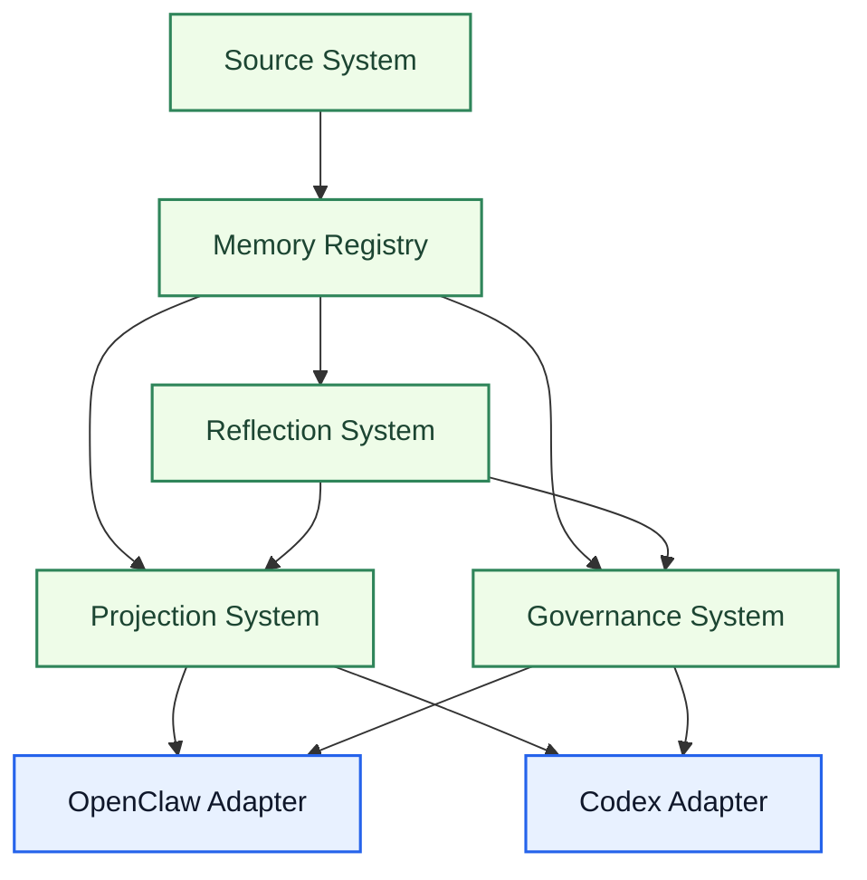

# Unified Memory Core Development Plan

[English](#english) | [中文](#中文)

## English

## Purpose

This document converts the product roadmap into an execution plan.

It is meant to answer one practical question:

`from the current repo state to the final product target, what should we build next, in what order, and how do we know each step is done?`

Use this document as the review and execution baseline before implementation starts.

Related documents:

- [../../project-roadmap.md](../../project-roadmap.md)
- [../../system-architecture.md](../../system-architecture.md)
- [../../unified-memory-core-architecture.md](../../unified-memory-core-architecture.md)
- [../../unified-memory-core-roadmap.md](../../unified-memory-core-roadmap.md)
- [architecture/README.md](architecture/README.md)
- [roadmaps/README.md](roadmaps/README.md)
- [blueprints/README.md](blueprints/README.md)
- [testing/README.md](testing/README.md)

## Final Target

`Unified Memory Core` should become:

- a governed shared-memory foundation
- a reusable product core for OpenClaw, Codex, and future tools
- a multi-adapter system with explicit namespaces, visibility rules, and repairable artifacts
- a product that can run in embedded mode and standalone mode

## Current Starting Point

The repo has already completed:

- product naming alignment
- top-level architecture alignment
- OpenClaw adapter rename and runtime verification
- master roadmap alignment
- self-learning boundary definition
- module-document skeleton setup

The next step is no longer “discuss the shape”.

The next step is:

`turn the agreed architecture into module-level contracts, test surfaces, and then incremental implementation`

## Program Map

```mermaid
flowchart LR
    A["Step 1\nFreeze execution order"] --> B["Step 2\nFinish module architecture docs"]
    B --> C["Step 3\nFinish module roadmaps / blueprints / todo"]
    C --> D["Step 4\nDefine testing surfaces"]
    D --> E["Step 5\nBuild core contracts"]
    E --> F["Step 6\nBuild source + registry backbone"]
    F --> G["Step 7\nBuild projection + governance backbone"]
    G --> H["Step 8\nBuild OpenClaw adapter integration"]
    H --> I["Step 9\nBuild Codex adapter integration"]
    I --> J["Step 10\nBuild self-learning workstream"]
    J --> K["Step 11\nHarden CLI + standalone mode"]
    K --> L["Step 12\nPrepare split-ready independent product execution"]

    classDef plan fill:#e8f1ff,stroke:#2563eb,color:#0f172a,stroke-width:1.6px;
    class A,B,C,D,E,F,G,H,I,J,K,L plan;
```

## Execution Order

### Step 1. Freeze execution order

Goal:

- confirm the main build order
- confirm which module blocks others
- confirm which work can stay parallel

Deliverables:

- this document
- explicit “build-first” module order

Done when:

- the team agrees on the order below
- no major architecture ambiguity remains at the top level

### Step 2. Finish module architecture docs

Goal:

- turn each first-class module from placeholder into a real architecture doc

Priority order:

1. `Source System`
2. `Memory Registry`
3. `OpenClaw Adapter`
4. `Codex Adapter`
5. `Projection System`
6. `Governance System`
7. `Reflection System`

Deliverables:

- one formal architecture doc per module
- boundaries, inputs, outputs, artifact shapes, dependency rules

Done when:

- each module doc can answer “what it owns / what it does not own / what it emits / what it consumes”

### Step 3. Finish module roadmaps / blueprints / todo

Goal:

- convert each module architecture into executable planning material

Deliverables:

- one roadmap per module
- one blueprint per module
- one todo file per module

Done when:

- each module has a phased build order
- each module has a near-term task queue
- dependencies across modules are explicit

### Step 4. Define testing surfaces

Goal:

- decide how correctness will be measured before deeper implementation starts

Deliverables:

- module case matrix
- artifact validation rules
- adapter compatibility checks
- regression ownership map

Done when:

- every major module has at least one explicit validation surface
- “what breaks if this changes” is visible

### Step 5. Build core contracts

Goal:

- lock the product’s shared contracts before implementation spreads

Contracts to define first:

- source artifact schema
- candidate artifact schema
- stable artifact schema
- decision trail schema
- namespace model
- visibility model
- export contract

Done when:

- adapters and core can reference one shared contract set
- tests exist for contract parsing / validation

### Step 6. Build source + registry backbone

Goal:

- build the minimum product core that can ingest controlled sources and persist governed artifacts

Implementation order:

1. `Source System`
2. `Memory Registry`

Deliverables:

- source adapters MVP
- normalization / fingerprinting
- registry persistence model
- artifact lifecycle states

Done when:

- one or more controlled sources can become persisted candidate artifacts
- the registry can store and query lifecycle state cleanly

### Step 7. Build projection + governance backbone

Goal:

- make artifacts exportable and auditable before broad adapter growth

Implementation order:

1. `Projection System`
2. `Governance System`

Deliverables:

- export builders
- comparison / diff surfaces
- audit / repair / replay primitives
- artifact regression checks

Done when:

- a stable artifact can be exported deterministically
- exported outputs can be audited and repaired

### Step 8. Build OpenClaw adapter integration

Goal:

- move the current repo shape toward the formal OpenClaw adapter boundary

Deliverables:

- namespace mapping for OpenClaw
- export consumption path
- retrieval / assembly integration against product contracts
- adapter-specific tests

Done when:

- OpenClaw consumes product exports through the adapter boundary
- adapter behavior stays regression-covered

### Step 9. Build Codex adapter integration

Goal:

- make Codex a first-class consumer from the beginning of real implementation

Deliverables:

- code-memory namespace mapping
- project / user binding model
- Codex-facing export projection
- adapter-specific test coverage

Done when:

- Codex can consume shared code memory through stable exports
- OpenClaw and Codex can share one governed memory namespace without tight coupling

### Step 10. Build self-learning workstream

Goal:

- turn the architecture into an actual governed learning pipeline

Implementation order:

1. candidate learning schema
2. daily reflection pipeline
3. promotion / decay rules
4. policy adaptation hooks
5. learning governance reports

Done when:

- daily learning runs can produce reviewable artifacts
- promotion is governed and reversible
- learned patterns can influence adapter behavior through explicit exports

### Step 11. Build CLI + standalone mode

Goal:

- make the system operable outside the OpenClaw runtime loop

Deliverables:

- standalone CLI commands
- scheduled-job-friendly entrypoints
- source registration flow
- export / audit / repair commands

Done when:

- at least one full ingest -> reflect -> export path can run without OpenClaw host participation

### Step 12. Prepare split-ready independent product execution

Goal:

- make the product structurally ready for long-term independent execution

Deliverables:

- split-readiness review
- repo layout convergence
- adapter/core ownership clarity
- independent release planning notes

Done when:

- the core is no longer conceptually trapped inside the OpenClaw adapter
- moving to a fully separate product repo becomes an operational choice, not an architecture rewrite

## Recommended Immediate Build Order

If implementation starts now, the recommended short-term order is:

1. finish `Source System` architecture / roadmap / blueprint / todo
2. finish `Memory Registry` architecture / roadmap / blueprint / todo
3. finish `OpenClaw Adapter` architecture / roadmap / blueprint / todo
4. finish `Codex Adapter` architecture / roadmap / blueprint / todo
5. define shared contracts and testing surfaces
6. start code implementation with `Source System + Memory Registry`

## Dependency Map

## Review Checklist

Review this document with these questions:

1. Is the final target stated clearly enough?
2. Is the execution order reasonable?
3. Are any module dependencies missing?
4. Is anything planned too early or too late?
5. Should any step be split into smaller milestones before implementation?

## 中文

## 目的

这份文档把产品 roadmap 进一步收成“执行计划”。

它回答的是一个更实际的问题：

`从当前仓库状态走到最终产品目标，接下来应该按什么顺序做、每一步产出什么、做到什么程度算完成？`

后续正式开干前，可以把这份文档当成 review 和执行基线。

相关文档：

- [../../project-roadmap.md](../../project-roadmap.md)
- [../../system-architecture.md](../../system-architecture.md)
- [../../unified-memory-core-architecture.md](../../unified-memory-core-architecture.md)
- [../../unified-memory-core-roadmap.md](../../unified-memory-core-roadmap.md)
- [architecture/README.md](architecture/README.md)
- [roadmaps/README.md](roadmaps/README.md)
- [blueprints/README.md](blueprints/README.md)
- [testing/README.md](testing/README.md)

## 最终目标

`Unified Memory Core` 最终应该成为：

- 一套受治理的共享记忆底座
- 一个可被 OpenClaw、Codex 和后续工具复用的产品核心层
- 一个具备显式 namespace、可见性规则、可修复工件的多 adapter 系统
- 一个既能嵌入宿主，也能独立运行的产品

## 当前起点

当前仓库已经完成：

- 产品命名对齐
- 顶层架构对齐
- OpenClaw adapter 重命名与运行验证
- 主 roadmap 对齐
- self-learning 边界定义
- 模块文档骨架建立

现在已经不再是“继续讨论形状”的阶段。

下一步应该进入：

`把已经达成共识的架构，收成模块级契约、测试面和分阶段实现计划`

## 总体路径图

## 执行步骤

### Step 1. 冻结总体执行顺序

目标：

- 确认主线开发顺序
- 确认哪些模块会阻塞后续开发
- 确认哪些工作可以并行

产出：

- 这份文档
- 一份明确的“先做什么、后做什么”的总顺序

完成标准：

- 团队认可这份顺序
- 顶层架构上不再存在大的歧义

### Step 2. 补齐模块架构文档

目标：

- 把每个一等模块从占位页补成正式架构文档

优先顺序：

1. `Source System`
2. `Memory Registry`
3. `OpenClaw Adapter`
4. `Codex Adapter`
5. `Projection System`
6. `Governance System`
7. `Reflection System`

产出：

- 每个模块各一份正式架构文档
- 写清边界、输入、输出、工件形态、依赖规则

完成标准：

- 每份模块文档都能回答“它负责什么 / 不负责什么 / 消费什么 / 产出什么”

### Step 3. 补齐模块 roadmap / blueprint / todo

目标：

- 把每个模块架构文档继续翻译成可执行计划

产出：

- 每个模块一份 roadmap
- 每个模块一份 blueprint
- 每个模块一份 todo

完成标准：

- 每个模块都有阶段顺序
- 每个模块都有近端任务队列
- 模块之间的依赖关系清晰可见

### Step 4. 定义测试面

目标：

- 在深度实现前先明确“后续怎么判断它是对的”

产出：

- 模块用例矩阵
- artifact 校验规则
- adapter 兼容性检查
- regression 归属图

完成标准：

- 每个关键模块至少有一个清晰测试面
- “改这里会影响哪里” 可以被明确看到

### Step 5. 建立核心 contracts

目标：

- 在实现扩散前先锁共享契约

优先定义的 contracts：

- source artifact schema
- candidate artifact schema
- stable artifact schema
- decision trail schema
- namespace model
- visibility model
- export contract

完成标准：

- core 与 adapters 可以共用一套契约
- 至少有 contract parsing / validation 测试

### Step 6. 建立 source + registry 主骨架

目标：

- 先做出一个能 ingest 可控输入、并持久化治理工件的最小核心层

实现顺序：

1. `Source System`
2. `Memory Registry`

产出：

- source adapters MVP
- normalization / fingerprinting
- registry persistence model
- artifact lifecycle states

完成标准：

- 一个或多个可控 source 能进入 candidate artifacts
- registry 能清晰存储和查询生命周期状态

### Step 7. 建立 projection + governance 主骨架

目标：

- 在 adapter 扩张前，先让工件具备稳定导出和可治理能力

实现顺序：

1. `Projection System`
2. `Governance System`

产出：

- export builders
- comparison / diff surfaces
- audit / repair / replay primitives
- artifact regression checks

完成标准：

- stable artifact 能被稳定导出
- 导出结果能被审计、修复、回放

### Step 8. 建立 OpenClaw adapter 集成

目标：

- 把当前仓库形态正式拉到 OpenClaw adapter 边界上

产出：

- OpenClaw namespace mapping
- export consumption path
- retrieval / assembly 与产品 contracts 的集成
- adapter 专属测试

完成标准：

- OpenClaw 通过 adapter 边界消费产品 exports
- adapter 行为有稳定 regression 保护

### Step 9. 建立 Codex adapter 集成

目标：

- 让 Codex 从真正开始开发的第一阶段起就是一等 consumer

产出：

- code-memory namespace mapping
- project / user binding model
- Codex-facing export projection
- adapter 专属测试覆盖

完成标准：

- Codex 能通过稳定 exports 消费共享 code memory
- OpenClaw 与 Codex 能共享同一治理过的 memory namespace，而不是紧耦合互绑

### Step 10. 建立 self-learning workstream

目标：

- 把目前的架构设想变成真正可运行的治理学习管线

实现顺序：

1. candidate learning schema
2. daily reflection pipeline
3. promotion / decay rules
4. policy adaptation hooks
5. learning governance reports

完成标准：

- daily learning run 可以产出可评审工件
- promotion 受治理且可回滚
- 学到的模式可以通过显式 export 影响 adapter 行为

### Step 11. 补齐 CLI + standalone mode

目标：

- 让系统脱离 OpenClaw runtime 也能运行

产出：

- standalone CLI commands
- 面向 scheduled jobs 的入口
- source registration 流程
- export / audit / repair commands

完成标准：

- 至少一条完整的 ingest -> reflect -> export 路径能在没有 OpenClaw host 的情况下跑通

### Step 12. 进入 split-ready 的独立产品执行

目标：

- 让产品在结构上真正具备独立执行条件

产出：

- split-readiness review
- repo layout 收口
- core / adapter ownership clarity
- 独立发布准备说明

完成标准：

- core 不再概念上困在 OpenClaw adapter 里面
- 未来是否彻底拆成独立产品仓，变成执行选择，而不是必须重写架构

## 现在最适合的短期开发顺序

如果现在就正式开始开发，建议的短期顺序是：

1. 先补齐 `Source System` 的 architecture / roadmap / blueprint / todo
2. 再补齐 `Memory Registry` 的 architecture / roadmap / blueprint / todo
3. 再补齐 `OpenClaw Adapter` 的 architecture / roadmap / blueprint / todo
4. 再补齐 `Codex Adapter` 的 architecture / roadmap / blueprint / todo
5. 然后定义 shared contracts 和 testing surfaces
6. 最后从 `Source System + Memory Registry` 开始写第一阶段代码

## 依赖关系图

## Review 清单

review 这份文档时，建议重点看这几个问题：

1. 最终目标写得是否足够清楚？
2. 执行顺序是否合理？
3. 模块依赖是否有遗漏？
4. 有没有哪一步排得太早或太晚？
5. 有没有哪一步需要在正式实现前再拆小？
