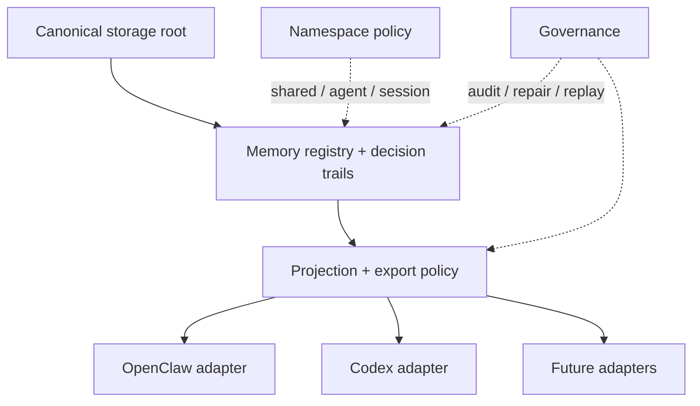

# Host-Neutral Memory Architecture

[English](architecture.md) | [中文](architecture.zh-CN.md)

## Purpose

This document defines the architecture boundary for making `Unified Memory Core` host-neutral.

The core architectural decision is:

`OpenClaw and Codex should consume one governed memory core; neither host should own canonical long-term memory.`

## Problem Statement

The current implementation is local-first and already useful, but the live registry path still carries OpenClaw host semantics.

That creates three long-term risks:

1. canonical memory can be mistaken for OpenClaw-owned state
2. Codex compatibility can drift into adapter-local copies instead of shared memory
3. agent namespace growth can incorrectly push the system toward per-agent physical storage

## Target State

The target system keeps:

- one canonical registry
- logical namespace layering
- adapter-specific projection rules
- host-neutral runtime access

The target system avoids:

- separate durable memory stores per agent by default
- OpenClaw-owned canonical long-term storage
- hidden adapter-local stable memory that cannot be governed centrally

## Layered Model

## Canonical Storage Principle

Canonical storage should belong to `Unified Memory Core`, not to a host runtime.

Expected direction:

- canonical root: host-neutral
- host adapters: consumers and producers
- registry and governance: shared product-core responsibility

This means OpenClaw can still trigger learning and consume exports, but it should not remain the conceptual owner of stable memory.

## Namespace Principle

Namespace is a logical isolation layer, not a physical storage requirement.

Recommended durable layering:

- shared workspace namespace
- optional agent sub namespace
- optional short-lived session scope for non-durable runtime material

Default rule:

- keep one physical registry
- segment access and projection by namespace

## Data Placement Policy

Recommended placement policy:

- shared workspace namespace:
  - stable facts
  - long-term rules
  - shared project background
- agent sub namespace:
  - agent-specific workflow preferences
  - agent-local operating conventions
  - bounded behavior patterns that should not globally override all consumers
- short-term or non-registry layer:
  - transient session summaries
  - current execution chatter
  - volatile runtime state

## Runtime Resolution Model

For a current OpenClaw or Codex consumer, reads should resolve in this order:

1. current agent sub namespace when enabled
2. shared workspace namespace
3. optional compatibility fallback during migration

Writes should follow artifact policy:

- stable shared knowledge -> shared workspace namespace
- agent-specific stable learning -> agent sub namespace
- volatile session material -> non-durable or short-lived layer

## Migration Strategy

The system should not break current local-first deployments while decoupling from OpenClaw-host paths.

The intended migration envelope is:

1. define canonical registry root resolution
2. add compatibility fallback for the current OpenClaw-scoped root
3. migrate or adopt existing records without silent loss
4. update OpenClaw and Codex adapters to resolve through the same canonical root

## Constraints

- preserve current local-first behavior
- avoid destructive migration
- keep governance and replay intact
- keep namespace semantics stable across adapters
- do not introduce a remote service requirement in this phase

## Non-Goals

- no mandatory remote sync service
- no per-agent physical database split by default
- no full host rewrite
- no replacement of all OpenClaw built-in memory behavior in one phase

## Development Entry

This architecture is implemented as the `host-neutral-memory` subproject and enters development through:

- registry-root contract
- compatibility and migration path
- OpenClaw / Codex shared-root convergence

Related:

- [README.md](README.md)
- [roadmap.md](roadmap.md)
- [../../../.codex/subprojects/host-neutral-memory.md](../../../.codex/subprojects/host-neutral-memory.md)
