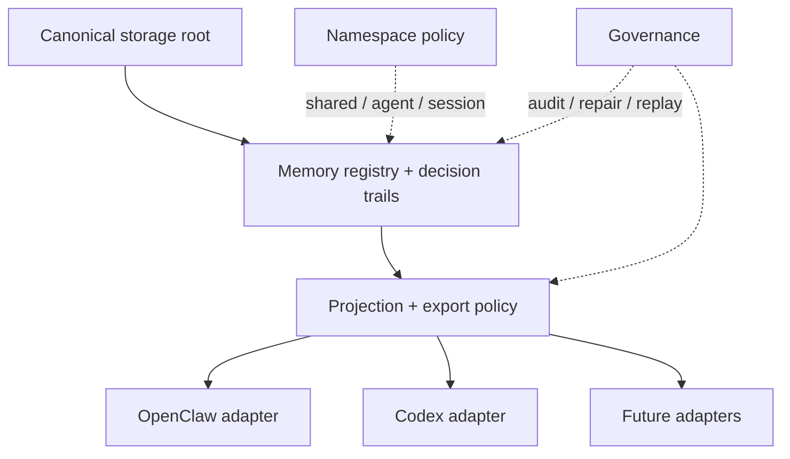

# Host-Neutral Memory Architecture

[English](architecture.md) | [中文](architecture.zh-CN.md)

## 目的

这份文档定义的是：如何把 `Unified Memory Core` 做成宿主无关的记忆核心，而不是继续让 OpenClaw 成为长期记忆的事实宿主。

核心架构决策是：

`OpenClaw 和 Codex 应该消费同一套 governed memory core，而不是各自拥有一份 canonical long-term memory。`

## 问题定义

当前实现已经是可用的 local-first 基线，但 live registry 路径仍然带着明显的 OpenClaw 宿主语义。

长期风险主要有 3 个：

1. canonical memory 容易被误解成 OpenClaw 私有状态
2. Codex 兼容路径容易漂移成 adapter-local 副本，而不是共享记忆
3. agent namespace 一扩张，就容易被误推成“每个 agent 一套物理存储”

## 目标状态

目标系统应保持：

- 一套 canonical registry
- 逻辑 namespace 分层
- adapter-specific projection 规则
- 宿主无关的 runtime access

目标系统应避免：

- 默认给每个 agent 拆独立长期存储
- 让 OpenClaw 持有 canonical long-term storage
- 出现无法统一治理的 adapter-local stable memory

## 分层模型

## Canonical Storage 原则

canonical storage 应归 `Unified Memory Core` 产品主干所有，而不是某个 host runtime。

方向应当是：

- canonical root：宿主无关
- host adapters：只是 consumer / producer
- registry 与 governance：由共享产品主干负责

也就是说，OpenClaw 仍可以触发学习、消费 export，但不该继续被当成 stable memory 的概念所有者。

## Namespace 原则

namespace 是逻辑隔离层，不是物理存储要求。

推荐的长期分层：

- shared workspace namespace
- optional agent sub namespace
- optional short-lived session scope，用于非长期 runtime material

默认规则：

- 维持一套物理 registry
- 通过 namespace 和 projection 做访问分层

## 数据放置策略

推荐的放置策略：

- shared workspace namespace：
  - stable facts
  - 长期规则
  - 共享项目背景
- agent sub namespace：
  - agent-specific workflow preferences
  - agent-local operating conventions
  - 不应全局覆盖所有消费者的局部行为模式
- 短期或非 registry 层：
  - 临时 session summaries
  - 当前执行 chatter
  - 易失 runtime state

## Runtime 解析模型

对于当前 OpenClaw 或 Codex consumer，读取顺序应是：

1. 当前 agent sub namespace（如果开启）
2. shared workspace namespace
3. 迁移期可选 compatibility fallback

写入按 artifact policy 决定：

- stable shared knowledge -> shared workspace namespace
- agent-specific stable learning -> agent sub namespace
- volatile session material -> 非长期或短期层

## 迁移策略

在从 OpenClaw-host 路径解耦时，不应打断现有 local-first 部署。

建议的迁移包络是：

1. 先定义 canonical registry root resolution
2. 给当前 OpenClaw-scoped root 增加 compatibility fallback
3. 迁移或接管已有 records，避免静默丢失
4. 让 OpenClaw / Codex adapter 都通过同一 canonical root 解析

## 约束

- 保留 current local-first 行为
- 避免破坏性迁移
- 保持 governance 与 replay 能力
- 让 namespace 语义在不同 adapter 之间稳定
- 当前阶段不引入远程服务依赖

## 非目标

- 不强制引入 remote sync service
- 不默认给每个 agent 拆物理数据库
- 不一次性重写 host
- 不在这一阶段彻底替代 OpenClaw 内置全部 memory 行为

## 开发入口

这份架构通过 `host-neutral-memory` 子项目进入开发序列，第一批切片是：

- registry-root contract
- compatibility / migration path
- OpenClaw / Codex shared-root convergence

相关文档：

- [README.md](README.md)
- [roadmap.md](roadmap.md)
- [../../../.codex/subprojects/host-neutral-memory.md](../../../.codex/subprojects/host-neutral-memory.md)
