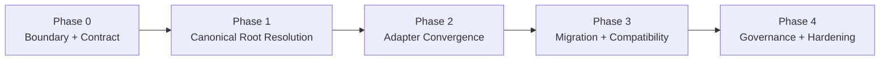

# Host-Neutral Memory Workstream Roadmap

[English](roadmap.md) | [中文](roadmap.zh-CN.md)

## Purpose

This roadmap turns the host-neutral memory architecture into an implementation sequence.

It answers:

- what gets built first
- how OpenClaw-scoped storage is decoupled safely
- how Codex converges on the same durable registry
- which validations are required before migration is considered complete

## Workstream Goal

Build a host-neutral canonical memory layer for `Unified Memory Core` so that:

- OpenClaw and Codex can share one governed registry
- namespace layering stays logical rather than physical
- current local-first deployments keep working during the transition

## Current Status

- status: `implementation-active / migration-and-governance-ready`
- dependency baseline:
  - shared contracts: `ready`
  - registry baseline: `implemented`
  - OpenClaw adapter baseline: `implemented`
  - Codex adapter baseline: `implemented`
  - agent sub namespace baseline: `implemented`
  - Codex write-back ingestion into nightly learning: `implemented`
  - registry migration / topology reporting: `implemented`

## Phase Map

## Phase 0: Boundary + Contract

Goal:

Define the stable product boundary for host-neutral canonical storage.

Scope:

- canonical registry ownership
- namespace vs storage rules
- shared / agent / session durability policy
- config and env resolution contract

Validation:

- boundary is documented
- storage rules are explicit
- first implementation slices are named

## Phase 1: Canonical Root Resolution

Goal:

Teach the runtime to resolve a host-neutral canonical registry root.

Scope:

- canonical root default
- config override
- env override
- compatibility fallback for current OpenClaw-scoped root

Validation:

- runtime resolves one canonical root deterministically
- current OpenClaw installs still work
- targeted tests cover resolution and fallback behavior

## Phase 2: Adapter Convergence

Goal:

Make OpenClaw and Codex resolve through the same memory root and namespace semantics.

Scope:

- OpenClaw adapter path alignment
- Codex adapter path alignment
- shared namespace and agent sub namespace parity
- projection compatibility

Validation:

- one workspace can be read by both adapters from the same registry
- agent-specific records remain scoped correctly
- no adapter-local duplicate stable-memory store is introduced
- Codex task/write-back signals have a planned path into the same governed learning ingestion surface

## Phase 3: Migration + Compatibility

Goal:

Move from OpenClaw-scoped storage semantics to host-neutral semantics without silent loss.

Scope:

- migration or adoption strategy
- registry report / inspection output
- live fallback behavior
- cutover rules

Validation:

- existing records remain visible
- migration is reversible or replayable
- governance surfaces still point to the correct root

## Phase 4: Governance + Hardening

Goal:

Harden the new storage boundary for long-term maintenance.

Scope:

- governance checks for root and namespace consistency
- regression coverage
- documentation and operator guidance

Validation:

- docs and runtime behavior match
- regression suite protects the shared-root path
- the new boundary is stable enough for future policy-adaptation work

## Immediate Execution Order

1. observe live topology and confirm the current active root/fallback path
2. decide the canonical-root cutover window
3. migrate or adopt legacy records into the canonical root when needed
4. keep registry-root findings visible in governance and operator workflows
5. continue adapter quality work without reopening per-host storage drift

Related:

- [architecture.md](architecture.md)
- [README.md](README.md)
- [../../../.codex/plan.md](../../../.codex/plan.md)
