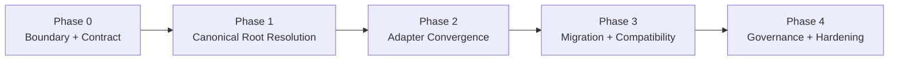

# Host-Neutral Memory Workstream Roadmap

[English](roadmap.md) | [中文](roadmap.zh-CN.md)

## 目的

这份路线图把 host-neutral memory 架构收成可执行的实现序列。

它回答的是：

- 先做什么
- 如何安全地从 OpenClaw-scoped storage 解耦
- Codex 如何收敛到同一套 durable registry
- 迁移完成前必须通过哪些验证

## 工作流目标

为 `Unified Memory Core` 建立一套宿主无关的 canonical memory layer，使得：

- OpenClaw 和 Codex 可以共享一套 governed registry
- namespace 分层保持逻辑意义，而不是拆物理存储
- 当前 local-first 部署在过渡期仍然可用

## 当前状态

- 状态：`policy-explicit / monitoring-active`
- 依赖基线：
  - shared contracts：`ready`
  - registry baseline：`implemented`
  - OpenClaw adapter baseline：`implemented`
  - Codex adapter baseline：`implemented`
  - agent sub namespace baseline：`implemented`
  - Codex write-back 纳入 nightly learning：`implemented`
  - registry migration / topology reporting：`implemented`
  - canonical-root operator policy：`adopt_canonical_root`

## Phase Map

## Phase 0：边界与契约

目标：

定义 host-neutral canonical storage 的稳定产品边界。

范围：

- canonical registry ownership
- namespace 与 storage 规则
- shared / agent / session 的长期性策略
- config / env resolution contract

验证：

- 边界被文档化
- storage 规则明确
- 首批实现切片被命名

## Phase 1：Canonical Root Resolution

目标：

让 runtime 能确定性地解析 host-neutral canonical registry root。

范围：

- canonical root default
- config override
- env override
- 当前 OpenClaw-scoped root 的 compatibility fallback

验证：

- runtime 能确定性解析一个 canonical root
- 当前 OpenClaw 安装仍然可用
- targeted tests 覆盖 resolution 和 fallback 行为

## Phase 2：Adapter Convergence

目标：

让 OpenClaw 和 Codex 通过同一 memory root 和同一套 namespace 语义接入。

范围：

- OpenClaw adapter path 对齐
- Codex adapter path 对齐
- shared namespace 与 agent sub namespace 语义对齐
- projection compatibility

验证：

- 同一 workspace 可被两个 adapter 从同一 registry 读取
- agent-specific records 仍能正确隔离
- 不引入 adapter-local duplicate stable-memory store
- 任一 adapter 发出的 accepted-action events，都应汇合到同一条 host-neutral intake surface

## Phase 3：Migration + Compatibility

目标：

在不静默丢失数据的前提下，从 OpenClaw-scoped storage 语义迁移到 host-neutral 语义。

范围：

- migration / adoption 策略
- registry report / inspection 输出
- live fallback 行为
- cutover 规则

验证：

- 已有 records 仍然可见
- 迁移可回退或可 replay
- governance 输出仍指向正确 root

## Phase 4：Governance + Hardening

目标：

把新的 storage boundary 收到可长期维护的状态。

范围：

- root / namespace 一致性的治理检查
- regression coverage
- 文档和运维说明

验证：

- docs 和 runtime 行为一致
- regression suite 能保护 shared-root 路径
- 新边界稳定到足以支撑后续 policy-adaptation work

## 立即执行顺序

1. 持续观察 live topology，确保 active root 不回退到 `legacy_fallback`
2. 把 runtime 已解析到 canonical root 视为当前已经 adopted 的 cutover 信号
3. 只有在 operator 明确需要维护时，才迁移、归档或清理 legacy records
4. 持续把 registry-root findings 暴露给治理和运维面
5. 保证未来 accepted-action capture 仍然对齐 shared registry intake，而不是退回 adapter-local persistence
6. 继续推进 adapter 质量，而不是重新分叉 per-host storage

相关文档：

- [architecture.md](architecture.md)
- [README.md](README.md)
- [../../../.codex/plan.md](../../../.codex/plan.md)
