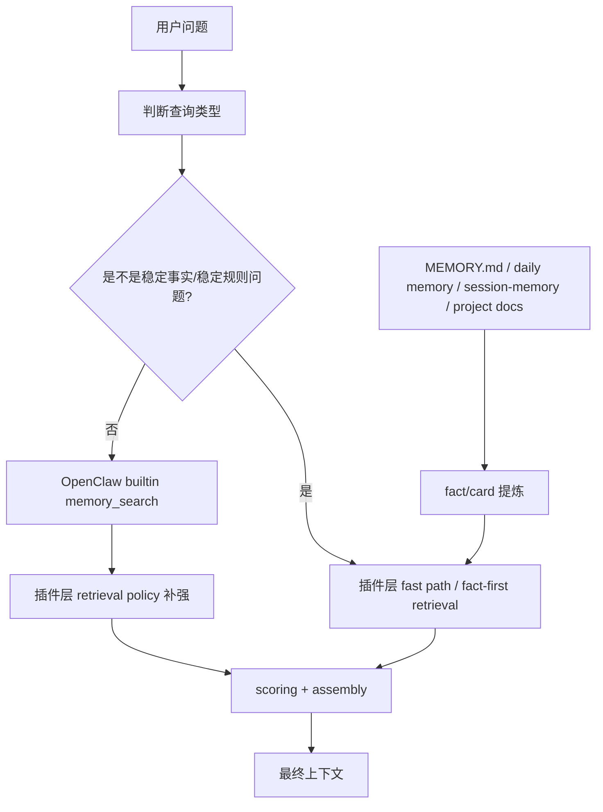
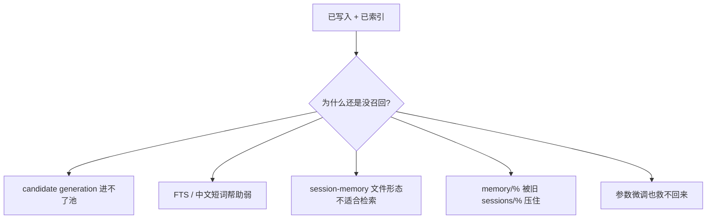
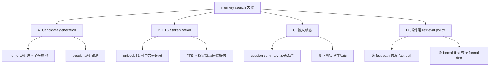
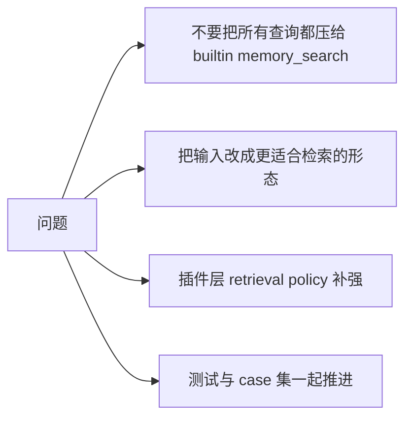
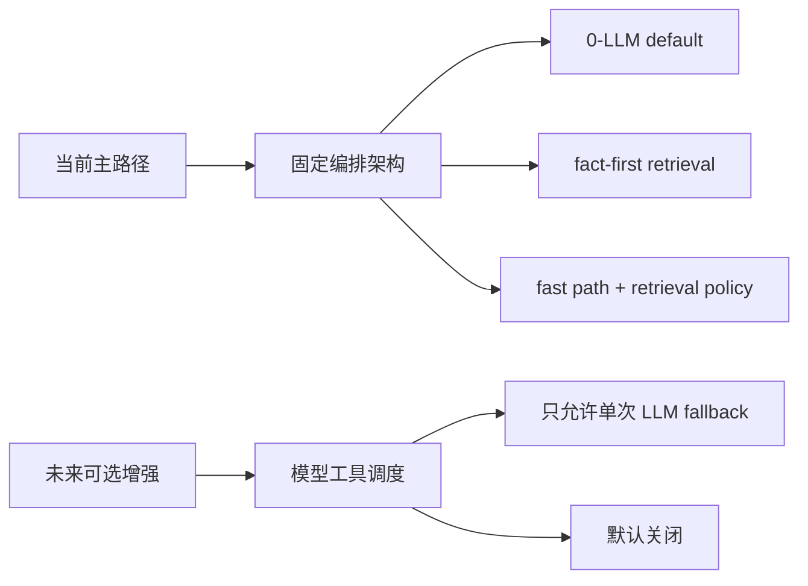
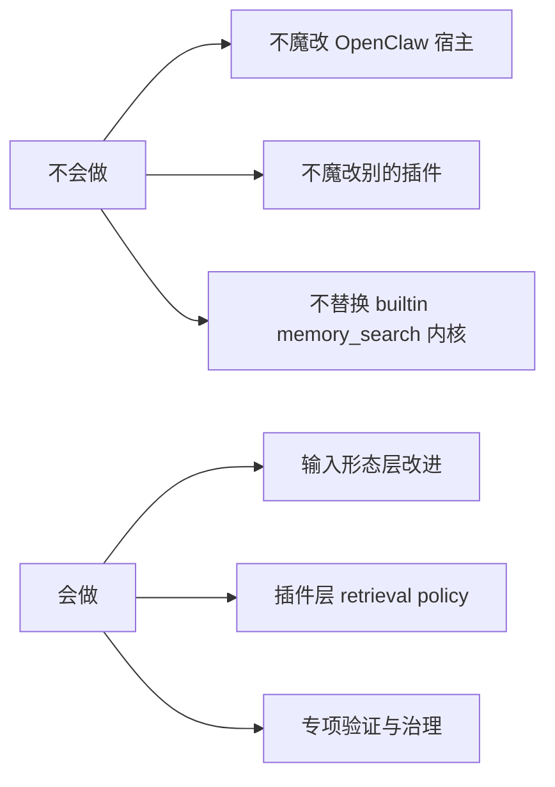
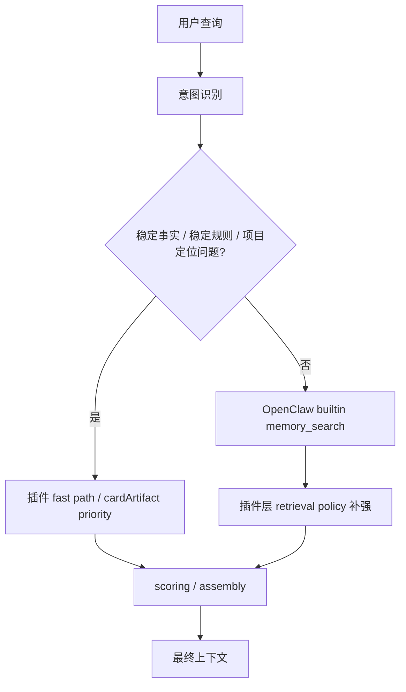
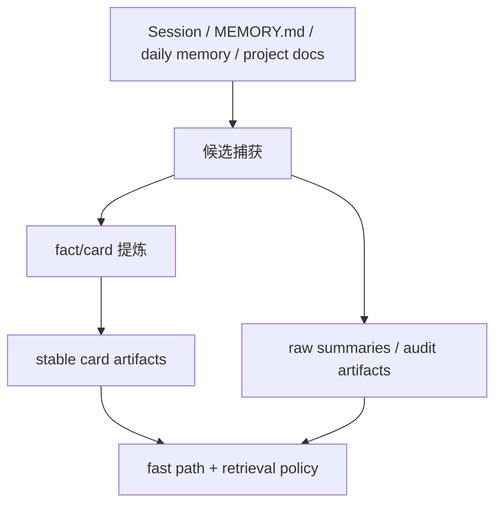

[English](architecture.md) | [中文](architecture.zh-CN.md)

# Memory Search: 问题、解决思路与架构

## 文档目的

这份文档单独讲清楚 `memory search` 这条线现在到底有什么问题、我们准备怎么解、以及后续的架构边界是什么。

这份文档的定位不是“记录一次排障”，而是：

- 给后续开发一个统一的理解基线
- 避免把“宿主 builtin `memory_search` 的问题”和“插件层已经补强的部分”混在一起
- 明确后面哪些能做，哪些不能做

## 一图看懂

## 先说结论

### 1. 宿主 builtin `memory_search` 本身没有被修好

当前已经确认：

- 我们没有魔改 OpenClaw 宿主
- 也没有替换 builtin `memory_search` 的内部算法
- 中文短词 / 短偏好句 / 某些 `session-memory` 文件形态下的召回缺口，仍然存在

所以如果问：

> `memory search` 现在是不是已经彻底好了？

答案是：

**没有。**

### 2. 关键查询现在之所以“能用”，主要靠插件层补强

当前已经完成的补强包括：

- `cardArtifact fast path`
- fact-first retrieval
- stable fact / stable rule priority
- formal memory source priority
- perf-critical query 毫秒级快路径

也就是说：

- 关键问题已经能稳定答对
- 但这不代表宿主内核层的 `memory_search` 根问题已经解决

### 3. 当前最合理的策略不是“硬改宿主”，而是分层治理

在不魔改宿主的前提下，后续要做的是：

1. 查清宿主 builtin `memory_search` 的真实缺口
2. 改善输入形态，让宿主更容易召回对的东西
3. 用插件层 retrieval policy 做稳定补强

### 4. 当前主架构继续采用“固定编排”，而不是“模型工具调度”

这一点要单独说清楚。

后续并不是没考虑过：

- 把 `memory_search`
- 意图判断
- rerank / merge / fact resolve

都做成工具，然后让模型自己在运行时调度。

但当前阶段更推荐的主架构仍然是：

**固定编排架构。**

原因是：

- 更稳
- 更快
- 更容易回归
- 更容易治理

模型工具调度架构不是不能做，而是更适合后续作为：

- 单次 LLM fallback
- 或复杂 query 的增强路径

而不是现在就替代主路径。

更完整的对比文档在：

- [memory-search-orchestration-vs-tool-agent.md](memory-search-orchestration-vs-tool-agent.md)
- 当前 retrieval mode / source priority / `0-LLM default` 的正式说明在：
  - [retrieval-policy.md](retrieval-policy.md)

---

## 一、问题是什么

### 问题总览图

### 1. “已写入 + 已索引” 不等于 “一定能被召回”

最典型例子就是：

- 用户说：`我爱吃牛排`
- 宿主把它写进：
  - `memory/2026-04-05-food-preference.md`
- 也已经进了 `main.sqlite`
- 但后面问：`我爱吃什么`
- builtin `memory_search` 还是会把旧的“爱吃面食” session 拉出来

这说明问题不在：

- 文件有没有写进去
- 索引有没有生成

而是在：

- 候选池里为什么没有它
- 或者为什么它竞争不过旧结果

### 2. 中文短词 / 短偏好句对当前 builtin 搜索不友好

已确认的问题包括：

- `unicode61` 对中文短词帮助有限
- `chunks_fts MATCH '牛排'` 这类短词查询效果很弱
- FTS 层对中文短偏好句并不能可靠兜底

所以像：

- `牛排`
- `爱吃`
- `超哥`

这类短词，不适合指望宿主 FTS 自动“稳稳命中”。

### 3. `session-memory` 文件形态不适合检索

宿主写出来的某些 `session-memory` 文件，当前更像：

- 会话摘要
- startup instruction
- metadata
- greeting
- 最后才夹了一点真正的用户事实

它们不像“记忆卡片”，更像“带记忆内容的会话记录”。

这会带来两个问题：

1. 关键词层不好命中  
真正的事实词埋在后面，文本密度不高。

2. 向量层不好竞争  
embedding 更像在表达“一段会话摘要”，而不是“一个干净的饮食偏好事实”。

这一层后续不再口头讨论，已经单独收成：

- [session-memory-shape-strategy.md](session-memory-shape-strategy.md)

当前架构结论已经明确：

- 保留 raw `session-memory summary` 作为审计底稿
- 不再把它当成高频事实问答的首选主检索单元
- 插件层额外提炼 `fact/card artifact` 作为 retrieval-friendly 输入

### 4. 新 `memory/%` 容易被旧 `sessions/%` 压住

当前一个很明显的结构性问题是：

- 新写入的 `memory/%` 事实文件
- 和旧的 `sessions/%` 历史语料

在同一个检索池里竞争时，旧的 session 往往有这些优势：

- 数量更多
- 表达更重复
- 历史上多次出现
- 在宽 query 下更容易占满候选池

结果就是：

- 新事实并不是“没写进去”
- 而是“根本没能进候选池，或者进了也被压掉”

### 5. 单纯调宿主参数，不足以把问题解决掉

已经做过的实验包括：

- temporal decay
- 更高 text weight
- 更大 candidate pool
- MMR 多样性

结果已经证明：

- 这些参数微调不能稳定把“牛排”从 `not-found` 变成“进入前排”

所以当前结论是：

**这不是一个“把参数再调一调”就能解决的问题。**

---

## 二、根因拆解

### 根因拆解图

现在更合理的拆法，是把问题拆成 4 层，而不是继续笼统说“memory search 不好”。

### A. Candidate generation 层

关键问题：

- 为什么 `memory/%` 在某些 query 下完全进不了候选池

这里要继续查：

- source competition
- 初始候选池扩展逻辑
- query 宽泛时 `sessions/%` 的占池效应

### B. FTS / tokenization 层

关键问题：

- 为什么中文短词命中弱
- 为什么文件里明明有词，FTS 却不稳定帮助召回

这里的现实边界是：

- 不能直接换宿主内核 tokenizer
- 所以这层更偏“认识限制”，而不是指望在插件内核外硬修掉

### C. 输入形态层

关键问题：

- `session-memory` 文件到底是不是在用“适合检索的形态”写入

当前判断是：

- 很多时候不是

所以这一层是后续最有价值的改造点之一。

### D. 插件层 retrieval policy 层

关键问题：

- 在宿主有缺口的情况下，哪些查询必须优先走 fast path
- 哪些查询仍然应该 search-first
- 哪些 query 需要强 source priority

这一层当前已经做了一部分，而且是后续最现实、最可控的主战场。

---

## 三、解决思路

### 解决思路图

### 当前架构选择图

### 思路 1：不要把所有问题都压给 builtin `memory_search`

这是最重要的方向。

像这些问题：

- `我爱吃什么`
- `你怎么称呼我`
- `MEMORY.md 应该放什么内容`
- `main 负责什么`

它们本质上都不应该完全靠慢而脆弱的通用检索去撞运气。

更好的方式是：

- 先把稳定事实整理成 stable card
- 在合适的意图下优先消费这些 card

### 思路 2：把“输入”改成更适合检索的形态

对于 `session-memory`，当前最有希望的不是继续调宿主参数，而是改输入形态。

推荐方向：

- 保留原始 session-memory summary 作为审计底稿
- 额外产出 retrieval-friendly 的 fact/card

也就是双层输出：

- raw summary
- memory card / fact artifact

这样做的好处是：

- 不丢原始语义
- 同时给 retrieval 一份更适合命中的输入

### 思路 3：插件层做 retrieval policy，而不是假装自己修了宿主内核

这层的核心不是“再造一个 memory_search”，而是：

- 根据 query 意图决定优先层
- 对稳定 facts / formal memory / cards 给更合理的优先级
- 在不改宿主的情况下，把关键问题稳定兜住

### 思路 4：测试必须和 workstream 一起推进

后面不能继续只靠“感觉它变好了”。

memory search 这条线后续要同时带着：

- 专项 case 集
- targeted 验证
- smoke / perf / regression 保护面

一起推进。

---

## 三点关键架构约束

这部分直接回答后续设计里最关键的 3 个问题。

### 1. 会不会多出很多次 LLM 调用？

答案应该明确分层：

- **最优方案**：不增加 LLM 调用
- **次优方案**：只增加 `1` 次 LLM 调用，而且必须可配置
- **最差方案**：增加多次 LLM 调用

当前推荐路线必须明确偏向：

**默认不增加 LLM 调用。**

原因：

- latency 上升
- 成本上升
- 可预测性下降
- 系统会越来越像“每次临时思考一次”，而不是稳定的记忆系统

所以后续优先级应该是：

1. 先用 stable card / source priority / retrieval policy / 输入形态优化解决问题
2. 只有这些明显不够时，才考虑单次 LLM 介入

### 2. 如果以后宿主 `memory_search` 开放正式接口，迁移会不会容易？

答案是：

**会，而且当前架构就是按“未来可迁移”设计的。**

原因：

- 我们没有把逻辑写死进宿主
- 没有魔改 builtin `memory_search`
- 当前能力被放在宿主外侧 3 层：
  - 输入形态层
  - retrieval policy 层
  - fact/card 层

所以如果未来宿主开放正式接口，迁移路径会相对清楚：

1. 保留 fact/card 层
2. 保留专项 case 与验证体系
3. 把当前插件层一部分 retrieval policy，有选择地下沉到宿主扩展点

也就是说：

**现在做的是“先在插件层验证策略”，不是“写死一条不可迁移的旁路”。**

### 3. 意图判断是否需要 LLM 支持？

答案是：

**默认不需要。**

当前更推荐的顺序是：

- 第一阶段：规则 / 模式匹配 / 词槽判断
- 第二阶段：只有规则明显不够时，才允许单次 LLM intent fallback，而且必须可配置

原因：

- 很多关键 query 的意图其实非常稳定：
  - `我爱吃什么`
  - `你怎么称呼我`
  - `MEMORY.md 应该放什么内容`
  - `main 负责什么`
- 这些问题完全可以优先用轻量规则识别
- 没必要默认把每个查询都送去做一次 LLM 分类

一句话：

**意图判断可以有 LLM fallback，但不能让 LLM 成为默认主路径。**

### 推荐决策

综合上面三点，推荐把这条线的决策固定成：

1. **默认架构**
   - `0` 次新增 LLM 调用
   - 用规则、stable card、retrieval policy、输入形态优化解决大多数问题

2. **可选增强架构**
   - 最多 `1` 次 LLM 调用
   - 用于：
     - intent classification
     - 或单次 query routing
   - 并且必须：
     - 默认关闭
     - 配置可控
     - 有 perf 基线

3. **明确不推荐**
   - 多次 LLM 调用链：
     - rewrite 一次
     - intent 一次
     - rerank 一次

这会把系统推向：

- 慢
- 贵
- 不稳定
- 不易治理

---

## 四、架构边界

### 架构边界图

### 我们不会做的

这些边界必须固定住：

- 不魔改 OpenClaw 宿主
- 不魔改别的插件
- 不替换 builtin `memory_search` 内核
- 不把插件层补强说成“宿主已经修好”
- 默认不新增 LLM 调用
- 如需增加 LLM，只允许单次、可配置、可关闭

### 我们会做的

后续只做这三类事情：

#### 1. 输入形态层改进

例如：

- `session-memory` 双格式输出
- card-friendly 的事实表达
- 更适合被宿主和插件同时消费的 memory artifact

#### 2. 插件层 retrieval policy

例如：

- fast path
- fact-first consumption
- source priority
- rule / identity / preference / project 类问题的稳定优先层

#### 3. 验证与治理

例如：

- memory-search 专项 case 集
- targeted 验证脚本
- 和 smoke / perf / governance 一起形成闭环

---

## 五、推荐的最终架构

后续 `memory search` 这条线，推荐按下面这层理解：

对应输入侧是：

要点是：

- raw summary 不丢
- stable card 独立存在
- retrieval 先判断该不该走 stable layer
- builtin `memory_search` 继续存在，但不再承担所有关键问题

---

## 六、当前工程决策

### 已经决定的

- `memory search` 工作流独立出来
- case 集独立出来
- roadmap / todo / testsuite 都单列

### 还没决定、暂缓的

- 是否立刻把源码物理拆成 `src/memory-search/`
- 是否立刻把测试物理拆成 `test/memory-search/`

当前判断：

- 现在先不大搬源码
- 等边界更稳定后再做物理拆分

---

## 七、后面怎么用这份文档

后续所有 `memory search` 开发，都应该对着这 3 份一起看：

- 架构与问题说明：
  [memory-search-architecture.md](memory-search-architecture.md)
- 工作流说明：
  [memory-search-workstream.md](memory-search-workstream.md)
- 专项 case 集：
  [memory-search-cases.json](../evals/memory-search-cases.json)

一句话：

**这条线后面不再是“碰到一个 case 再临时查”，而是按文档、按 case、按阶段推进。**
