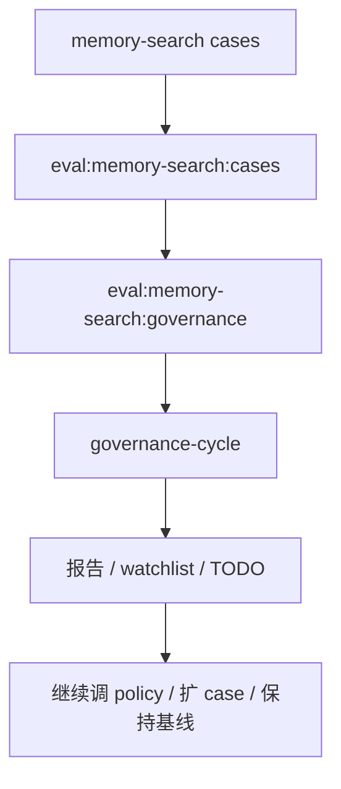
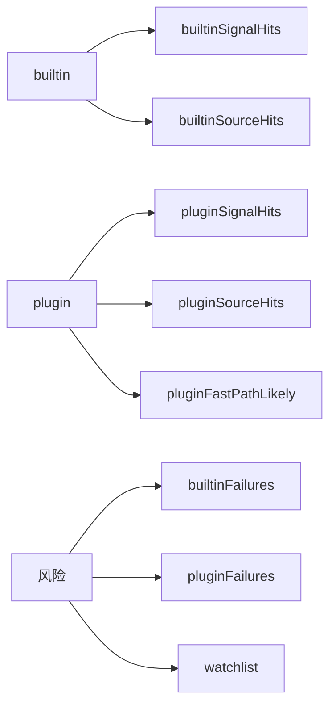

# Memory Search Governance

## 文档目的

这份文档单独收口 `Memory Search Workstream / Phase E`。

它要回答的是：

- memory-search 现在怎么进入长期治理
- baseline 怎么定期跑
- 哪些指标进入 watchlist
- 以后新增 stable fact / stable rule 时，怎么同步更新 case 与 policy

---

## 一图看懂



---

## 先说结论

### 1. memory-search 不再是临时专题

现在它已经有：

- 专项 case 集
- 专项 baseline
- 专项 policy
- 专项 governance 入口
- 已接入主 `governance-cycle`

### 2. 治理关注的不是“builtin 有没有完全修好”

治理层要看的重点是：

- builtin 有没有继续退化
- plugin 层还能不能稳定兜住关键 case
- 哪些 case 进入 watchlist
- 哪些 case 需要升格进 smoke / perf / hot-session health check

### 3. 当前 watchlist 的核心意义

watchlist 不代表“系统坏了”，而是代表：

- 这个 case 还没完全进入稳定层
- 后面改 retrieval / source priority / case 集时要特别盯

---

## 当前治理入口

### 单独跑 memory-search 治理

```bash
npm run eval:memory-search:governance -- --write
```

### 跑完整治理周期

```bash
npm run memory:governance-cycle -- --write
```

现在治理周期里会固定包含：

- formal memory audit
- session-memory exit audit
- fact conflict audit
- fact duplicate audit
- memory-search governance
- critical hot-session regression

---

## 当前治理指标

## 核心指标图



当前 summary 包括：

- `cases`
- `builtinSignalHits`
- `builtinSourceHits`
- `pluginSignalHits`
- `pluginSourceHits`
- `pluginFastPathLikely`
- `pluginSingleCard`
- `pluginMultiCard`
- `pluginNoisySupporting`
- `pluginUnexpectedSupportingTotal`
- `builtinFailures`
- `pluginFailures`
- `watchlist`

补充解释：

- `pluginSingleCard`
  - 最终 selected 只剩 1 张稳定卡，适合观察“是否已经收成单主题”
- `pluginMultiCard`
  - 最终 selected 仍然有多张卡，不一定是坏事，但说明还不是最纯状态
- `pluginNoisySupporting`
  - 最终 selected 里仍混入了超出预期 source 的 supporting candidates
- `pluginUnexpectedSupportingTotal`
  - 超预期 supporting candidates 的总数量，适合看“脏尾巴”是不是在下降

---

## 何时更新 case 集

以下情况需要同步看 `memory-search-cases.json`：

1. 新增 stable fact / stable rule
2. 新增一种明确 query intent
3. 调整 source priority
4. 新增一种 fast-path-first / formal-memory-first / mixed-mode 的边界

原则：

- 先有 case，再改 policy
- 先能复现，再说“已经修好”

---

## 何时升级到其他保护面

### 升进 smoke

当一个 case 满足：

- 是高频问题
- 已经有稳定 stable card / formal source
- top1 行为应该高度确定

就适合升进 smoke。

为了把这条规则收成固定入口，现在新增了：

```bash
npm run eval:smoke-promotion
```

它会基于最新 `memory-search-governance-latest.json` 和当前 `evals/smoke-cases.json` 给出：

- 已经在 smoke 里的 case
- 满足“stable-single-card”但还没进 smoke 的候选
- 还不够稳定、暂不建议升级的 case

当前还会再分一层：

- `recommendedForSmoke`
  - 既稳定、又像自然用户问题，适合优先考虑升进 smoke
- `reviewRequired`
  - 技术上已稳定，但 query 更像专项治理 query / 关键词拼接，需要人工判断是否值得进入长期保护面

注意：

- 这是**升级建议工具**
- 不是自动升格器
- 最终是否进入 smoke，仍然要人工看 query 是否足够高频、语义是否自然、是否适合成为长期保护面

### 升进 perf

当一个 case 满足：

- 高价值
- 明显受 retrieval latency 影响
- 应该优先走 fast path

就适合升进 perf。

### 升进 hot-session health check

当一个 case 满足：

- 在真实 main 会话里也必须经常答对
- 即使不是 clean isolated baseline，也值得持续盯

就适合进入 `eval:hot*`。

---

## 当前 Phase E 交付物

现在已经新增：

- [memory-search-governance.js](../src/memory-search-governance.js)
- [run-memory-search-governance.js](../scripts/run-memory-search-governance.js)
- [memory-search-governance.test.js](../test/memory-search-governance.test.js)

并且已接入：

- [governance-cycle.js](../src/governance-cycle.js)
- [run-governance-cycle.js](../scripts/run-governance-cycle.js)

---

## Phase E 完成标准核对

Roadmap 里的完成标准是：

1. 新增 memory-search 定期基线
2. 把关键 case 纳入常规检查
3. 当 stable fact / stable rule 扩充时，同步更新专项 case 集
4. 把这条线接入 TODO / Roadmap 周期复盘

当前核对：

- `定期基线`：已完成
- `常规检查入口`：已完成
- `可持续扩 case 的治理规则`：已完成
- `接入 governance-cycle / TODO / Roadmap`：已完成

所以这里明确收口：

**Phase E = done**

---

## 后续维护原则

Phase E 完成后，memory-search 不再作为单独“开发专题”继续拆 phase。

后续进入常规维护模式：

1. 跑治理周期
2. 看 watchlist
3. 如有新增 stable fact / stable rule，同步补 case
4. 如有 retrieval 行为变化，同步看 baseline 是否退化
