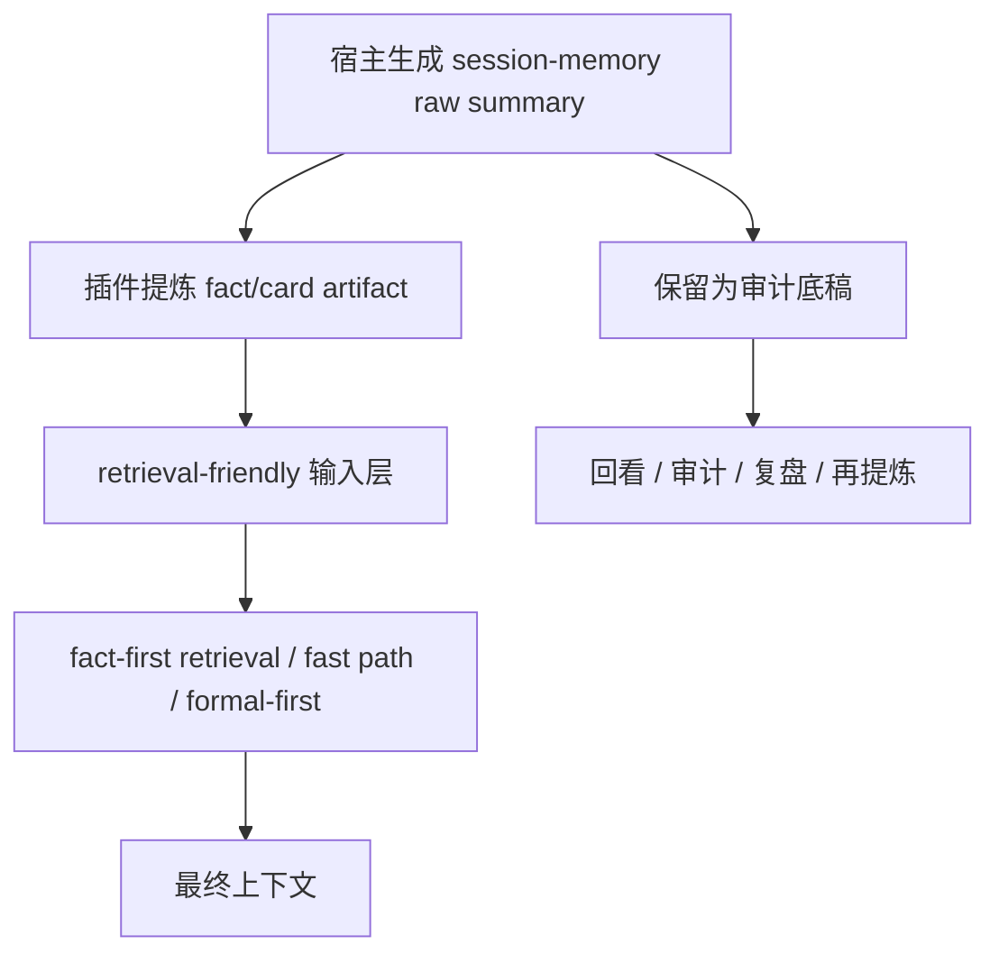
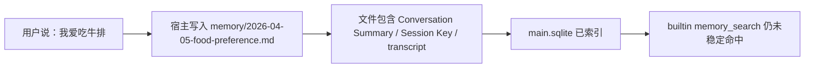
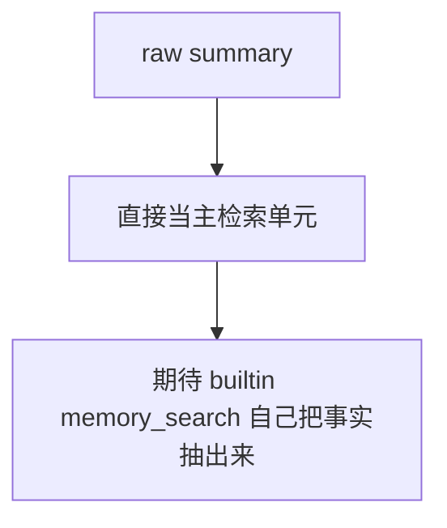
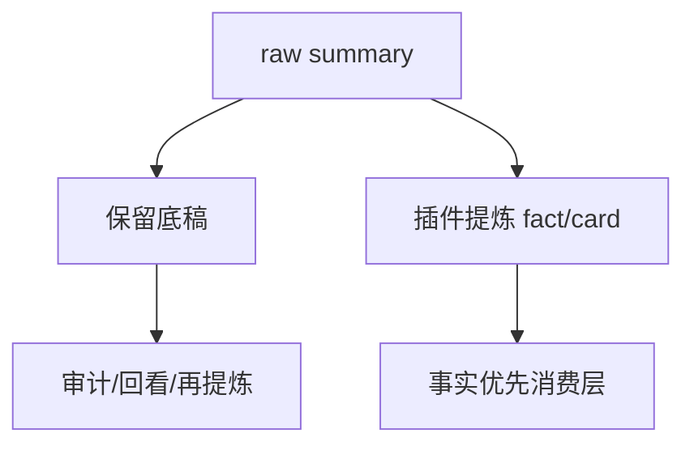
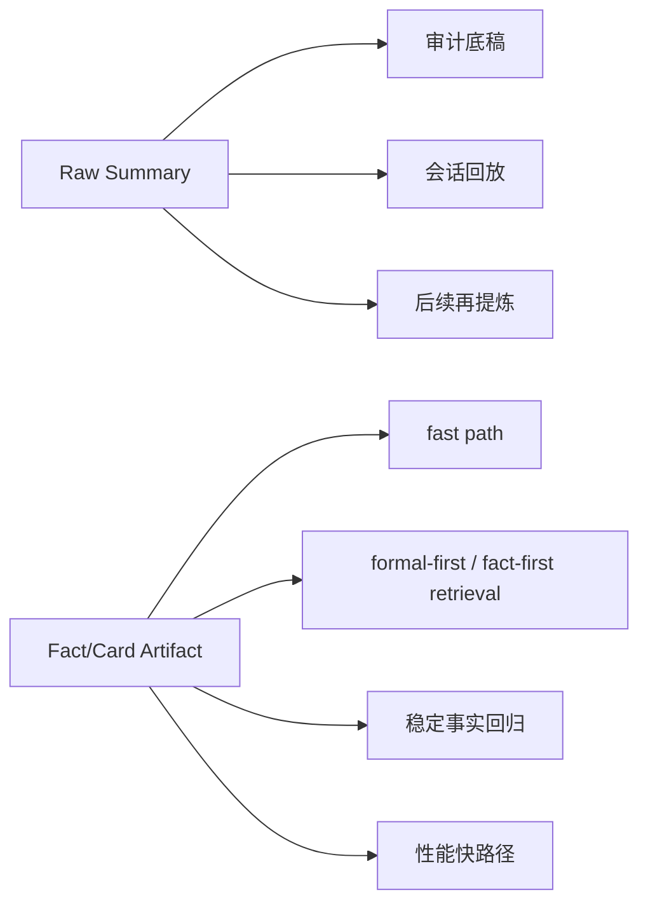
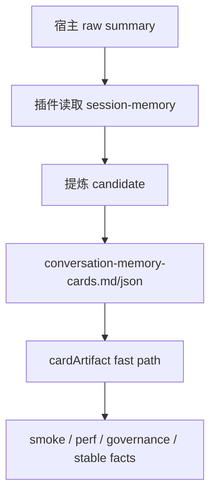
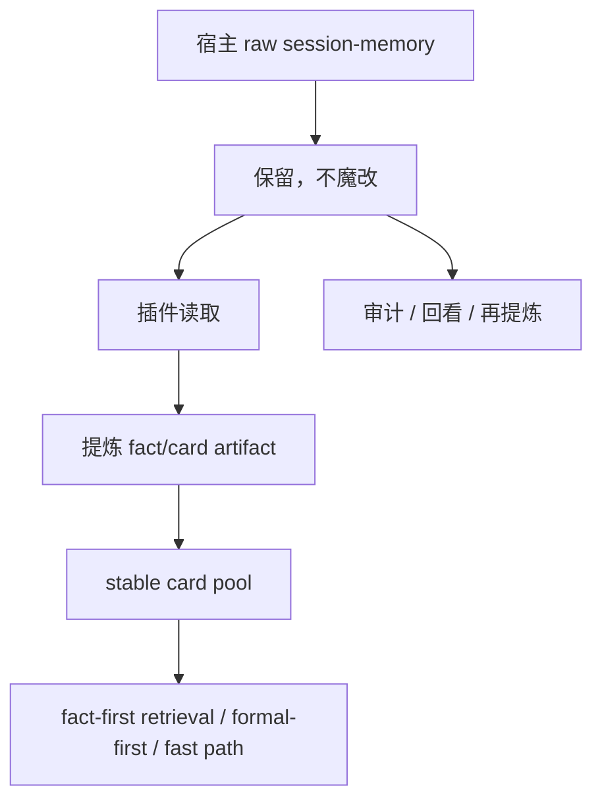

[English](session-memory-shape-strategy.md) | [中文](session-memory-shape-strategy.zh-CN.md)

# Session-Memory Shape Strategy

## 文档目的

这份文档单独收口 `Memory Search Workstream / Phase C`。

它要回答的不是：

- builtin `memory_search` 参数怎么调

而是：

- `session-memory` 为什么天然不利于检索
- 在不魔改宿主前提下，应该用什么输入形态策略
- `raw summary` 和 `fact/card artifact` 各自负责什么
- 哪些查询该继续依赖原始 summary，哪些应该优先吃 card

---

## 一图看懂

---

## 先说结论

### 1. 当前 `session-memory` 不是“坏文件”，而是“职责不对”

宿主生成的 `session-memory` 更像：

- 会话摘要
- startup instruction
- metadata
- transcript 片段
- 少量真正的用户事实

它适合：

- 回看
- 审计
- 事后再提炼

但它**不适合直接充当高质量检索单元**。

### 2. Phase C 的正确方向不是“替换 raw summary”，而是“双格式”

也就是：

1. 保留 `raw summary`
2. 额外产出 `fact/card artifact`

两者职责分开：

- `raw summary`：审计底稿
- `fact/card artifact`：检索友好输入

### 3. 当前这套双格式，在插件层已经具备第一版闭环

已经存在的工件和链路：

- `conversation-memory-cards.md`
- `conversation-memory-cards.json`
- session-memory 候选消费
- `cardArtifact` fast path
- `session-memory exit audit`

所以 `Phase C` 现在不是概念阶段，而是：

**第一版策略已经落地，接下来该进入 retrieval policy 边界化。**

---

## 当前 raw summary 长什么样

## 典型链路

## 当前 raw summary 的特点

它通常包含这些内容：

- `## Conversation Summary`
- `Session Key`
- `Session ID`
- startup / metadata
- transcript 片段
- 末尾或中间夹带真正的事实

这带来 4 个直接问题：

1. **事实密度低**
- 真正有价值的信息只占一小部分

2. **embedding 表意被稀释**
- 向量更像在表达“一段会话摘要”
- 不是“一个清晰的饮食偏好事实”

3. **关键词信号埋得太深**
- 中文短词本来就脆弱
- 再放进长 summary 里，效果更差

4. **source 竞争天然吃亏**
- `sessions/%` 语料数量大、重复多
- `session-memory raw summary` 更像“新但稀薄的单条摘要”

---

## 问题不是“要不要保留 raw”，而是“它应该扮演什么角色”

## 错误做法

问题：

- 太依赖宿主 builtin 检索
- 对中文短 query 很脆弱
- 对 source competition 很脆弱

## 正确做法

这就是 `Phase C` 的核心判断：

**raw summary 不丢，但它不再承担“主检索单元”的职责。**

---

## 双格式策略

## 结构图

## 格式 1：Raw Summary

职责：

- 保留宿主原始输出
- 支持人工回看
- 支持未来重跑提炼器
- 支持问题排查和治理

不负责：

- 成为主要高质量检索单元
- 承担高频事实问答的首选来源

## 格式 2：Fact/Card Artifact

职责：

- 提炼成更短、更稳定的事实表达
- 成为插件层 retrieval-friendly 输入
- 优先服务：
  - 身份
  - 偏好
  - 规则
  - 项目定位
  - 工具角色
  - Agent 边界

特征：

- 尽量一张 card 只表达一个主题
- 尽量写成主体事实，不写成助手策略句
- 能被 fast path / fact-first retrieval 直接消费

---

## 哪些查询继续依赖 raw summary

这些问题更适合继续回到 raw summary 或更长上下文：

- 让你回顾某一段会话过程
- 问“当时怎么讨论到这个结论的”
- 需要看上下文链条，而不是单一事实
- 需要审计 transcript 原文

例子：

- `我们当时为什么决定先做 Phase A`
- `这个结论是在哪个 session 里定下来的`
- `你把当时完整讨论过程概括一下`

这些问题的核心是：

**过程 / 来龙去脉 / 审计**

---

## 哪些查询应该优先吃 card

这些问题更适合直接走 `fact/card artifact`：

- `我爱吃什么`
- `你怎么称呼我`
- `MEMORY.md 应该放什么内容`
- `这个项目主要解决什么问题`
- `编程工作应该交给哪个 Agent`
- `已开始是什么意思`

这些问题的核心是：

**稳定事实 / 稳定规则 / 稳定定义**

---

## 和当前实现的对应关系

## 现在已经落地的部分

已经存在的实现证据：

- 插件会消费 host 生成的 `session-memory`
- 生成 retrieval-friendly companion：
  - `conversation-memory-cards.md`
  - `conversation-memory-cards.json`
- `food-preference` 这类事实已经能从 session-memory 提炼成：
  - `你爱吃牛排`
- `session-memory exit audit` 已证明：
  - 原始 session-memory 文件可以退出正式层
  - 但事实仍能被 cardArtifact 稳定承接

这意味着：

**Phase C 的“方向选择题”其实已经被真实实现验证过了。**

---

## Phase C 的最终架构结论

## 推荐架构图

### 关键边界

1. 不改宿主 `session-memory` 写法
2. 不指望 raw summary 自己变成优质主检索单元
3. 不丢 raw summary
4. 插件负责把 raw 提炼成 retrieval-friendly card
5. 高频事实问答优先吃 card，而不是继续豪赌 builtin `memory_search`

---

## Phase C 完成标准核对

Roadmap 里的完成标准是：

1. 文件形态问题讲清楚
2. 双格式策略讲清楚
3. 不再只靠口头结论描述这条线

当前核对结果：

- `文件形态问题讲清楚`：已完成
- `双格式策略讲清楚`：已完成
- `有独立文档与实现映射`：已完成

所以这里可以明确收口：

**Phase C = done**

---

## 下一阶段输入

Phase C 做完后，下一步不再纠结“session-memory 应不应该双格式”。

下一阶段真正要做的是：

## 1. Retrieval Policy Hardening

重点回答：

- 哪些意图继续 `fast-path-first`
- 哪些意图应该 `search-first`
- 哪些意图应该 `formal-first`
- 哪些意图才允许单次 LLM fallback

## 2. 把 source priority 边界写成更正式的 policy

因为现在真正的问题已经从“文件长得不对”收缩成：

- 同一个 query 下，哪种 source 应该优先
- 哪种意图不该被错误地路由到别的 stable card
