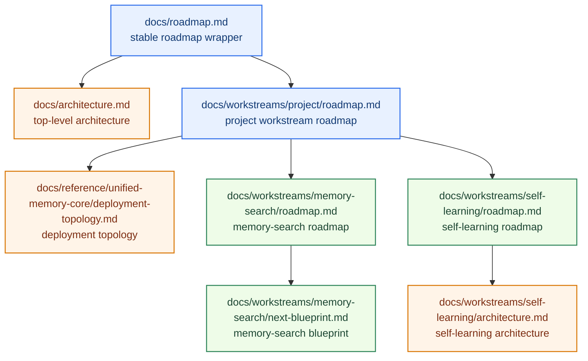

# Unified Memory Core Roadmap

[English](roadmap.md) | [中文](roadmap.zh-CN.md)

## Positioning

`Unified Memory Core` is not meant to be “just another memory plugin.”

The target is a **continuously running, governed, fact-first long-term memory context layer** for OpenClaw.

The next learning subsystem has now been lifted into an official product direction.

That product is now officially named:

`Unified Memory Core`

One-line summary:

`Turn OpenClaw long memory into a governed, fact-first, task-ready context system.`

What is already true today:

- the self-learning baseline is already implemented across reflection, daily reflection, registry promotion, exports, and governance surfaces
- the next phase is not to start self-learning from zero, but to make lifecycle rules and policy adaptation explicit

## What This Master Roadmap Does

`docs/roadmap.md` is the stable roadmap wrapper.

This file is the detailed project workstream roadmap and document index.

It should make four things obvious:

1. what the project is trying to become
2. what has already been completed
3. what is currently active
4. what the next major workstreams are

It is not the place for every detailed phase plan.

Use specialized roadmap documents for that.

Current execution control:

- current state: [../../../.codex/status.md](../../../.codex/status.md)
- module dashboard: [../../../.codex/module-dashboard.md](../../../.codex/module-dashboard.md)
- active module map: [../../module-map.md](../../module-map.md)

Module view:

- [../../../.codex/module-dashboard.md](../../../.codex/module-dashboard.md)
- [../../module-map.md](../../module-map.md)

## Roadmap Stack

## Status Snapshot

### Overall

- Project status: `usable + governed + regression-protected`
- Architecture status: `core backbone complete`
- Governance status: `running as regular maintenance`
- Current regression baseline:
  - `critical smoke = 10/10`
  - `full smoke = 25/25`

### Workstream Status

| Workstream | Status | Current mode |
| --- | --- | --- |
| Core capture / fact-card / assembly | `completed` | maintain + tune |
| Memory search | `phase-complete` | governance + incremental expansion |
| Self-learning / reflection | `baseline-implemented` | declared-source ingestion, daily reflection, candidate -> stable promotion, exports, CLI, and governance surfaces available |
| Unified Memory Core | `baseline-complete` | tranche 1-3 complete; ready for next enhancement phase |

## Progress Map

```mermaid
flowchart TB
    A["Unified Memory Core Project\nCurrent state: first baseline complete"] --> B["Foundation Layer\ncompleted"]
    A --> C["Unified Memory Core Product Line\nTranche 1-3 completed"]
    A --> D["Memory Search Workstream\nphase-complete / governed"]
    A --> E["Next Phase\nroadmap alignment + new enhancement plan"]

    B --> B1["Capture Foundation\ncompleted"]
    B --> B2["Fact / Card Foundation\ncompleted"]
    B --> B3["Consumption Foundation\ncompleted with tuning"]
    B --> B4["Regression Foundation\ncompleted"]
    B --> B5["Governance Foundation\nrunning"]

    C --> C1["Tranche 1\ncontracts + source + registry\ncompleted"]
    C --> C2["Tranche 2\nprojection + governance + adapters\ncompleted"]
    C --> C3["Tranche 3\nreflection + standalone + independent execution\ncompleted"]

    C2 --> C21["OpenClaw Adapter Runtime\ncompleted"]
    C2 --> C22["Codex Adapter Runtime\ncompleted"]
    C2 --> C23["Adapter Compatibility Tests\ncompleted"]

    C3 --> C31["Daily Reflection Loop Baseline\ncompleted"]
    C3 --> C32["Standalone CLI\nsource / reflect / export / govern\ncompleted"]
    C3 --> C33["Independent Execution Review\nownership / release boundary / migration checklist\ncompleted"]

    D --> D1["Memory Search Governance\nongoing"]
    D --> D2["Case Expansion / Policy Tuning\nas needed"]

    E --> E1["Align roadmap docs with completed baseline"]
    E --> E2["Open next enhancement phase"]
    E2 --> E21["Likely first track:\nself-learning phase 3\npromotion / decay / policy-input artifacts"]

    classDef done fill:#e8f7e8,stroke:#2f855a,color:#1c4532,stroke-width:1.5px;
    classDef active fill:#eef6ff,stroke:#2563eb,color:#123a73,stroke-width:1.5px;
    classDef next fill:#fff4e8,stroke:#d97706,color:#7c2d12,stroke-width:1.5px;

    class A,B,B1,B2,B3,B4,B5,C,C1,C2,C3,C21,C22,C23,C31,C32,C33 done;
    class D,D1,D2 active;
    class E,E1,E2,E21 next;
```

## Completed Foundation

The project foundation is already in place.

### 1. Capture foundation

Status: `completed`

Completed:

- session-memory consumption
- candidate distillation
- pre-compaction distillation
- raw session trace preservation

### 2. Fact/card foundation

Status: `completed`

Completed:

- fact sentence extraction
- `conversation-memory-cards.md/json`
- stable cards from `workspace/MEMORY.md`
- stable cards from `workspace/memory/YYYY-MM-DD.md`
- project cards from adapter docs / notes

### 3. Consumption foundation

Status: `completed with tuning`

Completed:

- cardArtifact consumption
- query rewrite
- heuristic rerank
- perf-critical fast path
- token-budget-aware assembly

Still tuning:

- optional LLM rerank evaluation

### 4. Regression foundation

Status: `active + strong`

Completed:

- smoke suite
- perf suite
- stable-facts regression
- hot-session regression framing

Current baseline:

- `critical smoke = 10/10`
- `full smoke = 25/25`

### 5. Governance foundation

Status: `running as regular maintenance`

Completed:

- confirmed vs pending separation
- pending export pipeline
- formal admission rules
- host workspace governance
- periodic cleanup tooling
- governance cycle
- duplicate audit
- conflict audit

Still ongoing:

- conflict handling refinement
- promotion of more stable facts into regression surfaces
- continued reduction of overlap between session-derived explanations and formal policy

## Current Focus

### Primary next engineering focus

**Roadmap Alignment + Next Enhancement Planning**

Why this is next:

- the current local-first baseline in `development-plan.md` is complete
- roadmap documents still need to reflect the true implementation state
- the next move should be a new enhancement-phase plan, not more work appended to the old baseline plan
- the most likely first coding track in that next phase is deeper self-learning policy work

Key documents:

- master roadmap:
  [../../roadmap.md](../../roadmap.md)
- implementation plan:
  [../../reference/unified-memory-core/development-plan.md](../../reference/unified-memory-core/development-plan.md)
- self-learning roadmap:
  [../self-learning/roadmap.md](../self-learning/roadmap.md)

### Parallel maintenance focus

**Memory Search**

Current state:

- `Memory Search Workstream` phases A-E are complete
- it is now in:
  - regular governance
  - incremental case expansion
  - policy tuning when needed
  - blueprint-driven execution

Current governance quality:

- `pluginSignalHits = 6/6`
- `pluginSourceHits = 6/6`
- `pluginFailures = 0`
- `pluginSingleCard = 6/6`
- `pluginMultiCard = 0/6`
- `pluginNoisySupporting = 0/6`

Key documents:

- roadmap:
  [../memory-search/roadmap.md](../memory-search/roadmap.md)
- blueprint:
  [../memory-search/next-blueprint.md](../memory-search/next-blueprint.md)

## What Is Currently Planned

The next major project move is:

`close the roadmap gap between documents and implementation, then open a fresh enhancement phase`

Planned project stages from here:

1. align roadmap documents with the completed baseline
2. define the next enhancement-phase scope explicitly
3. choose one primary coding track instead of broad parallel expansion
4. keep memory-search in governance mode
5. preserve local-first and network-ready boundaries while planning future growth

## Architecture Direction

The long-term architecture is now best understood as:

- `Unified Memory Core` as the product-level memory foundation
- `unified-memory-core` as the OpenClaw adapter
- `Codex Adapter` as a first-class adapter track

Inside the product, the first-class modules are:

1. **Source System**
2. **Reflection System**
3. **Memory Registry**
4. **Projection System**
5. **Governance System**
6. **OpenClaw Adapter**
7. **Codex Adapter**

## Document Map

### Top-level documents

- [../../../README.md](../../../README.md)
- [../../architecture.md](../../architecture.md)
- [../../roadmap.md](../../roadmap.md)
- [../../module-map.md](../../module-map.md)
- [../../reference/unified-memory-core/deployment-topology.md](../../reference/unified-memory-core/deployment-topology.md)
- [../self-learning/architecture.md](../self-learning/architecture.md)

### Current workstream documents

- [../memory-search/architecture.md](../memory-search/architecture.md)
- [../memory-search/roadmap.md](../memory-search/roadmap.md)
- [../memory-search/next-blueprint.md](../memory-search/next-blueprint.md)
- [../self-learning/roadmap.md](../self-learning/roadmap.md)

## Read This Next

- If you want overall system shape:
  [../../architecture.md](../../architecture.md)
- If you want the milestone-level roadmap wrapper:
  [../../roadmap.md](../../roadmap.md)
- If you want the self-learning workstream inside that product:
  [../self-learning/architecture.md](../self-learning/architecture.md)
