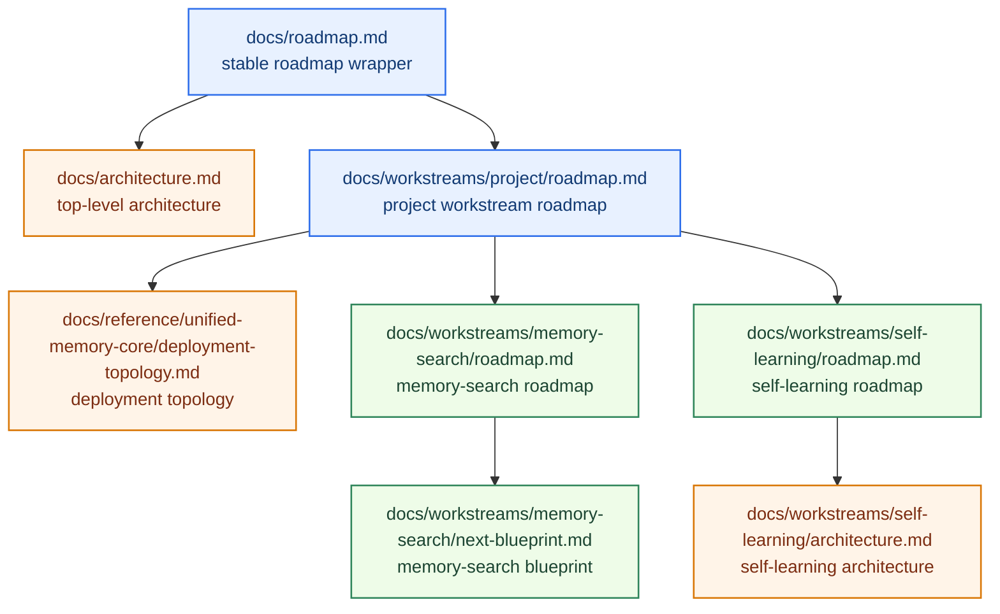

# Unified Memory Core Roadmap

[English](roadmap.md) | [中文](roadmap.zh-CN.md)

## Positioning

`Unified Memory Core` is not meant to be “just another memory plugin.”

The target is a **continuously running, governed, fact-first long-term memory context layer** for OpenClaw.

The next learning subsystem has now been lifted into an official product direction.

That product is now officially named:

`Unified Memory Core`

One-line summary:

`Turn OpenClaw long memory into a governed, fact-first, task-ready context system.`

What is already true today:

- the governed baseline now covers the Stage 3 self-learning lifecycle, Stage 4 policy adaptation, and Stage 5 product-hardening evidence
- release-preflight, bundle install verification, host smoke, and the registry-root operator policy are now part of the active operator baseline
- the next phase is not to reopen baseline contract work, but to keep that operator baseline stable before any later enhancement discussion

## What This Master Roadmap Does

`docs/roadmap.md` is the stable roadmap wrapper.

This file is the detailed project workstream roadmap and document index.

It should make four things obvious:

1. what the project is trying to become
2. what has already been completed
3. what is currently active
4. what the next major workstreams are

It is not the place for every detailed phase plan.

Use specialized roadmap documents for that.

Current execution control:

- current state: [../../../.codex/status.md](../../../.codex/status.md)
- module dashboard: [../../../.codex/module-dashboard.md](../../../.codex/module-dashboard.md)
- active module map: [../../module-map.md](../../module-map.md)

Module view:

- [../../../.codex/module-dashboard.md](../../../.codex/module-dashboard.md)
- [../../module-map.md](../../module-map.md)

## Roadmap Stack

## Status Snapshot

### Overall

- Project status: `usable + governed + regression-protected`
- Architecture status: `Stage 5 closeout baseline complete`
- Governance status: `running as regular maintenance`
- Current regression baseline:
  - `critical smoke = 18/18`
  - `full smoke = 28/28`

### Workstream Status

| Workstream | Status | Current mode |
| --- | --- | --- |
| Core capture / fact-card / assembly | `completed` | maintain + tune |
| Memory search | `phase-complete` | governance + benchmark expansion + policy tuning |
| Self-learning / reflection | `stage-complete` | governed lifecycle, policy adaptation, exports, CLI, and governance surfaces are available |
| Unified Memory Core | `stage5-complete / post-closeout` | `392` case runnable matrix + `53.83%` Chinese coverage + isolated local answer-level formal gate `12/12` + transport watchlist / perf baseline |

## Progress Map

```mermaid
flowchart TB
    A["Unified Memory Core Project\nCurrent state: post-Stage-5 evaluation-driven optimization"] --> B["Foundation Layer\ncompleted"]
    A --> C["Unified Memory Core Product Line\nStage 1-5 completed"]
    A --> D["Memory Search Workstream\nphase-complete / governed"]
    A --> E["Post-Stage-5 Mainline\nformal benchmark gates + operator baseline"]

    B --> B1["Capture Foundation\ncompleted"]
    B --> B2["Fact / Card Foundation\ncompleted"]
    B --> B3["Consumption Foundation\ncompleted with tuning"]
    B --> B4["Regression Foundation\ncompleted"]
    B --> B5["Governance Foundation\nrunning"]

    C --> C1["Stage 1-2\ncontracts + source + registry + adapters\ncompleted"]
    C --> C2["Stage 3\nself-learning lifecycle\ncompleted"]
    C --> C3["Stage 4\npolicy adaptation\ncompleted"]
    C --> C4["Stage 5\nproduct hardening + release-preflight\ncompleted"]

    C1 --> C11["OpenClaw Adapter Runtime\ncompleted"]
    C1 --> C12["Codex Adapter Runtime\ncompleted"]
    C1 --> C13["Adapter Compatibility Tests\ncompleted"]

    C2 --> C21["Daily Reflection + Promotion / Decay\ncompleted"]
    C3 --> C31["Policy-input artifacts + consumer adaptation\ncompleted"]
    C4 --> C41["Standalone source hardening + maintenance\ncompleted"]
    C4 --> C42["Bundle install verify + host smoke\ncompleted"]
    C4 --> C43["Independent execution + root policy\ncompleted"]

    D --> D1["Memory Search Governance\nongoing"]
    D --> D2["Formal Benchmark Gates / Policy Tuning\nactive"]

    E --> E1["Maintain the 392-case runnable matrix + 50%+ Chinese coverage"]
    E --> E2["Expand the isolated local answer-level formal gate"]
    E --> E3["Keep gateway/raw transport noise on separate watchlists"]
    E --> E4["Optimize the slowest layer from the perf baseline while keeping Stage 5 evidence green"]

    classDef done fill:#e8f7e8,stroke:#2f855a,color:#1c4532,stroke-width:1.5px;
    classDef active fill:#eef6ff,stroke:#2563eb,color:#123a73,stroke-width:1.5px;
    classDef next fill:#fff4e8,stroke:#d97706,color:#7c2d12,stroke-width:1.5px;

    class B,B1,B2,B3,B4,B5,C,C1,C2,C3,C4,C11,C12,C13,C21,C31,C41,C42,C43 done;
    class A,D,D1,D2,E,E1,E2,E3 active;
    class E4 next;
```

## Completed Foundation

The project foundation is already in place.

### 1. Capture foundation

Status: `completed`

Completed:

- session-memory consumption
- candidate distillation
- pre-compaction distillation
- raw session trace preservation

### 2. Fact/card foundation

Status: `completed`

Completed:

- fact sentence extraction
- `conversation-memory-cards.md/json`
- stable cards from `workspace/MEMORY.md`
- stable cards from `workspace/memory/YYYY-MM-DD.md`
- project cards from adapter docs / notes

### 3. Consumption foundation

Status: `completed with tuning`

Completed:

- cardArtifact consumption
- query rewrite
- heuristic rerank
- perf-critical fast path
- token-budget-aware assembly

Still tuning:

- optional LLM rerank evaluation

### 4. Regression foundation

Status: `active + strong`

Completed:

- smoke suite
- perf suite
- stable-facts regression
- hot-session regression framing

Current baseline:

- `critical smoke = 18/18`
- `full smoke = 28/28`

### 5. Governance foundation

Status: `running as regular maintenance`

Completed:

- confirmed vs pending separation
- pending export pipeline
- formal admission rules
- host workspace governance
- periodic cleanup tooling
- governance cycle
- duplicate audit
- conflict audit

Still ongoing:

- conflict handling refinement
- promotion of more stable facts into regression surfaces
- continued reduction of overlap between session-derived explanations and formal policy

## Current Focus

### Primary next engineering focus

**Stage 11 experience hardening: move `Context Minor GC` from “capability available” to “users can clearly feel on-demand context loading”**

Why this is next:

- the truly unfinished part is not “open a new theme”, but the user-visible acceptance gap inside `Stage 11`
- current live evidence already shows local project-layer pruning, but almost no meaningful host-visible shrinkage
- what users currently miss is not another operator metric but an obvious “this turn is materially thinner” feel
- so the mainline should finish host-visible context loading experience first instead of merging `Stage 12` into the same theme

This mainline now includes:

- controlling host-thread growth sources so debugging no longer bloats the active thread
- moving the project layer from raw-turn-first carry-forward to summary-first carry-forward
- separating operator observability from thread continuation and keeping only short conclusions in-thread
- redefining `Stage 11` closeout around user-visible experience rather than repo-local capability alone

Key documents:

- master roadmap:
  [../../roadmap.md](../../roadmap.md)
- implementation plan:
  [../../reference/unified-memory-core/development-plan.md](../../reference/unified-memory-core/development-plan.md)
- release preflight:
  [../../reference/unified-memory-core/testing/release-preflight.md](../../reference/unified-memory-core/testing/release-preflight.md)
- host-neutral roadmap:
  [../host-neutral-memory/roadmap.md](../host-neutral-memory/roadmap.md)

### Parallel maintenance focus

**Memory Search**

Current state:

- `Memory Search Workstream` phases A-E are complete
- it is now in:
  - regular governance
  - incremental case expansion
  - policy tuning when needed
  - blueprint-driven execution

Current governance quality:

- latest `eval:memory-search:cases` summary keeps `pluginSignalHits = 30/30`
- latest `eval:memory-search:cases` summary keeps `pluginSourceHits = 30/30`
- latest `eval:memory-search:cases` summary keeps `pluginFastPathLikely = 30/30`

Key documents:

- roadmap:
  [../memory-search/roadmap.md](../memory-search/roadmap.md)
- blueprint:
  [../memory-search/next-blueprint.md](../memory-search/next-blueprint.md)

## What Is Currently Planned

The next major project move is:

`finish the Stage 11 user-visible experience gap first, then move into the next separate theme`

Planned project stages from here:

1. finish `Stage 11 / host-visible experience hardening`
2. keep release-preflight, bundle install verification, host smoke, and `Stage 5` evidence green
3. keep canonical-root operator policy explicit in CLI, public docs, and the control surface
4. keep project and workstream roadmaps aligned with the live implementation baseline
5. move into `Stage 12` only after `Stage 11` is truly closed under the user-visible bar

## Architecture Direction

The long-term architecture is now best understood as:

- `Unified Memory Core` as the product-level memory foundation
- `unified-memory-core` as the OpenClaw adapter
- `Codex Adapter` as a first-class adapter track

Inside the product, the first-class modules are:

1. **Source System**
2. **Reflection System**
3. **Memory Registry**
4. **Projection System**
5. **Governance System**
6. **OpenClaw Adapter**
7. **Codex Adapter**

## Document Map

### Top-level documents

- [../../../README.md](../../../README.md)
- [../../architecture.md](../../architecture.md)
- [../../roadmap.md](../../roadmap.md)
- [../../module-map.md](../../module-map.md)
- [../../reference/unified-memory-core/deployment-topology.md](../../reference/unified-memory-core/deployment-topology.md)
- [../self-learning/architecture.md](../self-learning/architecture.md)

### Current workstream documents

- [../memory-search/architecture.md](../memory-search/architecture.md)
- [../memory-search/roadmap.md](../memory-search/roadmap.md)
- [../memory-search/next-blueprint.md](../memory-search/next-blueprint.md)
- [../self-learning/roadmap.md](../self-learning/roadmap.md)

## Read This Next

- If you want the milestone-level roadmap wrapper:
  [../../roadmap.md](../../roadmap.md)
- If you want the post-Stage-5 operator workflow:
  [../../reference/unified-memory-core/maintenance-workflow.md](../../reference/unified-memory-core/maintenance-workflow.md)
- If you want deployment and release gating:
  [../../reference/unified-memory-core/testing/release-preflight.md](../../reference/unified-memory-core/testing/release-preflight.md)
- If you want the host-neutral operator policy workstream:
  [../host-neutral-memory/roadmap.md](../host-neutral-memory/roadmap.md)
