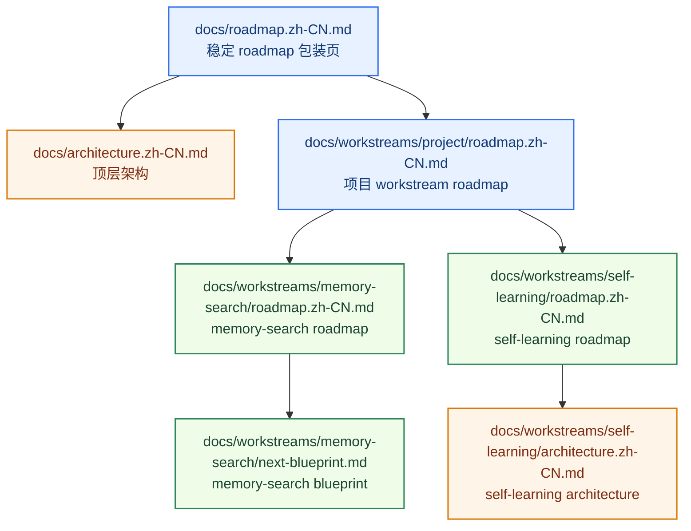

# Unified Memory Core Roadmap

[English](roadmap.md) | [中文](roadmap.zh-CN.md)

## 项目定位

`Unified Memory Core` 不是“又一个记忆插件”。

它的目标是成为 OpenClaw 一层**持续运行、可治理、事实优先的长期记忆上下文层**。

下一步的 learning 子系统已经被提升为正式产品方向的一部分。

这个产品现在已经正式命名为：

`Unified Memory Core`

一句话总结：

`把 OpenClaw 的长期记忆，变成一层可治理、事实优先、可直接服务任务的上下文系统。`

当前已经成立的事实是：

- 当前有治理的 baseline 已覆盖 Stage 3 self-learning lifecycle、Stage 4 policy adaptation、Stage 5 product hardening
- release-preflight、bundle install verify、host smoke，以及 registry-root operator policy 已进入当前 operator baseline
- 下一阶段不该重开 baseline contract work，而是先把这条 operator baseline 稳定住，再讨论后续增强

## 这份主 Roadmap 负责什么

`docs/roadmap.md` 是稳定的 roadmap 包装页。

这份文档是项目 workstream 的详细 roadmap 和文档索引。

它应该让下面四件事一眼就能看明白：

1. 项目最终想做成什么
2. 当前已经完成了什么
3. 当前正在做什么
4. 下一条主线准备怎么推进

它不负责承载每个专题的全部 phase 细节。

专题细节放到各自的 roadmap 里维护。

模块视角入口：

- [../../module-map.zh-CN.md](../../module-map.zh-CN.md)

## Roadmap 结构

## 当前状态快照

### 总体

- 项目状态：`可用 + 已治理 + 有回归保护`
- 架构状态：`Stage 5 closeout baseline 已完成`
- 治理状态：`已进入常规维护循环`
- 当前回归基线：
  - `critical smoke = 18/18`
  - `full smoke = 28/28`

### Workstream 状态

| Workstream | 状态 | 当前模式 |
| --- | --- | --- |
| 核心 capture / fact-card / assembly | `completed` | maintain + tune |
| Memory Search | `phase-complete` | governance + benchmark expansion + policy tuning |
| Self-Learning / Reflection | `stage-complete` | governed lifecycle、policy adaptation、exports、CLI、governance surfaces 已可用 |
| Unified Memory Core | `stage5-complete / post-closeout` | `392` case runnable matrix + `53.83%` 中文覆盖 + isolated local answer-level formal gate `12/12` + transport watchlist / perf baseline |

## 进展图

```mermaid
flowchart TB
    A["Unified Memory Core 项目总览\n当前状态：Stage 5 完成后进入评测驱动优化"] --> B["基础能力层\n已完成"]
    A --> C["Unified Memory Core 产品主线\nStage 1-5 已完成"]
    A --> D["Memory Search Workstream\nphase-complete / 治理中"]
    A --> E["Stage 5 之后的主线\nformal benchmark gates + operator baseline"]

    B --> B1["Capture Foundation\n已完成"]
    B --> B2["Fact / Card Foundation\n已完成"]
    B --> B3["Consumption Foundation\n已完成，持续调优"]
    B --> B4["Regression Foundation\n已完成"]
    B --> B5["Governance Foundation\n运行中"]

    C --> C1["Stage 1-2\ncontracts + source + registry + adapters\n已完成"]
    C --> C2["Stage 3\nself-learning lifecycle\n已完成"]
    C --> C3["Stage 4\npolicy adaptation\n已完成"]
    C --> C4["Stage 5\nproduct hardening + release-preflight\n已完成"]

    C1 --> C11["OpenClaw Adapter Runtime\n已完成"]
    C1 --> C12["Codex Adapter Runtime\n已完成"]
    C1 --> C13["Adapter Compatibility Tests\n已完成"]

    C2 --> C21["Daily Reflection + Promotion / Decay\n已完成"]
    C3 --> C31["Policy-input artifacts + consumer adaptation\n已完成"]
    C4 --> C41["Standalone source hardening + maintenance\n已完成"]
    C4 --> C42["Bundle install verify + host smoke\n已完成"]
    C4 --> C43["Independent execution + root policy\n已完成"]

    D --> D1["Memory Search Governance\n持续进行"]
    D --> D2["Formal Benchmark Gates / Policy Tuning\n当前主线"]

    E --> E1["维持 392-case runnable matrix + 50%+ 中文覆盖"]
    E --> E2["扩大 isolated local answer-level formal gate"]
    E --> E3["把 gateway/raw transport 噪声独立成 watchlist"]
    E --> E4["按主链路 perf baseline 优化最慢层并保持 Stage 5 evidence 继续为绿"]

    classDef done fill:#e8f7e8,stroke:#2f855a,color:#1c4532,stroke-width:1.5px;
    classDef active fill:#eef6ff,stroke:#2563eb,color:#123a73,stroke-width:1.5px;
    classDef next fill:#fff4e8,stroke:#d97706,color:#7c2d12,stroke-width:1.5px;

    class B,B1,B2,B3,B4,B5,C,C1,C2,C3,C4,C11,C12,C13,C21,C31,C41,C42,C43 done;
    class A,D,D1,D2,E,E1,E2,E3 active;
    class E4 next;
```

## 已完成的项目基础

项目的基础层已经搭起来了。

### 1. Capture 基础层

状态：`completed`

已完成：

- session-memory 消费
- candidate distillation
- pre-compaction distillation
- 原始 session trace 保留

### 2. Fact/Card 基础层

状态：`completed`

已完成：

- fact 句提炼
- `conversation-memory-cards.md/json`
- 从 `workspace/MEMORY.md` 生成 stable cards
- 从 `workspace/memory/YYYY-MM-DD.md` 生成 stable cards
- 从 adapter 文档 / notes 生成 project cards

### 3. Consumption 基础层

状态：`completed with tuning`

已完成：

- cardArtifact consumption
- query rewrite
- heuristic rerank
- perf-critical fast path
- token-budget-aware assembly

仍在微调：

- optional LLM rerank evaluation

### 4. Regression 基础层

状态：`active + strong`

已完成：

- smoke suite
- perf suite
- stable-facts regression
- hot-session regression 的真实边界说明

当前基线：

- `critical smoke = 18/18`
- `full smoke = 28/28`

### 5. Governance 基础层

状态：`running as regular maintenance`

已完成：

- confirmed vs pending 分层
- pending export pipeline
- formal admission rules
- host workspace governance
- 周期性清理工具
- governance cycle
- duplicate audit
- conflict audit

仍在持续：

- conflict handling refinement
- 把更多稳定事实升进回归保护面
- 继续减少 session-derived explanations 与 formal policy 的重叠

## 当前焦点

### 下一条主要工程主线

**评测驱动优化：从 `200+` 扩面执行进入正式门禁维护与 answer-level 扩容**

为什么先做这个：

- 基础能力和 Stage 5 收口已经完成，下一步最缺的不是“再加一个功能”，而是把正式门禁和下一轮优化顺序稳定下来
- runnable matrix 现在已扩到 `392`，其中 zh-bearing case = `211 / 392 = 53.83%`
- retrieval-heavy 正式 gate 现在是绿的：`250 / 250`
- isolated local answer-level formal gate 已经不是红线，而是 `12 / 12` 通过；正式路径是 `openclaw agent --local` + isolated eval agent `umceval65`
- raw `openclaw memory search` transport 已独立成 host watchlist；当前 formal watch 样本是 `0 / 8 raw ok`，全部 `invalid_json`
- 当前主链路 perf baseline 已把问题边界拆清楚：retrieval / assembly 平均 `85ms`，raw transport 平均 `15127ms`，isolated local answer-level 平均 `39281ms`
- release-preflight、deployment verification、host-neutral root policy 仍要保持为绿，但它们从主线目标变成并行守护线

这一条主线具体包含：

- 保持 `392` case runnable matrix 与 `50%+` 中文覆盖持续稳定
- 把 answer-level formal gate 从当前 `12` 条稳定样本继续扩成更深的稳定矩阵
- 把 gateway/session-lock 与 raw transport 保持在独立 watchlist，不让宿主噪声污染算法判断
- 按 perf baseline 优先优化最慢的 answer-level 层

关键文档：

- 主 roadmap：
  [../../roadmap.zh-CN.md](../../roadmap.zh-CN.md)
- 实施计划：
  [../../reference/unified-memory-core/development-plan.zh-CN.md](../../reference/unified-memory-core/development-plan.zh-CN.md)
- release preflight：
  [../../reference/unified-memory-core/testing/release-preflight.zh-CN.md](../../reference/unified-memory-core/testing/release-preflight.zh-CN.md)
- host-neutral roadmap：
  [../host-neutral-memory/roadmap.zh-CN.md](../host-neutral-memory/roadmap.zh-CN.md)

### 并行维护主线

**Memory Search**

当前状态：

- `Memory Search Workstream` 的 Phase A-E 已完成
- 现在已进入：
  - 常规治理
  - 增量 case 扩充
  - 按需 policy 调整
  - blueprint 驱动执行

当前治理质量：

- 最新 `eval:memory-search:cases` 摘要保持 `pluginSignalHits = 30/30`
- 最新 `eval:memory-search:cases` 摘要保持 `pluginSourceHits = 30/30`
- 最新 `eval:memory-search:cases` 摘要保持 `pluginFastPathLikely = 30/30`

当前新增要求：

- memory-search workstream 不再只做“按需 case 扩充”，而是要服务整个 `392` case formal benchmark matrix
- 新增案例必须优先覆盖容易暴露算法短板的场景，而不是只补静态事实题

关键文档：

- roadmap：
  [../memory-search/roadmap.zh-CN.md](../memory-search/roadmap.zh-CN.md)
- blueprint：
  [../memory-search/next-blueprint.zh-CN.md](../memory-search/next-blueprint.zh-CN.md)

## 当前已经计划好的下一阶段

项目下一步的大方向是：

`先把 post-Stage-5 的 operator baseline 稳定住，只有在 prerequisites 持续为绿后再单独开启新的增强阶段`

从这里开始的计划阶段是：

1. 保持 release-preflight、bundle install verify、host smoke、`Stage 5` evidence 持续为绿
2. 保持 canonical-root operator policy 在 CLI、公开文档和控制面里持续显式
3. 保持项目 / workstream roadmap 与 live implementation baseline 同步
4. 继续把 memory-search 维持在治理模式，只在必要时扩 targeted case
5. 只有在 runtime API / service-mode prerequisites 持续为绿后，才开启新的 enhancement plan

## 架构方向

当前更适合把整体架构理解为：

- `Unified Memory Core` 产品层
- `unified-memory-core` 作为 OpenClaw adapter
- `Codex Adapter` 作为一等 adapter

在产品内部，建议按 7 条一等模块组织：

1. **Source System**
2. **Reflection System**
3. **Memory Registry**
4. **Projection System**
5. **Governance System**
6. **OpenClaw Adapter**
7. **Codex Adapter**

## 文档地图

### 顶层文档

- [../../../README.zh-CN.md](../../../README.zh-CN.md)
- [../../architecture.zh-CN.md](../../architecture.zh-CN.md)
- [../../roadmap.zh-CN.md](../../roadmap.zh-CN.md)
- [../../module-map.zh-CN.md](../../module-map.zh-CN.md)
- [../../reference/unified-memory-core/deployment-topology.zh-CN.md](../../reference/unified-memory-core/deployment-topology.zh-CN.md)
- [../self-learning/architecture.zh-CN.md](../self-learning/architecture.zh-CN.md)

### 当前专题文档

- [../memory-search/architecture.zh-CN.md](../memory-search/architecture.zh-CN.md)
- [../memory-search/roadmap.zh-CN.md](../memory-search/roadmap.zh-CN.md)
- [../memory-search/next-blueprint.zh-CN.md](../memory-search/next-blueprint.zh-CN.md)
- [../self-learning/roadmap.zh-CN.md](../self-learning/roadmap.zh-CN.md)

## 建议接着读

- 如果想看里程碑层面的 roadmap 包装页：
  [../../roadmap.zh-CN.md](../../roadmap.zh-CN.md)
- 如果想看 post-Stage-5 的 operator 工作流：
  [../../reference/unified-memory-core/maintenance-workflow.zh-CN.md](../../reference/unified-memory-core/maintenance-workflow.zh-CN.md)
- 如果想看部署与发版 gate：
  [../../reference/unified-memory-core/testing/release-preflight.zh-CN.md](../../reference/unified-memory-core/testing/release-preflight.zh-CN.md)
- 如果想看 host-neutral operator policy 这条线：
  [../host-neutral-memory/roadmap.zh-CN.md](../host-neutral-memory/roadmap.zh-CN.md)
