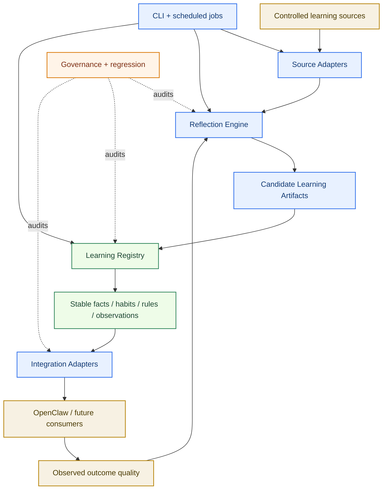
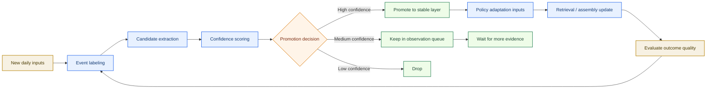
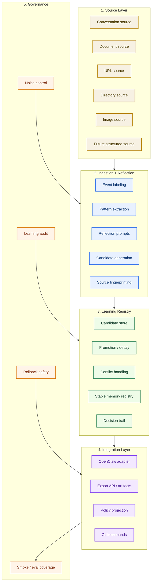
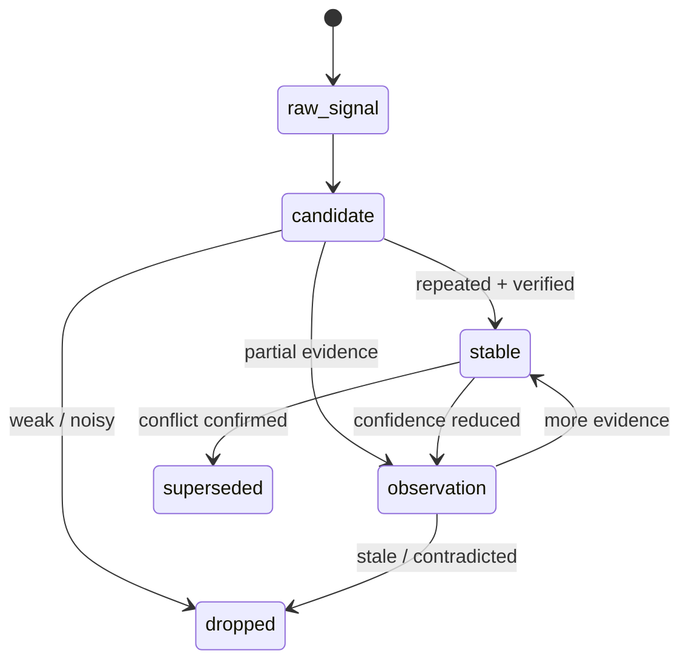
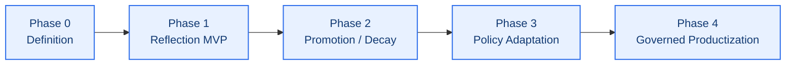

# Self-Learning Memory Architecture

[English](architecture.md) | [中文](architecture.zh-CN.md)

## Purpose

This document defines the self-learning workstream inside the current `Unified Memory Core` product direction.

It defines the boundary of the learning subsystem that feeds OpenClaw, Codex, and future adapters:

`daily self-learning + daily reflection + policy adaptation`

It explains:

- what this workstream is trying to achieve
- which problems it should solve
- how the solution should be layered
- how learning should remain governed instead of drifting into noise
- which roadmap phases should be executed next

This document is meant to guide future implementation work, not just describe an idea.

Related documents:

- [../../../README.md](../../../README.md)
- [../../architecture.md](../../architecture.md)
- [../../roadmap.md](../../roadmap.md)
- [roadmap.md](roadmap.md)
- [../memory-search/architecture.md](../memory-search/architecture.md)

## One-Line Goal

Turn `unified-memory-core` from a fact-first memory context layer into a:

`governed daily-learning system that can extract stable patterns, reflect on outcomes, and improve how it serves the user over time`

At the architecture level, this system should be designed as:

`a governable learning subsystem inside Unified Memory Core that feeds OpenClaw, Codex, and future adapters`

## Current Implementation Baseline

This workstream is no longer design-only. The repo already implements a meaningful baseline:

- declared-source ingestion for `manual`, `file`, `directory`, `conversation`, and `accepted_action`
- reflection labeling, candidate artifact generation, and decision trails
- daily reflection runs with repeated-signal and explicit remember detection
- candidate-to-stable promotion through the registry
- standalone runtime / CLI flows for reflect, daily-run, export, audit, repair, and replay
- generic, OpenClaw, and Codex export paths plus governance audit around exported stable artifacts

## What Problem This Workstream Solves

The current system is already good at:

- capturing memory inputs
- distilling facts/cards
- preferring stable facts during retrieval
- governing memory-search quality

But that is only the first half of a longer-term memory system.

The remaining gaps are now narrower and more specific:

1. repeated user expressions already produce candidates, but habit / behavior-specific lifecycle rules are still shallow
2. explicit `remember this` instructions are already detected, but they still rely on baseline promotion logic instead of a richer dedicated policy
3. daily reflection already exists as a structured pipeline, but learning-specific maintenance and reporting are not yet productized
4. behavior patterns are still not separated cleanly enough from plain facts at the artifact-policy layer
5. learned patterns do not yet systematically update retrieval and assembly policy
6. long-term learning still needs explicit decay, conflict, and time-window governance to avoid turning into a new noise pool

## Desired Outcome

After this workstream is complete, the system should be able to:

- detect repeated user preferences and speech habits
- capture explicit long-term instructions with strong confidence
- run a daily reflection cycle over new conversations and memory changes
- distinguish:
  - confirmed facts
  - stable preferences
  - behavioral patterns
  - operating rules
  - observations still under review
- adapt adapter-side policy using learned patterns
- keep all of the above governed, testable, and reversible

## Scope Boundary

This workstream does:

- define a standalone learning component boundary
- improve adapter-side learning and reflection integration
- create structured, portable learning artifacts
- adjust retrieval / scoring / assembly policy from governed signals
- add governance and regression around learned behavior
- support controllable learning inputs beyond conversation memory
- support CLI-driven learning and governance workflows

This workstream does not:

- patch the OpenClaw host
- patch other adapters or unrelated extensions
- let the model freely rewrite its own personality
- allow unverified free-form reflections to directly become stable memory

## Product Boundary

This self-learning subsystem should be designed as a distinct product module inside `Unified Memory Core`.

That means:

- it should have its own inputs, outputs, and governance rules
- it should be able to run independently from the OpenClaw runtime loop
- it should expose learning results through stable artifacts rather than hidden in-memory state
- it should integrate with OpenClaw through adapters, not through deep coupling
- it should remain reusable for future non-OpenClaw consumers

Current integration target:

- `unified-memory-core` consumes learning outputs and inserts them into the OpenClaw-facing memory/context flow

Cross-adapter target:

- the same learning outputs can be consumed by OpenClaw, Codex, and future consumers

## Design Principles

1. Learning is structured, not magical.
2. Reflection is evidence-based, not free-form storytelling.
3. Promotion must be reversible.
4. Stable memory, candidate memory, and runtime observations must stay separate.
5. Policy adaptation must consume confidence-ranked signals instead of raw summaries.
6. Context quality matters more than memory volume.
7. Input sources must be explicit and controllable.
8. Learning outputs must be portable across integrations.
9. The component should be operable from CLI without the OpenClaw host.
10. Every result should be traceable, inspectable, and repairable.

## System View



## Controlled Inputs

Learning sources should be explicit, selectable, and reviewable.

The system should support inputs such as:

- conversations
- a single document
- a directory
- current implementation baseline: `manual`, `file`, `directory`, and `conversation`
- future planned adapters such as URL or image sources
- future structured imports

Important rule:

`the system should learn only from declared sources, not from invisible ambient context`

## Traceability and Repairability

Every learning result should be:

- source-linked
- timestamped
- evidence-counted
- versionable
- diffable
- reviewable
- repairable

This means the system should preserve:

- where the signal came from
- which extraction rule or reflection pass produced it
- which promotion decision changed its state
- which downstream integration consumed it

When something is wrong, maintainers should be able to:

- inspect the source
- inspect the candidate
- inspect the decision trail
- fix the item
- rerun the pipeline
- regenerate downstream outputs

## Learning Model

The core idea is:

`learning = capture + extraction + scoring + promotion + policy use + verification`

The system should not treat all learned content equally.

It should explicitly separate:

- `stable_fact`
- `stable_preference`
- `stable_rule`
- `habit_signal`
- `behavior_pattern`
- `observation`
- `open_question`

It should also separate:

- source artifacts
- candidate artifacts
- promoted artifacts
- integration-facing exports

## Runtime Modes

The subsystem should support at least two runtime modes:

1. `embedded mode`
   - runs as part of the `unified-memory-core` workflow
   - exports results into OpenClaw-facing memory/context consumption
2. `standalone mode`
   - runs from CLI or scheduled jobs
   - ingests controlled sources
   - writes artifacts and reports without requiring OpenClaw runtime participation

## Daily Reflection Loop



## Accepted-Action Capture

One gap is still explicit:

`successful or adopted behavior can remain trapped inside task logs even when it should become a governed learning candidate`

This is the class of problem behind "the agent used the right publishing target once, but did not reliably remember it later."

The architecture direction should not be a product-specific hardcoded rule such as "if GitHub Pages succeeds, remember the URL."

Instead, the learning subsystem should add one generic capture surface for adopted behavior:

- `accepted_action`
- `applied_decision`
- `successful_execution`

These are not stable memories by themselves.

They are structured evidence events that let the learning subsystem inspect:

- what the agent proposed
- what the user accepted
- what the runtime actually executed
- which artifacts or external targets were produced
- which success signals were observed

Important boundary:

`all adopted behavior may enter fact-candidate extraction, but not all adopted behavior should become long-term memory`

## From Accepted Actions To Memory Candidates

The intended pipeline is:

1. capture a governed accepted-action event
2. extract candidate facts, rules, preferences, or one-off observations
3. score confidence and lifecycle class
4. write the result into the appropriate layer
5. let later governance promote, decay, merge, or drop it

This keeps the system generic.

It also avoids the two wrong extremes:

- remembering nothing beyond the current task
- promoting every successful action directly into durable memory

Recommended extraction classes:

- reusable environment fact
- stable operating rule
- user preference or workflow convention
- recent outcome artifact
- one-off execution result

Recommended admission classes:

- session-only recall
- daily-memory candidate
- governed stable-memory candidate
- dropped / audit-only record

## Deferred Deeper Extraction Rules

The current implementation intentionally stops at a conservative first step:

- `accepted_action` can enter the governed source -> candidate -> stable loop
- the CLI can submit structured accepted-action evidence
- successful accepted-action events now split into field-aware `target_fact`, `operating_rule`, and `outcome_artifact` candidates when structured source evidence is present
- runtime/task surfaces now include Codex `writeAfterTask(...)` and OpenClaw async `after_tool_call` when explicit structured accepted-action payloads are present

That is enough to prove the integration path and Step 47 field-aware extraction, but it is not yet the full extraction policy.

The deeper extraction rules remain a deliberate TODO so the system does not jump from "hardcoded nothing" to "overfit everything."

Deferred TODO package:

1. admission routing:
   route one-off URLs, slugs, and artifact paths into observation or daily-memory layers unless later reuse justifies stable promotion
2. stronger evidence weighting:
   score accepted action candidates using acceptance, execution success, repeat reuse, contradiction, and later citation signals together
3. negative and partial outcomes:
   treat rejected, failed, or ambiguous accepted-action events as audit or observation inputs instead of stable fact inputs
4. accepted-action conflict and dedupe policy:
   compare newer accepted-action outcomes against prior stable targets or rules so the registry can supersede stale defaults cleanly
5. extraction-specific replay and audit coverage:
   prove that accepted-action extraction decisions are traceable from raw event fields to final layered placement

Implementation gate:

`do not open this deeper extraction package until the current Stage 5 operator baseline stays green and the repo is ready for a later enhancement slice`

## What Counts As Evidence

The reflection system should score candidate learning signals using evidence like:

- explicit phrases such as `remember this`
- repeated statements across multiple days
- repeated wording patterns
- user acceptance / rejection of previous behavior
- accepted actions with successful execution
- consistency between what the user says and what the user actually does
- recency and freshness
- conflict with existing stable memory

Recommended interpretation:

- repeated sentence pattern -> candidate speaking habit or preference
- explicit remember instruction -> strong candidate stable memory
- accepted action with successful execution -> candidate fact or operating rule, subject to lifecycle checks
- repeated reflection / correction -> candidate operating rule
- repeated goal without matching action -> aspiration, not stable fact
- changing wording but consistent underlying principle -> candidate higher-level rule

## Layered Architecture



## Integration Boundary

The clean boundary should be:

- `self-learning component` owns ingestion, candidate generation, promotion lifecycle, audit trail, and exports
- `unified-memory-core` owns OpenClaw-specific retrieval, assembly, and adapter-side consumption
- adapters and task runtimes may emit accepted-action events, but they should not hardcode long-term-memory policy

In other words:

`self-learning decides what was learned`

`unified-memory-core decides how OpenClaw should consume it`

## Reflection Engine

The reflection engine should not be a generic journal writer.

It should answer a fixed set of governed questions such as:

- which user preferences were reinforced today
- which stable memories were re-validated today
- which new patterns appeared today
- which system behaviors helped
- which system behaviors added noise
- which candidate rules should be observed longer
- which candidate signals deserve promotion review

This keeps reflection useful for engineering and maintainable for governance.

## Memory States



## CLI Surface

The component should be operable through standalone CLI commands.

Early command directions:

- `learn add --file <path>`
- `learn add --url <url>`
- `learn add --dir <path>`
- `learn add --image <path>`
- `learn reflect --since <date>`
- `learn promote --review`
- `learn audit`
- `learn export --target openclaw`

The exact command names can change later.

The important part is the operational model:

- source registration is explicit
- learning runs are scriptable
- audits are scriptable
- exports are scriptable
- the CLI can run without the OpenClaw host

## Policy Adaptation

Learning should not stop at storage.

The OpenClaw adapter should gradually learn how to serve the user better by adapting:

- retrieval priority
- fast-path routing
- score bonuses / penalties
- supporting-context filtering
- task execution defaults
- answer formatting tendencies where explicitly reinforced

Examples:

- repeated `do not hardcode` -> stronger penalty against brittle implementation patterns
- repeated preference for concise docs -> favor shorter supporting context for documentation tasks
- repeated demand for tests + docs + deployment -> promote these into default execution policy

## Governance Rules

This workstream must remain governed.

Required controls:

- every learned item needs source references
- every learned item needs timestamps
- every learned item needs evidence count
- every learned item needs last-validated time
- every learned item must be degradable or expirable
- conflicts must be explicit, not silently overwritten
- source scope must be reviewable
- promotion history must be visible
- exported integration results must be reproducible

## Risks To Avoid

1. treating one-off statements as personality
2. treating aspirations as confirmed habits
3. allowing free-form model speculation about user intent
4. making the recalled context larger but not better
5. letting reflection outputs bypass promotion review

## Candidate Data Shape

```json
{
  "id": "candidate-rule-001",
  "type": "stable_rule_candidate",
  "statement": "User prefers concise, maintenance-friendly documentation.",
  "evidenceCount": 4,
  "explicitRemember": false,
  "sources": [
    "conversation:2026-04-11:turn-18",
    "conversation:2026-04-10:turn-42"
  ],
  "status": "observation",
  "confidence": 0.84,
  "lastValidatedAt": "2026-04-11",
  "conflicts": []
}
```

## Roadmap



### Phase 0: Definition

Status target: `next`

Deliverables:

- learning terminology and boundaries
- candidate types and state model
- evidence and confidence model
- document structure and workstream ownership

### Phase 1: Reflection MVP

Deliverables:

- daily reflection job
- event labeling
- candidate extraction for:
  - explicit remember instructions
  - repeated preferences
  - repeated wording habits
  - repeated operating rules
- observation queue output

### Phase 2: Promotion / Decay

Deliverables:

- promotion rules
- decay / expiry rules
- conflict detection
- stable registry updates
- regression cases for promotion decisions

### Phase 3: Policy Adaptation

Deliverables:

- use stable learned rules in retrieval and assembly
- adjust supporting-context filtering using learned signals
- define safe policy update boundaries
- measure context cleanliness after policy changes

### Phase 4: Governed Productization

Deliverables:

- learning audit report
- comparison report across time windows
- smoke coverage for self-learning behaviors
- maintenance workflow for reviewing promoted items

## Suggested Initial File/Module Direction

Potential future modules:

- `src/learning-source-adapters.js`
- `src/daily-reflection.js`
- `src/learning-candidates.js`
- `src/learning-promotion.js`
- `src/policy-adaptation.js`
- `src/learning-export.js`
- `src/learning-cli.js`
- `scripts/run-daily-reflection.js`
- `scripts/learn-add-source.js`
- `scripts/learn-export-openclaw.js`
- `reports/self-learning-*.md`
- `test/daily-reflection.test.js`
- `test/learning-promotion.test.js`
- `test/learning-cli.test.js`

These are suggested directions, not committed file contracts yet.

## Success Criteria

This workstream is successful when:

- repeated user rules and habits become easier to recall than before
- explicit `remember this` instructions are consistently promoted
- recalled context becomes cleaner, not noisier
- policy adaptation is visible and explainable
- learned behavior remains regression-tested and reviewable
- learning sources stay explicit and controllable
- the component can run in standalone CLI mode
- outputs can be reused outside OpenClaw with minimal adapter work
