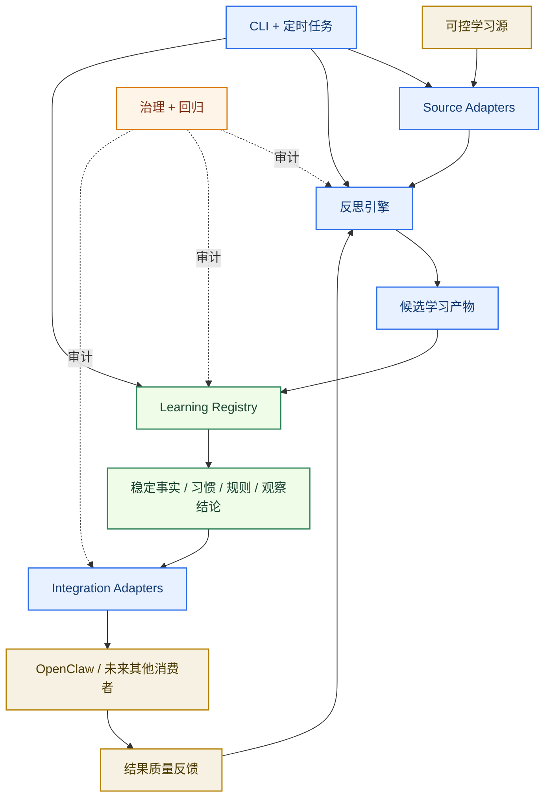
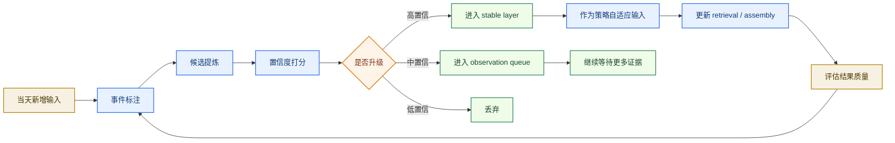
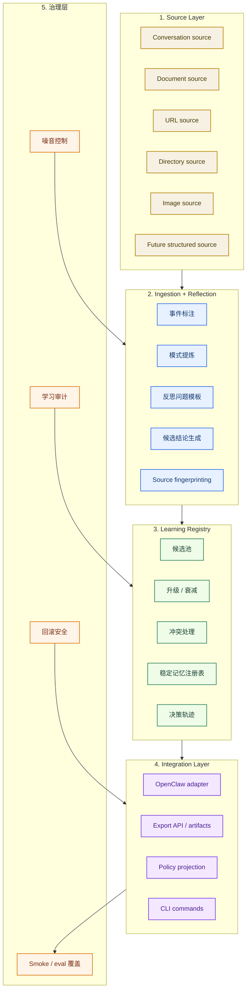
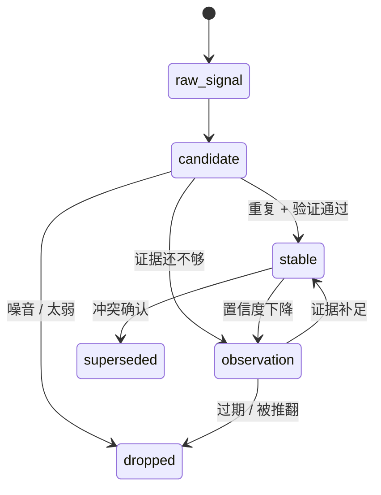
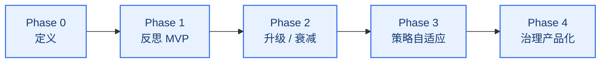

# Self-Learning Memory Architecture

[English](architecture.md) | [中文](architecture.zh-CN.md)

## 文档目的

这份文档定义 `unified-memory-core` 的下一条专项主线。

它同时定义一个未来可独立拆分的学习子系统边界：

`每日自动学习 + 每日反思 + 策略自适应`

它要讲清楚：

- 这条专项到底要做什么
- 它解决什么问题
- 解决思路是什么
- 系统应该怎么分层
- 后续 roadmap 应该怎么推进

这份文档不是灵感记录，而是后续专项落地的设计基线。

相关文档：

- [../../../README.zh-CN.md](../../../README.zh-CN.md)
- [../../architecture.zh-CN.md](../../architecture.zh-CN.md)
- [../../roadmap.zh-CN.md](../../roadmap.zh-CN.md)
- [roadmap.zh-CN.md](roadmap.zh-CN.md)
- [../memory-search/architecture.zh-CN.md](../memory-search/architecture.zh-CN.md)

## 一句话目标

把 `unified-memory-core` 从“事实优先的记忆上下文层”继续收成一套：

`受治理的每日学习系统，能够持续提炼稳定模式、进行结果反思，并逐步优化对用户的服务方式`

在架构层面，这个系统还应该被设计成：

`一个可独立拆分、可独立治理、当前先服务 OpenClaw、未来也可服务其他项目的学习组件`

## 当前已经实现的基线

这条专项已经不是纯设计稿了。当前仓库里已经落地了一条有实际能力的基线：

- `manual`、`file`、`directory`、`conversation`、`accepted_action` 这些 declared sources 的接入
- reflection labeling、candidate artifact generation、decision trails
- 带 repeated signal 和显式 remember 检测的 daily reflection
- 通过 registry 跑通的 candidate -> stable promotion
- standalone runtime / CLI，可执行 reflect、daily-run、export、audit、repair、replay
- generic、OpenClaw、Codex 三条 export 路径，以及围绕 exported stable artifacts 的 governance audit

## 这条专项要解决什么问题

当前系统已经比较擅长：

- 收集记忆输入
- 提炼 fact/card
- 在检索时优先稳定事实
- 治理 `memory search` 质量

但这还只是长期记忆系统的前半段。

现在剩下的缺口已经更具体了：

1. 用户重复表达的内容已经会生成 candidate，但 habit / behavior-specific 的生命周期规则还比较浅
2. 用户明确说“记住”的内容已经能被检测到，但目前仍主要依赖基线 promotion 逻辑，而不是更丰富的专门策略
3. “每日反思”已经是结构化管线，但 learning-specific 的维护流和报告体系还没有产品化
4. 行为模式在 artifact-policy 层还没有和普通事实彻底拉开
5. 学到的模式还没有系统地反哺 retrieval / assembly policy
6. 长期学习仍然需要更明确的 decay、conflict、time-window governance，避免再次变成噪音池

## 目标结果

这条专项完成后，系统应该能做到：

- 识别重复出现的用户偏好和说话习惯
- 高置信地接住用户明确要求长期记住的内容
- 每天对新增对话和记忆变化跑一轮反思
- 明确区分：
  - 已确认事实
  - 稳定偏好
  - 行为模式
  - 操作规则
  - 观察中结论
- 用学习结果调整 adapter 层策略
- 并且让这一切都保持可治理、可测试、可回滚

## 边界

这条专项会做：

- 定义独立学习组件的边界
- 强化 adapter 层的学习与反思集成能力
- 生成结构化、可移植的学习产物
- 用受治理的信号调整 retrieval / scoring / assembly policy
- 为学习行为补治理和回归保护
- 支持对话外的可控学习输入
- 支持 CLI 驱动的学习与治理流程

这条专项不会做：

- 魔改 OpenClaw 宿主
- 修改别的 adapter 或无关扩展
- 让模型随意重写自己的“人格”
- 让未经验证的自由反思直接进入 stable memory

## 产品边界

这个 self-learning 子系统应该被设计成一个独立产品形态的组件。

这意味着：

- 它要有自己的输入、输出和治理规则
- 它可以脱离 OpenClaw runtime 单独运行
- 它要通过稳定工件暴露学习结果，而不是把状态藏在运行时内存里
- 它和 OpenClaw 的关系应该是 adapter 集成，而不是深度耦合
- 它未来应该可以复用给其他 adapter、服务或本地工具

当前集成目标：

- `unified-memory-core` 消费学习结果，并把它们接入 OpenClaw 面向的 memory/context 流程

未来兼容目标：

- 同一份学习结果可以被其他项目或组件消费

## 设计原则

1. 学习是结构化的，不是玄学。
2. 反思是基于证据的，不是自由发挥写散文。
3. 升级必须可逆。
4. stable memory、候选记忆、运行时观察必须分层。
5. 策略自适应只能消费带置信度的信号，不能直接吃原始总结。
6. 上下文质量比记忆总量更重要。
7. 输入源必须显式且可控。
8. 学习结果必须可跨集成复用。
9. 组件必须支持脱离 OpenClaw 的 CLI 运行模式。
10. 每个结果都必须可追踪、可见、可修复。

## 整体图



## 可控输入

学习源应该是显式声明、可选择、可审阅的。

系统应支持的输入源包括：

- 对话
- OpenClaw memory artifacts
- 单个文档
- URL
- 目录
- 一张或多张图片
- 后续的结构化导入源

关键原则：

`系统只能从已声明的来源学习，不能从不可见的环境上下文里“偷偷学习”`

## 可追踪与可修复

每一条学习结果都应该满足：

- 能追溯来源
- 有时间戳
- 有证据次数
- 可版本化
- 可 diff
- 可审阅
- 可修复

也就是说，系统必须保留：

- 信号来自哪里
- 由哪次提炼 / 反思生成
- 由哪次升级决策改变了状态
- 被哪个集成出口消费

一旦结果有问题，维护者应该能够：

- 查看源数据
- 查看 candidate
- 查看决策链路
- 修复条目
- 重跑流程
- 重新生成下游输出

## 学习模型

这条专项的核心思路是：

`学习 = 采集 + 提炼 + 打分 + 升级 + 策略消费 + 验证`

系统不能把所有学到的内容都当成同一类东西。

建议明确分成：

- `stable_fact`
- `stable_preference`
- `stable_rule`
- `habit_signal`
- `behavior_pattern`
- `observation`
- `open_question`

还应明确分开：

- source artifacts
- candidate artifacts
- promoted artifacts
- integration-facing exports

## 运行模式

这个子系统至少应该支持两种运行模式：

1. `embedded mode`
   - 作为 `unified-memory-core` 的一部分运行
   - 将结果导出给 OpenClaw 面向的 memory/context 消费链路
2. `standalone mode`
   - 通过 CLI 或定时任务独立运行
   - 摄取可控输入源
   - 在不依赖 OpenClaw runtime 的前提下输出工件和报告

## 每日反思闭环



## 已采纳行为捕获

当前还缺一条很明确的链路：

`已经执行成功、而且已经被采纳的行为，可能仍然只停留在任务日志里，没进入受治理的学习候选层`

这正是“agent 这次明明用对了发布目标，下次却记不稳”的那类问题来源。

架构上不应该走产品特判，比如“只要 GitHub Pages 发布成功就记住 URL”。

更合理的是给学习子系统补一层通用的已采纳行为入口：

- `accepted_action`
- `applied_decision`
- `successful_execution`

这些事件本身不是 stable memory。

它们只是结构化证据事件，用来让学习子系统看清：

- agent 提议了什么
- 用户采纳了什么
- runtime 实际执行了什么
- 产出了哪些 artifact 或外部目标
- 观察到了哪些成功信号

关键边界：

`所有已采纳行为都可以进入事实候选抽取，但不是所有已采纳行为都应该变成长期记忆`

## 从已采纳行为到记忆候选

目标管线应该是：

1. 先捕获一条受治理的 accepted-action event
2. 再抽取候选事实、规则、偏好或一次性观察
3. 再判断置信度和生命周期类型
4. 再写入合适的记忆层
5. 最后由后续治理决定 promote、decay、merge 或 drop

这样做能保持系统通用性。

也能同时避免两个错误极端：

- 除了当前任务什么都记不住
- 只要执行成功就直接写进 durable memory

建议的抽取类别：

- 可复用环境事实
- 稳定操作规则
- 用户偏好或工作流约定
- 近期结果工件
- 一次性执行结果

建议的准入类别：

- 仅 session 召回
- daily-memory candidate
- governed stable-memory candidate
- dropped / 仅审计记录

## 延后实现的更深抽取规则

当前实现有意停在一个保守的第一步：

- `accepted_action` 已经可以进入受治理的 source -> candidate -> stable 闭环
- CLI 已经可以提交结构化 accepted-action 证据
- 成功的 accepted-action event 现在已经会在 source 提供结构化证据时拆成 field-aware 的 `target_fact`、`operating_rule`、`outcome_artifact` candidates
- runtime/task 接入面现在已经包括 Codex `writeAfterTask(...)`，以及 OpenClaw 在显式结构化 accepted-action payload 出现时的异步 `after_tool_call`

这已经足够证明集成链路和 Step 47 的 field-aware extraction 打通了，但还不是完整的抽取策略。

更深一层的抽取规则现在先明确记成 TODO，避免系统从“完全没机制”直接跳到“过度拟合一切细节”。

延后实现的 TODO 包：

1. admission routing：
   像一次性 URL、slug、artifact path 这类结果，默认先落 observation 或 daily-memory，只有后续复用才考虑 stable promotion
2. stronger evidence weighting：
   把 user accepted、execution succeeded、后续复用、矛盾信号、再次引用这些证据合并打分
3. negative and partial outcomes：
   对 rejected、failed、ambiguous 的 accepted-action events，默认走 audit / observation，而不是 stable fact
4. accepted-action conflict and dedupe policy：
   新的 accepted-action 结果要能和旧的 stable target / rule 做 supersede、dedupe、staleness 判断
5. extraction-specific replay and audit coverage：
   让 accepted-action 从原始 event 字段到最终落层结果的整个决策链都可 replay、可 audit

实现 gate：

`在当前 Stage 5 operator baseline 持续为绿、仓库明确进入后续 enhancement slice 之前，不要打开这组更深抽取规则`

## 什么算证据

反思系统对候选学习信号打分时，建议至少看这些证据：

- 用户是否明确说了 `记住`
- 是否跨多次、跨多天重复出现
- 是否有重复表达模式
- 用户是否接受或否定了系统之前的行为
- 某个已采纳行为是否已经执行成功
- 用户“怎么说”和“怎么做”是否一致
- 是否最近仍然有效
- 是否与已有稳定记忆冲突

建议这样理解：

- 重复句式 -> 候选说话习惯或偏好
- 明确 `记住` -> 高优先级 stable memory 候选
- 已采纳且执行成功的行为 -> 候选事实或操作规则，但仍需经过生命周期判断
- 重复出现的反思 / 修正 -> 候选操作规则
- 只反复表达目标、但行为不一致 -> `aspiration`，不是 stable fact
- 表述变化但底层原则一致 -> 抽象成更高层规则候选

## 分层架构



## 集成边界

最干净的边界应该是：

- `self-learning component` 负责 ingestion、candidate generation、promotion lifecycle、audit trail 和 exports
- `unified-memory-core` 负责 OpenClaw 专属的 retrieval、assembly 和 adapter-side consumption
- adapter 和任务 runtime 可以发出 accepted-action events，但不应该在适配层里硬编码长期记忆策略

换句话说：

`self-learning 决定学到了什么`

`unified-memory-core 决定 OpenClaw 怎么消费这些结果`

## 反思引擎

反思引擎不应该是一个泛化“写日记器”。

它应该稳定回答几类固定问题，比如：

- 今天哪些用户偏好被再次强化了
- 今天哪些稳定记忆被再次验证了
- 今天出现了哪些新模式
- 今天系统哪些行为是加分项
- 今天系统哪些行为制造了噪音
- 哪些候选规则还需要继续观察
- 哪些候选结论值得进入升级评审

这样反思结果才更适合工程落地，也更容易治理。

## 记忆状态



## CLI 形态

这个组件应该支持通过独立 CLI 操作。

早期命令方向例如：

- `learn add --file <path>`
- `learn add --url <url>`
- `learn add --dir <path>`
- `learn add --image <path>`
- `learn reflect --since <date>`
- `learn promote --review`
- `learn audit`
- `learn export --target openclaw`

命令名后续可以调整。

更重要的是运行模型：

- source registration 是显式的
- learning runs 可以脚本化
- audits 可以脚本化
- exports 可以脚本化
- CLI 可以脱离 OpenClaw host 运行

## 策略自适应

学习不能只停在“写入 memory”。

更重要的是，OpenClaw adapter 应该逐步学会“怎样更好地服务这个用户”，也就是让学习结果反哺：

- retrieval priority
- fast-path routing
- score bonus / penalty
- supporting-context 过滤
- 任务执行默认流程
- 在用户明确强化后，再逐步影响输出风格

例如：

- 多次出现 `不要硬编码` -> 对脆弱实现模式施加更强惩罚
- 多次强调文档要简洁 -> 文档任务里更偏向短而高信号的 supporting context
- 多次强调测试 + 文档 + 部署 -> 升级为默认执行 checklist

## 必须坚持的治理规则

这条专项必须全程受治理。

至少要有这些控制：

- 每条学习项都要能追溯来源
- 每条学习项都要有时间戳
- 每条学习项都要记录证据次数
- 每条学习项都要记录最近验证时间
- 每条学习项都必须可降级 / 可过期
- 冲突必须显式处理，不能静默覆盖
- source scope 必须可审阅
- promotion history 必须可见
- export 结果必须可复现

## 要规避的风险

1. 把一次性表达误判成长期人格
2. 把“想做到”误判成“已经稳定做到”
3. 让模型脑补用户动机
4. 让 recalled context 变多了，但没有变干净
5. 让反思产物绕过升级评审直接进入 stable memory

## 候选数据形态示例

```json
{
  "id": "candidate-rule-001",
  "type": "stable_rule_candidate",
  "statement": "User prefers concise, maintenance-friendly documentation.",
  "evidenceCount": 4,
  "explicitRemember": false,
  "sources": [
    "conversation:2026-04-11:turn-18",
    "conversation:2026-04-10:turn-42"
  ],
  "status": "observation",
  "confidence": 0.84,
  "lastValidatedAt": "2026-04-11",
  "conflicts": []
}
```

## Roadmap



### Phase 0：定义阶段

目标状态：`next`

产出：

- 学习术语和边界定义
- 候选类型和状态模型
- 证据与置信度模型
- 文档结构和专项归属

### Phase 1：反思 MVP

产出：

- daily reflection job
- event labeling
- 覆盖这些候选提炼：
  - 明确 `记住`
  - 重复偏好
  - 重复表达习惯
  - 重复操作规则
- observation queue 输出

### Phase 2：升级 / 衰减

产出：

- promotion rules
- decay / expiry rules
- conflict detection
- stable registry 更新
- 升级决策的回归用例

### Phase 3：策略自适应

产出：

- 让稳定学习结果进入 retrieval / assembly
- 用学习信号收紧 supporting-context 过滤
- 定义安全的策略更新边界
- 度量策略变化后的上下文纯度

### Phase 4：治理产品化

产出：

- 学习审计报告
- 跨时间窗口对比报告
- self-learning 行为的 smoke 覆盖
- 已升级学习项的日常维护流

## 建议的首批文件 / 模块方向

未来可以考虑新增：

- `src/learning-source-adapters.js`
- `src/daily-reflection.js`
- `src/learning-candidates.js`
- `src/learning-promotion.js`
- `src/policy-adaptation.js`
- `src/learning-export.js`
- `src/learning-cli.js`
- `scripts/run-daily-reflection.js`
- `scripts/learn-add-source.js`
- `scripts/learn-export-openclaw.js`
- `reports/self-learning-*.md`
- `test/daily-reflection.test.js`
- `test/learning-promotion.test.js`
- `test/learning-cli.test.js`

这里是建议方向，不是已经锁死的文件契约。

## 成功标准

这条专项真正算成功，至少要看到：

- 用户重复规则和习惯比以前更容易被稳定召回
- 明确 `记住` 的内容能被稳定升级
- recalled context 更干净，而不是更吵
- 策略自适应是可见、可解释的
- 学习行为本身也能被回归测试和评审
- 学习源保持显式且可控
- 组件可以用 standalone CLI mode 运行
- 输出能以最小 adapter 成本复用给 OpenClaw 之外的项目
