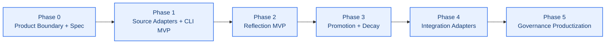
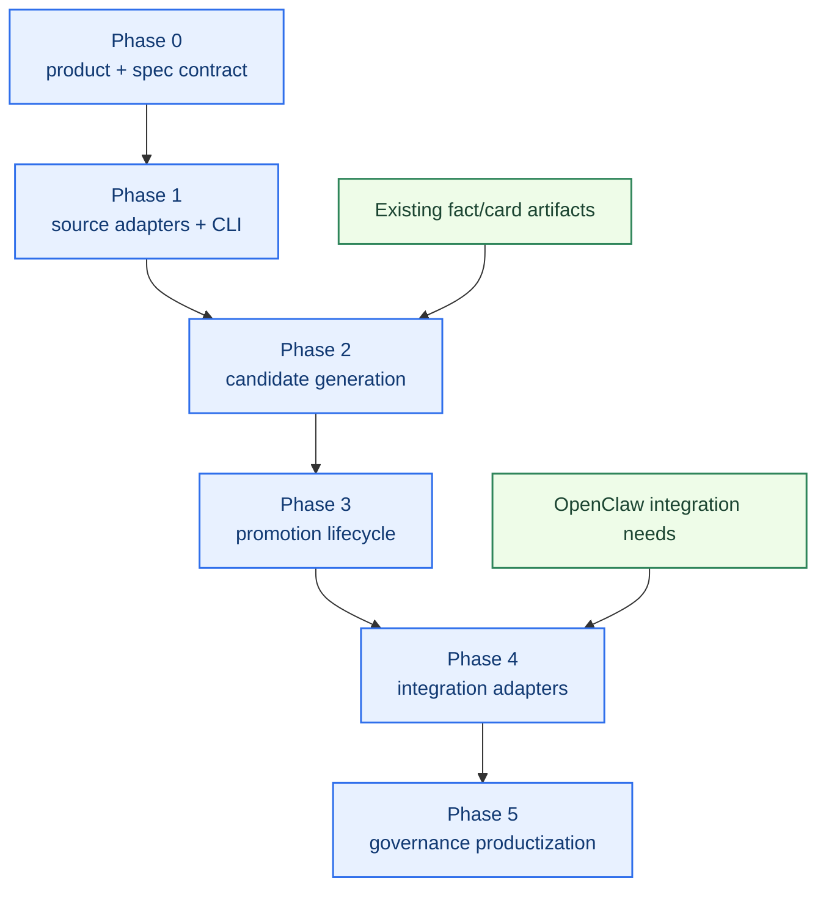

# Self-Learning Workstream Roadmap

[English](roadmap.md) | [中文](roadmap.zh-CN.md)

## Purpose

This roadmap turns the self-learning architecture into an implementation-oriented workstream plan.

It answers:

- what this workstream will build first
- which phases should be executed in order
- what each phase should deliver
- how each phase should be validated
- what should be considered out of scope for now

Related documents:

- [../../roadmap.md](../../roadmap.md)
- [architecture.md](architecture.md)
- [../memory-search/roadmap.md](../memory-search/roadmap.md)

## Workstream Goal

Build a governed daily-learning system for `unified-memory-core` that can:

- detect repeated signals
- run daily reflection
- promote stable learning candidates safely
- adapt adapter-side policy using verified patterns
- keep learned behavior testable and reviewable
- stay separable from `memory search`
- expose standalone CLI-driven workflows
- keep artifacts portable for future non-OpenClaw consumers

## Current Status

- status: `Stage 5 complete / hold stable`
- architecture baseline: `defined and partially realized in the current shared modules`
- implementation baseline: `already running`
- dependency status:
  - core memory-context backbone: `ready`
  - memory-search governance loop: `ready but not a hard coupling target`
  - daily reflection baseline: `implemented`
  - lifecycle baseline: `implemented`
  - standalone CLI / export / governance surfaces: `implemented`

## Implemented Baseline Today

The current repo no longer has only a baseline. Stage 3 lifecycle work is now complete.

- declared sources already support `manual`, `file`, `directory`, `conversation`, `url`, `image`, and `accepted_action`
- reflection already emits structured candidate artifacts and decision trails
- daily reflection already detects repeated signals and explicit remember instructions
- explicit promotion / decay / conflict / stable-update rules now run through the shared modules
- learning-specific audit / repair / replay / compare surfaces are now available
- standalone runtime / CLI / script now support one local governed `observation -> stable` loop
- OpenClaw consumption of promoted learning artifacts is now validated

The next phase is not to reopen Stage 5 contract work. That part is done. The next focus is keeping product hardening evidence stable while any later service-mode discussion remains deferred.

The phase descriptions below are planning envelopes. Parts of Phase 0-2 are already implemented across the current shared modules.

## Next Planning Slice

The next self-learning enhancement should not start from "more reflection" in the abstract.

The clearest product gap is:

`accepted and successfully executed behavior still lacks a generic path into governed fact-candidate extraction`

That gap shows up when:

- a task discovers a reusable repo, endpoint, or workflow target
- the user accepts the choice
- runtime execution succeeds
- but the result remains visible only in session logs instead of entering layered memory governance

The recommended direction is a generic pipeline, not business-specific hardcoding:

- emit accepted-action events from task/runtime surfaces
- extract candidate facts / rules / preferences / outcome artifacts
- classify lifecycle and confidence
- land results in session, daily, or governed stable-candidate layers
- keep later promotion under normal governance

## Deferred TODO For Deeper Accepted-Action Extraction

Current status:

- generic accepted-action intake is now implemented
- CLI and lifecycle coverage already prove that accepted-action evidence can enter the governed loop
- deeper extraction policy is still intentionally deferred

That deferred package should reopen only as a later enhancement slice.

TODO backlog:

1. split accepted-action fields into:
   reusable target facts, operating rules, and one-off outcome artifacts
2. add admission policy that keeps one-off URLs / paths out of stable memory until reuse justifies promotion
3. score accepted-action candidates with richer evidence than "accepted + succeeded" alone
4. add negative / partial-action handling so failed or rejected events do not promote like stable facts
5. add accepted-action-specific dedupe, supersede, and conflict rules
6. add replay / audit cases that assert final placement from raw accepted-action fields

Entry criteria for reopening this TODO:

- Stage 5 operator baseline remains stable
- current release-preflight evidence stays green
- the repo explicitly opens a later enhancement phase instead of appending more work into the closeout baseline

## Phase Map

## Phase 0: Product Boundary + Spec

Status target: `build first`

Goal:

Create the minimal stable contract and product boundary before runtime behavior is added.

Scope:

- standalone component boundary
- integration adapter boundary
- candidate types
- memory states
- evidence model
- confidence model
- promotion / decay rules draft
- report shape draft
- source registration model
- export artifact model

Suggested outputs:

- standalone-vs-embedded contract
- source / export contract
- candidate schema definition
- state transition definition
- reflection question template set
- initial file/module ownership plan

Suggested modules:

- `src/learning-candidates.js`
- `src/learning-schema.js`
- `src/learning-contracts.js`
- `test/learning-candidates.test.js`

Acceptance:

- self-learning and memory-search boundaries are explicit
- standalone CLI mode is part of the contract
- candidate types are explicitly named
- stable vs observation vs dropped is unambiguous
- evidence fields are sufficient for later audit

## Phase 1: Source Adapters + CLI MVP

Goal:

Build the first controlled-ingestion and CLI surface for the standalone component.

Scope:

- source registration
- file / directory / URL / image input adapters
- CLI command surface
- source manifest
- dry-run inspection mode

Suggested outputs:

- CLI runner
- source adapter layer
- source manifest artifact
- dry-run source inspection report

Suggested modules:

- `src/learning-source-adapters.js`
- `src/learning-cli.js`
- `scripts/learn-add-source.js`
- `test/learning-cli.test.js`

Acceptance:

- controlled sources can be registered explicitly
- CLI can run without OpenClaw host runtime
- source manifests are visible and reviewable
- ingestion behavior is traceable

## Phase 2: Reflection MVP

Goal:

Build the first daily reflection loop that generates governed learning candidates instead of stable memory directly.

Scope:

- daily input aggregation
- event labeling
- accepted-action event intake
- repeated-signal detection
- explicit remember detection
- observation queue generation
- decision trail generation

Suggested outputs:

- daily reflection runner
- first reflection report
- first observation candidate artifact
- first decision-trail artifact

Suggested modules:

- `src/daily-reflection.js`
- `scripts/run-daily-reflection.js`
- `test/daily-reflection.test.js`
- `reports/self-learning-reflection-*.md`

Acceptance:

- daily reflection can run on recent inputs
- repeated preference candidates can be extracted
- explicit remember instructions are detected
- accepted successful actions can enter governed candidate extraction without direct long-term promotion
- output is structured and reviewable

## Phase 3: Promotion + Decay

Goal:

Turn observation candidates into a governed lifecycle instead of a one-way accumulation bucket.

Scope:

- promotion rules
- decay / expiry rules
- conflict detection
- stable registry update rules

Suggested outputs:

- promotion evaluator
- decay evaluator
- conflict report
- stable candidate promotion report
- repair workflow draft

Suggested modules:

- `src/learning-promotion.js`
- `src/learning-conflicts.js`
- `test/learning-promotion.test.js`

Acceptance:

- strong repeated signals can be promoted
- weak or stale signals can decay
- conflicts are explicit
- no candidate bypasses review logic

Status:

`implemented in the current shared modules`

## Phase 4: Integration Adapters

Goal:

Use verified learning signals through adapters instead of hard-coupling the component to OpenClaw internals.

Scope:

- OpenClaw export adapter
- portable export artifacts
- retrieval / policy projection boundaries
- future consumer compatibility shape

Suggested outputs:

- OpenClaw integration adapter
- export artifact spec
- first OpenClaw-facing projection report
- future-consumer compatibility note

Suggested modules:

- `src/learning-export.js`
- `src/policy-adaptation.js`
- `test/learning-export.test.js`
- `test/policy-adaptation.test.js`
- `reports/self-learning-policy-*.md`

Acceptance:

- learned outputs can be exported without embedding logic directly in retrieval internals
- OpenClaw integration is explicit and adapter-based
- output shape is reusable outside OpenClaw

## Phase 5: Governance Productization

Goal:

Make self-learning a regular maintainable capability rather than a one-off experiment.

Scope:

- smoke coverage
- audit coverage
- time-window comparisons
- maintenance workflow
- rollback posture
- repair workflow
- export reproducibility
- accepted-action replay / audit coverage

Suggested outputs:

- self-learning audit report
- periodic comparison report
- smoke cases for learning behavior
- maintenance checklist
- repair checklist

Suggested modules:

- `scripts/run-self-learning-audit.js`
- `test/self-learning-governance.test.js`
- `reports/self-learning-audit-*.md`

Acceptance:

- self-learning behavior is regression-protected
- promoted items are reviewable
- quality can be compared over time
- accepted-action sourced candidates are traceable from event to final layer

## Phase Dependencies

## Explicit Non-Goals For Now

- patching the OpenClaw host
- changing builtin `memory_search`
- building free-form autonomous personality rewriting
- using reflection outputs as stable memory without governance
- binding the learning component permanently to OpenClaw-only inputs
- hiding learning decisions inside opaque runtime state

## Recommended Development Order

1. finish Phase 0 contracts and tests
2. implement Phase 1 source adapters and CLI MVP
3. implement Phase 2 reflection runner, including accepted-action event intake and candidate outputs
4. implement Phase 3 lifecycle rules
5. implement Phase 4 integration adapters
6. implement Phase 5 reports and smoke coverage
