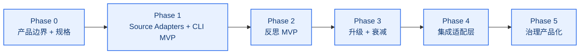
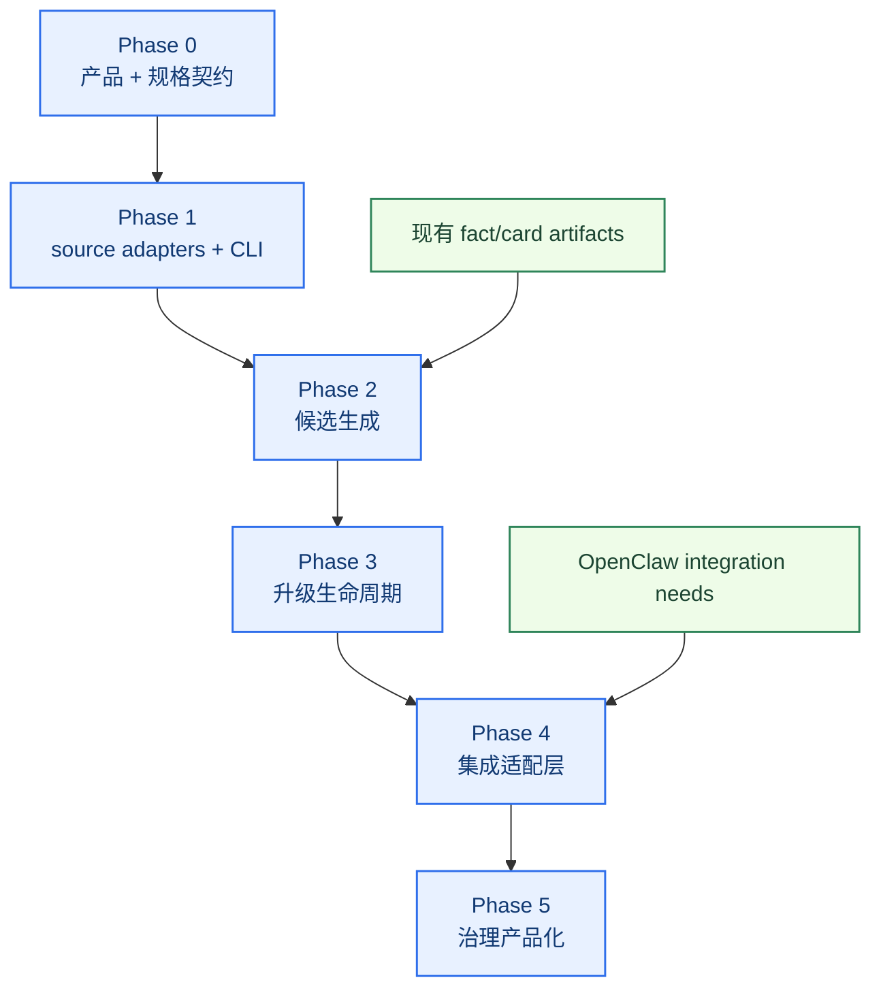

# Self-Learning Workstream Roadmap

[English](roadmap.md) | [中文](roadmap.zh-CN.md)

## 文档目的

这份 roadmap 把 self-learning architecture 继续收成一份可执行的专项开发计划。

它要回答：

- 这条专项先做什么
- 各阶段应该按什么顺序推进
- 每一阶段要交付什么
- 每一阶段怎么验证
- 现阶段哪些内容明确不做

相关文档：

- [../../roadmap.zh-CN.md](../../roadmap.zh-CN.md)
- [architecture.zh-CN.md](architecture.zh-CN.md)
- [../memory-search/roadmap.zh-CN.md](../memory-search/roadmap.zh-CN.md)

## 专项目标

为 `unified-memory-core` 做出一套受治理的每日学习系统，能够：

- 识别重复信号
- 执行 daily reflection
- 安全升级稳定学习候选
- 用已验证模式更新 adapter 层策略
- 让学习行为本身可测试、可评审
- 尽可能与 `memory search` 解耦
- 通过独立 CLI 驱动运行
- 让学习产物未来可复用给 OpenClaw 之外的项目

## 当前状态

- 状态：`Stage 5 complete / hold stable`
- 架构基线：`已定义，并且已经在当前共享模块里部分落地`
- 实现基线：`已经可运行`
- 依赖状态：
  - memory-context 主骨架：`ready`
  - memory-search 治理循环：`ready but not a hard coupling target`
  - daily reflection 基线：`implemented`
  - lifecycle 基线：`implemented`
  - standalone CLI / export / governance 面：`implemented`

## 当前已经落地的基线

当前仓库已经不只是“有一条 baseline”。Stage 3 lifecycle 已经收口完成。

- declared sources 已支持 `manual`、`file`、`directory`、`conversation`、`url`、`image`、`accepted_action`
- reflection 已能产出结构化的 candidate artifacts 和 decision trails
- daily reflection 已能识别 repeated signals 和显式 remember 指令
- promotion / decay / conflict / stable-update 规则已经落进共享模块
- learning-specific audit / repair / replay / compare 面已经可用
- standalone runtime / CLI / script 已支持一条本地 governed `observation -> stable` loop
- OpenClaw 对 promoted learning artifacts 的消费行为已经有验证

下一阶段不再是重开 Stage 5 contract 工作。这一段已经完成。接下来的重点是保持产品加固证据面长期稳定，同时继续延后任何 service-mode 讨论。

下面的 phase 描述是规划外壳。Phase 0-2 的一部分，已经通过当前共享模块实现。

## 下一段规划切片

下一条 self-learning 增强主线，不该再抽象地写成“继续做更多 reflection”。

现在最清晰的产品缺口是：

`已采纳并执行成功的行为，还没有一条通用入口进入受治理的事实候选抽取链路`

这个缺口会表现为：

- 某次任务发现了一个可复用的 repo、endpoint 或 workflow target
- 用户接受了这个选择
- runtime 执行也成功了
- 但结果只存在于 session logs，没有进入分层记忆治理

推荐方向是通用管线，而不是业务硬编码：

- 从 task/runtime 面发出 accepted-action events
- 抽取候选 facts / rules / preferences / outcome artifacts
- 判断生命周期和置信度
- 分别落到 session、daily 或 governed stable-candidate 层
- 后续 promote 仍然走常规治理

## 延后实现的 accepted-action 深层抽取 TODO

当前状态：

- generic accepted-action intake 已经落地
- CLI 和 lifecycle 覆盖已经证明 accepted-action 证据可以进入 governed loop
- Step 47 的 field-aware extraction 已经落地
- 后续 admission / weighting / negative-path policy 仍然是有意延后的

这一包延后项，只应在后续 enhancement slice 单独打开，不应继续往当前 closeout baseline 里追加。

TODO backlog：

1. 补 admission policy：
   对一次性 URL / path 默认不直接进 stable memory，只有复用后才考虑 promotion
2. 补 richer evidence scoring：
   不只看 `accepted + succeeded`，还要合并后续复用、冲突、再次引用等证据
3. 补 negative / partial-action handling：
   failed、rejected、ambiguous 的事件应进入 audit / observation，而不是直接按 stable fact 处理
4. 补 accepted-action-specific dedupe / supersede / conflict rules
5. 补 replay / audit cases，验证从原始 accepted-action 字段到最终落层结果的完整链路

重新打开这组 TODO 的前置条件：

- Stage 5 operator baseline 持续稳定
- 当前 release-preflight 证据持续为绿
- 仓库明确开启新的 enhancement phase，而不是继续往 closeout baseline 上叠加工作

## 阶段图

## Phase 0：产品边界 + 规格

目标状态：`第一个开发阶段`

目标：

在接入运行时行为之前，先把 self-learning 的最小稳定契约和产品边界定义清楚。

范围：

- standalone component boundary
- integration adapter boundary
- candidate types
- memory states
- evidence model
- confidence model
- promotion / decay rules 草案
- report shape 草案
- source registration model
- export artifact model

建议产出：

- standalone-vs-embedded contract
- source / export contract
- candidate schema 定义
- 状态流转定义
- 反思问题模板集
- 初版文件 / 模块归属计划

建议模块：

- `src/learning-candidates.js`
- `src/learning-schema.js`
- `src/learning-contracts.js`
- `test/learning-candidates.test.js`

验收：

- self-learning 和 memory-search 边界清楚
- standalone CLI mode 进入契约定义
- candidate 类型命名清楚
- stable / observation / dropped 边界清楚
- evidence 字段足够支撑后续审计

## Phase 1：Source Adapters + CLI MVP

目标：

先做出独立组件的可控输入层和 CLI 操作面。

范围：

- source registration
- file / directory / URL / image input adapters
- CLI commands
- source manifest
- dry-run inspection mode

建议产出：

- CLI runner
- source adapter layer
- source manifest artifact
- dry-run source inspection report

建议模块：

- `src/learning-source-adapters.js`
- `src/learning-cli.js`
- `scripts/learn-add-source.js`
- `test/learning-cli.test.js`

验收：

- 可控来源可以被显式注册
- CLI 可以脱离 OpenClaw host runtime 执行
- source manifests 可见、可审阅
- ingestion 行为可追踪

## Phase 2：反思 MVP

目标：

做出第一版 daily reflection 闭环，但先生成受治理的 learning candidates，而不是直接写 stable memory。

范围：

- 每日输入聚合
- 事件标注
- accepted-action event intake
- 重复信号检测
- 明确 `记住` 检测
- observation queue 生成
- decision trail 生成

建议产出：

- daily reflection runner
- 第一版 reflection report
- 第一版 observation candidate artifact
- 第一版 decision-trail artifact

建议模块：

- `src/daily-reflection.js`
- `scripts/run-daily-reflection.js`
- `test/daily-reflection.test.js`
- `reports/self-learning-reflection-*.md`

验收：

- 能对最近输入跑 daily reflection
- 能提炼重复偏好候选
- 能识别明确 `记住`
- 已采纳且成功执行的行为，能进入受治理的候选抽取，而不是直接晋升长期记忆
- 输出结构化且可评审

## Phase 3：升级 + 衰减

目标：

让 observation candidates 进入受治理生命周期，而不是只进不出的堆积池。

范围：

- promotion rules
- decay / expiry rules
- conflict detection
- stable registry 更新规则

建议产出：

- promotion evaluator
- decay evaluator
- conflict report
- stable candidate promotion report
- repair workflow draft

建议模块：

- `src/learning-promotion.js`
- `src/learning-conflicts.js`
- `test/learning-promotion.test.js`

验收：

- 强信号可以升级
- 弱信号和过期信号可以衰减
- 冲突会被显式标出
- 没有候选能绕过评审逻辑

状态：

`已经通过当前共享模块实现`

## Phase 4：集成适配层

目标：

通过 adapter 把已验证学习结果接入 OpenClaw，而不是把组件和 OpenClaw 内部强耦合。

范围：

- OpenClaw export adapter
- portable export artifacts
- retrieval / policy projection boundaries
- future consumer compatibility shape

建议产出：

- OpenClaw integration adapter
- export artifact spec
- 第一版 OpenClaw-facing projection report
- future-consumer compatibility note

建议模块：

- `src/learning-export.js`
- `src/policy-adaptation.js`
- `test/learning-export.test.js`
- `test/policy-adaptation.test.js`
- `reports/self-learning-policy-*.md`

验收：

- 学习结果可以在不嵌入 retrieval internals 的前提下导出
- OpenClaw 集成是显式 adapter-based
- 输出形态可复用于 OpenClaw 外的消费者

## Phase 5：治理产品化

目标：

把 self-learning 从一次性实验，收成可长期维护的稳定能力。

范围：

- smoke coverage
- audit coverage
- 跨时间窗口对比
- 日常维护流
- rollback posture
- repair workflow
- export reproducibility
- accepted-action replay / audit coverage

建议产出：

- self-learning audit report
- 周期性对比报告
- learning behavior smoke cases
- 维护 checklist
- repair checklist

建议模块：

- `scripts/run-self-learning-audit.js`
- `test/self-learning-governance.test.js`
- `reports/self-learning-audit-*.md`

验收：

- self-learning 行为有回归保护
- 已升级条目可评审
- 质量可跨时间对比
- 能从 accepted-action event 一路追踪到最终落层结果

## 阶段依赖图

## 当前明确不做

- 魔改 OpenClaw 宿主
- 修改 builtin `memory_search`
- 做自由发挥式的“人格重写”
- 让 reflection 结果绕过治理直接进入 stable memory
- 把学习组件永久绑定成 OpenClaw-only 输入
- 把学习决策藏进不可见的 runtime state

## 建议开发顺序

1. 先完成 Phase 0 的 contract 和测试
2. 再实现 Phase 1 的 source adapters 和 CLI MVP
3. 再实现 Phase 2 的 reflection runner，其中包括 accepted-action event intake 和 candidate 输出
4. 再补 Phase 3 的生命周期规则
5. 再接入 Phase 4 的 integration adapters
6. 最后补 Phase 5 的报告和 smoke 覆盖
