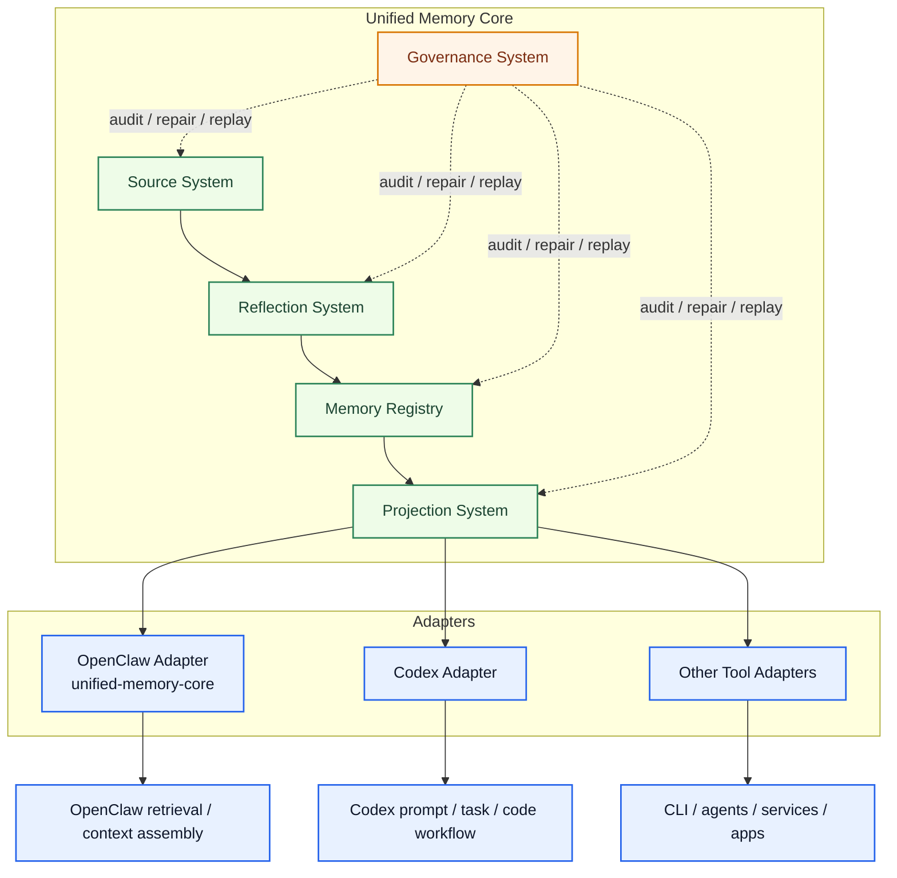
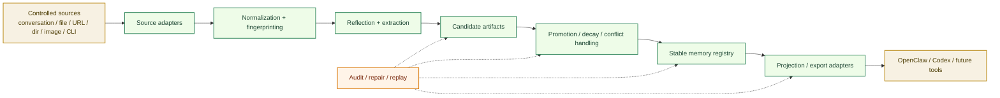
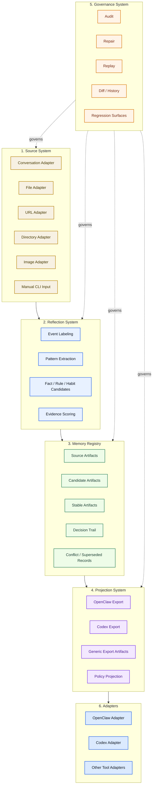
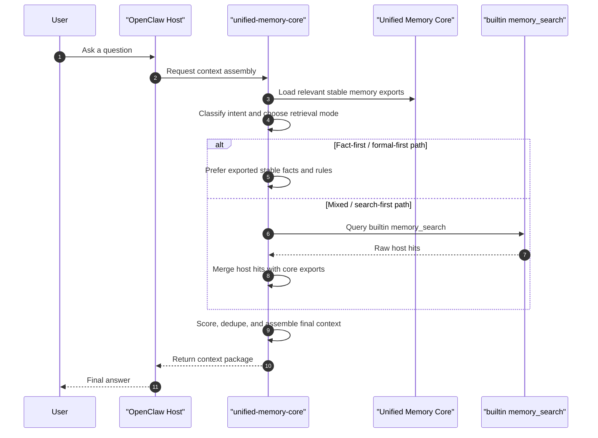
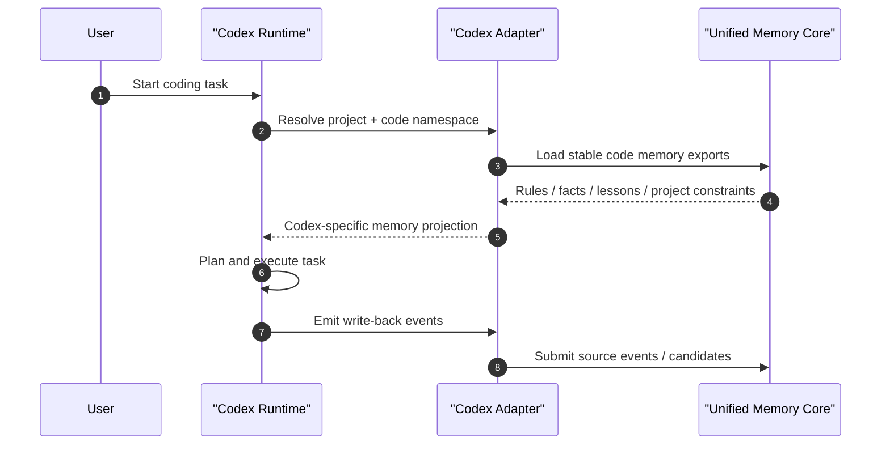
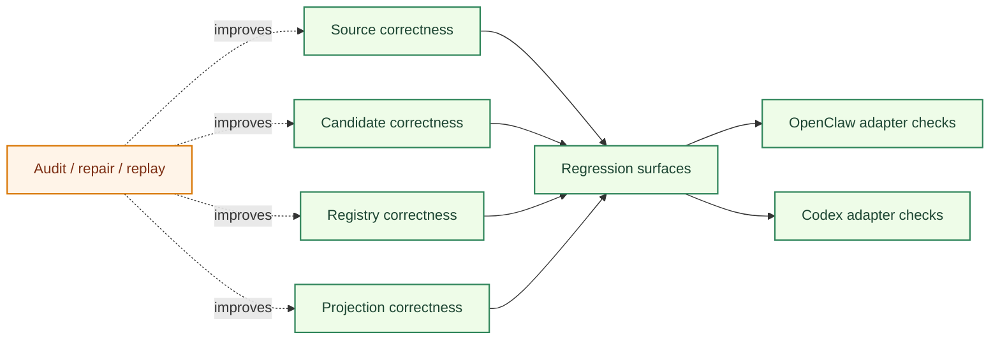

# System Architecture

[English](architecture.md) | [中文](architecture.zh-CN.md)

## Purpose

This is the top-level system architecture document for the current repo.

It explains the latest official model:

- `Unified Memory Core` is the product-level shared memory foundation
- `unified-memory-core` is the OpenClaw-facing adapter and consumption layer
- `Codex Adapter` is a first-class integration target from day one
- `memory search` is now one workstream inside a broader multi-product architecture

This document should answer:

- what the overall system is now
- which boundaries are stable
- how data moves from sources to tools
- how the current repo is organized around product core and adapters
- where governance and testing sit

Related documents:

- [../../../README.md](../../../README.md)
- [../../roadmap.md](../../roadmap.md)
- [../../reference/unified-memory-core/deployment-topology.md](../../reference/unified-memory-core/deployment-topology.md)
- [../../reference/code-memory-binding-architecture.md](../../reference/code-memory-binding-architecture.md)
- [../self-learning/architecture.md](../self-learning/architecture.md)
- [../memory-search/architecture.md](../memory-search/architecture.md)

## Architecture At A Glance

## Official Position

The current official architecture is:

1. `Unified Memory Core` is the shared-memory product
2. `unified-memory-core` is not the whole product anymore
3. `unified-memory-core` is the OpenClaw adapter and OpenClaw-specific consumption layer
4. `Codex Adapter` is part of the intended first-class architecture, not a later afterthought
5. product logic and tool-specific logic should stay separated through adapters

## System Goal

The combined system is meant to do three things well:

1. build governed memory from controlled sources
2. preserve high traceability and repairability
3. project stable memory differently for different tools without coupling the core to any one tool

## Deployment Position

The current architecture should support:

- one OpenClaw with multiple agents
- multiple OpenClaw runtimes
- multiple Codex runtimes
- multiple Claude or future tool runtimes

Current implementation target:

- support local and shared-workspace modes first
- keep contracts ready for later shared-service and runtime-API phases

See:

- [../../reference/unified-memory-core/deployment-topology.md](../../reference/unified-memory-core/deployment-topology.md)

## End-To-End Flow

## Stable Boundaries

### 1. Product boundary

`Unified Memory Core` owns:

- source ingestion
- candidate generation
- artifact lifecycle
- decision trail
- exports
- governance controls

### 2. OpenClaw boundary

`unified-memory-core` owns:

- OpenClaw-specific retrieval policy
- OpenClaw-specific context assembly
- OpenClaw-facing export consumption
- integration with OpenClaw host behavior through the OpenClaw adapter

### 3. Codex boundary

`Codex Adapter` owns:

- Codex-facing code memory projection
- Codex-specific task guidance consumption
- Codex write-back event mapping

## Module Stack

## OpenClaw Flow

## Codex Flow

## Where Memory Search Fits

`memory search` is important, but it is no longer the top-level architecture story.

Its role is now:

- one workstream inside the OpenClaw adapter
- one consumption-layer concern
- one area of governance and regression inside `unified-memory-core`

It does not define the whole shared-memory product.

## Governance And Testing Position

## Repo Direction

The latest repo direction is:

- preserve the prior adapter-bootstrap shape through the branch `unified-memory-core-bootstrap`
- use `main` to move the system toward the official `Unified Memory Core` product shape
- keep product docs, module docs, and adapter docs aligned before deep implementation

## Document Map

- product index:
  [../../roadmap.md](../../roadmap.md)
- top-level architecture wrapper:
  [../../architecture.md](../../architecture.md)
- deployment topology:
  [../../reference/unified-memory-core/deployment-topology.md](../../reference/unified-memory-core/deployment-topology.md)
- OpenClaw code-memory binding:
  [../../reference/code-memory-binding-architecture.md](../../reference/code-memory-binding-architecture.md)
- self-learning workstream:
  [../self-learning/architecture.md](../self-learning/architecture.md)
- memory-search workstream:
  [../memory-search/architecture.md](../memory-search/architecture.md)
