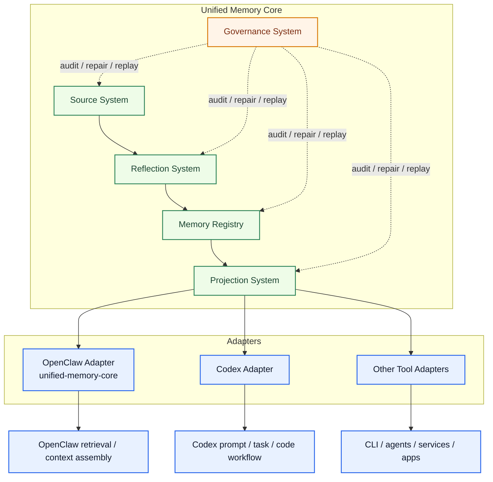
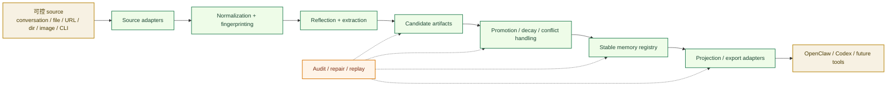
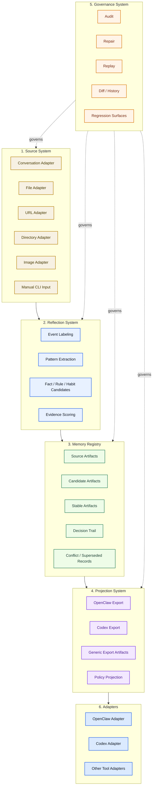
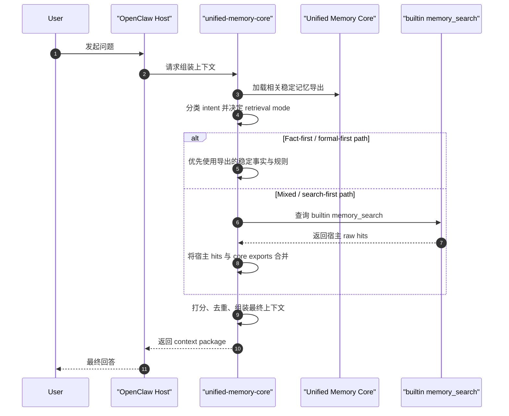
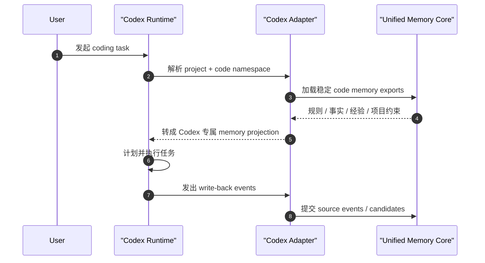
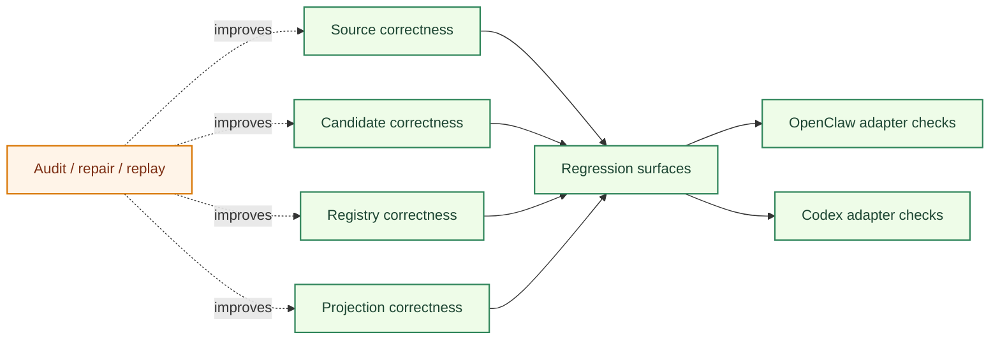

# System Architecture

[English](architecture.md) | [中文](architecture.zh-CN.md)

## 文档目的

这是当前仓库的顶层系统架构文档。

它描述的是最新的正式架构：

- `Unified Memory Core` 是产品级共享记忆底座
- `unified-memory-core` 是面向 OpenClaw 的 adapter 和消费层
- `Codex Adapter` 从第一天就是一等集成目标
- `memory search` 现在只是更大体系中的一个 workstream

这份文档主要回答：

- 现在整体系统到底是什么
- 哪些边界已经稳定
- 数据如何从 source 流到不同工具
- 当前仓库如何围绕产品 core 与 adapters 组织
- governance 和 testing 放在什么位置

相关文档：

- [README.md](README.md)
- [project-roadmap.md](project-roadmap.md)
- [unified-memory-core.md](docs/archive/unified-memory-core.md)
- [unified-memory-core-architecture.md](docs/archive/unified-memory-core-architecture.md)
- [self-learning-architecture.md](docs/workstreams/self-learning/architecture.md)
- [reports/memory-search-architecture.md](docs/workstreams/memory-search/architecture.md)

## 一图看懂

## 正式定位

当前正式架构可以概括成：

1. `Unified Memory Core` 是共享记忆产品
2. `unified-memory-core` 不再代表整个产品本体
3. `unified-memory-core` 负责 OpenClaw adapter 与 OpenClaw 专属消费层
4. `Codex Adapter` 是第一天就存在的一等架构目标
5. 产品逻辑和工具专属逻辑通过 adapter 分开

## 系统目标

整个体系的目标是把三件事做好：

1. 从可控 source 中构建受治理的记忆
2. 保持高可追踪、可修复、可回放能力
3. 在不把 core 绑死给单一工具的前提下，把稳定记忆投影给不同工具

## 从输入到输出的主链

## 稳定边界

### 1. Product boundary

`Unified Memory Core` 负责：

- source ingestion
- candidate generation
- artifact lifecycle
- decision trail
- exports
- governance controls

### 2. OpenClaw boundary

`unified-memory-core` 负责：

- OpenClaw 专属 retrieval policy
- OpenClaw 专属 context assembly
- OpenClaw 面向的 export consumption
- 通过 OpenClaw adapter 与 OpenClaw host 行为集成

### 3. Codex boundary

`Codex Adapter` 负责：

- 面向 Codex 的 code memory projection
- Codex 专属任务提示消费
- Codex write-back event 映射

## 模块栈

## OpenClaw 流程

## Codex 流程

## Memory Search 在哪里

`memory search` 很重要，但它已经不是顶层架构故事本身。

它现在的位置是：

- OpenClaw adapter 内部的一条 workstream
- consumption layer 的一个重点问题
- `unified-memory-core` 内部的一条治理与回归线

它不再定义整个共享记忆产品。

## Governance 与 Testing 在哪里

## 仓库方向

当前最新的仓库方向是：

- 用 `unified-memory-core-bootstrap` 保留旧的 adapter-bootstrap 形态
- 用 `main` 按正式 `Unified Memory Core` 产品方向继续推进
- 在深度实现前，优先把产品文档、模块文档和 adapter 文档对齐

## 文档地图

- 产品索引：
  [unified-memory-core.md](docs/archive/unified-memory-core.md)
- 产品架构：
  [unified-memory-core-architecture.md](docs/archive/unified-memory-core-architecture.md)
- 产品 roadmap：
  [unified-memory-core-roadmap.md](docs/archive/unified-memory-core-roadmap.md)
- OpenClaw code-memory 绑定：
  [code-memory-binding-architecture.md](docs/reference/code-memory-binding-architecture.md)
- self-learning workstream：
  [self-learning-architecture.md](docs/workstreams/self-learning/architecture.md)
- memory-search workstream：
  [reports/memory-search-architecture.md](docs/workstreams/memory-search/architecture.md)
