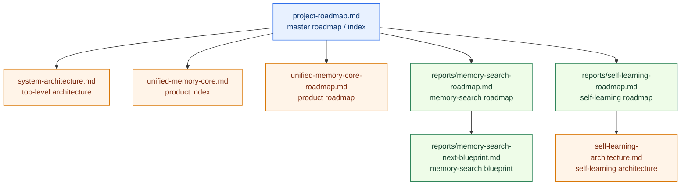
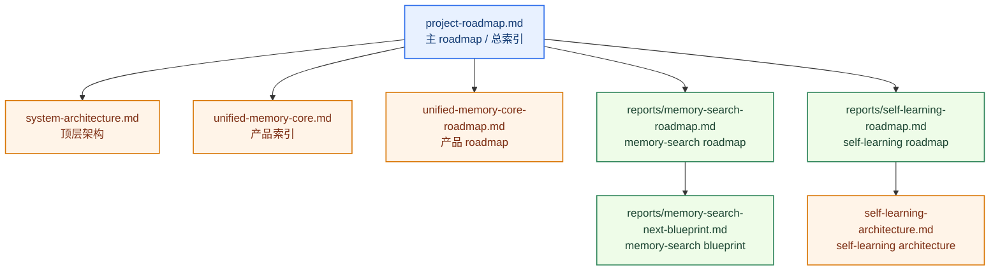

# Unified Memory Core Roadmap

[English](#english) | [中文](#中文)

## English

## Positioning

`unified-memory-core` is not meant to be “just another memory plugin.”

The target is a **continuously running, governed, fact-first long-term memory context layer** for OpenClaw.

The next learning subsystem has now been lifted into an official product direction.

That product is now officially named:

`Unified Memory Core`

One-line summary:

`Turn OpenClaw long memory into a governed, fact-first, task-ready context system.`

## What This Master Roadmap Does

`project-roadmap.md` is the master roadmap and document index.

It should make four things obvious:

1. what the project is trying to become
2. what has already been completed
3. what is currently active
4. what the next major workstreams are

It is not the place for every detailed phase plan.

Use specialized roadmap documents for that.

## Roadmap Stack

## Status Snapshot

### Overall

- Project status: `usable + governed + regression-protected`
- Architecture status: `core backbone complete`
- Governance status: `running as regular maintenance`
- Current regression baseline:
  - `critical smoke = 10/10`
  - `full smoke = 25/25`

### Workstream Status

| Workstream | Status | Current mode |
| --- | --- | --- |
| Core capture / fact-card / assembly | `completed` | maintain + tune |
| Memory search | `phase-complete` | governance + incremental expansion |
| Self-learning / reflection | `planning-updated` | architecture separation + phased implementation ready |
| Unified Memory Core | `phase-1-active` | product framing + master structure setup |

## Completed Foundation

The project foundation is already in place.

### 1. Capture foundation

Status: `completed`

Completed:

- session-memory consumption
- candidate distillation
- pre-compaction distillation
- raw session trace preservation

### 2. Fact/card foundation

Status: `completed`

Completed:

- fact sentence extraction
- `conversation-memory-cards.md/json`
- stable cards from `workspace/MEMORY.md`
- stable cards from `workspace/memory/YYYY-MM-DD.md`
- project cards from plugin docs / notes

### 3. Consumption foundation

Status: `completed with tuning`

Completed:

- cardArtifact consumption
- query rewrite
- heuristic rerank
- perf-critical fast path
- token-budget-aware assembly

Still tuning:

- optional LLM rerank evaluation

### 4. Regression foundation

Status: `active + strong`

Completed:

- smoke suite
- perf suite
- stable-facts regression
- hot-session regression framing

Current baseline:

- `critical smoke = 10/10`
- `full smoke = 25/25`

### 5. Governance foundation

Status: `running as regular maintenance`

Completed:

- confirmed vs pending separation
- pending export pipeline
- formal admission rules
- host workspace governance
- periodic cleanup tooling
- governance cycle
- duplicate audit
- conflict audit

Still ongoing:

- conflict handling refinement
- promotion of more stable facts into regression surfaces
- continued reduction of overlap between session-derived explanations and formal policy

## Current Focus

### Primary next engineering focus

**Self-Learning / Daily Reflection**

Why this is next:

- the main memory-context backbone is already complete
- memory-search hardening has moved into regular governance mode
- the next step is turning stable memory into a governed daily-learning system
- this subsystem now needs to be built with clear product boundaries instead of staying plugin-internal

Key documents:

- architecture:
  [self-learning-architecture.md](self-learning-architecture.md)
- roadmap:
  [reports/self-learning-roadmap.md](reports/self-learning-roadmap.md)
- product:
  [unified-memory-core.md](unified-memory-core.md)
- product roadmap:
  [unified-memory-core-roadmap.md](unified-memory-core-roadmap.md)

### Parallel maintenance focus

**Memory Search**

Current state:

- `Memory Search Workstream` phases A-E are complete
- it is now in:
  - regular governance
  - incremental case expansion
  - policy tuning when needed
  - blueprint-driven execution

Current governance quality:

- `pluginSignalHits = 6/6`
- `pluginSourceHits = 6/6`
- `pluginFailures = 0`
- `pluginSingleCard = 6/6`
- `pluginMultiCard = 0/6`
- `pluginNoisySupporting = 0/6`

Key documents:

- roadmap:
  [reports/memory-search-roadmap.md](reports/memory-search-roadmap.md)
- blueprint:
  [reports/memory-search-next-blueprint.md](reports/memory-search-next-blueprint.md)

## What Is Currently Planned

The next major project move is:

`grow the repo from a governed OpenClaw memory-context plugin into the product skeleton of Unified Memory Core plus first-class adapters`

Planned project stages:

1. finalize top-level product architecture and document chain
2. finalize module splits and module-level documentation
3. build Source / Registry / Adapter contracts first
4. keep self-learning as a workstream inside the new product shape
5. continue OpenClaw adapter hardening while starting Codex adapter design
6. add long-term audit, repair, comparison, and regression around product artifacts

## Architecture Direction

The long-term architecture is now best understood as:

- `Unified Memory Core` as the product-level memory foundation
- `unified-memory-core` as the OpenClaw adapter
- `Codex Adapter` as a first-class adapter track

Inside the product, the first-class modules are:

1. **Source System**
2. **Reflection System**
3. **Memory Registry**
4. **Projection System**
5. **Governance System**
6. **OpenClaw Adapter**
7. **Codex Adapter**

## Document Map

### Top-level documents

- [README.md](README.md)
- [system-architecture.md](system-architecture.md)
- [project-roadmap.md](project-roadmap.md)
- [self-learning-architecture.md](self-learning-architecture.md)
- [unified-memory-core.md](unified-memory-core.md)
- [unified-memory-core-roadmap.md](unified-memory-core-roadmap.md)

### Current workstream documents

- [reports/memory-search-architecture.md](reports/memory-search-architecture.md)
- [reports/memory-search-roadmap.md](reports/memory-search-roadmap.md)
- [reports/memory-search-next-blueprint.md](reports/memory-search-next-blueprint.md)
- [reports/self-learning-roadmap.md](reports/self-learning-roadmap.md)

## Read This Next

- If you want overall system shape:
  [system-architecture.md](system-architecture.md)
- If you want the product direction:
  [unified-memory-core.md](unified-memory-core.md)
- If you want the product-level roadmap:
  [unified-memory-core-roadmap.md](unified-memory-core-roadmap.md)
- If you want the self-learning workstream inside that product:
  [self-learning-architecture.md](self-learning-architecture.md)

## 中文

## 项目定位

`unified-memory-core` 不是“又一个记忆插件”。

它的目标是成为 OpenClaw 一层**持续运行、可治理、事实优先的长期记忆上下文层**。

下一步的 learning 子系统已经被提升为正式产品方向的一部分。

这个产品现在已经正式命名为：

`Unified Memory Core`

一句话总结：

`把 OpenClaw 的长期记忆，变成一层可治理、事实优先、可直接服务任务的上下文系统。`

## 这份主 Roadmap 负责什么

`project-roadmap.md` 是主 roadmap，也是文档总索引。

它应该让下面四件事一眼就能看明白：

1. 项目最终想做成什么
2. 当前已经完成了什么
3. 当前正在做什么
4. 下一条主线准备怎么推进

它不负责承载每个专题的全部 phase 细节。

专题细节放到各自的 roadmap 里维护。

## Roadmap 结构

## 当前状态快照

### 总体

- 项目状态：`可用 + 已治理 + 有回归保护`
- 架构状态：`主骨架已完成`
- 治理状态：`已进入常规维护循环`
- 当前回归基线：
  - `critical smoke = 10/10`
  - `full smoke = 25/25`

### Workstream 状态

| Workstream | 状态 | 当前模式 |
| --- | --- | --- |
| 核心 capture / fact-card / assembly | `completed` | maintain + tune |
| Memory Search | `phase-complete` | governance + incremental expansion |
| Self-Learning / Reflection | `planning-updated` | architecture separation + phased implementation ready |
| Unified Memory Core | `phase-1-active` | product framing + master structure setup |

## 已完成的项目基础

项目的基础层已经搭起来了。

### 1. Capture 基础层

状态：`completed`

已完成：

- session-memory 消费
- candidate distillation
- pre-compaction distillation
- 原始 session trace 保留

### 2. Fact/Card 基础层

状态：`completed`

已完成：

- fact 句提炼
- `conversation-memory-cards.md/json`
- 从 `workspace/MEMORY.md` 生成 stable cards
- 从 `workspace/memory/YYYY-MM-DD.md` 生成 stable cards
- 从插件文档 / notes 生成 project cards

### 3. Consumption 基础层

状态：`completed with tuning`

已完成：

- cardArtifact consumption
- query rewrite
- heuristic rerank
- perf-critical fast path
- token-budget-aware assembly

仍在微调：

- optional LLM rerank evaluation

### 4. Regression 基础层

状态：`active + strong`

已完成：

- smoke suite
- perf suite
- stable-facts regression
- hot-session regression 的真实边界说明

当前基线：

- `critical smoke = 10/10`
- `full smoke = 25/25`

### 5. Governance 基础层

状态：`running as regular maintenance`

已完成：

- confirmed vs pending 分层
- pending export pipeline
- formal admission rules
- host workspace governance
- 周期性清理工具
- governance cycle
- duplicate audit
- conflict audit

仍在持续：

- conflict handling refinement
- 把更多稳定事实升进回归保护面
- 继续减少 session-derived explanations 与 formal policy 的重叠

## 当前焦点

### 下一条主要工程主线

**Self-Learning / Daily Reflection**

为什么现在切到这条线：

- 记忆上下文主骨架已经完成
- memory-search 补强已经进入常规治理模式
- 下一步应该把稳定记忆继续收成“受治理的每日学习系统”
- 这条线现在需要按“独立产品边界”来设计，而不是继续混在插件内部

关键文档：

- 架构：
  [self-learning-architecture.md](self-learning-architecture.md)
- roadmap：
  [reports/self-learning-roadmap.md](reports/self-learning-roadmap.md)
- 产品：
  [unified-memory-core.md](unified-memory-core.md)
- 产品 roadmap：
  [unified-memory-core-roadmap.md](unified-memory-core-roadmap.md)

### 并行维护主线

**Memory Search**

当前状态：

- `Memory Search Workstream` 的 Phase A-E 已完成
- 现在已进入：
  - 常规治理
  - 增量 case 扩充
  - 按需 policy 调整
  - blueprint 驱动执行

当前治理质量：

- `pluginSignalHits = 6/6`
- `pluginSourceHits = 6/6`
- `pluginFailures = 0`
- `pluginSingleCard = 6/6`
- `pluginMultiCard = 0/6`
- `pluginNoisySupporting = 0/6`

关键文档：

- roadmap：
  [reports/memory-search-roadmap.md](reports/memory-search-roadmap.md)
- blueprint：
  [reports/memory-search-next-blueprint.md](reports/memory-search-next-blueprint.md)

## 当前已经计划好的下一阶段

项目下一步的大方向是：

`把 unified-memory-core 从“可治理的事实优先上下文层”，继续推进成“可治理的自学习与反思系统”`

当前计划中的阶段是：

1. 定稿顶层产品架构和文档链路
2. 定稿模块拆分和模块级文档
3. 先做 Source / Registry / Adapter contracts
4. 让 self-learning 作为新产品形态中的一条 workstream 继续推进
5. 一边继续加固 OpenClaw adapter，一边启动 Codex adapter 设计
6. 为产品级 artifacts 补 audit、repair、对比和回归保护

## 架构方向

当前更适合把整体架构理解为：

- `Unified Memory Core` 产品层
- `unified-memory-core` 作为 OpenClaw adapter
- `Codex Adapter` 作为一等 adapter

在产品内部，建议按 7 条一等模块组织：

1. **Source System**
2. **Reflection System**
3. **Memory Registry**
4. **Projection System**
5. **Governance System**
6. **OpenClaw Adapter**
7. **Codex Adapter**

## 文档地图

### 顶层文档

- [README.md](README.md)
- [system-architecture.md](system-architecture.md)
- [project-roadmap.md](project-roadmap.md)
- [self-learning-architecture.md](self-learning-architecture.md)
- [unified-memory-core.md](unified-memory-core.md)
- [unified-memory-core-roadmap.md](unified-memory-core-roadmap.md)

### 当前专题文档

- [reports/memory-search-architecture.md](reports/memory-search-architecture.md)
- [reports/memory-search-roadmap.md](reports/memory-search-roadmap.md)
- [reports/memory-search-next-blueprint.md](reports/memory-search-next-blueprint.md)
- [reports/self-learning-roadmap.md](reports/self-learning-roadmap.md)
- [unified-memory-core.md](unified-memory-core.md)
- [unified-memory-core-roadmap.md](unified-memory-core-roadmap.md)

## 建议接着读

- 如果想看整体系统形态：
  [system-architecture.md](system-architecture.md)
- 如果想看新的产品主线：
  [unified-memory-core.md](unified-memory-core.md)
- 如果想看产品级 roadmap：
  [unified-memory-core-roadmap.md](unified-memory-core-roadmap.md)
- 如果想看下一条主线的架构设计：
  [self-learning-architecture.md](self-learning-architecture.md)
- 如果想看接下来怎么分阶段开发：
  [reports/self-learning-roadmap.md](reports/self-learning-roadmap.md)
