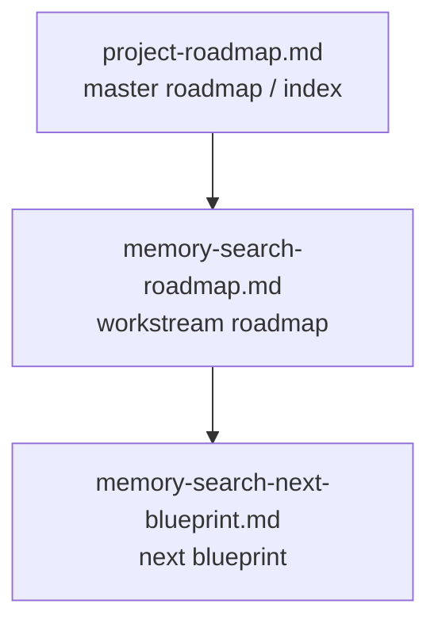
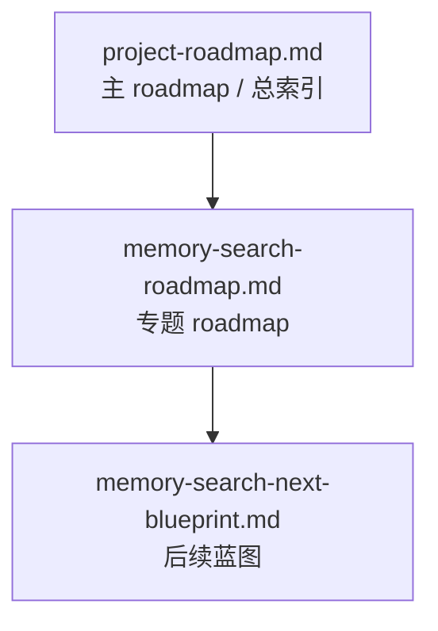
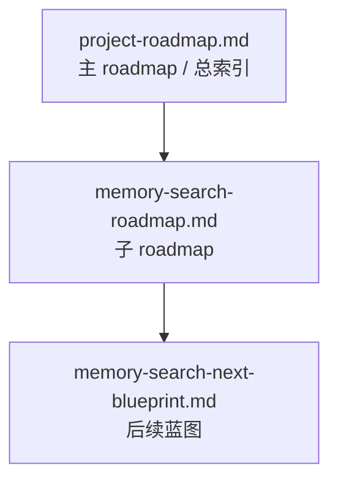

# Memory Context Claw Roadmap

[English](#english) | [中文](#中文)

## English

## Final Target

`memory-context-claw` is not meant to be “just another memory plugin.” The target is a **continuously running, governed, fact-first memory context layer** for OpenClaw.

It should:

1. Continuously capture valuable facts, rules, background, and project information from real conversations.
2. Distill those into stable, retrievable `fact/card` artifacts instead of pushing raw conversation directly into long-term memory.
3. Keep confirmed facts, pending candidates, and runtime noise clearly separated.
4. Prefer stable facts in real queries so key questions use fast paths instead of always depending on heavyweight search.
5. Stay regression-protected with smoke / perf / hot-session checks.
6. Treat memory governance as regular maintenance rather than a one-off cleanup.
7. Distinguish real regressions from hot-session/tooling contamination.

One-line summary:

`Turn OpenClaw long memory into a governed, fact-first, task-ready context layer.`

## Status Snapshot

### Overall

- Project status: `usable + governed + regression-protected`
- Governance status: `running as a regular maintenance loop`
- Current engineering focus: `Memory Search`
- Current regression baseline:
  - `critical smoke = 10/10`
  - `full smoke = 19/19`

### Memory Search Status

- OpenClaw builtin `memory_search`: **not fixed**
  - We did not patch the host
  - We did not replace the host algorithm
  - Short Chinese queries and some session-memory shapes are still host-side weaknesses

- `memory-context-claw`: **plugin-side compensation is in place**
  - done:
    - `cardArtifact fast path`
    - fact-first retrieval
    - stable rule / identity / preference / project / routing priority
    - millisecond-level perf for critical queries
  - not done:
    - full root-cause repair of builtin `memory_search` without host changes

## Roadmap Management

This repo now uses three roadmap layers:

### 1. `project-roadmap.md`

The **master roadmap / index**.

It is responsible for:

- final target
- global phases
- current focus
- workstream status
- links to deeper documents

It is not responsible for:

- full detail for every specialized workstream

Related top-level architecture document:

- [system-architecture.md](system-architecture.md)

### 2. Workstream roadmaps

Use these when one topic becomes large enough to need its own:

- phases
- cases
- baselines
- governance rules

Current workstream roadmap:

- [memory-search-roadmap.md](reports/memory-search-roadmap.md)

### 3. Blueprints

Use these when a workstream phase-plan is already complete, but the topic still needs ongoing:

- optimization
- expansion
- maintenance

Current blueprint:

- [memory-search-next-blueprint.md](reports/memory-search-next-blueprint.md)

### Recommended management model

## Positioning

`memory-context-claw` is an OpenClaw `context engine` plugin.

It does:

- plugin-layer recall policy
- fact/card distillation
- context assembly
- memory governance

It does not:

- replace builtin OpenClaw memory
- patch the host
- patch other plugins

## Architecture Direction

The architecture stays organized into four layers:

1. **Capture**
   - collect candidates from sessions, `workspace/memory/*.md`, `workspace/MEMORY.md`, and intermediate artifacts

2. **Fact/Card**
   - distill raw text into stable facts, rules, background, and project cards

3. **Consumption**
   - route suitable questions into `cardArtifact`
   - keep retrieval, rerank, and assembly stable and fast

4. **Governance**
   - separate formal memory, pending items, and noise
   - periodically audit / clean the formal layer
   - promote stable facts into regression protection

## Global Phases

### Phase 1: Capture Foundation

Status: `done / maintain`

Done:

- session-memory consumption
- candidate distillation
- pre-compaction distillation
- raw session log preservation

### Phase 2: Fact/Card Layer

Status: `done / maintain`

Done:

- fact sentence extraction
- `conversation-memory-cards.md/json`
- stable cards from `workspace/MEMORY.md`
- stable cards from `workspace/memory/YYYY-MM-DD.md`
- project cards from plugin docs

### Phase 3: Consumption Layer

Status: `done / tune`

Done:

- cardArtifact consumption
- query rewrite
- heuristic rerank
- perf-critical fast path
- token-budget-aware assembly

Still tuning:

- optional LLM rerank evaluation

### Phase 4: Regression Layer

Status: `active / strong`

Done:

- smoke suite
- perf suite
- stable-facts regression
- honest hot-session regression framing

Current baseline:

- `critical smoke = 10/10`
- `full smoke = 19/19`

### Phase 5: Governance Layer

Status: `running as regular maintenance`

Done:

- confirmed vs pending separation
- pending export pipeline
- formal admission rules
- host workspace governance
- periodic cleanup tooling
- governance cycle
- duplicate audit
- conflict audit

Still ongoing:

- conflict handling refinement
- promotion of more stable facts into regression surfaces
- reducing remaining overlap between session-derived rule explanations and formal policy

## Current Focus

### Primary engineering focus

**Memory Search**

Workstream documents:

- roadmap:
  [memory-search-roadmap.md](reports/memory-search-roadmap.md)
- next blueprint:
  [memory-search-next-blueprint.md](reports/memory-search-next-blueprint.md)

### Current state

- `Memory Search Workstream` phases A-E are complete
- it is now in:
  - regular governance
  - incremental case expansion
  - policy tuning when needed
  - blueprint-driven execution

## Related Architecture Docs

- overall architecture:
  [system-architecture.md](system-architecture.md)
- memory-search architecture:
  [memory-search-architecture.md](reports/memory-search-architecture.md)
- orchestration vs tool-agent comparison:
  [memory-search-orchestration-vs-tool-agent.md](reports/memory-search-orchestration-vs-tool-agent.md)

## 中文

## 最终目标

`memory-context-claw` 不是“又一个记忆插件”，而是要做成一层**持续运行、可治理、事实优先的长期记忆上下文层**。

它应该能够：

1. 持续从真实对话中抓取有价值的事实、规则、背景和项目信息。
2. 把这些内容提炼成稳定、可检索的 `fact/card` 工件，而不是把原始对话直接塞进长期记忆。
3. 清楚地区分 confirmed facts、pending candidates 和 runtime noise。
4. 在真实查询里优先消费稳定事实，让关键问题尽量走快路径，而不是每次都依赖重量级 search。
5. 用 smoke / perf / hot-session 检查持续保护回归。
6. 把记忆治理当成常规维护，而不是一次性清库。
7. 能区分真正的功能退化，和 hot-session / 工具链污染。

一句话总结：

`把 OpenClaw 的长期记忆，变成一层可治理、事实优先、可直接服务任务的上下文系统。`

## 当前状态快照

### 总体

- 项目状态：`可用 + 已治理 + 有回归保护`
- 治理状态：`已进入常规维护循环`
- 当前工程主焦点：`Memory Search`
- 当前回归基线：
  - `critical smoke = 10/10`
  - `full smoke = 19/19`

### Memory Search 状态

- OpenClaw 内置 `memory_search`：**没有被修好**
  - 我们没有改宿主
  - 我们没有替换宿主算法
  - 中文短 query 和某些 session-memory 形态，仍然是宿主侧弱点

- `memory-context-claw`：**插件层补强已经到位**
  - 已完成：
    - `cardArtifact fast path`
    - fact-first retrieval
    - 稳定规则 / 身份 / 偏好 / 项目 / 路由优先
    - 关键查询的毫秒级性能
  - 未完成：
    - 在不改宿主前提下，从根上修掉 builtin `memory_search`

## Roadmap 管理方式

这个仓库现在用三层 roadmap 管理：

### 1. `project-roadmap.md`

这是**主 roadmap / 总索引**。

负责：

- 最终目标
- 全局阶段
- 当前焦点
- workstream 状态
- 深入文档入口

不负责：

- 每个专题 workstream 的全部细节

相关的顶层架构文档：

- [system-architecture.md](system-architecture.md)

### 2. Workstream roadmaps

当某个专题足够大时，单独拆出来维护：

- phase
- case 集
- baseline
- governance 规则

当前 workstream roadmap：

- [memory-search-roadmap.md](reports/memory-search-roadmap.md)

### 3. Blueprints

当某个 workstream 的 phase 已经做完，但后面还要持续：

- 优化
- 扩面
- 维护

就用 blueprint 承接。

当前 blueprint：

- [memory-search-next-blueprint.md](reports/memory-search-next-blueprint.md)

### 推荐的管理模型

## 定位

`memory-context-claw` 是一个 OpenClaw `context engine` 插件。

它负责：

- 插件层 recall policy
- fact/card 提炼
- context assembly
- memory governance

它不负责：

- 替换 OpenClaw builtin memory
- 修改宿主
- 修改其他插件

## 架构方向

整体架构保持四层：

1. **Capture**
   - 从 sessions、`workspace/memory/*.md`、`workspace/MEMORY.md` 和中间工件中收集候选

2. **Fact/Card**
   - 把原始文本提炼成稳定事实、规则、背景和项目 card

3. **Consumption**
   - 把适合的问题路由进 `cardArtifact`
   - 让 retrieval、rerank 和 assembly 更稳定、更快

4. **Governance**
   - 区分 formal memory、pending items 和 noise
   - 周期性巡检 / 清理正式层
   - 把稳定事实升格进回归保护面

## 全局阶段

### Phase 1: Capture Foundation

状态：`done / maintain`

已完成：

- session-memory 消费
- candidate distillation
- pre-compaction distillation
- 原始 session log 保留

### Phase 2: Fact/Card Layer

状态：`done / maintain`

已完成：

- fact 句提炼
- `conversation-memory-cards.md/json`
- 从 `workspace/MEMORY.md` 生成 stable card
- 从 `workspace/memory/YYYY-MM-DD.md` 生成 stable card
- 从项目文档生成 project card

### Phase 3: Consumption Layer

状态：`done / tune`

已完成：

- cardArtifact consumption
- query rewrite
- heuristic rerank
- perf-critical fast path
- token-budget-aware assembly

仍在微调：

- optional LLM rerank evaluation

### Phase 4: Regression Layer

状态：`active / strong`

已完成：

- smoke suite
- perf suite
- stable-facts regression
- 对 hot-session regression 的真实边界说明

当前基线：

- `critical smoke = 10/10`
- `full smoke = 19/19`

### Phase 5: Governance Layer

状态：`running as regular maintenance`

已完成：

- confirmed vs pending 分层
- pending export pipeline
- 正式层准入规则
- 宿主 workspace 治理
- 周期性清理工具
- governance cycle
- duplicate audit
- conflict audit

仍在持续：

- conflict handling refinement
- 把更多稳定事实升进回归面
- 继续减少 session-derived 规则解释与 formal policy 的重叠

## 当前主焦点

### 主要工程焦点

**Memory Search**

相关文档：

- roadmap：
  [memory-search-roadmap.md](reports/memory-search-roadmap.md)
- next blueprint：
  [memory-search-next-blueprint.md](reports/memory-search-next-blueprint.md)

### 当前状态

- `Memory Search Workstream` 的 Phase A-E 已全部完成
- 现在已进入：
  - 常规治理
  - 增量 case 扩充
  - 按需 policy 调整
  - blueprint 驱动执行

## 相关架构文档

- 总体架构：
  [system-architecture.md](system-architecture.md)
- memory-search 专项架构：
  [memory-search-architecture.md](reports/memory-search-architecture.md)
- 固定编排 vs 工具调度对比：
  [memory-search-orchestration-vs-tool-agent.md](reports/memory-search-orchestration-vs-tool-agent.md)

### Immediate priorities

1. Continue reducing the memory-search watchlist
2. Keep expanding stable facts / stable rules into regression protection
3. Improve governance and reporting ergonomics
4. Keep governance-cycle running without letting it dominate engineering focus

## Suggested GitHub Description

Long:

`Memory-first context assembly for OpenClaw. Improve long-memory recall, fact extraction, reranking, governance, and context packing without replacing OpenClaw's built-in memory.`

Short:

`An OpenClaw context-engine plugin for governed, fact-first memory context assembly.`

---

## 中文

## 最终目标

`memory-context-claw` 的目标不是“再做一个记忆插件”，而是做成一层 **持续运行、可治理、事实优先消费的长期记忆上下文层**。

它最终应该做到：

1. 能从真实对话中持续抓取用户事实、规则、背景、项目信息。
2. 能把这些信息提炼成稳定、干净、可检索的 `fact/card`，而不是把原始对话直接塞进长期记忆。
3. 能把已确认事实、待确认候选、运行噪音明确分层。
4. 能在真实查询里优先消费稳定事实层，让关键问题走快路径，而不是总依赖重检索。
5. 能通过 smoke / perf / hot-session 等回归持续验证系统是否退化。
6. 能把数据治理变成常规任务，而不是一次性清库。
7. 能明确区分“真实功能退化”和“热会话 / 工具链污染”。

一句话：

`把 OpenClaw 的长期记忆，变成一层可治理、事实优先、随时可用于当前任务的上下文层。`

## 状态快照

### 总体状态

- 项目状态：`usable + governed + regression-protected`
- 治理状态：`已进入常规维护循环`
- 当前工程焦点：`Memory Search`
- 当前回归基线：
  - `critical smoke = 10/10`
  - `full smoke = 19/19`

### Memory Search 状态

- OpenClaw 内置 `memory_search`：**没有被修好**
  - 我们没有魔改宿主
  - 也没有替换宿主内部算法
  - 中文短 query 和某些 session-memory 形态仍然是宿主层弱点

- `memory-context-claw`：**插件层补强已经完成**
  - 已完成：
    - `cardArtifact fast path`
    - fact-first retrieval
    - 稳定规则 / 身份 / 偏好 / 项目 / 路由优先
    - 关键查询毫秒级返回
  - 未完成：
    - 在不改宿主前提下，从根上修掉 builtin `memory_search` 缺口

## Roadmap 管理方式

现在这套项目用 3 层文档来管理 roadmap：

### 1. `project-roadmap.md`

这是**主 roadmap / 总索引**。

它负责：

- 讲项目最终目标
- 讲全局阶段
- 讲当前主焦点
- 讲各 workstream 状态
- 给出更细文档入口

它不负责：

- 展开每一条复杂专题的全部细节

### 2. workstream 子 roadmap

当某一条线已经复杂到需要单独管理时，拆成子 roadmap。

当前子 roadmap：

- [memory-search-roadmap.md](reports/memory-search-roadmap.md)

它负责：

- 管理 `memory-search` 自己的 phase
- 管理专项 case、baseline、治理方式

### 3. blueprint 文档

当某条 workstream 的 phase 已经做完，但后面还有持续优化、扩面、维护时，用 blueprint 接后续。

当前 blueprint：

- [memory-search-next-blueprint.md](reports/memory-search-next-blueprint.md)

它负责：

- 讲后续开发任务
- 讲推荐顺序
- 讲下一步主攻点

### 当前推荐关系

一句话：

- **主 roadmap 放在 `project-roadmap.md`**
- **复杂专题拆成子 roadmap**
- **phase 做完后，用 blueprint 接持续工作**

## 项目定位

`memory-context-claw` 是一个 OpenClaw 的 `context engine` 插件。

它做的是：

- 插件层 recall policy
- fact/card 提炼
- context assembly
- memory governance

它不做：

- 替代 OpenClaw 内置 memory
- 魔改宿主
- 魔改其他插件

## 架构方向

整体架构仍然围绕 4 层：

1. **Capture**
   - 从 sessions、`workspace/memory/*.md`、`workspace/MEMORY.md`、中间工件抓候选信息

2. **Fact/Card**
   - 把原始文本提炼成主体事实、规则、背景、项目 card

3. **Consumption**
   - 让合适的问题优先走 `cardArtifact`
   - 把 retrieval、rerank、assembly 控制在稳定且足够快的范围内

4. **Governance**
   - 区分正式记忆、待确认项、噪音
   - 定期巡检 / 清理正式层
   - 把稳定事实持续升级进回归保护面

## 全局阶段

### Phase 1：Capture Foundation

状态：`done / maintain`

已完成：

- session-memory 消费
- 候选记忆提炼
- pre-compaction distillation
- 原始 session log 保留

### Phase 2：Fact/Card Layer

状态：`done / maintain`

已完成：

- 主体事实句提炼
- `conversation-memory-cards.md/json`
- stable cards from `workspace/MEMORY.md`
- stable cards from `workspace/memory/YYYY-MM-DD.md`
- project cards from plugin docs

### Phase 3：Consumption Layer

状态：`done / tune`

已完成：

- cardArtifact consumption
- query rewrite
- heuristic rerank
- perf-critical fast path
- token-budget-aware assembly

仍在微调：

- optional LLM rerank 的长期效果评估

### Phase 4：Regression Layer

状态：`active / strong`

已完成：

- smoke suite
- perf suite
- stable-facts regression
- hot-session regression 诚实化

当前结果：

- `critical smoke = 10/10`
- `full smoke = 19/19`

### Phase 5：Governance Layer

状态：`已进入常规维护`

已完成：

- confirmed vs pending separation
- pending export pipeline
- formal admission rules
- host workspace governance
- periodic cleanup tooling
- governance cycle
- duplicate audit
- conflict audit

仍在持续：

- 冲突治理细化
- 更多稳定事实升格进回归面
- 继续压缩 session-derived 规则解释与正式 policy 的重叠

## 当前焦点

### 当前主工程焦点

**Memory Search**

相关文档入口：

- 子 roadmap：
  [memory-search-roadmap.md](reports/memory-search-roadmap.md)
- 后续蓝图：
  [memory-search-next-blueprint.md](reports/memory-search-next-blueprint.md)

### 当前状态

- `Memory Search Workstream` 的 Phase A-E 已全部完成
- 后续不再按 phase 往下拆，而是进入：
  - 常规治理
  - 增量 case 扩充
  - 必要时的 policy 微调
  - 按 blueprint 持续推进

### 当前最重要的事

1. 继续压低 memory-search watchlist
2. 持续把新稳定事实 / 规则纳入回归保护面
3. 继续优化治理和报告体验
4. 保持 governance-cycle 持续运行，但不再让它抢占主工程焦点
