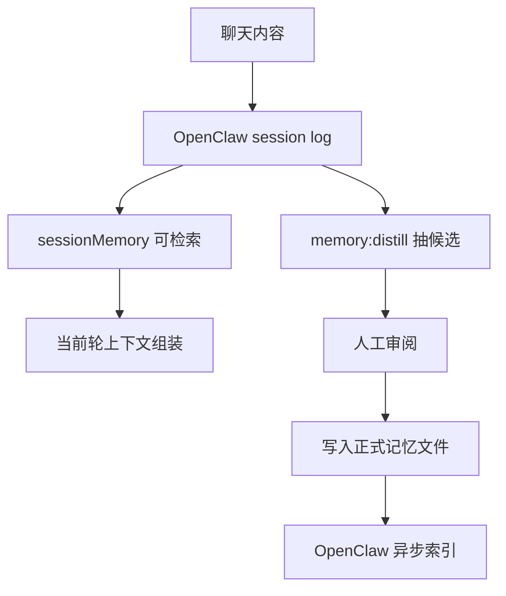

# 对话记忆沉淀现状

## 问题是什么

真实聊天里经常会出现重要信息，例如：

- 用户偏好
- 长期工作规则
- 项目阶段结论
- 临时但后面还会反复用到的事实

这些信息如果只停留在 session transcript 里，就会出现两个问题：

1. 当前轮能用，不等于以后还稳定能用
2. 会话历史存在，不等于已经变成正式长期记忆

---

## 今天已经做了什么

### 1. 已打开 session memory

`main` agent 现在已经启用：

```json5
memorySearch: {
  sources: ["memory", "sessions"],
  experimental: {
    sessionMemory: true
  }
}
```

这意味着：

- 正式记忆文件继续来自 `MEMORY.md`、`memory/*.md`、`extraPaths`
- `main` 的 session transcript 也开始进入 Memory 的扫描范围

### 2. 已补上对话候选记忆提炼

仓库里新增了：

```bash
npm run memory:distill
```

它会从最近的 `main` agent 会话中提炼：

- 建议进入 `MEMORY.md` 的长期规则候选
- 建议进入 `memory/YYYY-MM-DD.md` 的每日记忆候选

输出文件：

- [conversation-memory-candidates.md](conversation-memory-candidates.md)

### 3. 已补说明文档

工作原理和完整链路说明在：

- [how-memory-context-claw-works.md](how-memory-context-claw-works.md)

---

## 现在的真实状态

### 已经成立的部分

- `main` 的 `sessionMemory` 已开启
- `sessions` 不只是进入扫描范围，而且已经真实写入主 Memory 索引库
  - 当前实测：`sessions = 110 files / 3952 chunks`
- 候选记忆提炼工具已可用
- 候选报告已能生成

### 还没完全闭环的部分

- 新追加到当前 session 的消息，进入索引库存在刷新延迟
  - 实测中，当前活跃 session 文件已经在 `files` 表里
  - 但最新追加的探针消息还没有进入 `chunks`
  - 说明“旧 session 入库”已经成立，“当前活跃 session 的最新增量何时刷新入库”还要继续验证
- 候选提炼第一版已经能跑，但还需要继续减少噪音、提高“长期规则”提取质量
- 目前最稳的长期沉淀方式，仍然是：
  - 先生成候选
  - 再审阅
  - 最后写入 `MEMORY.md` 或 `memory/YYYY-MM-DD.md`

---

## 目前最合理的链路



一句话：

> 先让对话内容变得可检索，再把真正重要的部分提炼并沉淀成正式长期记忆。

---

## 接下来最值得继续做的事

1. 继续验证“当前活跃 session 的最新消息”写入主索引库的时机和触发条件。
2. 提升 `memory:distill` 的提炼质量，让它更少抓到动作回执和工程噪音。
3. 设计“候选记忆 -> 审阅 -> 写入正式记忆文件”的半自动流程，而不是直接把整段对话自动入库。
