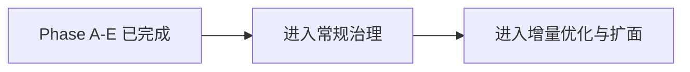
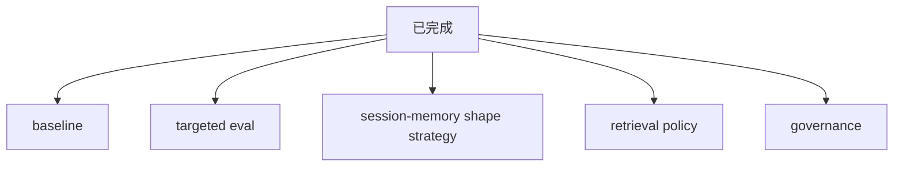
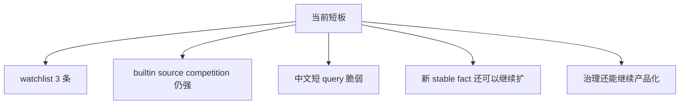
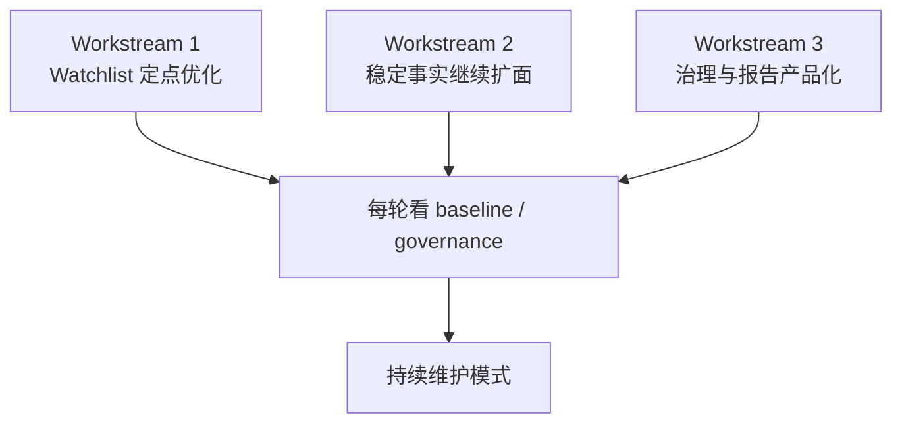

# Memory Search Next Blueprint

## 为什么单独写这份文档

`memory-search` 的 Phase A-E 已经做完。

接下来不再是“继续补 phase”，而是进入：

- 持续优化
- 增量扩面
- 常规治理

所以后面的工作更适合用一份**蓝图文档**来推进，而不是继续沿用原来的 phase roadmap。

---

## 命名建议

### 推荐做法

优先使用**语义化稳定命名**，不要把主文档直接按日期命名。

推荐主文件名：

- `memory-search-next-blueprint.md`

原因：

1. 这是长期主文档，不是一次性快照
2. 后面会持续更新，语义名更容易引用
3. roadmap / todo / testsuite 里挂链接更稳定

### 日期命名适合什么

日期命名更适合：

- 一次性调查报告
- 单轮实验记录
- 某次基线快照

例如：

- `memory-search-governance-2026-04-05.md`
- `memory-search-baseline-report.md`

### 最终建议

后面采用这套：

- **长期主文档**：语义名
- **单次报告 / 快照**：日期名

---

## 当前状态一句话

一句话总结：

**memory-search 现在已经不是“要不要做”的问题，而是“按什么蓝图持续做”的问题。**

---

## 当前我们已经有什么

### 已经完成的层

已经具备：

- 专项 case 集
- baseline 报告
- `session-memory` 双格式策略
- retrieval policy 统一入口
- governance 入口
- watchlist

### 当前真实短板

---

## 后续工作总图

---

## Workstream 1：Watchlist 定点优化

## 要解决的问题

当前 watchlist 里仍有 3 条：

1. `food-preference-recall`
2. `short-chinese-token`
3. `session-memory-source-competition`

这些问题代表：

- builtin `memory_search` 仍然不稳定
- plugin 层虽然已经兜住一部分，但还没全部收口

## 目标

把 watchlist 从“已知问题列表”变成“逐条消灭”的工程面。

## 拆解任务

### 1. `short-chinese-token`

目标：

- 搞清楚短 query 下，为什么 signal 和 source 都不稳

重点看：

- `牛排 刘超` 这类 query 为什么会串到身份 card
- 当前 intent 分类是否过于宽泛
- 是否需要更细的 token/slot 规则

### 2. `session-memory-source-competition`

目标：

- 搞清楚为什么 `memory/%` / raw summary 在 source competition 下几乎永远输给 `sessions/%`

重点看：

- builtin 返回的 top-N source 分布
- plugin 为什么能兜住 fact，但仍没把原始 `memory/%` 拉成优先 source

### 3. `food-preference-recall`

目标：

- 把“能答对，但 signal/source 还不够理想”的 case 收得更稳

重点看：

- case 的 expectedSignals 是否应进一步区分“必须命中”与“可选增强”
- plugin top1 已经对时，baseline 怎么更合理反映真实效果

## 完成标准

- watchlist 至少减少一半
- 或明确把其中部分改成“合理例外”，不再反复误报

---

## Workstream 2：稳定事实继续扩面

## 要解决的问题

现在很多高价值事实已经进入稳定层，但还有一些长期信息还没被系统性纳入。

## 目标

继续扩稳定事实 / 稳定规则，使它们：

- 进入 stable card
- 进入 smoke
- 必要时进入 perf / hot-session 健康检查

## 候选方向

### 1. 更多个人长期背景

例如：

- 长期工作方式
- 更多稳定偏好
- 生活节律 / 时间习惯

### 2. 更多系统分工 / Agent 边界

例如：

- 其他 Agent 的边界规则
- 工具分工的负边界

### 3. 更多项目长期定位

例如：

- 项目之间的角色关系
- 长期路线判断

## 完成标准

- 新增一批 stable card
- 新增一批 smoke case
- 保持 `smoke` 和 `governance` 不退化

---

## Workstream 3：治理与报告产品化

## 要解决的问题

现在治理已经能跑，但对人类维护来说还可以更顺。

## 目标

把治理从“工程脚本集合”推进成“更好读、更好用的维护面板”。

## 拆解任务

### 1. watchlist 趋势化

目标：

- 不只看当前有几条
- 还要能看：
  - 比上一轮变好还是变坏
  - 新增了什么
  - 消掉了什么

### 2. baseline 对比报告

目标：

- 支持“当前 vs 上一版”
- 让优化成效更容易看见

### 3. case 升级规则

目标：

- 新 stable fact 出现后，明确判断：
  - 是否进入 smoke
  - 是否进入 perf
  - 是否进入 hot-session health check

## 完成标准

- watchlist / baseline / case 升级规则更清晰
- 治理成本继续下降

---

## 推荐执行顺序

推荐顺序：

1. 先做 `Watchlist 定点优化`
2. 再做 `稳定事实继续扩面`
3. 最后做 `治理与报告产品化`

原因：

- watchlist 是当前最真实的痛点
- 稳定事实扩面会持续产出价值
- 治理产品化更适合在前两者稍稳后再做

---

## 当前建议的下一步

如果接下来直接继续开发，我建议从这里开始：

### 第一优先级

- `short-chinese-token`
- `session-memory-source-competition`

### 第二优先级

- `food-preference-recall`

### 第三优先级

- 新增下一批 stable fact / rule case

---

## 后续执行原则

后面每次继续开发时，默认按这份蓝图走：

1. 先看当前 watchlist
2. 再决定本轮打哪一条
3. 改完后跑：
   - `eval:memory-search:cases`
   - `eval:memory-search:governance`
   - 必要时 `smoke:eval`
4. 把结果记进：
   - `development-journal.md`
   - `investigation-todo.md`

---

## 一句话收口

**从现在开始，memory-search 后续工作不再靠临时讨论推进，而是按这份 blueprint 逐步做。**
