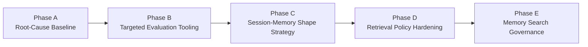
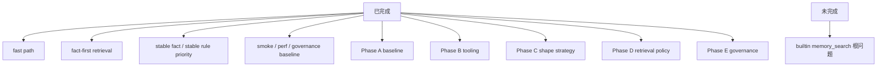
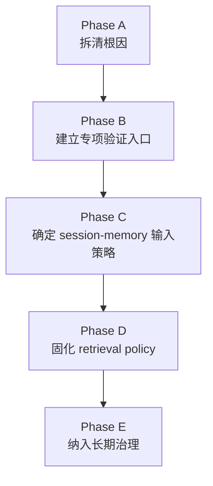
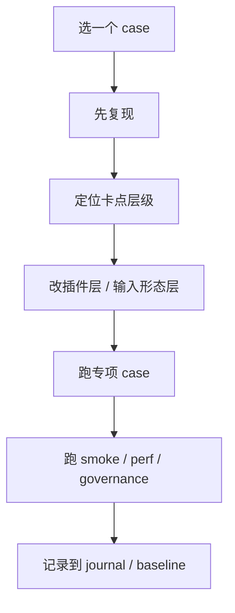

# Memory Search Roadmap

## 文档目的

这份文档单独定义 `memory search` 这条线后续怎么开发。

后续这条线不再按“想到哪修到哪”推进，而是：

- 按阶段
- 按专项 case 集
- 按验证结果

逐步推进。

相关配套文档：

- 架构与问题说明：
  [memory-search-architecture.md](/Users/redcreen/Project/长记忆/context-assembly-claw/reports/memory-search-architecture.md)
- 工作流说明：
  [memory-search-workstream.md](/Users/redcreen/Project/长记忆/context-assembly-claw/reports/memory-search-workstream.md)
- 专项 case：
  [memory-search-cases.json](/Users/redcreen/Project/长记忆/context-assembly-claw/evals/memory-search-cases.json)
- baseline 报告：
  [memory-search-baseline-report.md](/Users/redcreen/Project/长记忆/context-assembly-claw/reports/memory-search-baseline-report.md)
- session-memory 形态策略：
  [session-memory-shape-strategy.md](/Users/redcreen/Project/长记忆/context-assembly-claw/reports/session-memory-shape-strategy.md)
- retrieval policy：
  [retrieval-policy.md](/Users/redcreen/Project/长记忆/context-assembly-claw/reports/retrieval-policy.md)
- governance：
  [memory-search-governance.md](/Users/redcreen/Project/长记忆/context-assembly-claw/reports/memory-search-governance.md)
- 后续蓝图：
  [memory-search-next-blueprint.md](/Users/redcreen/Project/长记忆/context-assembly-claw/reports/memory-search-next-blueprint.md)

## roadmap 总览图

---

## 当前状态

### 当前状态图

### 已完成

- 插件层 fast path
- fact-first retrieval
- stable fact / stable rule priority
- 关键 smoke / perf / governance 基线
- memory-search workstream 文档与 case 集
- `eval:memory-search:cases` 专项脚本
- builtin vs plugin 并排 baseline 报告
- session-memory 双格式 / shape strategy 文档
- retrieval policy 文档与统一入口
- memory-search governance 文档与治理入口

### 未完成

- 宿主 builtin `memory_search` 根问题仍未收口

### 当前工作状态

- `Memory Search Workstream` 的 Phase A-E 已全部完成
- 后续不再按 phase 继续拆开发，而是进入：
  - 常规治理
  - 增量 case 扩充
  - 必要时的 policy 微调
  - 按 blueprint 持续推进

---

## 开发原则

1. 不魔改 OpenClaw 宿主
2. 不魔改别的插件
3. 不把插件层补强说成“宿主内核已修好”
4. 每一阶段都要有对应的 case 和验证
5. 优先做可观测、可解释、可复现的推进
6. 默认不增加 LLM 调用
7. 如需 LLM，只允许单次、可配置、可关闭

---

## 阶段拆解

### 阶段推进图

## Phase A. Root-Cause Baseline

### 目标

把 `memory search` 根问题拆成稳定、可复现的实验面。

### 要做的事

1. 固化专项 case 集
2. 给每个 case 标：
   - query
   - expected signals
   - expected sources
   - known risk
3. 梳理现有实验结果：
   - 参数实验
   - source competition
   - FTS/tokenizer 限制
   - session-memory 文件形态问题

### 完成标准

- case 集足够覆盖当前已知主问题
- 每个 case 都有统一描述
- 不再只靠“牛排”单点说问题

### 当前状态

- `done`

已完成：

- 已有专项 case 集
- 已有统一入口：
  - `scripts/eval-memory-search-cases.js`
  - `npm run eval:memory-search:cases`
- 已有正式 baseline：
  - [memory-search-baseline-report.md](/Users/redcreen/Project/长记忆/context-assembly-claw/reports/memory-search-baseline-report.md)

阶段结论：

- builtin `memory_search` 的主要问题不是“完全搜不到”
- 而是：
  - `sessions/%` source competition 极强
  - `memory/%` / formal source 很难在 builtin 层胜出
  - 中文短 query 与 session-memory 形态仍然脆弱

---

## Phase B. Targeted Evaluation Tooling

### 目标

建立 memory-search 专项验证入口，不再完全依赖现有 smoke/perf。

### 要做的事

1. 新增 targeted evaluation 脚本
   - 例如：
     - `scripts/eval-memory-search-cases.js`
2. 输出统一报告
   - top-N source 分布
   - expected signal 是否出现
   - expected source 是否出现
   - 是否 fallback 到 fast path
3. 区分：
   - 宿主 builtin search 问题
   - 插件层 fast path 已兜住的问题

### 完成标准

- 一条命令可以跑完整个 memory-search case 集
- 报告能明确看出哪类问题卡在哪层

### 当前状态

- `done`

已完成：

- 一条命令可以跑完整个 memory-search case 集
- 每个 case 都会输出：
  - builtin signal / source 命中
  - plugin signal / source 命中
  - top source 分布
  - fast path likely

阶段结论：

- 现在已经能稳定区分：
  - 宿主 builtin search 的问题
  - 插件层已经兜住的问题

---

## Phase C. Session-Memory Shape Strategy

### 目标

明确 `session-memory` 的双格式 / retrieval-friendly 输入方案。

### 要做的事

1. 分析当前 `session-memory` 文件为什么不利于检索
2. 设计更适合宿主与插件消费的双格式
3. 定义：
   - raw summary
   - fact/card artifact
4. 评估：
   - 哪些查询仍该依赖 raw summary
   - 哪些查询应该优先吃 card

### 完成标准

- 文件形态问题讲清楚
- 双格式策略讲清楚
- 不再只靠口头结论描述这条线

### 当前状态

- `done`

已完成：

- 已有独立文档：
  - [session-memory-shape-strategy.md](/Users/redcreen/Project/长记忆/context-assembly-claw/reports/session-memory-shape-strategy.md)
- 已明确双格式职责：
  - `raw summary`
  - `fact/card artifact`
- 已明确消费边界：
  - 哪些 query 继续依赖 raw summary
  - 哪些 query 应优先吃 card
- 已把策略映射回当前实现：
  - `conversation-memory-cards.md/json`
  - `cardArtifact fast path`
  - `session-memory exit audit`

阶段结论：

- `session-memory` 当前更适合当审计底稿，不适合直接承担高质量主检索单元职责
- 正确方向不是替换 raw summary，而是保留 raw summary + 提炼 retrieval-friendly card
- 这条策略已经被当前实现部分验证，因此 Phase C 可以正式收口

---

## Phase D. Retrieval Policy Hardening

### 目标

把插件层 retrieval policy 从“能兜关键查询”推进成“有明确边界的稳定层”。

### 要做的事

1. 明确 query intent 分类
2. 明确：
   - fast-path-first
   - search-first
   - formal-memory-first
   - mixed mode
3. 对每类意图绑定：
   - 期望 source priority
   - 期望 fallback 行为
4. 明确哪些意图只靠规则判断，哪些意图才允许单次 LLM fallback

### 完成标准

- retrieval policy 有清晰分类
- 对应测试齐全
- 新 case 进来时，不再每次重新拍脑袋决定
- `0-LLM default` 路径明确
- `1-LLM optional` 路径明确

### 当前状态

- `done`

已完成：

- 已有独立文档：
  - [retrieval-policy.md](/Users/redcreen/Project/长记忆/context-assembly-claw/reports/retrieval-policy.md)
- 已有统一策略入口：
  - `src/retrieval-policy.js`
- 已明确 4 类 mode：
  - `fast-path-first`
  - `formal-memory-first`
  - `mixed-mode`
  - `search-first`
- 已明确：
  - `0-LLM default`
  - `1-LLM optional`
- 已有对应测试：
  - `test/retrieval-policy.test.js`

阶段结论：

- retrieval policy 不再散落在实现细节里，而是已经有统一分类和统一入口
- 后面新 query / new fact 进入系统时，可以先落到 policy，再落到实现

---

## Phase E. Memory Search Governance

### 目标

把 `memory search` 这条线也纳入长期治理，而不是只做一次实验。

### 要做的事

1. 新增 memory-search 定期基线
2. 把关键 case 纳入常规检查
3. 当 stable fact / stable rule 扩充时，同步更新专项 case 集
4. 把这条线接入 TODO / Roadmap 周期复盘

### 完成标准

- memory-search 不再是“临时专题”
- 而是正式进入长期维护体系

### 当前状态

- `done`

已完成：

- 已有独立治理文档：
  - [memory-search-governance.md](/Users/redcreen/Project/长记忆/context-assembly-claw/reports/memory-search-governance.md)
- 已有单独入口：
  - `npm run eval:memory-search:governance`
- 已接入主治理周期：
  - `npm run memory:governance-cycle -- --write`
- 已定义 watchlist / baseline 规则

阶段结论：

- memory-search 不再是“临时专题”
- 已正式进入长期治理体系

---

## 测试推进方式

### 测试推进图

后续必须按测试集推进，不能脱离 case 写逻辑。

## 1. 专项 case 集

主 case 集：

- [memory-search-cases.json](/Users/redcreen/Project/长记忆/context-assembly-claw/evals/memory-search-cases.json)

当前包括：

- `food-preference-recall`
- `identity-name-recall`
- `short-chinese-token`
- `session-memory-source-competition`
- `rule-formal-memory-priority`
- `project-positioning-priority`

## 2. 现有保护面

后续 memory-search 改动，每轮至少要看：

- `smoke`
- `perf`
- `governance-cycle`

因为它们已经是当前稳定基线。

## 3. 新的 targeted 脚本

后续推荐新增：

- `eval-memory-search-cases.js`

输出建议包括：

- case id
- query
- expected signals hit/miss
- expected sources hit/miss
- top sources
- fast path used / not used
- risk note

---

## 每轮开发的标准流程

后面 memory-search 这条线建议固定按这个节奏走：

1. 选一个 case 或一组同类 case
2. 先复现
3. 再定位卡点层级
4. 再改插件层 / 输入形态层
5. 跑专项 case
6. 跑 smoke / perf 保护面
7. 记录结论到 journal

换句话说：

**后续是按 case 推开发，不是按感觉推开发。**

---

## 当前推荐的下一步

如果按顺序走，下一步优先级是：

1. 先完成 `Phase A`
   - 把现有已知根因重新整理成统一 baseline
2. 再做 `Phase B`
   - 补 targeted evaluation 脚本
3. 再进入 `Phase C`
   - 正式设计 session-memory shape strategy

这样推进，后面就会很稳，不会再回到“每次来一个问题再临时查”的模式。

## LLM 使用策略

这条线后续固定遵守下面的优先级：

1. 最好方案：
   - 不增加 LLM 调用

2. 次优方案：
   - 最多增加 `1` 次 LLM 调用
   - 必须可配置
   - 必须能关闭

3. 最差方案：
   - 多次 LLM 调用链

后续 roadmap 的每一个阶段，都要优先朝 `0-LLM default` 方案收敛。
