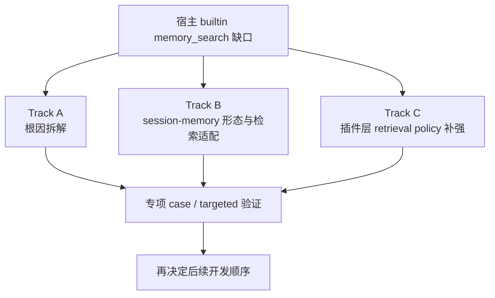
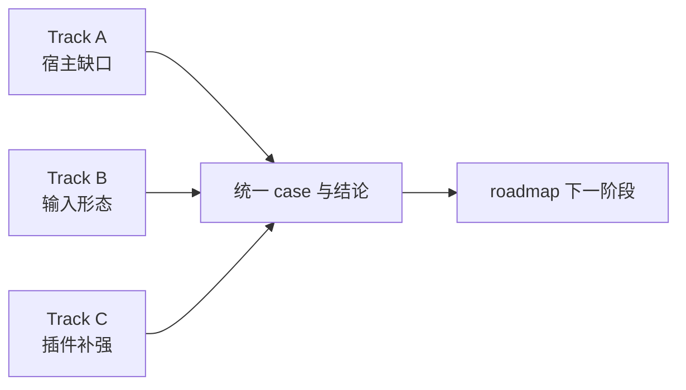

# Memory Search Workstream

## 目标

把 `memory search` 从一个模糊的大问题，拆成一条可持续推进的工程工作流。

这里的重点不是魔改 OpenClaw 宿主，也不是替换 builtin `memory_search` 内核，而是：

1. 查清宿主 builtin `memory_search` 的真实缺口
2. 查清哪些缺口来自输入形态，而不是参数
3. 在不魔改宿主的前提下，找到插件层最稳定的补强路径

## 工作流总览图

## 当前结论

### 1. 宿主 builtin `memory_search` 还没有被修好

当前已确认：

- 中文短词 / 短偏好句仍然可能召回失败
- `memory/%` 新事实可能被旧 `sessions/%` 压住
- 单纯调 `hybrid` 参数不是万能解
- `eval:hot*` 不是 clean live baseline，不能拿来代替更底层的 targeted 验证

### 2. 关键问题目前主要靠插件层补强

当前已经完成：

- `cardArtifact fast path`
- fact-first retrieval
- stable rule / identity / preference / project / routing priority
- perf-critical query 毫秒级返回

这意味着：

- 关键问题已经“能用”
- 但这不等于宿主 `memory_search` 根问题已经解决

### 3. 目前更像是“输入形态 + source 竞争 + FTS 限制”的组合问题

已知问题组合：

- `session-memory` 文件不是天然为检索优化的记忆单元
- 某些宿主写出的 `memory/*.md`，虽然已写入、已索引，但不容易被 builtin `memory_search` 命中
- `unicode61` 对中文短词帮助有限
- 新 `memory/%` 与旧 `sessions/%` 竞争时，旧 session 很容易占满结果池

## 工作流拆解

### Track A. 宿主 builtin `memory_search` 缺口拆解

重点回答：

- 失败到底发生在：
  - candidate generation
  - FTS/tokenization
  - source competition
  - rerank / final ordering

要产出的东西：

- 最小可复现实验
- 每一类实验的结论

### Track B. `session-memory` 文件形态与检索适配

重点回答：

- 哪种 `memory/*.md` 形态更容易被宿主检索命中
- 哪种形态更适合插件直接消费成 fact/card
- 双格式输出里，哪一层是“检索友好输入”，哪一层是“审计底稿”

要产出的东西：

- 文件形态问题说明
- card-friendly 形态建议

当前状态：

- `done`
- 已形成独立策略文档：
  - [session-memory-shape-strategy.md](/Users/redcreen/Project/长记忆/context-assembly-claw/reports/session-memory-shape-strategy.md)
- 当前结论：
  - `raw summary` 保留为审计底稿
  - `fact/card artifact` 作为 retrieval-friendly 输入层
  - 高频事实问答优先吃 card，不再继续豪赌 raw summary + builtin search

### Track C. 插件层 retrieval policy 补强

重点回答：

- 哪些查询继续走 fast path
- 哪些查询应该 search-first
- 哪些查询需要 formal memory / stable card 的 source priority
- 哪些 targeted case 需要单独看 top-N source 分布

要产出的东西：

- retrieval policy 说明
- 对应 smoke / perf / targeted 验证入口

当前状态：

- `done`
- 已形成独立策略文档：
  - [retrieval-policy.md](/Users/redcreen/Project/长记忆/context-assembly-claw/reports/retrieval-policy.md)
- 已有统一代码入口：
  - `src/retrieval-policy.js`
- 当前结论：
  - 默认继续走 `0-LLM default`
  - 只预留 `1-LLM optional`
  - retrieval mode 已统一收敛成：
    - `fast-path-first`
    - `formal-memory-first`
    - `mixed-mode`
    - `search-first`

## 三条 track 的关系图

## 当前优先级

### P0

- 把失败案例系统化，不再只盯“牛排”单点
- 先建立 memory-search 专项 case 集

### P1

- 对每类 case 明确：
  - query
  - 期望 source
  - 典型错误 source
  - 当前已知根因

### P2

- 再决定哪些地方需要新的 targeted 脚本
- 哪些地方只需要沿用现有 `smoke` / `perf` / targeted retrieval 验证

## 当前原则

- 不魔改 OpenClaw 宿主
- 不魔改别的插件
- 只做插件层 / 接口层 / 输入形态层改进
- 不把插件层补强误说成“宿主 memory_search 已修好”

## 当前状态

- `Track A / B / C` 已全部完成首轮收口
- `Memory Search Workstream` 现在进入常规治理模式
- 后续主动作是：
  - 跑 `eval:memory-search:governance`
  - 跑 `memory:governance-cycle`
  - 看 watchlist
  - 新增 stable fact / stable rule 时同步补 case
