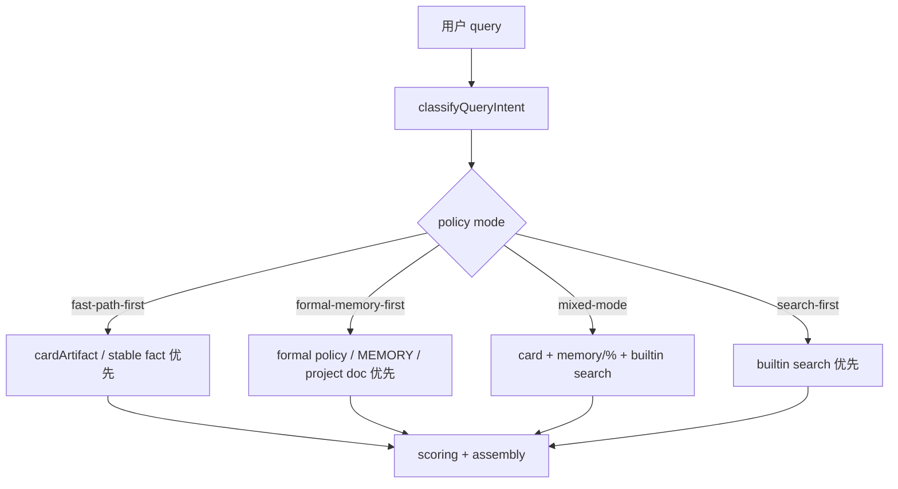
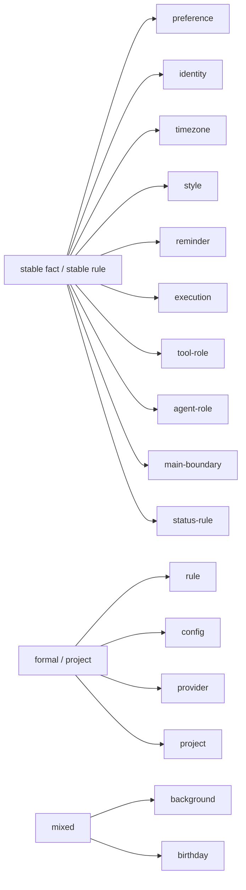
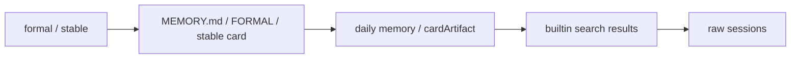
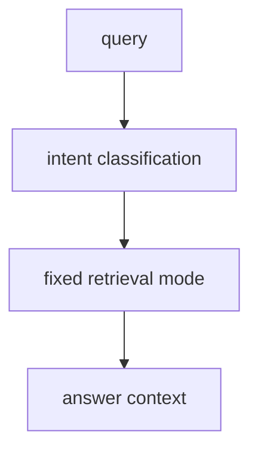
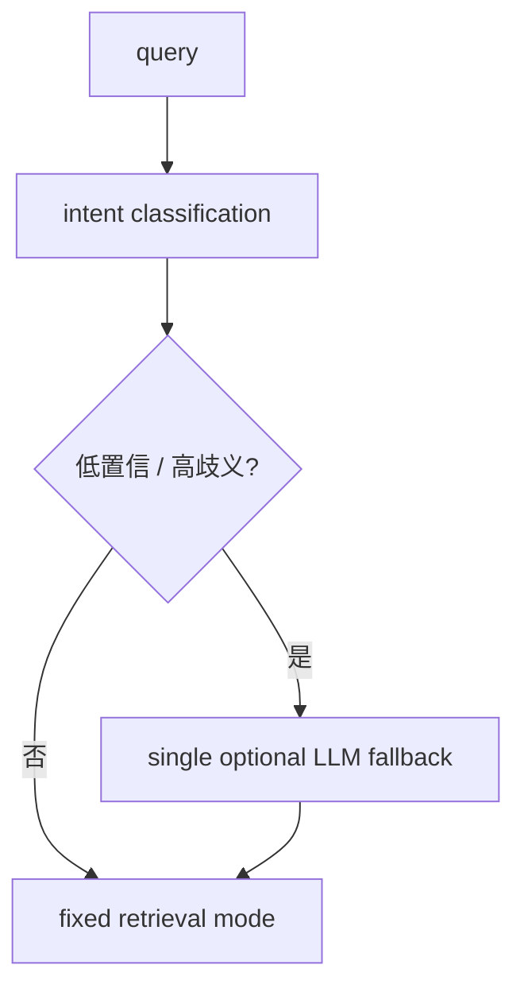

# Retrieval Policy

## 文档目的

这份文档单独收口 `Memory Search Workstream / Phase D`。

它要回答的是：

- 当前 query intent 怎么分
- 每类 intent 走哪条 retrieval 路径
- 哪类 source 应该优先
- `0-LLM default / 1-LLM optional` 到底怎么落地

---

## 一图看懂

---

## 先说结论

### 1. 当前默认主路径是 `0-LLM`

默认策略：

- 不增加 LLM 调用
- 先做规则化 intent 分类
- 再走固定 retrieval path

### 2. 允许的增强路径只有 `1-LLM optional`

如果未来要加：

- 只能是**单次**
- 必须**可配置**
- 必须**默认关闭**

### 3. 多次 LLM 调用链不进入主架构

也就是：

- 不把“让模型自己反复调工具”作为主路径
- 它最多只能是将来的受控增强层

---

## 当前 intent 分类

## 分类图

## 当前 intent 到 policy mode 的映射

| intent | mode | 主策略 |
| --- | --- | --- |
| `preference` | `fast-path-first` | 稳定事实优先 |
| `identity` | `fast-path-first` | 稳定身份优先 |
| `timezone` | `fast-path-first` | 稳定事实优先 |
| `style` | `fast-path-first` | 稳定规则优先 |
| `reminder` | `fast-path-first` | 稳定规则优先 |
| `execution` | `fast-path-first` | 稳定规则优先 |
| `toolRole` | `fast-path-first` | 稳定工具角色优先 |
| `agentRole` | `fast-path-first` | 稳定路由规则优先 |
| `mainBoundary` / `mainNegativeBoundary` | `fast-path-first` | 稳定边界规则优先 |
| `statusRule` | `fast-path-first` | 稳定状态词规则优先 |
| `rule` | `formal-memory-first` | 正式规则优先 |
| `config` | `formal-memory-first` | 配置文档 / 正式来源优先 |
| `provider` | `formal-memory-first` | provider/config 正式来源优先 |
| `project` | `formal-memory-first` | README / roadmap / stable project card 优先 |
| `background` | `mixed-mode` | card + supporting history |
| `birthday` | `mixed-mode` | card + daily memory + supporting history |
| 未分类 query | `search-first` | builtin search 优先 |

---

## 4 种 retrieval mode

## 1. `fast-path-first`

适用：

- 高置信稳定事实
- 高置信稳定规则

优先 source：

1. `cardArtifact`
2. `MEMORY.md`
3. `memory/%`
4. `builtin-search`

典型 query：

- `我爱吃什么`
- `你怎么称呼我`
- `我说提醒时默认用什么`
- `编程工作应该交给哪个 Agent`

## 2. `formal-memory-first`

适用：

- 正式规则
- 配置
- provider 说明
- 项目定位

优先 source：

1. `cardArtifact`
2. `formal-memory-policy.md`
3. `MEMORY.md`
4. `README.md / configuration.md`
5. `builtin-search`

典型 query：

- `MEMORY.md 应该放什么内容`
- `memorySearch.provider 是做什么的`
- `这个项目主要解决什么问题`

## 3. `mixed-mode`

适用：

- 背景类事实
- 生日 / 家庭类事实

优先 source：

1. `cardArtifact`
2. `memory/%`
3. `builtin-search`
4. `sessions`

典型 query：

- `我女儿叫什么，生日是哪天，现在几年级`
- `你现在做什么行业`

## 4. `search-first`

适用：

- 未分类 query
- 更像过程回顾 / 长上下文复盘的问题

优先 source：

1. `builtin-search`
2. `workspace-doc`
3. `sessions`

典型 query：

- `把今天下午那次讨论过程重新概括一下`

---

## source priority 原则

核心原则：

1. 正式来源优先于 session-derived 解释
2. 稳定 fact/rule 优先于长 transcript 片段
3. raw session 主要作为 supporting history，不再是高频事实问答的首选来源

---

## LLM 路径边界

## 当前默认

当前状态：

- `0-LLM default`

## 允许的未来增强

限制：

- 只能单次
- 必须可配置
- 默认关闭

不允许：

- 多轮 LLM 工具调度链成为主路径

---

## 与当前实现的对应关系

现在代码里已经有统一入口：

- [retrieval-policy.js](/Users/redcreen/Project/长记忆/context-assembly-claw/src/retrieval-policy.js)

它负责：

- `classifyQueryIntent`
- `resolveRetrievalPolicy`

并且已经接回：

- [retrieval.js](/Users/redcreen/Project/长记忆/context-assembly-claw/src/retrieval.js)

对应测试：

- [retrieval-policy.test.js](/Users/redcreen/Project/长记忆/context-assembly-claw/test/retrieval-policy.test.js)

---

## Phase D 完成标准核对

Roadmap 里的完成标准是：

1. retrieval policy 有清晰分类
2. 对应测试齐全
3. 新 case 进来时，不再每次重新拍脑袋决定
4. `0-LLM default` 路径明确
5. `1-LLM optional` 路径明确

当前核对：

- `清晰分类`：已完成
- `对应测试`：已完成
- `策略入口统一`：已完成
- `0-LLM default`：已完成
- `1-LLM optional`：已完成

所以这里明确收口：

**Phase D = done**

---

## 下一步输入

Phase D 完成后，下一步不再是继续堆 intent 规则。

真正应该进入的是：

- `Phase E / Memory Search Governance`

也就是：

- 把 memory-search case 集、baseline、policy 健康度纳入常规治理周期
- 新 stable fact / stable rule 进入系统时，同步决定是否要补 case / 调 policy
