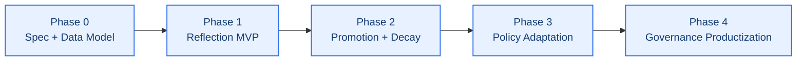
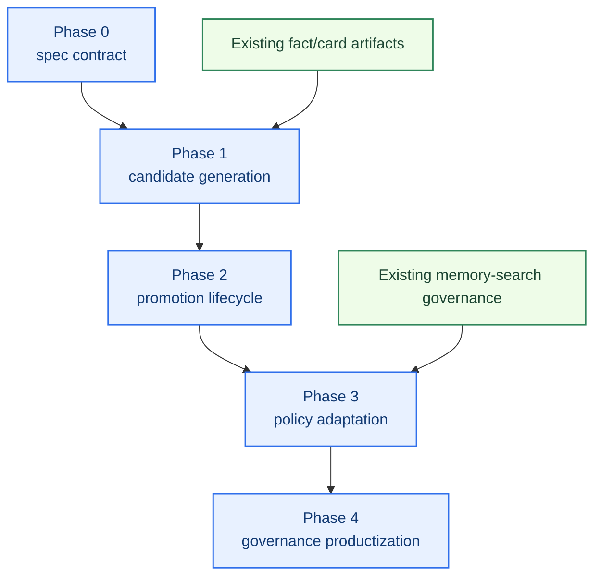
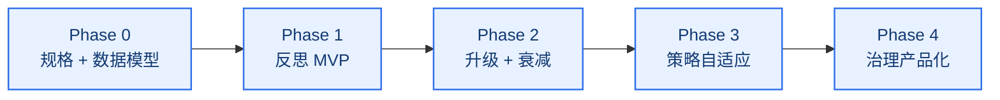
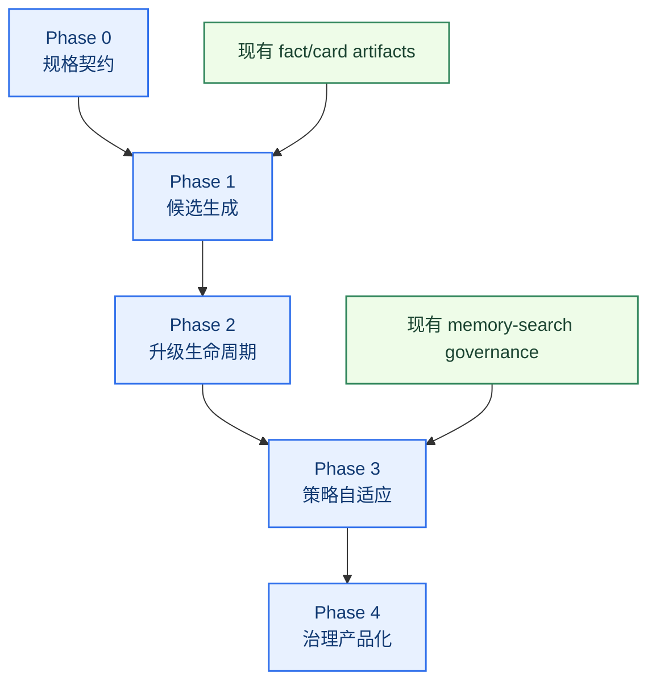

# Self-Learning Workstream Roadmap

[English](#english) | [中文](#中文)

## English

## Purpose

This roadmap turns the self-learning architecture into an implementation-oriented workstream plan.

It answers:

- what this workstream will build first
- which phases should be executed in order
- what each phase should deliver
- how each phase should be validated
- what should be considered out of scope for now

Related documents:

- [../project-roadmap.md](../project-roadmap.md)
- [../self-learning-architecture.md](../self-learning-architecture.md)
- [memory-search-roadmap.md](memory-search-roadmap.md)

## Workstream Goal

Build a governed daily-learning system for `memory-context-claw` that can:

- detect repeated signals
- run daily reflection
- promote stable learning candidates safely
- adapt plugin-side policy using verified patterns
- keep learned behavior testable and reviewable

## Current Status

- status: `planning-complete / development-ready`
- architecture baseline: `defined`
- implementation baseline: `not started`
- dependency status:
  - core memory-context backbone: `ready`
  - memory-search governance loop: `ready`

## Phase Map

## Phase 0: Spec + Data Model

Status target: `build first`

Goal:

Create the minimal stable contract for self-learning artifacts before runtime behavior is added.

Scope:

- candidate types
- memory states
- evidence model
- confidence model
- promotion / decay rules draft
- report shape draft

Suggested outputs:

- candidate schema definition
- state transition definition
- reflection question template set
- initial file/module ownership plan

Suggested modules:

- `src/learning-candidates.js`
- `src/learning-schema.js`
- `test/learning-candidates.test.js`

Acceptance:

- candidate types are explicitly named
- stable vs observation vs dropped is unambiguous
- evidence fields are sufficient for later audit

## Phase 1: Reflection MVP

Goal:

Build the first daily reflection loop that generates governed learning candidates instead of stable memory directly.

Scope:

- daily input aggregation
- event labeling
- repeated-signal detection
- explicit remember detection
- observation queue generation

Suggested outputs:

- daily reflection runner
- first reflection report
- first observation candidate artifact

Suggested modules:

- `src/daily-reflection.js`
- `scripts/run-daily-reflection.js`
- `test/daily-reflection.test.js`
- `reports/self-learning-reflection-*.md`

Acceptance:

- daily reflection can run on recent inputs
- repeated preference candidates can be extracted
- explicit remember instructions are detected
- output is structured and reviewable

## Phase 2: Promotion + Decay

Goal:

Turn observation candidates into a governed lifecycle instead of a one-way accumulation bucket.

Scope:

- promotion rules
- decay / expiry rules
- conflict detection
- stable registry update rules

Suggested outputs:

- promotion evaluator
- decay evaluator
- conflict report
- stable candidate promotion report

Suggested modules:

- `src/learning-promotion.js`
- `src/learning-conflicts.js`
- `test/learning-promotion.test.js`

Acceptance:

- strong repeated signals can be promoted
- weak or stale signals can decay
- conflicts are explicit
- no candidate bypasses review logic

## Phase 3: Policy Adaptation

Goal:

Use verified learning signals to improve retrieval and context assembly.

Scope:

- retrieval priority updates
- supporting-context filtering updates
- score bonus / penalty updates
- execution-default adaptation boundaries

Suggested outputs:

- policy adaptation module
- explainable policy delta report
- first context cleanliness comparison report

Suggested modules:

- `src/policy-adaptation.js`
- `test/policy-adaptation.test.js`
- `reports/self-learning-policy-*.md`

Acceptance:

- learned rules can affect retrieval or assembly
- policy changes are explainable
- context quality does not regress

## Phase 4: Governance Productization

Goal:

Make self-learning a regular maintainable capability rather than a one-off experiment.

Scope:

- smoke coverage
- audit coverage
- time-window comparisons
- maintenance workflow
- rollback posture

Suggested outputs:

- self-learning audit report
- periodic comparison report
- smoke cases for learning behavior
- maintenance checklist

Suggested modules:

- `scripts/run-self-learning-audit.js`
- `test/self-learning-governance.test.js`
- `reports/self-learning-audit-*.md`

Acceptance:

- self-learning behavior is regression-protected
- promoted items are reviewable
- quality can be compared over time

## Phase Dependencies

## Explicit Non-Goals For Now

- patching the OpenClaw host
- changing builtin `memory_search`
- building free-form autonomous personality rewriting
- using reflection outputs as stable memory without governance

## Recommended Development Order

1. finish Phase 0 schemas and tests
2. implement Phase 1 runner and candidate outputs
3. implement Phase 2 lifecycle rules
4. implement Phase 3 safe policy hooks
5. implement Phase 4 reports and smoke coverage

## 中文

## 文档目的

这份 roadmap 把 self-learning architecture 继续收成一份可执行的专项开发计划。

它要回答：

- 这条专项先做什么
- 各阶段应该按什么顺序推进
- 每一阶段要交付什么
- 每一阶段怎么验证
- 现阶段哪些内容明确不做

相关文档：

- [../project-roadmap.md](../project-roadmap.md)
- [../self-learning-architecture.md](../self-learning-architecture.md)
- [memory-search-roadmap.md](memory-search-roadmap.md)

## 专项目标

为 `memory-context-claw` 做出一套受治理的每日学习系统，能够：

- 识别重复信号
- 执行 daily reflection
- 安全升级稳定学习候选
- 用已验证模式更新插件层策略
- 让学习行为本身可测试、可评审

## 当前状态

- 状态：`planning-complete / development-ready`
- 架构基线：`已定义`
- 实现基线：`尚未开始`
- 依赖状态：
  - memory-context 主骨架：`ready`
  - memory-search 治理循环：`ready`

## 阶段图

## Phase 0：规格 + 数据模型

目标状态：`第一个开发阶段`

目标：

在接入运行时行为之前，先把 self-learning 工件的最小稳定契约定义清楚。

范围：

- candidate types
- memory states
- evidence model
- confidence model
- promotion / decay rules 草案
- report shape 草案

建议产出：

- candidate schema 定义
- 状态流转定义
- 反思问题模板集
- 初版文件 / 模块归属计划

建议模块：

- `src/learning-candidates.js`
- `src/learning-schema.js`
- `test/learning-candidates.test.js`

验收：

- candidate 类型命名清楚
- stable / observation / dropped 边界清楚
- evidence 字段足够支撑后续审计

## Phase 1：反思 MVP

目标：

做出第一版 daily reflection 闭环，但先生成受治理的 learning candidates，而不是直接写 stable memory。

范围：

- 每日输入聚合
- 事件标注
- 重复信号检测
- 明确 `记住` 检测
- observation queue 生成

建议产出：

- daily reflection runner
- 第一版 reflection report
- 第一版 observation candidate artifact

建议模块：

- `src/daily-reflection.js`
- `scripts/run-daily-reflection.js`
- `test/daily-reflection.test.js`
- `reports/self-learning-reflection-*.md`

验收：

- 能对最近输入跑 daily reflection
- 能提炼重复偏好候选
- 能识别明确 `记住`
- 输出结构化且可评审

## Phase 2：升级 + 衰减

目标：

让 observation candidates 进入受治理生命周期，而不是只进不出的堆积池。

范围：

- promotion rules
- decay / expiry rules
- conflict detection
- stable registry 更新规则

建议产出：

- promotion evaluator
- decay evaluator
- conflict report
- stable candidate promotion report

建议模块：

- `src/learning-promotion.js`
- `src/learning-conflicts.js`
- `test/learning-promotion.test.js`

验收：

- 强信号可以升级
- 弱信号和过期信号可以衰减
- 冲突会被显式标出
- 没有候选能绕过评审逻辑

## Phase 3：策略自适应

目标：

让已验证的学习信号真正反哺 retrieval 和 context assembly。

范围：

- retrieval priority 更新
- supporting-context 过滤更新
- score bonus / penalty 更新
- execution-default adaptation 边界

建议产出：

- policy adaptation 模块
- 可解释的 policy delta report
- 第一版上下文纯度对比报告

建议模块：

- `src/policy-adaptation.js`
- `test/policy-adaptation.test.js`
- `reports/self-learning-policy-*.md`

验收：

- 学到的稳定规则可以影响 retrieval 或 assembly
- policy 变化是可解释的
- 上下文质量不回退

## Phase 4：治理产品化

目标：

把 self-learning 从一次性实验，收成可长期维护的稳定能力。

范围：

- smoke coverage
- audit coverage
- 跨时间窗口对比
- 日常维护流
- rollback posture

建议产出：

- self-learning audit report
- 周期性对比报告
- learning behavior smoke cases
- 维护 checklist

建议模块：

- `scripts/run-self-learning-audit.js`
- `test/self-learning-governance.test.js`
- `reports/self-learning-audit-*.md`

验收：

- self-learning 行为有回归保护
- 已升级条目可评审
- 质量可跨时间对比

## 阶段依赖图

## 当前明确不做

- 魔改 OpenClaw 宿主
- 修改 builtin `memory_search`
- 做自由发挥式的“人格重写”
- 让 reflection 结果绕过治理直接进入 stable memory

## 建议开发顺序

1. 先完成 Phase 0 的 schema 和测试
2. 再实现 Phase 1 的 runner 和 candidate 输出
3. 再补 Phase 2 的生命周期规则
4. 再接入 Phase 3 的安全 policy hooks
5. 最后补 Phase 4 的报告和 smoke 覆盖
