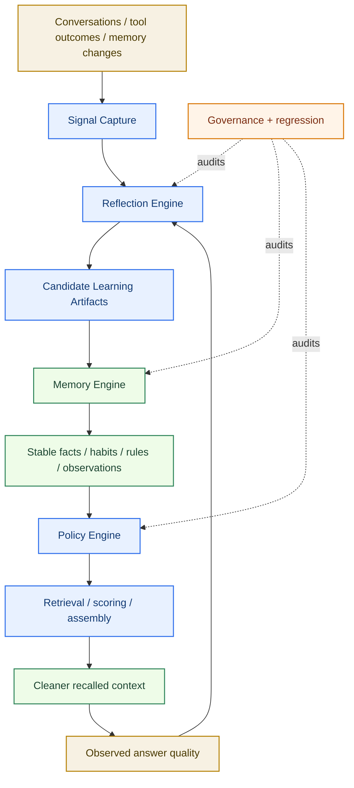
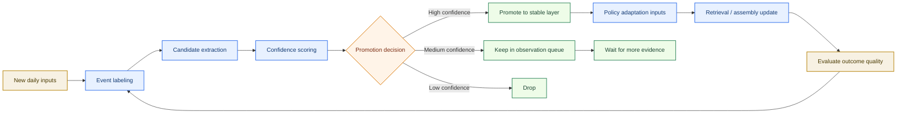
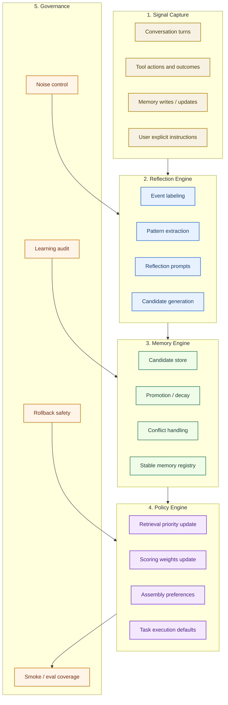
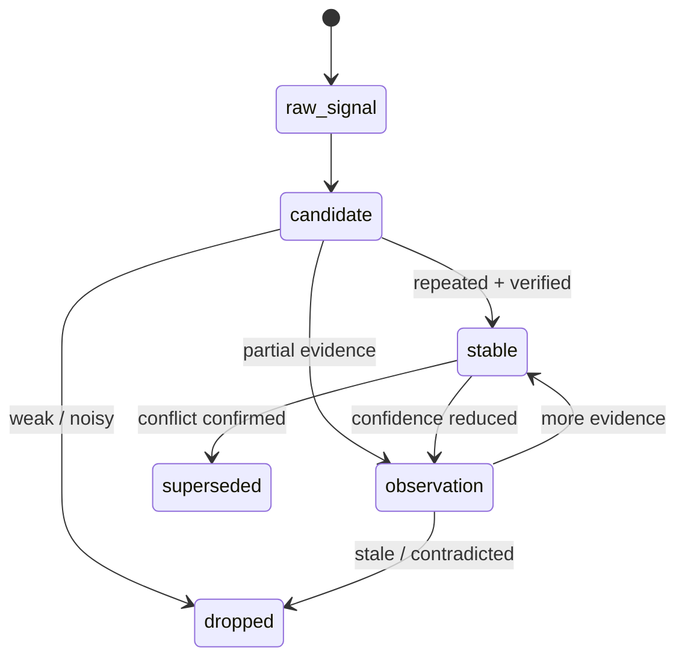
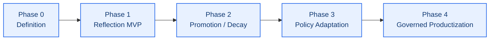
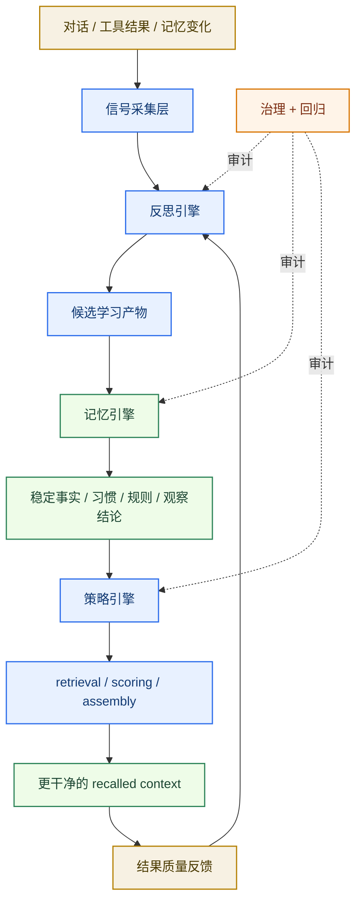
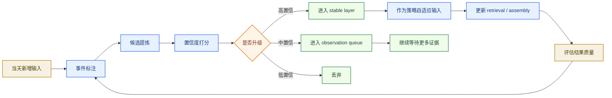
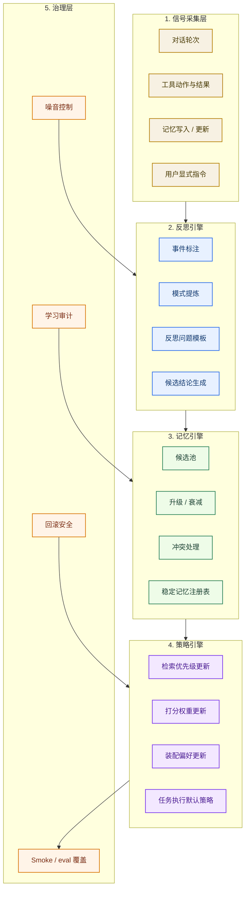
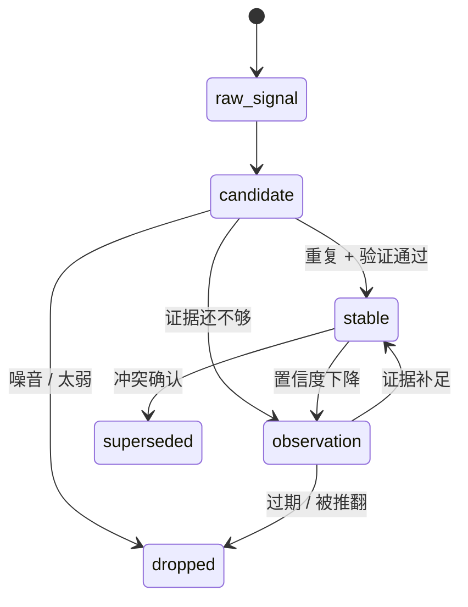
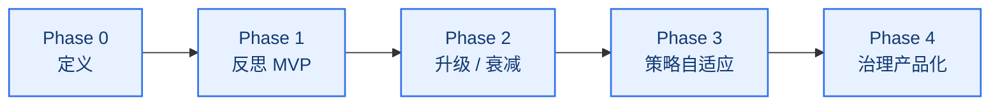

# Self-Learning Memory Architecture

[English](#english) | [中文](#中文)

## English

## Purpose

This document defines the next major workstream for `memory-context-claw`:

`daily self-learning + daily reflection + policy adaptation`

It explains:

- what this workstream is trying to achieve
- which problems it should solve
- how the solution should be layered
- how learning should remain governed instead of drifting into noise
- which roadmap phases should be executed next

This document is meant to guide future implementation work, not just describe an idea.

Related documents:

- [README.md](README.md)
- [system-architecture.md](system-architecture.md)
- [project-roadmap.md](project-roadmap.md)
- [reports/self-learning-roadmap.md](reports/self-learning-roadmap.md)
- [reports/memory-search-architecture.md](reports/memory-search-architecture.md)

## One-Line Goal

Turn `memory-context-claw` from a fact-first memory context layer into a:

`governed daily-learning system that can extract stable patterns, reflect on outcomes, and improve how it serves the user over time`

## What Problem This Workstream Solves

The current system is already good at:

- capturing memory inputs
- distilling facts/cards
- preferring stable facts during retrieval
- governing memory-search quality

But that is only the first half of a longer-term memory system.

Without a dedicated self-learning layer, the plugin still has several gaps:

1. repeated user expressions are not yet turned into governed habit signals
2. explicit `remember this` instructions are not yet treated as a first-class promotion path
3. daily reflection is not yet formalized into a stable pipeline
4. behavior patterns are not yet separated from plain facts
5. learned patterns do not yet systematically update retrieval and assembly policy
6. long-term learning can easily become noisy if candidate promotion is not carefully controlled

## Desired Outcome

After this workstream is complete, the system should be able to:

- detect repeated user preferences and speech habits
- capture explicit long-term instructions with strong confidence
- run a daily reflection cycle over new conversations and memory changes
- distinguish:
  - confirmed facts
  - stable preferences
  - behavioral patterns
  - operating rules
  - observations still under review
- adapt plugin-side policy using learned patterns
- keep all of the above governed, testable, and reversible

## Scope Boundary

This workstream does:

- improve plugin-side learning and reflection
- create structured learning artifacts
- adjust retrieval / scoring / assembly policy from governed signals
- add governance and regression around learned behavior

This workstream does not:

- patch the OpenClaw host
- patch other plugins
- let the model freely rewrite its own personality
- allow unverified free-form reflections to directly become stable memory

## Design Principles

1. Learning is structured, not magical.
2. Reflection is evidence-based, not free-form storytelling.
3. Promotion must be reversible.
4. Stable memory, candidate memory, and runtime observations must stay separate.
5. Policy adaptation must consume confidence-ranked signals instead of raw summaries.
6. Context quality matters more than memory volume.

## System View



## Learning Model

The core idea is:

`learning = capture + extraction + scoring + promotion + policy use + verification`

The system should not treat all learned content equally.

It should explicitly separate:

- `stable_fact`
- `stable_preference`
- `stable_rule`
- `habit_signal`
- `behavior_pattern`
- `observation`
- `open_question`

## Daily Reflection Loop



## What Counts As Evidence

The reflection system should score candidate learning signals using evidence like:

- explicit phrases such as `remember this`
- repeated statements across multiple days
- repeated wording patterns
- user acceptance / rejection of previous behavior
- consistency between what the user says and what the user actually does
- recency and freshness
- conflict with existing stable memory

Recommended interpretation:

- repeated sentence pattern -> candidate speaking habit or preference
- explicit remember instruction -> strong candidate stable memory
- repeated reflection / correction -> candidate operating rule
- repeated goal without matching action -> aspiration, not stable fact
- changing wording but consistent underlying principle -> candidate higher-level rule

## Layered Architecture



## Reflection Engine

The reflection engine should not be a generic journal writer.

It should answer a fixed set of governed questions such as:

- which user preferences were reinforced today
- which stable memories were re-validated today
- which new patterns appeared today
- which system behaviors helped
- which system behaviors added noise
- which candidate rules should be observed longer
- which candidate signals deserve promotion review

This keeps reflection useful for engineering and maintainable for governance.

## Memory States



## Policy Adaptation

Learning should not stop at storage.

The plugin should gradually learn how to serve the user better by adapting:

- retrieval priority
- fast-path routing
- score bonuses / penalties
- supporting-context filtering
- task execution defaults
- answer formatting tendencies where explicitly reinforced

Examples:

- repeated `do not hardcode` -> stronger penalty against brittle implementation patterns
- repeated preference for concise docs -> favor shorter supporting context for documentation tasks
- repeated demand for tests + docs + deployment -> promote these into default execution policy

## Governance Rules

This workstream must remain governed.

Required controls:

- every learned item needs source references
- every learned item needs timestamps
- every learned item needs evidence count
- every learned item needs last-validated time
- every learned item must be degradable or expirable
- conflicts must be explicit, not silently overwritten

## Risks To Avoid

1. treating one-off statements as personality
2. treating aspirations as confirmed habits
3. allowing free-form model speculation about user intent
4. making the recalled context larger but not better
5. letting reflection outputs bypass promotion review

## Candidate Data Shape

```json
{
  "id": "candidate-rule-001",
  "type": "stable_rule_candidate",
  "statement": "User prefers concise, maintenance-friendly documentation.",
  "evidenceCount": 4,
  "explicitRemember": false,
  "sources": [
    "conversation:2026-04-11:turn-18",
    "conversation:2026-04-10:turn-42"
  ],
  "status": "observation",
  "confidence": 0.84,
  "lastValidatedAt": "2026-04-11",
  "conflicts": []
}
```

## Roadmap



### Phase 0: Definition

Status target: `next`

Deliverables:

- learning terminology and boundaries
- candidate types and state model
- evidence and confidence model
- document structure and workstream ownership

### Phase 1: Reflection MVP

Deliverables:

- daily reflection job
- event labeling
- candidate extraction for:
  - explicit remember instructions
  - repeated preferences
  - repeated wording habits
  - repeated operating rules
- observation queue output

### Phase 2: Promotion / Decay

Deliverables:

- promotion rules
- decay / expiry rules
- conflict detection
- stable registry updates
- regression cases for promotion decisions

### Phase 3: Policy Adaptation

Deliverables:

- use stable learned rules in retrieval and assembly
- adjust supporting-context filtering using learned signals
- define safe policy update boundaries
- measure context cleanliness after policy changes

### Phase 4: Governed Productization

Deliverables:

- learning audit report
- comparison report across time windows
- smoke coverage for self-learning behaviors
- maintenance workflow for reviewing promoted items

## Suggested Initial File/Module Direction

Potential future modules:

- `src/daily-reflection.js`
- `src/learning-candidates.js`
- `src/learning-promotion.js`
- `src/policy-adaptation.js`
- `scripts/run-daily-reflection.js`
- `reports/self-learning-*.md`
- `test/daily-reflection.test.js`
- `test/learning-promotion.test.js`

These are suggested directions, not committed file contracts yet.

## Success Criteria

This workstream is successful when:

- repeated user rules and habits become easier to recall than before
- explicit `remember this` instructions are consistently promoted
- recalled context becomes cleaner, not noisier
- policy adaptation is visible and explainable
- learned behavior remains regression-tested and reviewable

## 中文

## 文档目的

这份文档定义 `memory-context-claw` 的下一条专项主线：

`每日自动学习 + 每日反思 + 策略自适应`

它要讲清楚：

- 这条专项到底要做什么
- 它解决什么问题
- 解决思路是什么
- 系统应该怎么分层
- 后续 roadmap 应该怎么推进

这份文档不是灵感记录，而是后续专项落地的设计基线。

相关文档：

- [README.md](README.md)
- [system-architecture.md](system-architecture.md)
- [project-roadmap.md](project-roadmap.md)
- [reports/self-learning-roadmap.md](reports/self-learning-roadmap.md)
- [reports/memory-search-architecture.md](reports/memory-search-architecture.md)

## 一句话目标

把 `memory-context-claw` 从“事实优先的记忆上下文层”继续收成一套：

`受治理的每日学习系统，能够持续提炼稳定模式、进行结果反思，并逐步优化对用户的服务方式`

## 这条专项要解决什么问题

当前系统已经比较擅长：

- 收集记忆输入
- 提炼 fact/card
- 在检索时优先稳定事实
- 治理 `memory search` 质量

但这还只是长期记忆系统的前半段。

如果没有专门的自学习层，当前仍然有几个明显缺口：

1. 用户重复表达的内容，还没有被稳定收成“习惯信号”
2. 用户明确说“记住”的内容，还没有被当成一条一等公民的升级路径
3. “每日反思”还没有被正式产品化成固定管线
4. 行为模式还没有和普通事实清楚分开
5. 学到的模式还没有系统地反哺 retrieval / assembly policy
6. 如果没有治理，长期学习很容易把 memory 再次做成噪音池

## 目标结果

这条专项完成后，系统应该能做到：

- 识别重复出现的用户偏好和说话习惯
- 高置信地接住用户明确要求长期记住的内容
- 每天对新增对话和记忆变化跑一轮反思
- 明确区分：
  - 已确认事实
  - 稳定偏好
  - 行为模式
  - 操作规则
  - 观察中结论
- 用学习结果调整插件层策略
- 并且让这一切都保持可治理、可测试、可回滚

## 边界

这条专项会做：

- 强化插件层的学习与反思能力
- 生成结构化学习产物
- 用受治理的信号调整 retrieval / scoring / assembly policy
- 为学习行为补治理和回归保护

这条专项不会做：

- 魔改 OpenClaw 宿主
- 修改别的插件
- 让模型随意重写自己的“人格”
- 让未经验证的自由反思直接进入 stable memory

## 设计原则

1. 学习是结构化的，不是玄学。
2. 反思是基于证据的，不是自由发挥写散文。
3. 升级必须可逆。
4. stable memory、候选记忆、运行时观察必须分层。
5. 策略自适应只能消费带置信度的信号，不能直接吃原始总结。
6. 上下文质量比记忆总量更重要。

## 整体图



## 学习模型

这条专项的核心思路是：

`学习 = 采集 + 提炼 + 打分 + 升级 + 策略消费 + 验证`

系统不能把所有学到的内容都当成同一类东西。

建议明确分成：

- `stable_fact`
- `stable_preference`
- `stable_rule`
- `habit_signal`
- `behavior_pattern`
- `observation`
- `open_question`

## 每日反思闭环



## 什么算证据

反思系统对候选学习信号打分时，建议至少看这些证据：

- 用户是否明确说了 `记住`
- 是否跨多次、跨多天重复出现
- 是否有重复表达模式
- 用户是否接受或否定了系统之前的行为
- 用户“怎么说”和“怎么做”是否一致
- 是否最近仍然有效
- 是否与已有稳定记忆冲突

建议这样理解：

- 重复句式 -> 候选说话习惯或偏好
- 明确 `记住` -> 高优先级 stable memory 候选
- 重复出现的反思 / 修正 -> 候选操作规则
- 只反复表达目标、但行为不一致 -> `aspiration`，不是 stable fact
- 表述变化但底层原则一致 -> 抽象成更高层规则候选

## 分层架构



## 反思引擎

反思引擎不应该是一个泛化“写日记器”。

它应该稳定回答几类固定问题，比如：

- 今天哪些用户偏好被再次强化了
- 今天哪些稳定记忆被再次验证了
- 今天出现了哪些新模式
- 今天系统哪些行为是加分项
- 今天系统哪些行为制造了噪音
- 哪些候选规则还需要继续观察
- 哪些候选结论值得进入升级评审

这样反思结果才更适合工程落地，也更容易治理。

## 记忆状态



## 策略自适应

学习不能只停在“写入 memory”。

更重要的是，插件应该逐步学会“怎样更好地服务这个用户”，也就是让学习结果反哺：

- retrieval priority
- fast-path routing
- score bonus / penalty
- supporting-context 过滤
- 任务执行默认流程
- 在用户明确强化后，再逐步影响输出风格

例如：

- 多次出现 `不要硬编码` -> 对脆弱实现模式施加更强惩罚
- 多次强调文档要简洁 -> 文档任务里更偏向短而高信号的 supporting context
- 多次强调测试 + 文档 + 部署 -> 升级为默认执行 checklist

## 必须坚持的治理规则

这条专项必须全程受治理。

至少要有这些控制：

- 每条学习项都要能追溯来源
- 每条学习项都要有时间戳
- 每条学习项都要记录证据次数
- 每条学习项都要记录最近验证时间
- 每条学习项都必须可降级 / 可过期
- 冲突必须显式处理，不能静默覆盖

## 要规避的风险

1. 把一次性表达误判成长期人格
2. 把“想做到”误判成“已经稳定做到”
3. 让模型脑补用户动机
4. 让 recalled context 变多了，但没有变干净
5. 让反思产物绕过升级评审直接进入 stable memory

## 候选数据形态示例

```json
{
  "id": "candidate-rule-001",
  "type": "stable_rule_candidate",
  "statement": "User prefers concise, maintenance-friendly documentation.",
  "evidenceCount": 4,
  "explicitRemember": false,
  "sources": [
    "conversation:2026-04-11:turn-18",
    "conversation:2026-04-10:turn-42"
  ],
  "status": "observation",
  "confidence": 0.84,
  "lastValidatedAt": "2026-04-11",
  "conflicts": []
}
```

## Roadmap



### Phase 0：定义阶段

目标状态：`next`

产出：

- 学习术语和边界定义
- 候选类型和状态模型
- 证据与置信度模型
- 文档结构和专项归属

### Phase 1：反思 MVP

产出：

- daily reflection job
- event labeling
- 覆盖这些候选提炼：
  - 明确 `记住`
  - 重复偏好
  - 重复表达习惯
  - 重复操作规则
- observation queue 输出

### Phase 2：升级 / 衰减

产出：

- promotion rules
- decay / expiry rules
- conflict detection
- stable registry 更新
- 升级决策的回归用例

### Phase 3：策略自适应

产出：

- 让稳定学习结果进入 retrieval / assembly
- 用学习信号收紧 supporting-context 过滤
- 定义安全的策略更新边界
- 度量策略变化后的上下文纯度

### Phase 4：治理产品化

产出：

- 学习审计报告
- 跨时间窗口对比报告
- self-learning 行为的 smoke 覆盖
- 已升级学习项的日常维护流

## 建议的首批文件 / 模块方向

未来可以考虑新增：

- `src/daily-reflection.js`
- `src/learning-candidates.js`
- `src/learning-promotion.js`
- `src/policy-adaptation.js`
- `scripts/run-daily-reflection.js`
- `reports/self-learning-*.md`
- `test/daily-reflection.test.js`
- `test/learning-promotion.test.js`

这里是建议方向，不是已经锁死的文件契约。

## 成功标准

这条专项真正算成功，至少要看到：

- 用户重复规则和习惯比以前更容易被稳定召回
- 明确 `记住` 的内容能被稳定升级
- recalled context 更干净，而不是更吵
- 策略自适应是可见、可解释的
- 学习行为本身也能被回归测试和评审
