# System Architecture

[English](#english) | [中文](#中文)

## English

## Purpose

This is the top-level architecture document for `memory-context-claw`.

It answers:

- what the system is
- which major layers it contains
- how data moves across the layers
- where `memory search` fits in the overall design
- which parts are host behavior vs plugin behavior

This document is the architectural companion to:

- [project-roadmap.md](project-roadmap.md)
- [self-learning-architecture.md](self-learning-architecture.md)
- [memory-search-architecture.md](reports/memory-search-architecture.md)

## One Diagram

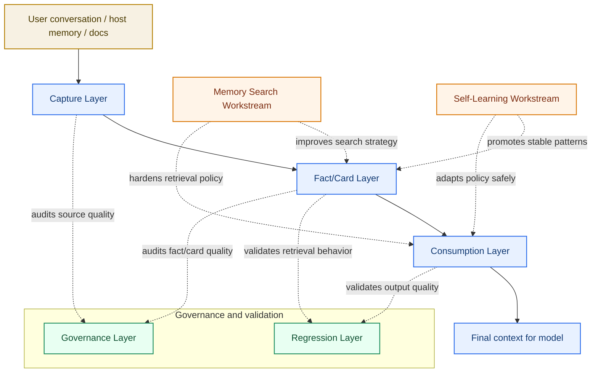

## End-to-End Flow

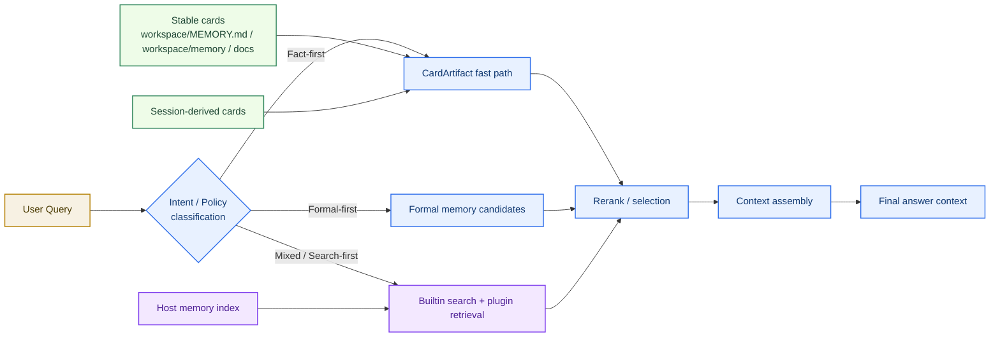

## Sequence View

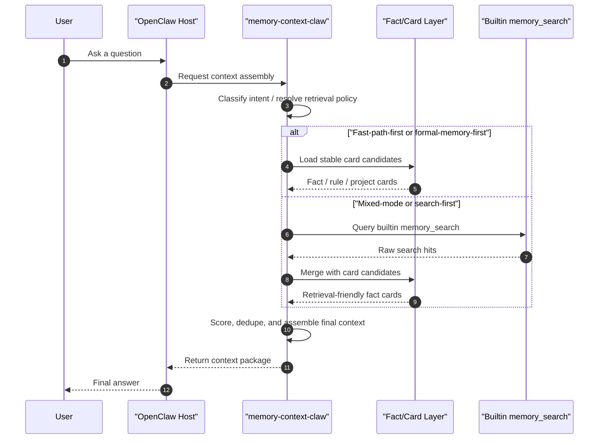

### Legend

- purple: host-side behavior
- blue: plugin-side behavior
- green: retrieval-friendly artifact
- orange: governance / regression

## System Goal

`memory-context-claw` is a governed, fact-first context engine for OpenClaw.

It is designed to:

1. capture useful information from real interaction
2. distill it into stable facts/cards
3. prefer stable facts during retrieval and assembly
4. continuously validate and govern the memory layer
5. gradually learn stable patterns and feed them back into plugin-side policy

## What The Plugin Does Not Do

The plugin does **not**:

- replace OpenClaw builtin memory
- patch the OpenClaw host
- patch other plugins

The plugin **does**:

- consume existing host/session artifacts
- distill fact/card artifacts
- apply retrieval policy and assembly logic
- run governance and regression tooling around the memory layer

## Layer Overview

### Architecture Map

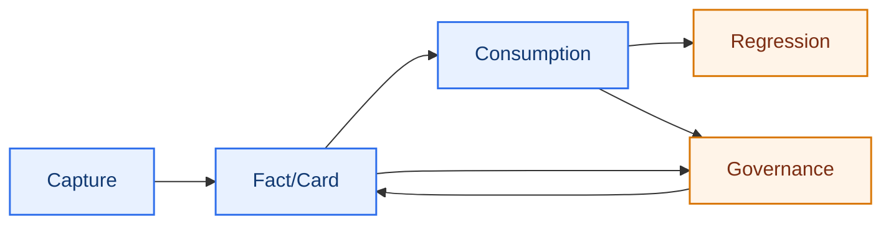

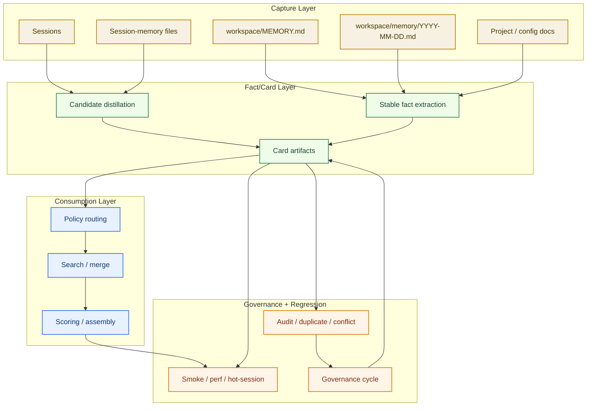

## 1. Capture Layer

The capture layer collects candidate information from:

- sessions
- host-generated session-memory files
- `workspace/MEMORY.md`
- `workspace/memory/YYYY-MM-DD.md`
- project docs / config docs

Responsibilities:

- preserve raw session traces
- collect candidate facts before they disappear
- support pre-compaction distillation

Outputs:

- candidate memory inputs
- raw session artifacts

## 2. Fact/Card Layer

The fact/card layer converts noisy memory inputs into stable units.

Responsibilities:

- extract subject facts
- extract stable rules
- derive background/project cards
- keep one card focused on one main idea when possible

Key artifacts:

- `conversation-memory-cards.md`
- `conversation-memory-cards.json`
- stable cards derived from:
  - `workspace/MEMORY.md`
  - `workspace/memory/YYYY-MM-DD.md`
  - policy/config/project docs

## 3. Consumption Layer

The consumption layer is where retrieval and context assembly happen.

Responsibilities:

- route certain queries into `cardArtifact fast path`
- apply fact-first / formal-first / mixed / search-first policy
- score and select candidates
- build token-budget-aware final context

Key point:

This layer is where most of the practical “system feels smart” behavior comes from.

## 4. Regression Layer

The regression layer ensures the system does not quietly drift.

Responsibilities:

- smoke checks
- perf checks
- hot-session health checks
- stable-facts regression

Key outputs:

- `smoke`
- `perf`
- `eval:hot*`
- targeted `memory-search` evaluation

## 5. Governance Layer

The governance layer keeps the memory system healthy over time.

Responsibilities:

- separate confirmed / pending / noise
- audit formal memory
- audit duplicates and conflicts
- review session-memory exit conditions
- run periodic governance cycles

Key outputs:

- audit reports
- governance-cycle reports
- watchlists

## Memory Search In The Big Picture

`memory search` is not the whole system.

It is one workstream inside the broader architecture:

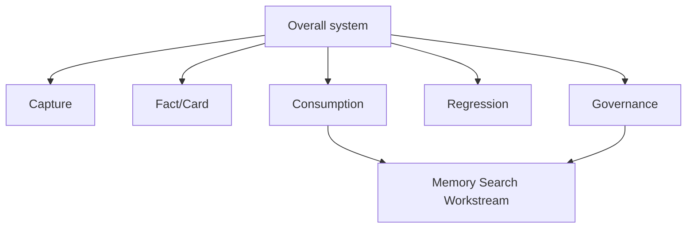

Why it matters:

- memory search affects the consumption layer directly
- memory search affects governance through watchlists, baselines, and source-quality checks
- but memory search is still only one part of the whole plugin

## Raw Summary vs Fact/Card

One of the most important architectural decisions is this separation:

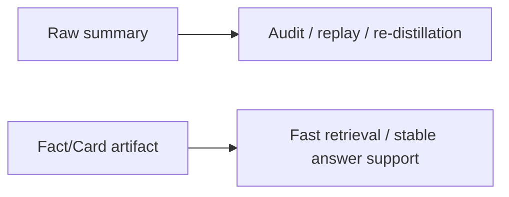

Meaning:

- raw summary is preserved
- fact/card artifacts carry retrieval-friendly responsibility

This is why the system can stay both:

- auditable
- efficient for high-value fact queries

## Host vs Plugin Boundary

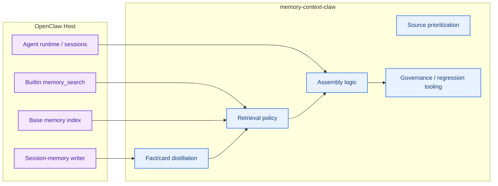

### Host Side

OpenClaw host is responsible for:

- builtin `memory_search`
- writing some session-memory files
- base memory indexing
- agent runtime/session behavior

### Plugin Side

`memory-context-claw` is responsible for:

- fact/card distillation
- retrieval policy
- source prioritization
- assembly logic
- governance reporting

This boundary is important because:

- host limitations must not be misreported as plugin fixes
- plugin compensation must not be described as host repair

## LLM Boundary

Default architecture:

- `0-LLM default`

Allowed optional enhancement:

- `1-LLM optional`
- configurable
- disabled by default

Disallowed as main path:

- multi-step LLM orchestration chain

## Current Maturity

### Stable

- capture foundation
- fact/card layer
- fact-first consumption skeleton
- smoke/perf/governance baseline
- memory-search A-E workstream closure

### Still evolving

- builtin memory-search gap handling
- watchlist reduction
- stable fact expansion
- governance ergonomics

## Related Documents

- [project-roadmap.md](project-roadmap.md)
- [memory-search-roadmap.md](reports/memory-search-roadmap.md)
- [memory-search-architecture.md](reports/memory-search-architecture.md)
- [memory-search-next-blueprint.md](reports/memory-search-next-blueprint.md)

---

## 中文

## 文档目的

这是 `memory-context-claw` 的总架构文档。

它用来回答：

- 这个系统整体是什么
- 它包含哪些主要层
- 数据在各层之间怎么流动
- `memory search` 在整体里处于什么位置
- 哪些能力属于宿主，哪些属于插件

这份文档是下面这些文档的总架构入口：

- [project-roadmap.md](project-roadmap.md)
- [memory-search-architecture.md](reports/memory-search-architecture.md)

## 一图看懂

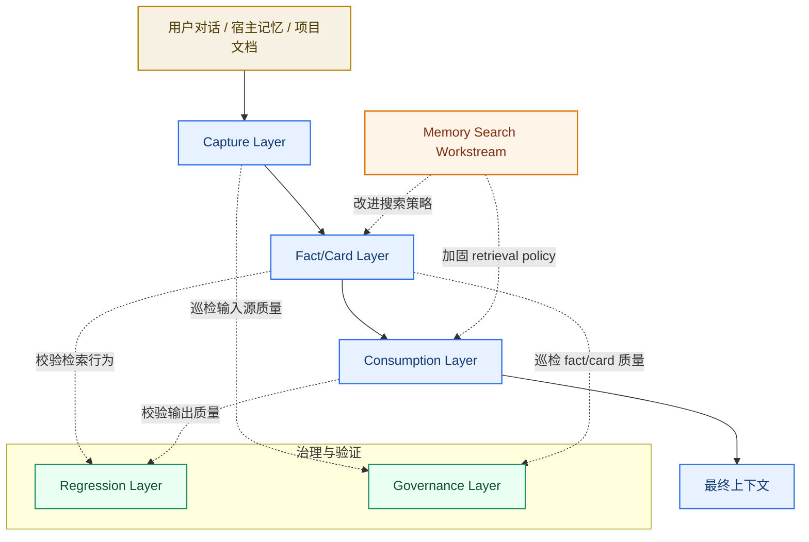

## 端到端流程

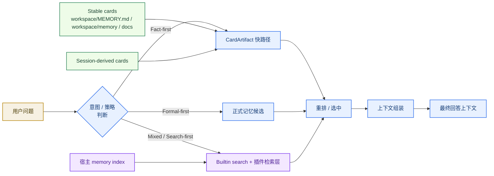

## 时序图

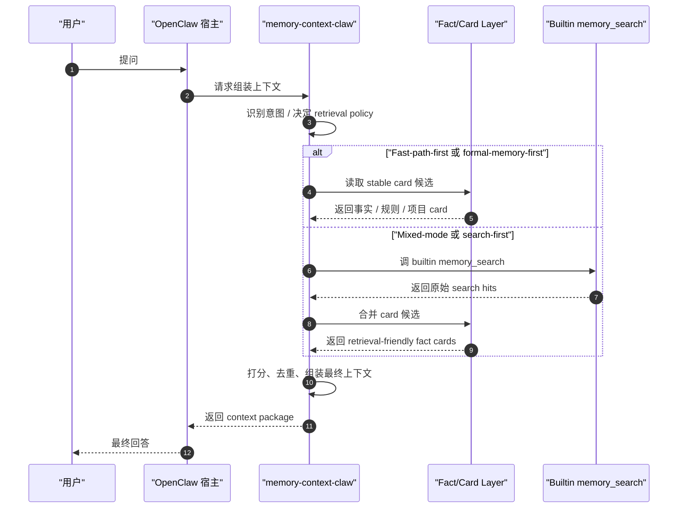

### 图例

- 紫色：宿主侧行为
- 蓝色：插件侧行为
- 绿色：检索友好型工件
- 橙色：治理 / 回归

## 系统目标

`memory-context-claw` 是一层面向 OpenClaw 的、可治理的、事实优先的上下文引擎。

它的核心目标是：

1. 从真实交互里抓出有价值的信息
2. 把它们提炼成稳定的 fact/card
3. 在检索和组装时优先消费稳定事实
4. 持续验证并治理整层记忆系统

## 插件不做什么

这个插件**不做**：

- 替代 OpenClaw 内置 memory
- 魔改 OpenClaw 宿主
- 魔改其他插件

这个插件**负责做**：

- 消费宿主已有的 session/memory 工件
- 提炼 fact/card
- 应用 retrieval policy 和 assembly 逻辑
- 围绕记忆层做治理和回归工具链

## 分层总览

### 架构图

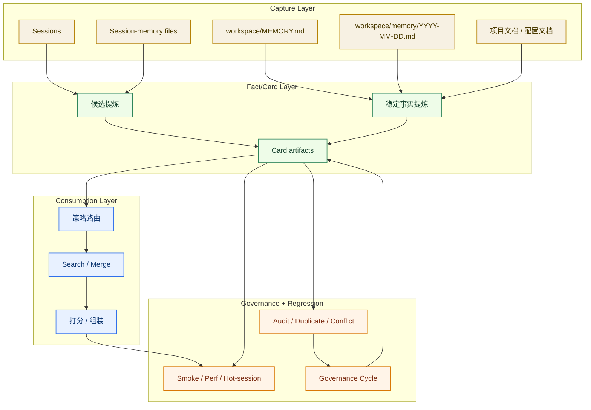

## 1. Capture Layer

这一层负责从各类输入源收集候选信息，包括：

- sessions
- 宿主生成的 session-memory 文件
- `workspace/MEMORY.md`
- `workspace/memory/YYYY-MM-DD.md`
- 项目文档 / 配置文档

职责：

- 保留原始 session 轨迹
- 在信息消失前抓住候选事实
- 支持 pre-compaction distillation

输出：

- 候选记忆输入
- 原始 session 工件

## 2. Fact/Card Layer

这一层把噪音较大的原始输入提炼成稳定单元。

职责：

- 提取主体事实
- 提取稳定规则
- 生成背景 / 项目定位 card
- 尽量让一张 card 只表达一个主题

关键工件：

- `conversation-memory-cards.md`
- `conversation-memory-cards.json`
- 从以下来源派生的 stable card：
  - `workspace/MEMORY.md`
  - `workspace/memory/YYYY-MM-DD.md`
  - policy/config/project docs

## 3. Consumption Layer

这一层负责真正的 retrieval 和 context assembly。

职责：

- 把某些查询路由到 `cardArtifact fast path`
- 应用 fact-first / formal-first / mixed / search-first 策略
- 对候选做 scoring 和 selection
- 在 token budget 下构建最终上下文

关键点：

这层决定了系统在真实使用中“看起来聪不聪明”。

## 4. Regression Layer

这一层保证系统不会悄悄漂移。

职责：

- smoke 检查
- perf 检查
- hot-session 健康检查
- stable-facts regression

关键产物：

- `smoke`
- `perf`
- `eval:hot*`
- `memory-search` 专项验证

## 5. Governance Layer

这一层保证记忆系统长期健康。

职责：

- 区分 confirmed / pending / noise
- 巡检正式记忆层
- 审计 duplicate / conflict
- 审计 session-memory 退出条件
- 定期运行治理周期

关键产物：

- audit 报告
- governance-cycle 报告
- watchlist

## Memory Search 在整体里的位置

`memory search` 不是整个系统本身。

它是整体架构里的一个 workstream：

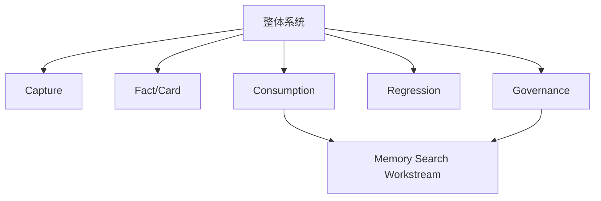

为什么要这样看：

- memory search 直接影响 consumption
- memory search 通过 baseline / watchlist / source-quality 影响 governance
- 但它依然只是整个插件中的一部分

## Raw Summary 与 Fact/Card 的分工

最重要的架构决策之一，就是把这两者分开：

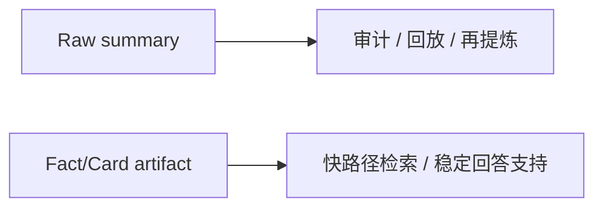

含义是：

- raw summary 保留
- retrieval-friendly 的职责交给 fact/card artifact

这也是为什么系统可以同时做到：

- 可审计
- 对高价值事实问答又足够高效

## 宿主与插件的边界

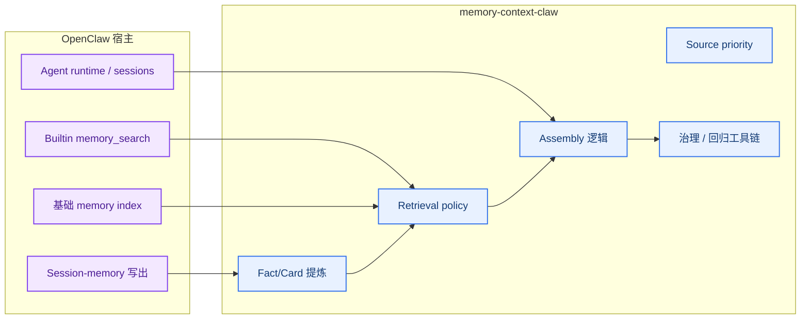

### 宿主侧

OpenClaw 宿主负责：

- builtin `memory_search`
- 写出部分 session-memory 文件
- 基础记忆索引
- agent 运行时 / session 行为

### 插件侧

`memory-context-claw` 负责：

- fact/card 提炼
- retrieval policy
- source priority
- assembly 逻辑
- governance 报告

这个边界很重要，因为：

- 宿主限制不能误说成插件已修好
- 插件补强也不能误说成宿主内核已修复

## LLM 边界

默认架构：

- `0-LLM default`

允许的增强路径：

- `1-LLM optional`
- 必须可配置
- 默认关闭

不允许作为主路径的：

- 多步 LLM orchestration chain

## 当前成熟度

### 已稳定

- capture foundation
- fact/card layer
- fact-first consumption 主骨架
- smoke/perf/governance baseline
- memory-search A-E workstream 完整收口

### 仍在演化

- builtin memory-search 缺口处理
- watchlist 持续压缩
- stable fact 扩面
- 治理体验优化

## 相关文档

- [project-roadmap.md](project-roadmap.md)
- [memory-search-roadmap.md](reports/memory-search-roadmap.md)
- [memory-search-architecture.md](reports/memory-search-architecture.md)
- [memory-search-next-blueprint.md](reports/memory-search-next-blueprint.md)
