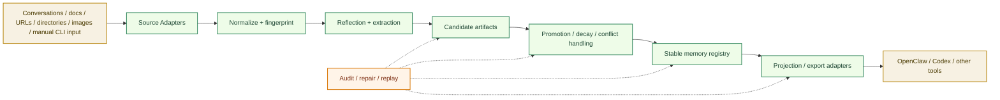
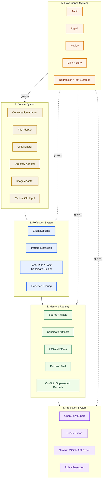
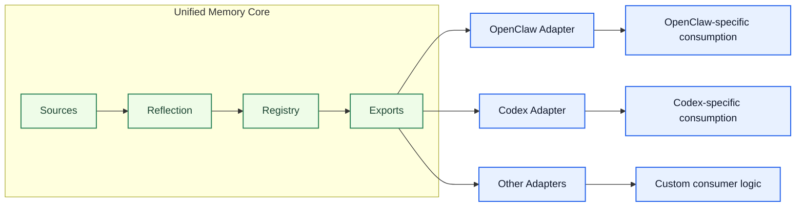
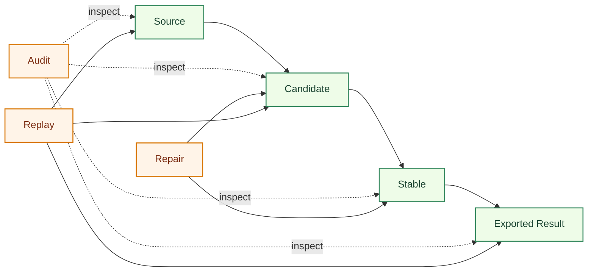
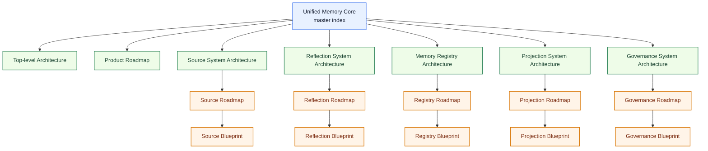
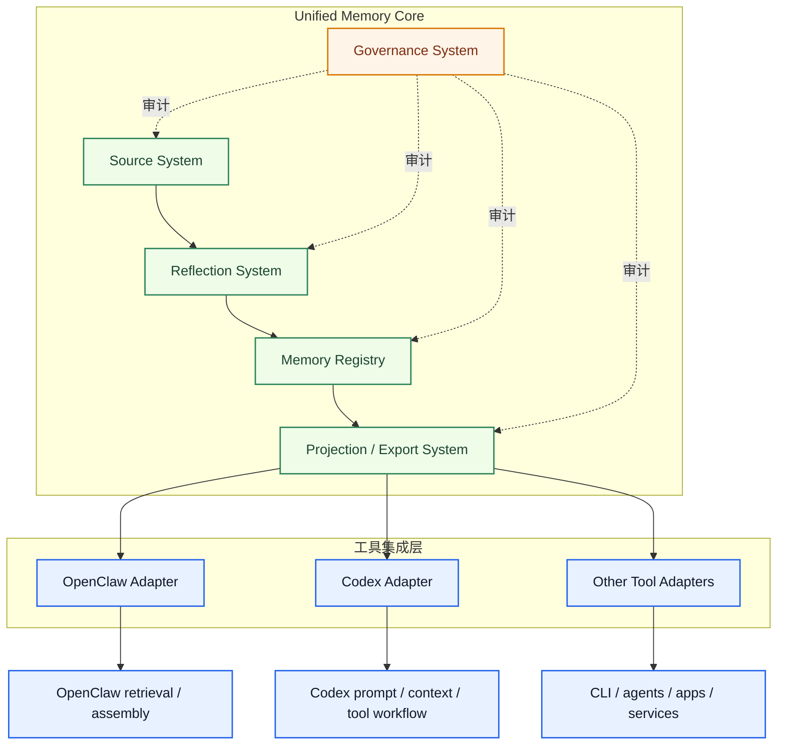
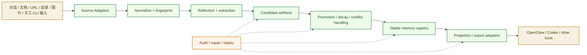

# Unified Memory Core Architecture

[English](#english) | [中文](#中文)

## English

## Purpose

This document is a discussion draft for the next-level architecture beyond `memory-context-claw`.

It is meant to answer one question first:

`if memory should become the shared foundation across OpenClaw, Codex, and future tools, what should the overall architecture look like?`

This is not yet the implementation contract.

It is a review-first architecture sketch for judging:

- whether the system boundary is correct
- whether the module split is reasonable
- whether the product should become an independent subproject

## Executive View

Recommended direction:

- `Unified Memory Core` becomes the long-term shared memory foundation
- `memory-context-claw` becomes the OpenClaw adapter / consumer
- future Codex integration becomes the Codex adapter / consumer
- other tools connect through explicit adapters instead of direct coupling

## One Big Picture

## Architecture Position

The important shift is:

`memory-context-claw` should not carry the entire long-term product direction by itself`

Instead:

- the shared memory layer should be designed as a reusable core
- OpenClaw should be one integration target
- Codex should be another integration target
- future consumers should not require redesigning the core

## Input-To-Output Flow

## Why This Shape

This shape is meant to preserve five properties:

1. shared memory is not trapped inside one plugin
2. learning sources remain explicit and controllable
3. stable memory is not written directly from raw inputs
4. outputs can be projected differently for different tools
5. everything remains reviewable, repairable, and replayable

## Core Modules

## Tool Boundary

The clean responsibility split should be:

- `Unified Memory Core`
  - owns ingestion
  - owns candidate generation
  - owns promotion lifecycle
  - owns audit trail
  - owns exports

- `OpenClaw Adapter`
  - owns OpenClaw-specific retrieval and context assembly integration

- `Codex Adapter`
  - owns Codex-specific prompt/context/tool integration

## Integration View

## Governance Loop

## Recommended Product Decision

Current recommendation:

`yes, this should be designed as an independent subproject direction`

But the implementation strategy should be staged:

1. architect it as independent now
2. document it as independent now
3. keep initial code incubation inside the current repo if that reduces migration cost
4. physically split into its own repo only after contracts and adapters stabilize

In short:

- `architecturally independent`: yes
- `document-independent`: yes
- `roadmap-independent`: yes
- `immediately split repository`: not required yet

## Suggested Future Document Tree

## Review Questions

Before turning this into formal project documentation, the main questions to review are:

1. Should `Unified Memory Core` be the official product name, or should it be framed as a codename for now?
2. Is the five-module split correct, or should `Projection` and `Governance` be merged early?
3. Should Codex integration be treated as a first-class adapter from day one, or a later adapter?
4. Should the core expose only artifact exports first, or both exports and runtime APIs?
5. At what point should the subproject be physically split from this repo?

## 中文

## 文档目的

这份文档是对下一层产品架构的讨论草案。

它先回答一个问题：

`如果记忆系统要成为 OpenClaw、Codex 以及后续其他工具共享的统一记忆底座，整体架构应该长什么样？`

这份文档还不是实现契约。

它的定位是先给你审结构：

- 系统边界对不对
- 模块拆分是否合理
- 是否应该作为独立子项目推进

## 总览图

建议方向：

- `Unified Memory Core` 作为长期共享记忆底座
- `memory-context-claw` 作为 OpenClaw adapter / consumer
- 后续 Codex 集成作为 Codex adapter / consumer
- 其他工具通过显式 adapter 接入，而不是直接耦合到核心里

## 一图总览

## 架构定位

这里最关键的转向是：

`memory-context-claw` 不应该继续独自承载整个长期产品方向`

更合理的是：

- 共享记忆层设计成可复用 core
- OpenClaw 只是一个集成目标
- Codex 也是一个集成目标
- 未来新增消费者时，不需要重做核心架构

## 从输入到输出的主链

## 为什么要长这样

这个形状主要是为了保住 5 个性质：

1. 共享记忆不被困死在某一个插件内部
2. 学习源保持显式、可控
3. 原始输入不能直接写 stable memory
4. 不同工具可以吃到不同投影结果
5. 整个链路始终可审、可修、可回放

## 核心模块

## 工具边界

更干净的职责拆分应该是：

- `Unified Memory Core`
  - 负责 ingestion
  - 负责 candidate generation
  - 负责 promotion lifecycle
  - 负责 audit trail
  - 负责 exports

- `OpenClaw Adapter`
  - 负责 OpenClaw 专属的 retrieval / context assembly 集成

- `Codex Adapter`
  - 负责 Codex 专属的 prompt / context / tool 集成

## 集成视图

## 治理与修复闭环

## 是否应该做成独立子项目

我当前的建议是：

`对，方向上应该按独立子项目来设计`

但实施上建议分阶段：

1. 先在架构上独立
2. 先在文档上独立
3. 初期代码仍可先在当前仓库孵化，降低迁移成本
4. 等契约、adapter、CLI 形态稳定后，再决定是否物理拆仓库

也就是说：

- `架构独立`：是
- `文档独立`：是
- `roadmap 独立`：是
- `现在立刻拆仓库`：不一定

## 建议的后续文档树

## 需要你重点审的几个问题

在把它正式收成项目文档前，最值得先确认的是：

1. `Unified Memory Core` 这个名字，是正式产品名，还是先只当内部代号？
2. 现在这 5 个模块的拆分是否合适，还是应该先把 `Projection` 和 `Governance` 合并？
3. Codex integration 要不要从第一天就当成一等 adapter？
4. 核心层早期是只导出 artifacts，还是同时暴露 runtime API？
5. 到什么阶段再物理拆成独立仓库最合适？
