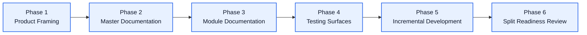
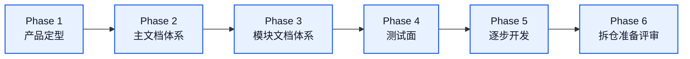

# Unified Memory Core Roadmap

[English](#english) | [中文](#中文)

## English

## Final Target

`Unified Memory Core` is the official shared-memory product for:

- OpenClaw
- Codex
- future tools

It should become:

- a governed shared memory foundation
- a separable long-term product
- a multi-adapter system with explicit namespaces and visibility control

## Current Phase

Status: `phase 1 / product and structure framing`

What is happening now:

- official product naming
- future module split
- repo layout planning
- master documentation planning
- module documentation skeletons

## Program Roadmap

### Phase 1: Product Framing

Goal:

- confirm product name
- confirm adapter model
- confirm first-class module split
- confirm repo incubation strategy

### Phase 2: Master Documentation

Goal:

- finalize top-level architecture
- finalize master roadmap
- finalize future repo layout
- record overall implementation order

### Phase 3: Module Documentation

Goal:

- create sub-architecture docs
- create module roadmaps
- create module blueprints
- create module todo pages

### Phase 4: Testing Surfaces

Goal:

- create module case matrix
- define regression surfaces
- define artifact validation surfaces
- define adapter compatibility checks

### Phase 5: Incremental Development

Goal:

- develop modules in sequence
- start with contracts and source model
- keep docs and testing aligned from day one

### Phase 6: Split Readiness Review

Goal:

- judge whether contracts are stable enough
- judge whether adapter boundaries are stable enough
- decide whether to move to a separate repository

## First-Class Module Tracks

1. `Source System`
2. `Reflection System`
3. `Memory Registry`
4. `Projection System`
5. `Governance System`
6. `OpenClaw Adapter`
7. `Codex Adapter`

## 中文

## 最终目标

`Unified Memory Core` 是面向：

- OpenClaw
- Codex
- 后续其他工具

的正式共享记忆产品。

它最终要成为：

- 一套受治理的共享记忆底座
- 一个可独立拆分的长期产品
- 一个具备显式 namespace 和可见性控制的多 adapter 系统

## 当前阶段

状态：`phase 1 / 产品与结构定型`

当前正在做：

- 正式产品命名
- 未来模块拆分
- 仓库目录结构规划
- 主文档体系规划
- 模块文档骨架建立

## 项目路线图

### Phase 1：产品定型

目标：

- 确认正式产品名
- 确认 adapter 模型
- 确认一等模块拆分
- 确认仓内孵化策略

### Phase 2：主文档体系

目标：

- 定稿顶层架构
- 定稿主 roadmap
- 定稿未来仓库结构
- 记录总体实施顺序

### Phase 3：模块文档体系

目标：

- 建立子架构文档
- 建立模块 roadmap
- 建立模块 blueprint
- 建立模块 todo

### Phase 4：测试面

目标：

- 建立模块用例矩阵
- 定义回归面
- 定义 artifact 校验面
- 定义 adapter 兼容性检查

### Phase 5：逐步开发

目标：

- 按模块顺序推进开发
- 从 contracts 和 source model 开始
- 从第一天起保持文档和测试同步

### Phase 6：拆仓准备评审

目标：

- 判断 contracts 是否足够稳定
- 判断 adapter 边界是否足够稳定
- 决定是否迁移成独立仓库

## 一等模块主线

1. `Source System`
2. `Reflection System`
3. `Memory Registry`
4. `Projection System`
5. `Governance System`
6. `OpenClaw Adapter`
7. `Codex Adapter`
