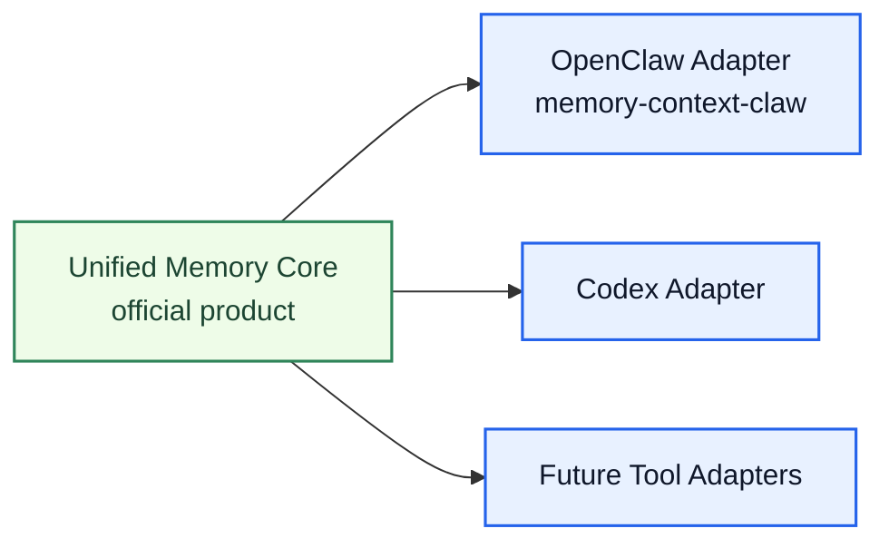
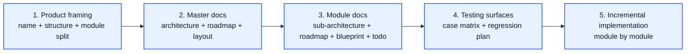
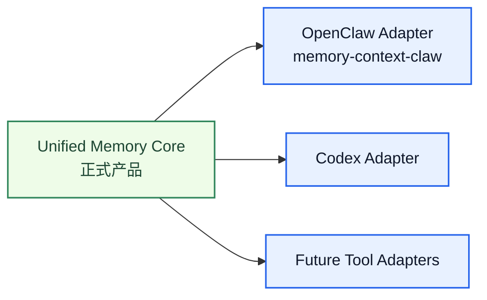
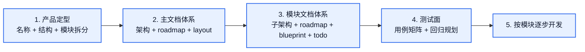

# Unified Memory Core

[English](#english) | [中文](#中文)

## English

## What This Is

`Unified Memory Core` is the official product name for the shared-memory foundation now being incubated from this repo.

It is intended to become:

- a governed shared memory foundation
- a reusable core for OpenClaw, Codex, and future tools
- a product with its own architecture, roadmap, and module boundaries

Current repo role:

- this repo continues to host `memory-context-claw`
- this repo also becomes the incubation home for `Unified Memory Core`
- `memory-context-claw` should gradually become the OpenClaw adapter for the core

## Product Position

## Core Modules

The future product is organized into seven first-class module tracks:

1. `Source System`
2. `Reflection System`
3. `Memory Registry`
4. `Projection System`
5. `Governance System`
6. `OpenClaw Adapter`
7. `Codex Adapter`

## Why Projection And Governance Stay Separate

Recommended future-facing split:

- `Projection` owns export shape and tool-facing projection logic
- `Governance` owns audit, repair, replay, regression, and quality controls

They answer different questions:

- projection: `how outputs are consumed`
- governance: `whether outputs can be trusted`

## Current Decisions

Confirmed decisions:

- `Unified Memory Core` is the official product name
- Codex integration is a first-class adapter from day one
- runtime API is a later phase, not required for early delivery
- an independent product direction is now active from the current main branch
- a branch snapshot of the old shape has already been preserved: `unified-memory-core-bootstrap`

## Program Steps

## Document Map

### Master documents

- [unified-memory-core-architecture.md](unified-memory-core-architecture.md)
- [unified-memory-core-roadmap.md](unified-memory-core-roadmap.md)
- [docs/unified-memory-core/repo-layout.md](docs/unified-memory-core/repo-layout.md)
- [code-memory-binding-architecture.md](code-memory-binding-architecture.md)

### Module architecture

- [docs/unified-memory-core/architecture/README.md](docs/unified-memory-core/architecture/README.md)

### Module roadmaps

- [docs/unified-memory-core/roadmaps/README.md](docs/unified-memory-core/roadmaps/README.md)

### Module blueprints

- [docs/unified-memory-core/blueprints/README.md](docs/unified-memory-core/blueprints/README.md)

### Module todo

- [docs/unified-memory-core/todo/README.md](docs/unified-memory-core/todo/README.md)

### Testing plan

- [docs/unified-memory-core/testing/README.md](docs/unified-memory-core/testing/README.md)

## 中文

## 这是什么

`Unified Memory Core` 是这条新产品线的正式产品名。

它的目标是成为：

- 一套受治理的共享记忆底座
- OpenClaw、Codex 以及后续其他工具可复用的核心层
- 拥有自己架构、roadmap 和模块边界的独立产品

当前仓库的角色是：

- 这个仓库继续承载 `memory-context-claw`
- 同时也作为 `Unified Memory Core` 的孵化仓
- `memory-context-claw` 后续应逐步收成这个核心层的 OpenClaw adapter

## 产品定位图

## 核心模块

未来产品按 7 条一等模块主线组织：

1. `Source System`
2. `Reflection System`
3. `Memory Registry`
4. `Projection System`
5. `Governance System`
6. `OpenClaw Adapter`
7. `Codex Adapter`

## 为什么 Projection 和 Governance 继续拆开

更符合未来形态的做法是继续分开：

- `Projection` 负责导出形态和面向工具的投影逻辑
- `Governance` 负责审计、修复、回放、回归和质量控制

它们回答的是不同问题：

- projection：`结果怎么被消费`
- governance：`结果能不能被信任`

## 当前已确认的决策

已经明确的决策：

- `Unified Memory Core` 是正式产品名
- Codex integration 从第一天就是一等 adapter
- runtime API 放到后续阶段，不要求前期先做
- 独立产品方向已经启动，当前主干就是新的产品推进主线
- 当前旧形态代码已保留分支：`unified-memory-core-bootstrap`

## 总体步骤

## 文档地图

### 主文档

- [unified-memory-core-architecture.md](unified-memory-core-architecture.md)
- [unified-memory-core-roadmap.md](unified-memory-core-roadmap.md)
- [docs/unified-memory-core/repo-layout.md](docs/unified-memory-core/repo-layout.md)
- [code-memory-binding-architecture.md](code-memory-binding-architecture.md)

### 模块架构

- [docs/unified-memory-core/architecture/README.md](docs/unified-memory-core/architecture/README.md)

### 模块 roadmap

- [docs/unified-memory-core/roadmaps/README.md](docs/unified-memory-core/roadmaps/README.md)

### 模块 blueprint

- [docs/unified-memory-core/blueprints/README.md](docs/unified-memory-core/blueprints/README.md)

### 模块 todo

- [docs/unified-memory-core/todo/README.md](docs/unified-memory-core/todo/README.md)

### 测试规划

- [docs/unified-memory-core/testing/README.md](docs/unified-memory-core/testing/README.md)
