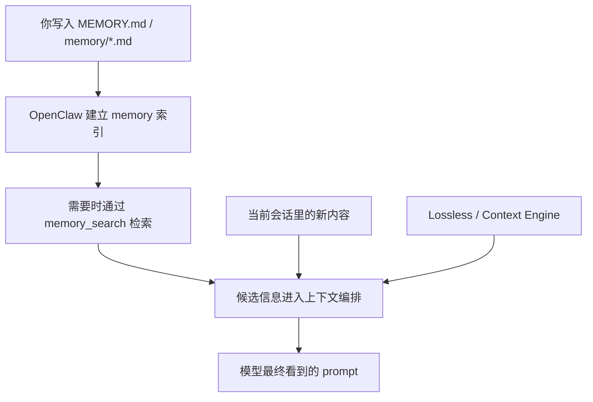

# OpenClaw 内置长期记忆 vs Lossless 类插件

## 一句话结论
OpenClaw 内置长期记忆负责长期保存和检索，`Lossless` 更偏向上下文编排与信息保真，二者是互补关系，不是替代关系。

## 适用场景
- 当需要解释为什么已经有长期记忆还会推荐 `Lossless`
- 当需要区分 `memory`、`memory_search`、`context engine` 的职责
- 当需要说明“记得住”和“当前上下文拿得到”不是一回事

## 关键信息
- `Memory` 负责长期保存与检索
- `Lossless` 更像 `context engine`
- 长期记忆不等于当前轮一定进入上下文
- 真实问题通常分为“长期保存”和“当前上下文保真”两类
- 最合理的顺序是先把长期记忆和检索跑通，再考虑 `Lossless`

这份笔记专门解释一个常见疑问：

既然 OpenClaw 已经有内置长期记忆库，为什么还会推荐 `Lossless` 这类插件？

结论先说：

`内置长期记忆` 和 `Lossless` 这类插件，不是替代关系，而是分工不同、可以配合使用的关系。

## 一句话理解

- `Memory` 解决的是：哪些信息应该被长期保存，以及之后怎么找回来。
- `Lossless` 解决的是：当前这轮对话要把哪些上下文真正送进模型，以及如何尽量少丢信息。

可以把它们理解成：

- `Memory` 是图书馆
- `Lossless` 是图书管理员和备课助手

图书馆里有书，不代表老师上课时桌上已经摆好了最相关的那几本。

## OpenClaw 内置长期记忆到底在做什么

OpenClaw 自带的长期记忆体系，核心是这些文件和能力：

- `MEMORY.md`
- `memory/*.md`
- `memory_search`
- 向量索引和语义检索

它的工作流程大致是：

1. 把稳定信息写进 `MEMORY.md`
2. 把过程性沉淀写进 `memory/` 目录
3. OpenClaw 对这些内容建立索引
4. 需要时通过 `memory_search` 把相关内容找回来

所以它主要解决的是这两个问题：

- 什么内容值得长期保留
- 当以后需要时，怎么把相关内容检索出来

这就是“长期记忆”的核心能力。

## 但长期记忆不等于当前上下文

很多人容易把这两件事混在一起：

- 内容已经被保存
- 内容已经出现在当前模型上下文里

这其实不是一回事。

一个事实写进了 `MEMORY.md`，只说明它已经被保存下来了；但它不代表每一轮聊天时，模型都会自动看到它。

要让模型在当前这一轮真正利用某段内容，中间还需要经过“上下文选择”和“上下文编排”。

也就是说：

- `memory` 负责“存”
- `search` 负责“找”
- `context engine` 负责“喂给模型”

## Lossless 类插件到底在补什么

`Lossless` 这类插件，本质上不是单纯的“再做一个记忆库”，而更像是一个 `context engine`。

它关心的是：

- 当前回合到底把哪些信息送进 prompt
- 长对话变长之后，哪些细节容易丢
- 压缩上下文时怎么尽量保留关键内容
- 检索回来的内容怎样拼接进当前上下文更合理

所以它解决的不是“有没有记住”，而是：

- 当前模型眼前看到了什么
- 模型看到的信息是不是足够完整
- 长会话里的重要细节有没有在压缩中丢掉

## 为什么两者都需要

因为真实使用中，存在两类不同的问题。

### 第一类：长期保存问题

例如：

- 用户偏好
- 项目背景
- 固定规则
- 过去讨论过的结论

这些适合进长期记忆库。

这时需要的是：

- 可持久化
- 可搜索
- 可跨会话找回

这是 OpenClaw 内置 `memory` 最擅长的部分。

### 第二类：当前上下文保真问题

例如：

- 这次会话里刚说过的细节很多
- 对话很长，已经接近压缩
- 有些信息很新，还没来得及沉淀进长期记忆
- 就算记住了，也未必在当前轮被正确调出来

这时需要的是：

- 更好的上下文保留
- 更好的上下文压缩
- 更好的 prompt 编排

这正是 `Lossless` 类插件更想解决的部分。

## 用一个流程图看清楚

这张图说明：

- `Memory` 负责把信息保存下来，并在需要时检索
- `Lossless` 负责把检索结果和当前会话内容一起整理后，再送给模型

## 所以为什么 OpenClaw 还会推荐这类插件

原因并不是“内置长期记忆不行”，而是因为：

1. 长期记忆只解决“知识存储和召回”
2. 它不自动等于“当前模型上下文最优”
3. 长会话压缩、上下文拼接、信息保真，本来就是另一层问题

所以官方会同时提供：

- 内置 `memory`
- 额外的 `context engine` / 插件能力

这是互补关系，不是重复造轮子。

## 对我自己的实际建议

如果目标是先把 OpenClaw 用起来，优先级建议这样排：

1. 先把 `MEMORY.md` 和 `memory/` 用起来
2. 先把 Workspace 索引接进去
3. 先验证 `memory_search` 是否稳定可用
4. 只有在你明显感到“长对话信息丢失严重”时，再考虑加 `Lossless`

也就是说：

- 第一阶段先解决“记得住、找得到”
- 第二阶段再解决“当前轮喂得更好、丢得更少”

## 最后一句总结

`OpenClaw 内置长期记忆` 负责“把知识存下来，并且以后能找回来”。

`Lossless` 这类插件负责“让当前这轮对话尽量看到最该看的内容，并减少上下文压缩带来的信息损失”。

二者不是冲突，而是一个偏“记忆层”，一个偏“上下文层”。
